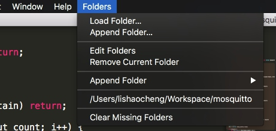
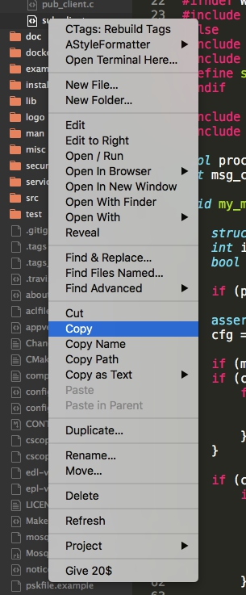
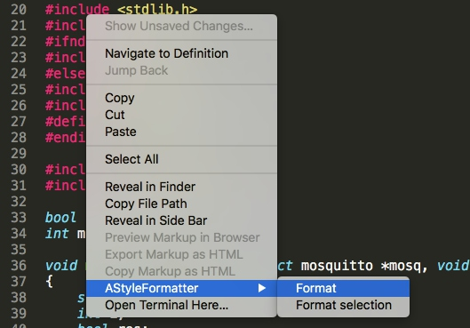
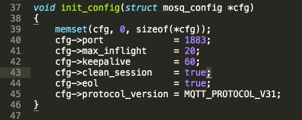
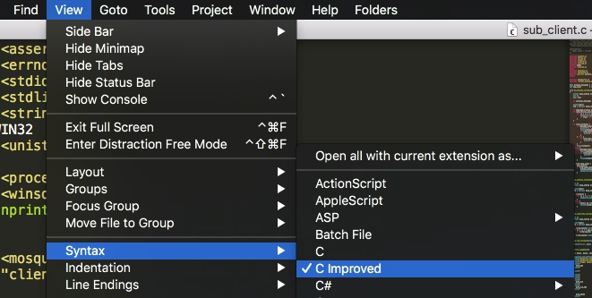
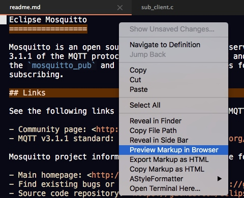

## 0. [Package Control](https://packagecontrol.io/installation)

用于下载、管理插件的插件，安装方法见项目主页。有时安装后会出现 “There are no packages available for installation” 这样的错误，这是因为无法下载插件资源列表文件。解决方法是在菜单栏中选择 Preferences > Package Settings > Package Control > Settings-User ，在打开的配置文件中添加：

	"channels":
	[
	   "https://gist.githubusercontent.com/stanwu/679f8af0c9a43f800974/raw/5e3561bfb8b3ddc92680052c89e73c7dabc92f94/channel_v3.json",
		"https://web.archive.org/web/20150905194312/https://packagecontrol.io/channel_v3.json"
	],

## 1. [Predawn](https://github.com/jamiewilson/predawn)

一款为Sublime和Atom打造的暗色主题，可以定义Tab的大小，SideBar大小，Find栏大小，并提供主题同款的ICON。

安装后重启 Sublime Text ，通过菜单栏 Preferences -> Settings 打开用户配置文件，添加：

	"theme": "predawn-DEV.sublime-theme", //软件 UI 主题
	"color_scheme": "Packages/Predawn/predawn.tmTheme",  //编辑器配色
	"font_size": 15,
	"predawn_findreplace_small": true,   //查找对话框设为最小
	"predawn_sidebar_small": true,     //侧边栏设为最小
	"predawn_tabs_active_underline": true,   //使能当前标签页高亮
	"predawn_tabs_small": true,    //标签页设为最小

更多选项可以在项目主页查看。

## 2. [SideBarFolder](https://github.com/titoBouzout/SideBarFolders)

打开的文件夹都太多了，可以用这个来管理，安装后会在菜单栏多一个 Folders 。

## 3. [SideBarEnhancements](https://github.com/titoBouzout/SideBarEnhancements)

扩展右键选项：

## 4. [SublimeAStyleFormatter](http://theo.im/SublimeAStyleFormatter/)

简单好用的代码格式化工具。安装后，对文件点击鼠标右键，会出现格式化选项，可以全文件格式化，也可以对选中的文本格式化：

也可以在配置文件中设置快捷键，最好打开保存时自动格式化：

    // Auto format on file save
    "autoformat_on_save": true,
    
## 5. [Terminal](https://github.com/wbond/sublime_terminal)

在当前文件夹内打开 Terminal 。安装后，对文件或者目录点鼠标右键，会出现 Open Terminal Here... ：

必须在配置文件中设置打开 Terminal 的命令，对于在 Mac OS 中的 iTerm2 打开新的标签页，可以这样设置：

    "terminal": "iTerm.sh",
    "parameters": ["--open-in-tab"]

对于 iTerm2 V3 ：

    "terminal": "iTerm2-v3.sh"
    
## 6. [Alignment](http://wbond.net/sublime_packages/alignment)

选中后按 command+control+a 就可以使其按照等号对其:

## 7. [C Improved](https://github.com/abusalimov/SublimeCImproved)

C 语言语法高亮插件。安装后打开一个 C 源文件，在菜单栏中选中 C Improved ：

## 8. [Ctags](https://github.com/SublimeText/CTags)

寻找函数和变量的定义。安装插件后还要在系统中安装 Ctags ：

    brew install ctags 
    
默认安装在 /usr/local/bin/ctags 。在配置文件中添加命令路径和参数：
    
    "command": "/usr/local/bin/ctags -R",
    
然后在对源码目录右键选择 Rebuild Tags ，生成索引文件：

之后再函数上悬停鼠标，就会出现该函数定义的位置，点击可进入：

或者右键选择 Navigate to Definition :

Jump Back 可以跳回调用处。默认快捷键是 `control+shift+左键` 跳转到定义处，`control+shift+右键` 跳回来。

## 9. [made-of-code-themes](https://github.com/kumarnitin/made-of-code-tmbundle)

Markdown 语法高亮配色。下载后解压到包目录下，然后打开一个 Markdown 文件，在菜单中选择语法配置：

在打开的 Markdown 配置文件中添加该配色文件的路径：

## 10. [OmniMarkupPreviewer](http://theo.im/OmniMarkupPreviewer/)

实时预览 Markdown 文件。对 Markdown 文件右键就会出现在浏览器中预览、导出 HTML 文件等选项：

快捷键：

* command+option+O: Preview Markup in Browser.
* command+option+X: Export Markup as HTML.
* command+option+C: Copy Markup as HTML.

## 11. [FileHeader](https://github.com/shiyanhui/FileHeader)

自动为源码文件生成头部注释。可以自定义注释内容，自动识别各种语言的文件。

## 12. [Pretty JSON](https://packagecontrol.io/packages/Pretty%20JSON)

格式化 JSON ，用法是选中 JSON 格式的文本，然后按快捷键是 `cmd+ctrl+j`，也可以直接按快捷键对全文件格式化。

## 13. [HTML-CSS-JS prettify](https://github.com/victorporof/Sublime-HTMLPrettify)

可以格式化 HTML、CSS 和 JS 文本。安装后，选中需要格式化的文本，按快捷键 `cmd+shift+h` 即可完成格式化。

## 参考

* Sublime Text：学习资源篇：<http://www.jianshu.com/p/d1b9a64e2e37>
