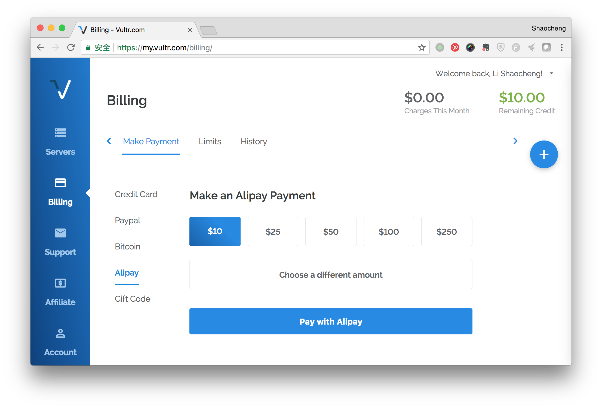
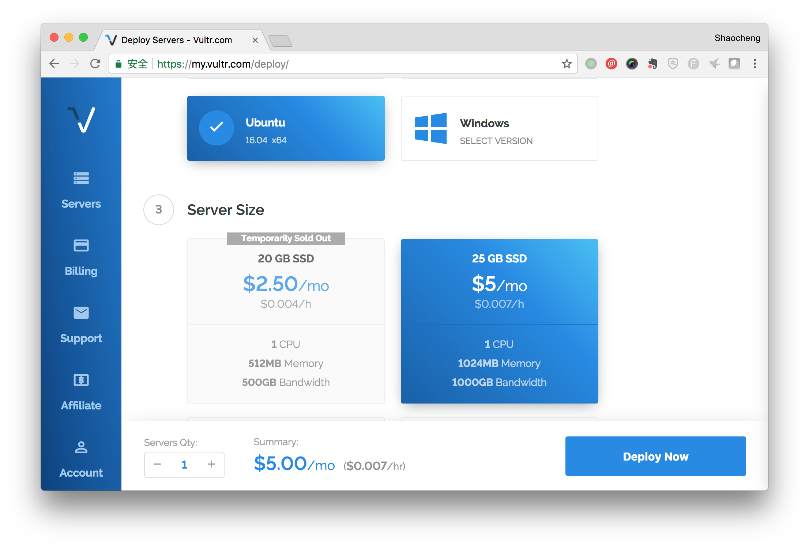
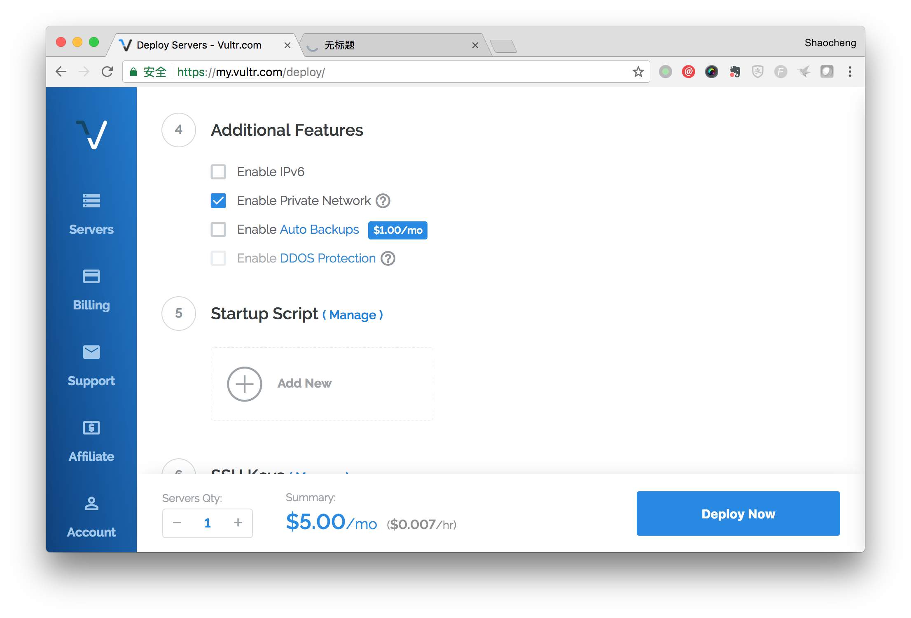
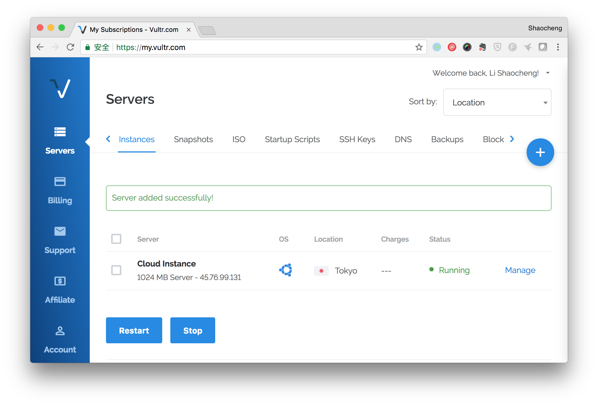
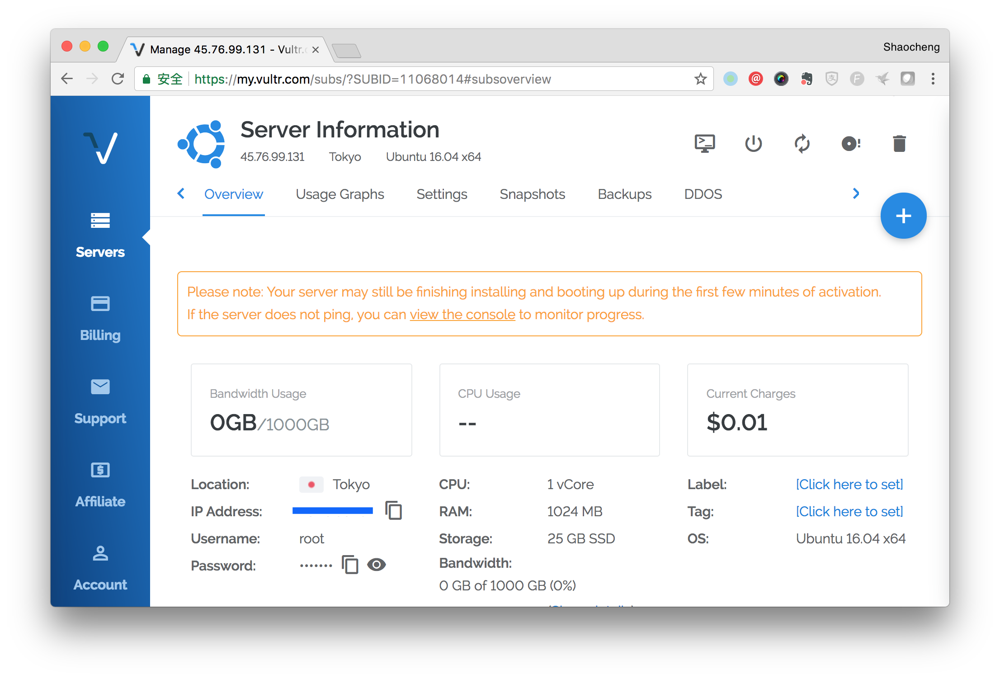
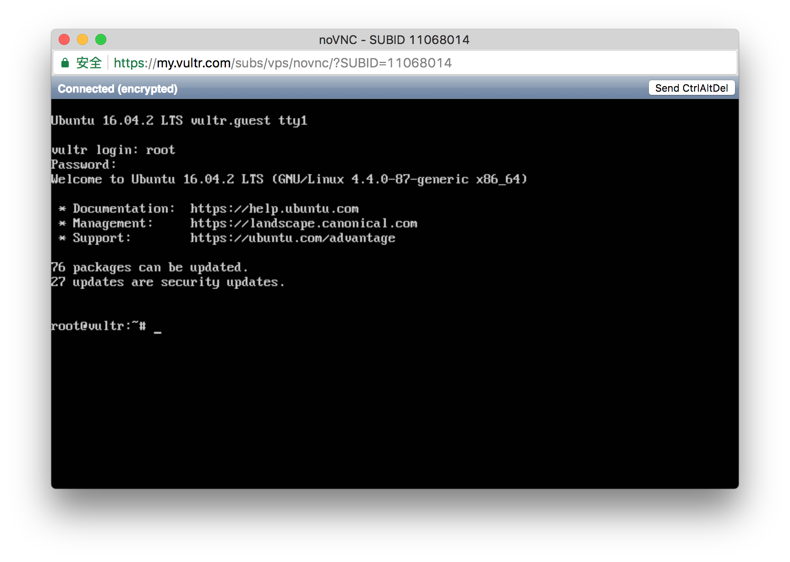
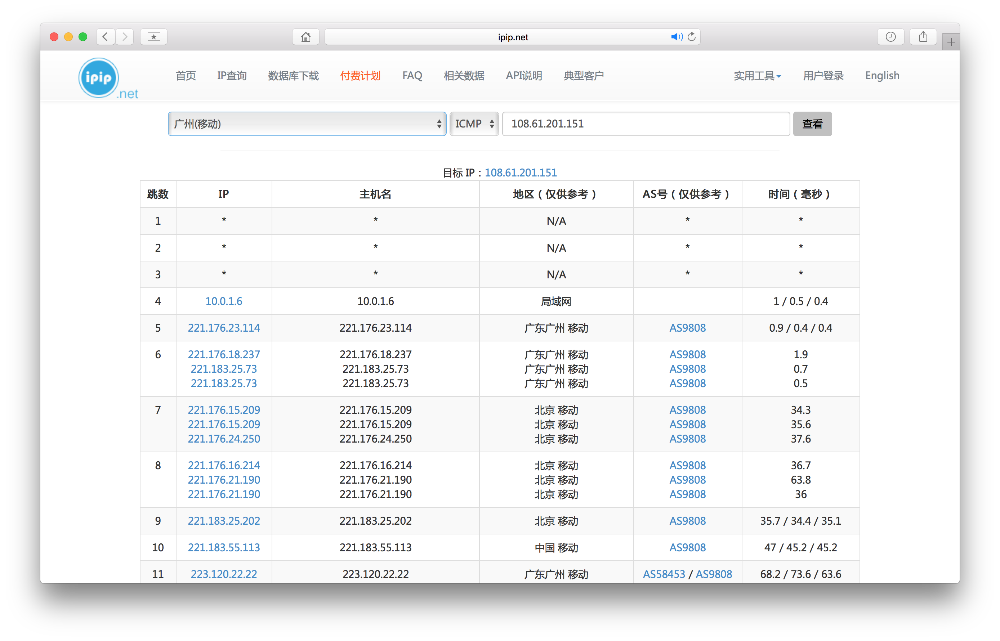
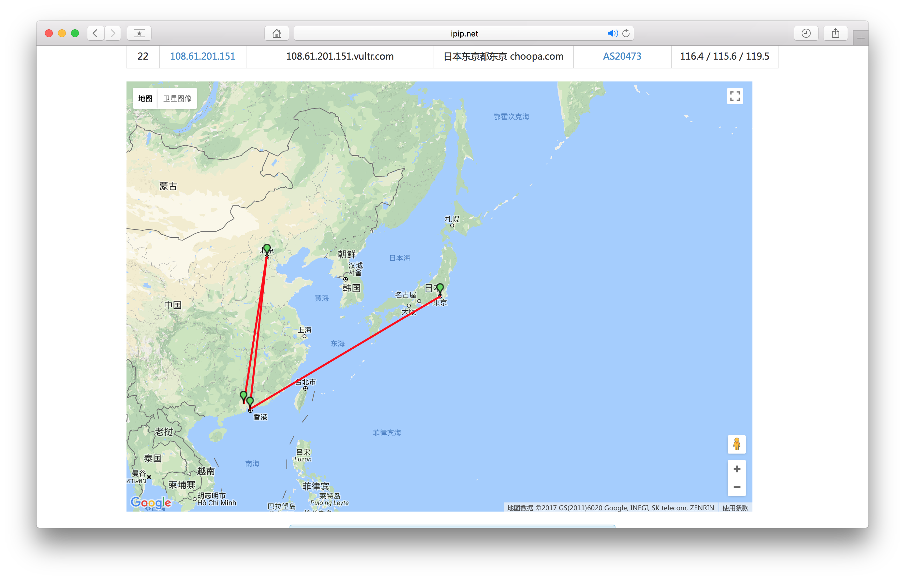

## 1. 购买 VPS

推荐 <https://www.vultr.com> ，注册成功后先充值，Vultr 支持信用卡、比特币和支付宝等，支付宝比较方便：

充值完毕后，点击右上角的蓝色加号购买服务器，然后选择服务器位置、系统和配置，国内推荐东京：

选择 Ubuntu 16.04 系统，$5/月的套餐，可以先购买一个月试用：

使能私有 IP ：

点击左下角的 Deploy Now 完成购买，稍等片刻，安装完成后：

点击服务器名称，进入详情页，记下 IP Address、Username 和 Password ：

现在就可以用 SSH 客户端连接服务器，也可以点击右上第一个图标 View Console ，打开一个 Console 对话框，输入用户名和密码登录：

## 2. 安装 SSR

有一个一键安装的脚本，项目主页在 <https://github.com/teddysun/shadowsocks_install>，在服务器上运行如下命令：

    wget --no-check-certificate https://raw.githubusercontent.com/teddysun/shadowsocks_install/master/shadowsocksR.sh
    chmod +x shadowsocksR.sh
    ./shadowsocksR.sh 2>&1 | tee shadowsocksR.log

根据提示配置：

* 服务器端口：自己设定（如不设定，默认为 8989）
* 密码：自己设定（如不设定，默认为 teddysun.com）
* 加密方式：自己设定（如不设定，默认为 aes-256-cfb）
* 协议（Protocol）：自己设定（如不设定，默认为 origin）
* 混淆（obfs）：自己设定（如不设定，默认为 plain）

安装完成后，脚本会提示如下,，记住自己的配置：

    Congratulations, ShadowsocksR server install completed!
    Your Server IP        :your_server_ip
    Your Server Port      :your_server_port
    Your Password         :your_password
    Your Protocol         :your_protocol
    Your obfs             :your_obfs
    Your Encryption Method:your_encryption_method
    
    Welcome to visit:https://shadowsocks.be/9.html
    Enjoy it!

ShadowsocksR 已经加入开机自启动，查看运行状态：

    ~# /etc/init.d/shadowsocks status
    ShadowsocksR (pid 28287) is running...

如果想要卸载，执行：

    ./shadowsocksR.sh uninstall

## 3. 客户端

* Windows 客户端：<https://github.com/shadowsocksr-backup/shadowsocksr-csharp/releases>
* Mac 客户端：<https://github.com/shadowsocksr-backup/ShadowsocksX-NG/releases>

## 4. 测试

查看本地 IP 和所在线路 <http://www.ipip.net/ip.html> ：

测试各线路 ping 延时 <http://www.ipip.net/ping.php> :

路由追踪 <http://www.ipip.net/traceroute.php> :

另外有一个测试脚本 bench.sh ，[秋水逸冰](https://teddysun.com/)大神写的，bench.sh 既是脚本名，同时又是域名，下载执行同步，感觉很屌：

    wget -qO- bench.sh | bash

参考：<https://teddysun.com/444.html>

## 5. 加速

直接访问境外 VPS 的延时普遍很高，有些还不稳定，丢包率飙升。这时需要通过测试，找出连接比较快的大陆节点，然后租一台该节点上的服务器，作为中继加速，最终的线路是：

    本地PC  <==> 中继服务器 <==> SSR 代理 <==> FreeInternet

现在中继服务器上安装 HAProxy ，这是一款 HTTP/TCP 负载均衡器，核心功能就是将前端的大流量请求，分流到后端的各个服务器中。原理与我们要实现的代理中继非常类似。Haproxy 监听特定端口的请求，然后将这个请求转发到后台的某一台服务器的端口上。这里使用它将我们发给它的请求转发给 SSR 服务器。以 Ubuntu 为例：

    sudo apt-get install haproxy 

安装成功后，编辑配置文件 /etc/haproxy/haproxy.cfg ，用如下内容替换 ：

    global
        ulimit-n  51200
    
    defaults
        log    global
        mode    tcp
        option    dontlognull
            timeout connect 5000
            timeout client  50000
            timeout server  50000
    
    frontend ss-in
        bind *:relay_server_port
        default_backend ss-out
    
    backend ss-out
        server server1 proxy_server_ip:proxy_server_port maxconn 20480

relay_server_port 是用于本地与中继服务器B的连接的端口。proxy_server_ip 是 SSR 代理服务器的 IP 地址，proxy_server_port 是 SSR 代理服务器的监听端口。

然后将本地客户端上配置的服务器 IP 和端口改成中继服务器的 IP 和端口即可。

## 6. 参考

[利用Haproxy进行SS代理中继](https://ayase.moe/2017/02/01/haproxy-in-proxy-relay/)
