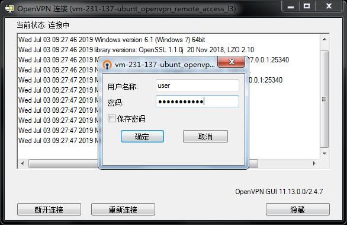
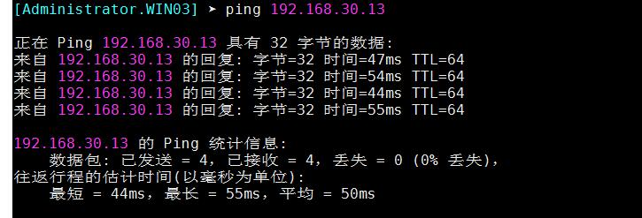

有时我们需要连接不同局域网的两台主机，使其可以互相访问，比如用家里的电脑登录办公室电脑的某个服务。我们可以使用 OpenVPN 实现这个功能，它的原理是在两台电脑上安装 OpenVPN 客户端，同时连接公网上的 OpenVPN 服务器，OpenVPN 会将这两台电脑组成一个虚拟局域网，它们就可以像局域网内一样互相访问了。搭建 VPN 前的网络拓扑如下：


家里的电脑是 Windows7 系统，办公室的电脑安装了 Ubuntu16.04 ，公网上的 VPS 安装了 Ubuntu16.04 。如果全部都是 Windows 系统，配置起来会更方便一点，Linux 下的文本操作略显繁琐，好在 SoftEther 提供了可以远程管理的 GUI 工具。

## 1. 在 VPS 上安装 SoftEther

SoftEther 这套软件其实是一个完整的夸平台 VPN 解决方案，在单一软件内集成了 OpenVPN 、L2TP 、IPsec 等 VPN 协议，我们可以用它在 VPS 上搭建一个 OpenVPN 的服务器，非常方便。

首先在 [SoftEther 下载中心](https://www.softether-download.com/cn.aspx?product=softether) 下载 X64-Linux 平台的 SoftEther VPN Server，我下载的版本是 `softether-vpnserver-v4.29-9680-rtm-2019.02.28-linux-x64-64bit.tar.gz` ，将其解压到 VPS 的用户根目录下，得到一个名为 vpnserver 的文件夹，在这个文件夹下执行 `./.install.sh` ，根据提示依次输入三次数字 `1` 并按回车即可完成编译安装，所有的可执行文件还是在这个路径下，先执行 `sudo ./vpnserver start` 让服务器在后台运行，然后执行 `./vpncmd` 开始初始化配置，按如下输入：

```shell
ubuntu@VM-231-137-ubuntu:~/vpnserver$ sudo ./vpnserver start
The SoftEther VPN Server service has been started.
ubuntu@VM-231-137-ubuntu:~/vpnserver$ ./vpncmd
vpncmd command - SoftEther VPN Command Line Management Utility
SoftEther VPN Command Line Management Utility (vpncmd command)
Version 4.29 Build 9680   (English)
Compiled 2019/02/28 19:22:54 by yagi at pc33
Copyright (c) SoftEther VPN Project. All Rights Reserved.

By using vpncmd program, the following can be achieved.

1. Management of VPN Server or VPN Bridge
2. Management of VPN Client
3. Use of VPN Tools (certificate creation and Network Traffic Speed Test Tool)

Select 1, 2 or 3: [在这里输入 1 ，表示管理 VPN 服务器]

Specify the host name or IP address of the computer that the destination VPN Server or VPN Bridge is operating on.
By specifying according to the format ‘host name:port number’, you can also specify the port number.
(When the port number is unspecified, 443 is used.)
If nothing is input and the Enter key is pressed, the connection will be made to the port number 8888 of localhost (this computer).
Hostname of IP Address of Destination:[这里敲回车键，按默认配置使用 443 端口]

If connecting to the server by Virtual Hub Admin Mode, please input the Virtual Hub name.
If connecting by server admin mode, please press Enter without inputting anything.
Specify Virtual Hub Name: [这里敲回车键]

Connection has been established with VPN Server “localhost” (port 443).You have administrator privileges for the entire VPN Server.

VPN Server>[输入 ServerPasswordSet ，表示设置一个密码]

ServerPasswordSet command - Set VPN Server Administrator PasswordPlease enter the password. To cancel press the Ctrl+D key.
Password: [输入你的密码]
Confirm input: [再次输入你的密码]
```

之后的配置可以用 Windows 下的远程管理工具进行。

首先在 [SoftEther 下载中心](https://www.softether-download.com/cn.aspx?product=softether) 下载 X64-Windows 平台的 SoftEther VPN Server ，把它安装在家里的笔记本上，安装时选择 `SoftEther VPN Server 管理工具（仅限管理工具）` ，我们只是用它来连接并配置 VPS 上的 VPN 服务器：


安装完成后启动 `SoftEther VPN Server 管理器` ，在连接设置界面中点击 `新设置` 按钮，在弹出的对话框中按如下设置，新建一个指向 VPS 的连接：


新建成功后，在连接设置界面双击这个设置，开始连接 VPS ，连接成功后会弹出一个管理对话框，这里会出现一个默认的虚拟 HUB ，先将其删除，然后点击 `创建虚拟 HUB` 按钮，按如下设置，然后点击 `确定` ，就可以新建一个虚拟 HUB ，其中名字和密码都可以自定义：


回到管理界面，双击刚才新建的这个虚拟 HUB ，进入这个 HUB 的管理界面：


点击 `管理用户` ，为这个 HUB 新建一个用户，按如下设置：


回到这个 HUB 的管理界面，点击 `虚拟 NAT 和 虚拟 DHCP 服务器` ，在弹出的对话框中点击 `启动 SecureNAT` ，如果想修改配置，可以点击  `SecureNAT 配置`  。至此，VPN 服务器配置都结束了，我们需要导出相应的客户端配置，供后面的客户端使用。在管理界面的右下角点击 `OpenVPN/MS-SSTP 设置` 按钮，在弹出的对话框中按如下设置：


然后点击 `为 OpenVPN Client 生成配置样本文件` 就可以导出一个保护配置文件的压缩包，压缩包里会有两个配置文件，我们使用 L3 用于远程访问的这个：


> 注意，VPS 上使用了默认的 TCP:443 和 UDP:1194 端口，要记得在 VPS 的防火墙上打开这两个端口，否则会造成客户端连接失败。

## 2. 在家里电脑上安装 OpenVPN 客户端

在 [OpenVPN 下载中心](https://openvpn.net/community-downloads/) 下载 Win7 版的安装包，一路 Next 安装成功后启动 OpenVPN GUI ，首次启动会提示没有配置文件，这时需要在状态栏的 OpenVPN 图标上点击右键，选择 `导入配置文件...` :


导入上一步得到的 `vm-231-137-ubunt_openvpn_remote_access_l3.ovpn` 配置文件，然后点击 `连接` ，按提示输入 OpenVPN 服务器中设置的用户名和密码：



点击 `确定` 后开始连接，连接成功后会获得虚拟局域网为本机分配的 IP ：


## 3. 在办公室电脑上安装 OpenVPN 客户端

在 Ubuntu 上用 `sudo apt-get install openvpn` 命令安装 OpenVPN ，然后把配置文件 `vm-231-137-ubunt_openvpn_remote_access_l3.ovpn` 复制到 `/etc/openvpn/` 路径下，并改名为 `client.conf` ，然后执行 `systemctl start openvpn@client` 启动连接：

```shell
root@ubuntu:~# systemctl start openvpn@client
Enter Auth Username: ****
Enter Auth Password: ***********
root@ubuntu:~# systemctl status openvpn@client
● openvpn@client.service - OpenVPN connection to client
   Loaded: loaded (/lib/systemd/system/openvpn@.service; disabled; vendor preset: enabled)
   Active: active (running) since Wed 2019-07-03 10:12:01 CST; 11s ago
     Docs: man:openvpn(8)
           https://community.openvpn.net/openvpn/wiki/Openvpn23ManPage
           https://community.openvpn.net/openvpn/wiki/HOWTO
  Process: 2409 ExecStart=/usr/sbin/openvpn --daemon ovpn-%i --status /run/openvpn/%i.status 10 --cd /etc/openvp
 Main PID: 2429 (openvpn)
   CGroup: /system.slice/system-openvpn.slice/openvpn@client.service
           └─2429 /usr/sbin/openvpn --daemon ovpn-client --status /run/openvpn/client.status 10 --cd /etc/openvp

Jul 03 10:12:04 ubuntu ovpn-client[2429]: ROUTE_GATEWAY 10.231.222.129/255.255.255.248 IFACE=enp0s29u1u3u1c2 HWA
Jul 03 10:12:04 ubuntu ovpn-client[2429]: TUN/TAP device tun0 opened
Jul 03 10:12:04 ubuntu ovpn-client[2429]: TUN/TAP TX queue length set to 100
Jul 03 10:12:04 ubuntu ovpn-client[2429]: do_ifconfig, tt->ipv6=0, tt->did_ifconfig_ipv6_setup=0
Jul 03 10:12:04 ubuntu ovpn-client[2429]: /sbin/ip link set dev tun0 up mtu 1500
Jul 03 10:12:04 ubuntu ovpn-client[2429]: /sbin/ip addr add dev tun0 local 192.168.30.13 peer 192.168.30.14
Jul 03 10:12:04 ubuntu ovpn-client[2429]: /sbin/ip route add 118.89.16.2/32 via 10.231.222.129
Jul 03 10:12:04 ubuntu ovpn-client[2429]: /sbin/ip route add 0.0.0.0/1 via 192.168.30.14
Jul 03 10:12:04 ubuntu ovpn-client[2429]: /sbin/ip route add 128.0.0.0/1 via 192.168.30.14
Jul 03 10:12:04 ubuntu ovpn-client[2429]: Initialization Sequence Completed
root@ubuntu:~# ps -ef | grep openvpn
root      2429     1  0 10:12 ?        00:00:00 /usr/sbin/openvpn --daemon ovpn-client --status /run/openvpn/client.status 10 --cd /etc/openvpn --script-security 2 --config /etc/openvpn/client.conf --writepid /run/openvpn/client.pid
root      2503  1858  0 10:12 pts/0    00:00:00 grep --color=auto openvpn
```

连接成功后会出现 tun0 网络接口，并获得一个 IP ：

```shell
root@ubuntu:~# ifconfig tun0
tun0      Link encap:UNSPEC  HWaddr 00-00-00-00-00-00-00-00-00-00-00-00-00-00-00-00
          inet addr:192.168.30.13  P-t-P:192.168.30.14  Mask:255.255.255.255
          UP POINTOPOINT RUNNING NOARP MULTICAST  MTU:1500  Metric:1
          RX packets:6 errors:0 dropped:0 overruns:0 frame:0
          TX packets:6 errors:0 dropped:0 overruns:0 carrier:0
          collisions:0 txqueuelen:100
          RX bytes:396 (396.0 B)  TX bytes:396 (396.0 B)

root@ubuntu:~# cat /run/openvpn/client.status
OpenVPN STATISTICS
Updated,Wed Jul  3 10:12:52 2019
TUN/TAP read bytes,594
TUN/TAP write bytes,594
TCP/UDP read bytes,4196
TCP/UDP write bytes,2725
Auth read bytes,850
END
```

## 4. 测试

连接成功后的网络拓扑如下：


客户端通过 VPN 隧道连接到了服务器的虚拟 HUB 上，共同组成了一个 `192.168.30.0/24` 的局域网，客户端直接可以想局域网内一样相互访问，在家里电脑上 ping 办公室内的电脑：



## 5. 配置签名证书

上面建立的 VPN 服务器支持的是密码验证，如果要使用签名证书认证，需要用 OpenVPN 搭建服务器，因为 SoftEther 对签名证书认证支持不够完善。签名证书由服务器端签发，需要制作三个证书： CA 证书、服务器端证书和客户端证书。

### 5.1. 生成证书

先在服务器端使用 `sudo apt-get install openvpn easy-rsa` 命令安装 OpenVPN 和证书制作工具 easy-rsa 。然后把 `/usr/share/easy-rsa/` 文件夹及其内容复制到 `/etc/openvpn/` 路径下，然后编辑其中的 `vars` 文件，这个文件是 easy-rsa 的配置文件，包含了生成证书和密钥时使用的选项，可以使用默认值，或者根据实际情况修改如下选项：

```shell
# These are the default values for fields
# which will be placed in the certificate.
# Don't leave any of these fields blank.
export KEY_COUNTRY="CN"   #国家
export KEY_PROVINCE="GD"  #省份
export KEY_CITY="Shenzhen"  #城市
export KEY_ORG="Fort-Funston"  #组织/公司
export KEY_EMAIL="me@myhost.mydomain"  #Email
export KEY_OU="MyOrganizationalUnit"  #部门名称

# X509 Subject Field
export KEY_NAME="EasyRSA" #密钥的名称
```

然后使这项选项生效，并初始化，需要先切换到 root 用户：

```shell
ubuntu@VM-231-137-ubuntu:~$ sudo su
root@VM-231-137-ubuntu:~# cd /etc/openvpn/easy-rsa
root@VM-231-137-ubuntu:/etc/openvpn/easy-rsa# source vars
NOTE: If you run ./clean-all, I will be doing a rm -rf on /etc/openvpn/easy-rsa/keys
root@VM-231-137-ubuntu:/etc/openvpn/easy-rsa# ./clean-all
```

执行 `./build-ca` 新建 CA 证书，一路回车即可，生成的证书和密钥在 keys 文件夹下，把证书复制到 `/etc/openvpn/` 目录下：

```
root@VM-231-137-ubuntu:/etc/openvpn/easy-rsa# ls keys/
ca.crt  ca.key  index.txt  serial
root@VM-231-137-ubuntu:/etc/openvpn/easy-rsa# cp -rf keys/ca.crt  /etc/openvpn/
```

执行 `./build-key-server EasyRSA` 新建服务器端证书，其中 `EasyRSA` 是 vars 文件中设置的 `KEY_NAME` 的值，再执行 `./build-dh` 生成密钥交换所需的 Diffe-Hellman 文件，一路回车后，生成的证书和密钥等都在 keys 文件夹下，把他们复制到 `/etc/openvpn/` 目录下：

```shell
root@VM-231-137-ubuntu:/etc/openvpn/easy-rsa# ll keys/
total 60
drwx------ 2 root root 4096 Jul  3 17:51 ./
drwxr-xr-x 3 root root 4096 Jul  3 17:43 ../
-rw-r--r-- 1 root root 5702 Jul  3 17:45 01.pem
-rw-r--r-- 1 root root 5702 Jul  3 17:45 EasyRSA.crt
-rw-r--r-- 1 root root 1094 Jul  3 17:45 EasyRSA.csr
-rw------- 1 root root 1704 Jul  3 17:45 EasyRSA.key
-rw-r--r-- 1 root root 1801 Jul  3 17:27 ca.crt
-rw------- 1 root root 1704 Jul  3 17:27 ca.key
-rw-r--r-- 1 root root  424 Jul  3 17:51 dh2048.pem
-rw-r--r-- 1 root root  146 Jul  3 17:45 index.txt
-rw-r--r-- 1 root root   21 Jul  3 17:45 index.txt.attr
-rw-r--r-- 1 root root    0 Jul  3 17:23 index.txt.old
-rw-r--r-- 1 root root    3 Jul  3 17:45 serial
-rw-r--r-- 1 root root    3 Jul  3 17:23 serial.old
root@VM-231-137-ubuntu:/etc/openvpn/easy-rsa# cp -rf keys/EasyRSA.crt /etc/openvpn/
root@VM-231-137-ubuntu:/etc/openvpn/easy-rsa# cp -rf keys/EasyRSA.key /etc/openvpn/
root@VM-231-137-ubuntu:/etc/openvpn/easy-rsa# cp -rf keys/dh2048.pem /etc/openvpn/
```

执行 `./build-key client` 新建客户端证书，client 是证书名称，可以自定义，生成的客户端证书和密钥等都在 keys 文件夹下：

```
root@VM-231-137-ubuntu:/etc/openvpn/easy-rsa# ll keys/
total 92
drwx------ 2 root root 4096 Jul  3 17:57 ./
drwxr-xr-x 3 root root 4096 Jul  3 17:43 ../
-rw-r--r-- 1 root root 5702 Jul  3 17:45 01.pem
-rw-r--r-- 1 root root 5578 Jul  3 17:57 02.pem
-rw-r--r-- 1 root root 5702 Jul  3 17:45 EasyRSA.crt
-rw-r--r-- 1 root root 1094 Jul  3 17:45 EasyRSA.csr
-rw------- 1 root root 1704 Jul  3 17:45 EasyRSA.key
-rw-r--r-- 1 root root 1801 Jul  3 17:27 ca.crt
-rw------- 1 root root 1704 Jul  3 17:27 ca.key
-rw-r--r-- 1 root root 5578 Jul  3 17:57 client.crt
-rw-r--r-- 1 root root 1094 Jul  3 17:57 client.csr
-rw------- 1 root root 1704 Jul  3 17:57 client.key
-rw-r--r-- 1 root root  424 Jul  3 17:51 dh2048.pem
-rw-r--r-- 1 root root  291 Jul  3 17:57 index.txt
-rw-r--r-- 1 root root   21 Jul  3 17:57 index.txt.attr
-rw-r--r-- 1 root root   21 Jul  3 17:45 index.txt.attr.old
-rw-r--r-- 1 root root  146 Jul  3 17:45 index.txt.old
-rw-r--r-- 1 root root    3 Jul  3 17:57 serial
-rw-r--r-- 1 root root    3 Jul  3 17:45 serial.old
```

### 5.2. 服务器端配置

服务器端可以复制 OpenVPN 自带的配置文件模板，得到 server.conf ，然后进行修改：

```
root@VM-231-137-ubuntu:~# cp -rf /usr/share/doc/openvpn/examples/sample-config-files/server.conf.gz /etc/openvpn/
root@VM-231-137-ubuntu:~# cd /etc/openvpn/
root@VM-231-137-ubuntu:/etc/openvpn# gzip -d server.conf.gz
```

注意如下几个选项：

```
port 1194   # 监听的端口，使用默认的 1194 就行
proto udp  # 使用的传输层协议，默认使用 UDP
dev tun  # 这里设置了虚拟网卡的类型，tun 表示网络层设备，它操作 IP 数据包，tap 表示以太网设备，它操作链路层的以太网数据帧。
ca ca.crt  # 指定 CA 证书
cert EasyRSA.crt  # 指定服务器端证书
key EasyRSA.key  # 指定服务器端密钥
dh dh2048.pem  # 指定 Diffe-Hellman 文件
server 10.8.0.0 255.255.255.0  # 设置虚拟局域网的网段，10.8.0.1 会留给服务器自用
client-to-client  # 允许客户端之间相互可见，否则多个客户端只能看到服务器，而看不到彼此
duplicate-cn  # 这个选项允许多个客户端使用相同的证书和密钥进行连接，并分配不同的 IP 
```

保存后切回普通用户，然后启动 OpenVPN 服务器：

```
root@VM-231-137-ubuntu:~# exit
exit
ubuntu@VM-231-137-ubuntu:~$ cd
ubuntu@VM-231-137-ubuntu:~$ systemctl start openvpn@server
ubuntu@VM-231-137-ubuntu:~$ systemctl status openvpn@server
* openvpn@server.service - OpenVPN connection to server
   Loaded: loaded (/lib/systemd/system/openvpn@.service; disabled; vendor preset: enabled
   Active: active (running) since Thu 2019-07-04 09:05:45 CST; 2s ago
     Docs: man:openvpn(8)
           https://community.openvpn.net/openvpn/wiki/Openvpn23ManPage
           https://community.openvpn.net/openvpn/wiki/HOWTO
  Process: 20430 ExecStart=/usr/sbin/openvpn --daemon ovpn-%i --status /run/openvpn/%i.st
 Main PID: 20439 (openvpn)
   CGroup: /system.slice/system-openvpn.slice/openvpn@server.service
           `-20439 /usr/sbin/openvpn --daemon ovpn-server --status /run/openvpn/server.st

Jul 04 09:05:45 VM-231-137-ubuntu ovpn-server[20439]: do_ifconfig, tt->ipv6=0, tt->did_if
Jul 04 09:05:45 VM-231-137-ubuntu ovpn-server[20439]: /sbin/ip link set dev tun0 up mtu 1
Jul 04 09:05:45 VM-231-137-ubuntu ovpn-server[20439]: /sbin/ip addr add dev tun0 local 10
Jul 04 09:05:45 VM-231-137-ubuntu ovpn-server[20439]: /sbin/ip route add 10.8.0.0/24 via
Jul 04 09:05:45 VM-231-137-ubuntu ovpn-server[20439]: UDPv4 link local (bound): [undef]
Jul 04 09:05:45 VM-231-137-ubuntu ovpn-server[20439]: UDPv4 link remote: [undef]
Jul 04 09:05:45 VM-231-137-ubuntu ovpn-server[20439]: MULTI: multi_init called, r=256 v=2
Jul 04 09:05:45 VM-231-137-ubuntu ovpn-server[20439]: IFCONFIG POOL: base=10.8.0.4 size=6
Jul 04 09:05:45 VM-231-137-ubuntu ovpn-server[20439]: IFCONFIG POOL LIST
Jul 04 09:05:45 VM-231-137-ubuntu ovpn-server[20439]: Initialization Sequence Completed
ubuntu@VM-231-137-ubuntu:~$ ifconfig tun0
tun0      Link encap:UNSPEC  HWaddr 00-00-00-00-00-00-00-00-00-00-00-00-00-00-00-00
          inet addr:10.8.0.1  P-t-P:10.8.0.2  Mask:255.255.255.255
          UP POINTOPOINT RUNNING NOARP MULTICAST  MTU:1500  Metric:1
          RX packets:0 errors:0 dropped:0 overruns:0 frame:0
          TX packets:0 errors:0 dropped:0 overruns:0 carrier:0
          collisions:0 txqueuelen:100
          RX bytes:0 (0.0 B)  TX bytes:0 (0.0 B)
```

### 5.3. 客户端配置

客户端的认证需要三个文件：ca.crt 、client.crt 和 client.key ，它们都在服务器 `/etc/openvpn/easy-rsa/keys/` 目录下已经生成了，客户端的配置文件也可用 OpenVPN 提供的模板 `/usr/share/doc/openvpn/examples/sample-config-files/client.conf` 进行修改。

以 Ubuntu 系统为例，把以上四个文件复制到客户端的 `/etc/openvpn/` 目录下，然后修改配置文件 `/etc/openvpn/` ，注意如下几个选项。

```
dev tun   # 虚拟网卡类型，与服务器保持一致
proto udp   # 传输层协议类型，与服务器保持一致
remote 118.89.16.2 1194   # 服务器的 IP 和端口
ca ca.crt   # CA 证书的文件名，因为在同一目录下，所以不用加路径
cert client.crt  # 客户端证书
key client.key  # 客户端密钥
```

保存后启动 OpenVPN 客户端连接，这次就不用再输入用户名和密码了：

```
root@ubuntu:~# systemctl start openvpn@client
root@ubuntu:~# ifconfig tun0
tun0      Link encap:UNSPEC  HWaddr 00-00-00-00-00-00-00-00-00-00-00-00-00-00-00-00
          inet addr:10.8.0.6  P-t-P:10.8.0.5  Mask:255.255.255.255
          UP POINTOPOINT RUNNING NOARP MULTICAST  MTU:1500  Metric:1
          RX packets:0 errors:0 dropped:0 overruns:0 frame:0
          TX packets:0 errors:0 dropped:0 overruns:0 carrier:0
          collisions:0 txqueuelen:100
          RX bytes:0 (0.0 B)  TX bytes:0 (0.0 B)
```

如果是 Windows 客户端，配置文件的后缀要改成 `.ovpn` ，其他都是一样的。
