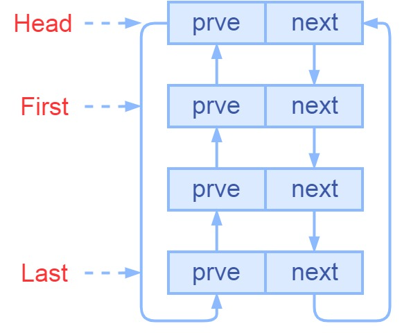

## 编译安装

首先要安装一些依赖的软件：

```shell
apt-get install pkg-config
apt-get install lua5.1
apt-get install liblua5.1-dev
apt-get install cmake
apt-get install libjson-c-dev
```

然后要编译安装 libubox ：

```shell
git clone https://git.openwrt.org/project/libubox.git
cd libubox
cmake .
make
make install
```

## ulog

头文件 `ulog.h` 提供了打印日志的方法。使用时，先调用 `ulog_open()` 函数初始化一些 ulog 需要的变量：

```c
void ulog_open(int channels, int facility, const char *ident);
```

`channels` 用于设置日志消息的输出目标，取值：

* `ULOG_KMSG`，内核日志，输出到了 `/dev/kmsg` 文件。
* `ULOG_SYSLOG`，系统日志，调用了 `vsyslog()` 产生系统日志。
* `ULOG_STDIO`，标准输出，输出到了 `stderr` 。

`facility` 用于设置记录日志的程序的类型，只有当 `channels` 的值为 `ULOG_SYSLOG` 时，这个参数有效。取值与 `openlog()` 的第三个参数一致，它们是定义在 `<syslog.h>` 中的宏：

```c
/* facility codes */
#define LOG_KERN        (0<<3)  /* kernel messages */
#define LOG_USER        (1<<3)  /* random user-level messages */
#define LOG_MAIL        (2<<3)  /* mail system */
#define LOG_DAEMON      (3<<3)  /* system daemons */
#define LOG_AUTH        (4<<3)  /* security/authorization messages */
#define LOG_SYSLOG      (5<<3)  /* messages generated internally by syslogd */
#define LOG_LPR         (6<<3)  /* line printer subsystem */
#define LOG_NEWS        (7<<3)  /* network news subsystem */
#define LOG_UUCP        (8<<3)  /* UUCP subsystem */
#define LOG_CRON        (9<<3)  /* clock daemon */
#define LOG_AUTHPRIV    (10<<3) /* security/authorization messages (private) */
#define LOG_FTP         (11<<3) /* ftp daemon */
```

`ident` 用于设置日志消息的标识，当 `channels` 的值为 `ULOG_STDIO` 时，这个参数无效。可以设置为程序名的字符串，如果为空，它会从 `/proc/self/status` 文件读取当前进程的名称作为默认值。

初始化完毕后，就可以调用 `ulog` 打印一条日志：

```c
void ulog(int priority, const char *fmt, ...)
```

`priority` 表示这条日志的类型，当 `channels` 的值为 `ULOG_STDIO` 时，这个参数无效。取值与 `syslog()` 的第一个参数一致，它们是定义在 `<syslog.h>` 中的宏：

```c
#define LOG_EMERG       0       /* system is unusable */
#define LOG_ALERT       1       /* action must be taken immediately */
#define LOG_CRIT        2       /* critical conditions */
#define LOG_ERR         3       /* error conditions */
#define LOG_WARNING     4       /* warning conditions */
#define LOG_NOTICE      5       /* normal but significant condition */
#define LOG_INFO        6       /* informational */
#define LOG_DEBUG       7       /* debug-level messages */
```

为了调用方便，ulog 提供了不同类型的宏定义：

```c
#define ULOG_INFO(fmt, ...) ulog(LOG_INFO, fmt, ## __VA_ARGS__)
#define ULOG_NOTE(fmt, ...) ulog(LOG_NOTICE, fmt, ## __VA_ARGS__)
#define ULOG_WARN(fmt, ...) ulog(LOG_WARNING, fmt, ## __VA_ARGS__)
#define ULOG_ERR(fmt, ...) ulog(LOG_ERR, fmt, ## __VA_ARGS__)
```

程序结束时，应该调用 `ulog_close()` 关闭日志，对于 `ULOG_SYSLOG` 来说，它会调用 `closelog()` 函数完成任务。

ulog 还提供了一个函数来控制程序打印日志的级别：

```c
void ulog_threshold(int threshold);
```

 `threshold` 可选的值与 `ulog()` 的 `priority`  参数一致，默认值是 `LOG_DEBUG` 。设置后，再调动 `ulog()` 时，如果  `priority` 的数值大于 `threshold` ，就不会打印任何消息。我们可以在开发调试阶段设置为  `LOG_DEBUG` ，调试结束发布程序时再设为 `LOG_INFO` ，调试信息就直接关闭了。

下面是一个例程：

```c
// main.c
#include <stdio.h>
#include <stdarg.h>
#include <libubox/ulog.h>

int main()
{
    ulog_open(ULOG_SYSLOG, LOG_USER, NULL);
    ULOG_INFO("hello ulog");
    ulog_close();
}
```

编译后执行：

```bash
~$ gcc -Wall main.c  -o main -lubox
~$ ./main
```

然后，在系统日志中可以查看到这条消息：

```bash
Jul 02 10:58:06 ubuntu main[25733]: hello ulog
```

## utils

`utils.h` 类似一个工具库，提供很多使用的方法。

### base64

utils 提供了 base64 的编解码方法。

编码函数是 `b64_encode()` ：

```c
int b64_encode(const void *_src, size_t srclength, void *dest, size_t targsize)
```

参数 `_src` 是指向源数据的指针，`srclength` 是源数据的长度，单位是字节。`dest` 指向编码后的字符串存放位置，`targsize`  是 `dest` 的空间大小，单位是字节。`targsize` 应该不小于 `(((srclength) + 2) / 3) * 4 + 1` ，除法取整，最后要加字符串结束符 `'\0'` ，所以要加 1 。如果调用成功，返回值是编码后的字符串长度，失败则返回 -1 。例如：

```c
b64_encode("food", 4, buf, 9);
```

解码函数是 `b64_decode()` ：

```c
int b64_decode(const void *_src, void *dest, size_t targsize);
```

参数的含义与编码函数一致，不需要设置源数据的长度，函数以 `_src` 字符串中的 `'\0'` 字符为结束符。如果调用成功，返回值是编码后的字符串长度，失败则返回 -1 。

`util.h` 文件提供了计算编解码后字符串长度的宏：

```c
#define B64_ENCODE_LEN(_len)	((((_len) + 2) / 3) * 4 + 1)
#define B64_DECODE_LEN(_len)	(((_len) / 4) * 3 + 1)
```

## list

ubox 用 `list.h` 提供了一种侵入式链表结构，结点中不含任何数据 ：

```c
struct list_head {
    struct list_head *next; // 下一个元素
    struct list_head *prev; // 上一个元素
};
```

可以用一个宏初始化链表：

```c
#define LIST_HEAD_INIT(name) { &(name), &(name) }
```

它定义了链表的 head  ，next 和 prev 都指向本身，调用方法：

```c
struct list_head test_list = LIST_HEAD_INIT(test_list);
```

ubox 的 list 还是一个双向循环链表：



在链表 head 的头部插入 new 结点，实际上是在 head 与 first 之间插入 new 结点：

```c
static inline void list_add(struct list_head *_new, struct list_head *head);
```

在链表 head 的末尾追加 new 结点，实际上是在 head 与 last 之间插入 new 结点 ：

```c
static inline void list_add_tail(struct list_head *_new, struct list_head *head);
```

将 entry 结点从原有的列表中删除：

```c
static inline void list_del(struct list_head *entry);
```

将 list 结点移动列表头部，就是 head 与 first 之间：

```c
static inline void list_move(struct list_head *list, struct list_head *head);
```

将 list 结点移动到列表末尾，就是 head 与 last 之间：

```c
static inline void list_move_tail(struct list_head *entry, struct list_head *head);
```

判断一个链表是否为空，它会判断 head 结点的 next 指针是否指向本身。：

```c
static inline bool list_empty(const struct list_head *head);
```

判断 list 结点是否是 head 链表的头结点：

```c
static inline bool list_is_first(const struct list_head *list, const struct list_head *head);
```

判断 list 结点是否是 head 链表的尾结点：

```c
static inline bool list_is_last(const struct list_head *list, const struct list_head *head);
```

对于侵入式链表，通常的使用方法是将 list 结点嵌入到特定的数据结构中，例如：

```c
struct item {
    const char *data;
    struct list_head list;
};
```

## usock

`usock.h` 提供便于新建 socket 的方法，是对 Linux socket API 的封装：

```c
int usock(int type, const char *host, const char *service);
```

如果调用成功，就返回一个 socket 文件描述符，失败返回 -1。

参数 `type` 用于设置 socket 类型，可选的值是下面这些宏定义的组合：

```c
#define USOCK_IPV6ONLY      0x2000 // IPv4 地址域的套接字
#define USOCK_IPV4ONLY      0x4000 // IPv6 地址域的套接字
#define USOCK_UNIX          0x8000 // UNIX 域的套接字

#define USOCK_TCP 0  // 字节流
#define USOCK_UDP 1  // 报文

#define USOCK_SERVER        0x0100
#define USOCK_NOCLOEXEC     0x0200
#define USOCK_NONBLOCK      0x0400  // 非阻塞
#define USOCK_NUMERIC       0x0800
```

`host` 是本机地址，如果是网络 socket，这里应该是一个 IP 地址或者域名，如果是 UNIX socket ，这里应该是 socket 文件的路径。

`service` 是本机端口，也可以是协议名称的字符串，例如 `http` 和 `ftp` 等。对于 UNIX socket ，这个参数无效。

对于非阻塞的 socket ，usock 提供了一个等待描述符就绪的方法：

```c
int usock_wait_ready(int fd, int msecs);
```

`fd` 是要等待的 socket 描述符，`msecs` 是等待超时，单位是微秒。这个方法是对 `poll()` 函数的封装。

```c
const char *usock_port(int port);
```

`usock_port()` 函数可以把数字表示的端口号转换为一个字符串。


