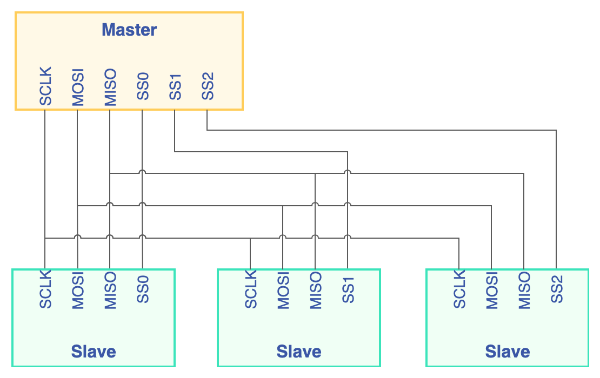
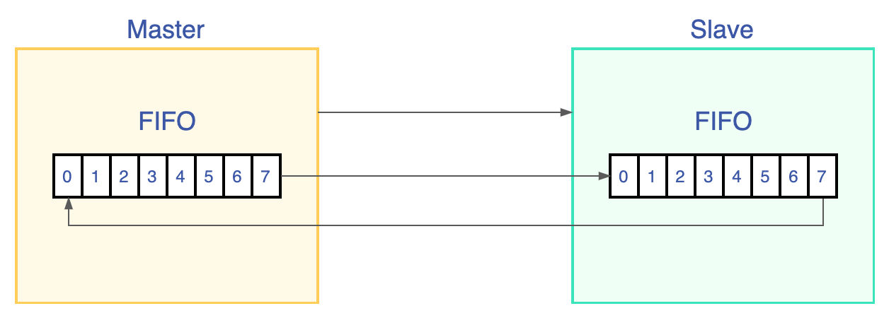
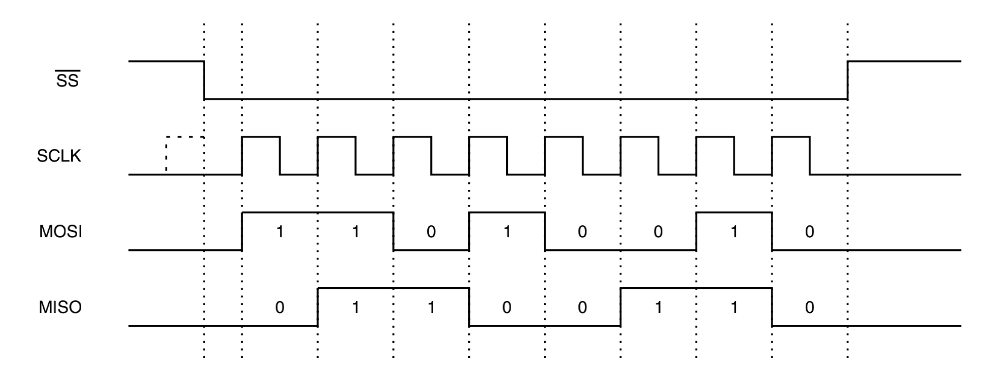
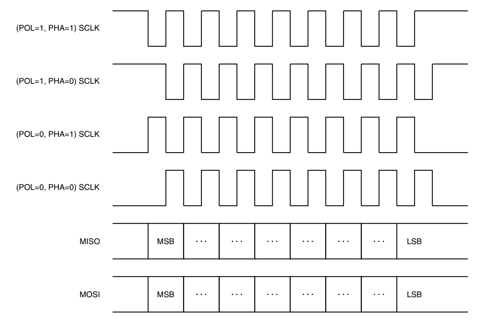

## SPI 通信协议

SPI 的全称是 Serial Peripheral Interface，是一个带时钟同步的全双工串行链接，使用主/从结构，用于连接微控制器和传感器、存储器和外设。常见的连接结构如下：



通信时需要四个信号：

1. SCLK，Serial Clock，时钟信号，SPI 的时钟频率通常可以达到 10MHz，实际情况还依赖从机能够支持的时钟频率。
2. MISO，Master In Slave Out，从机向主机发出的数据。
3. MOSI，Master Out Slave In，主机向从机发出的数据。
4. SS，Slave Select，从机选择，也叫做片选信号。一条 SPI 总线可以连接多个从设备，SCLK、MISO 和 MOSI 是共用的，每个从机需要一个独立的片选信号，当从机的 SS 信号拉低时，表示从机被选中，才开始接收总线上的信号。

在一个SPI时钟周期内，收发是同时进行的：

1. 主机通过 MOSI 线发送 1bit 数据，从机通过该线读取这 1bit 数据；
2. 从机通过 MISO 线发送 1bit 数据，主机通过该线读取这 1bit 数据。

这个过程是 SPI 设备内的移位寄存器实现的，当寄存器中的内容全部移出时，相当于完成了两个寄存器内容的交换，如下图所示。



下面是一个典型的主机模型的通信时序，描述了主机的 0xD2 的数据被移出，从 MISO 信号移入了 0x66 ：



SCLK 、MOSI 和 SS 信号由主机产生，MISO 是从机发出的信号，主机从这个信号读取从机的数据。通信开始前，SCLK 为低电平，当 SS 拉低后，从机被选中，通信开始，MOSI 和 MISO 信号在 SCLK 的上升沿发生变化，MISO 信号在 SCLK 的下降沿被采样锁存，通信结束后，SS 信号拉高，SCLK 信号重回低电平，一次通信发出的 bit 数为一个 word ，也叫字长。这只是一种情况，在 SCLK 下降沿和上升沿所做的事情由 CPOL 和 CPHA 的值决定，可以在 SPI 设备内的寄存器配置：

* CPOL，时钟极性，是指 SS 处于高电平，通信空闲时，SCLK 的电平。CPOL=0 时， SCLK 在空闲状态时为低电平，CPOL=1 时，则相反。
* CPHA，时钟相位，是指通信过程中，数据被采样锁存的时刻。当 CPHA=0 时，MOSI 或 MISO 信号会在 SCLK 的“奇数边沿”被采样，当 CPHA=1 时，信号在 SCLK 的“偶数边沿”采样。

两个配置选项，就会组成四种模式，时序如下图所示：



我们需要注意的是，主机和从机必须在相同的模式下才能正常通信。

## SPI userspace api

Linux 的 SPI 驱动生成的 spi 设备文件格式 `/dev/spidevB.C` ，并提供了功能有限的 API ，可以用 `open()` 和 `close()` 函数打开和关闭设备，用 `read()` 和 `write()` 函数读写数据，用 `ioctl()` 发送请求。需要的头文件： 

```c
#include <fcntl.h>
#include <unistd.h>
#include <sys/ioctl.h>
#include <linux/types.h>
#include <linux/spi/spidev.h>
```

首先需要打开设备文件，调用 `open()` 和 `close()` 是标准操作，没有特殊之处，例如 `open("/dev/spidev0.0", O_RDWR)` 。然后调用 `ioctl()` 进行设置，常用的请求有：

* SPI_IOC_RD_MODE 和 SPI_IOC_WR_MODE 。用于查询（RD）和设置（WR）单字节 SPI 通信的工作模式，包括时钟极性和时钟相位等特性，需要传递一个字符指针，每个位表示一种特性，可用的宏定义在内核源码的 `include/uapi/linux/spi/spi.h` 文件中，常用的有：
    * `SPI_MODE_0` , 表示 CPOL=0，CPHA=0 。
    * `SPI_MODE_1` , 表示 CPOL=0，CPHA=1 。
    * `SPI_MODE_2` , 表示 CPOL=1，CPHA=0 。
    * `SPI_MODE_3` , 表示 CPOL=1，CPHA=1 。
    * `SPI_CS_HIGH` , 表示片选信号高电平有效。
    * `SPI_LSB_FIRST`, 表示按照 LSB 发送，默认是 MSB 发送。
* SPI_IOC_RD_MODE32 和 SPI_IOC_WR_MODE32 。用于查询（RD）和设置（WR）完整的 SPI 通信的工作模式，不再局限于单字节传输。需要传递一个 `uint32` 指针，可用的选项与 `SPI_IOC_WR_MODE` 相同。
* SPI_IOC_RD_LSB_FIRST 和 SPI_IOC_WR_LSB_FIRST 。用于查询（RD）和设置（WR）SPI 的发送顺序，需要传递一个字符指针，0 表示 MSB ，其他值表示 LSB 。
* SPI_IOC_RD_BITS_PER_WORD 和 SPI_IOC_WR_BITS_PER_WORD 。用于查询（RD）和设置（WR）SPI 通信的字长，即一次通信发送的 bit 数，需要传递一个字符指针， 0 表示 8bits 。
* SPI_IOC_RD_MAX_SPEED_HZ 和 SPI_IOC_WR_MAX_SPEED_HZ 。用于查询（RD）和设置（WR）SPI  的最大传输速率（比特率），单位是 Hz，需要传递一个 `uint32` 型的指针。

配置完毕后就是可以读写，标准的 `read()` 和 `write()` 函数显然只能实现半双工，在这些函数调用之间，片选会被停用，要实现全双工需要调用 `ioctl()` 函数的 `SPI_IOC_MESSAGE(n)` 请求，n 用于指定传输的次数，读写的数据需要用 `struct spi_ioc_transfer` 型的指针传递：

```c
#include <linux/spi/spidev.h>

struct spi_ioc_transfer {
	__u64		tx_buf;  // 发送缓冲区的指针，里面的数据会发出去，如果为空，会发出 0 
	__u64		rx_buf;  // 接收缓冲区的指针，接收的数据会放在这里，可以为空

	__u32		len; // 一次传输的数据长度，单位是字节
	__u32		speed_hz;  // 临时改变 SPI 的速率

	__u16		delay_usecs; // 如果非零，表示两次传输直接的间隔，单位是微秒
	__u8		bits_per_word; // 临时改变字长
	__u8		cs_change; // 如果非零，下次传输前会取消片选
	__u8		tx_nbits;
	__u8		rx_nbits;
	__u8		word_delay_usecs;
	__u8		pad;
}
```

下面是一个例程，它的作用是向指定的 SPI 设备发送数据，并读回从设备发来的数据。

```c
/*
Copyright (C), SBS Science & Technology Co., Ltd. 
Author: LiShaocheng
*/

#include <sys/types.h>
#include <sys/stat.h>
#include <fcntl.h>
#include <sys/ioctl.h>
#include <unistd.h>
#include <stdio.h>
#include <stdlib.h>
#include <string.h>
#include <errno.h>
#include <linux/types.h>
#include <linux/spi/spidev.h>

#define BUF_MAX_SIZE	0x100
static unsigned char mode;
static unsigned char bits_per_word = 8;
static unsigned int speed = 100000;

char *buffer;

void help_info(const char *appname)
{
    printf("\n"
           "*******************************************************\n"
           "***********    Read/Write SPI device test    **********\n"
           "*******************************************************\n"
           "*                                                     *\n"
           "    Options : %s                                       \n"
           "                  [-D spi_dev]  [-s speed]             \n"
           "                  [-b bits_per_word]                   \n"
           "                  [-H] [-O] [-C] <value>               \n"
           "*                                                     *\n"
           "*    <spi_dev> - SPI device name , /dev/spidev0.0     *\n"
           "*    <speed> - Max transfer speed，Hz                 *\n"
           "*    <bits_per_word> - bits per word                  *\n"
           "*    -H - Phase 1 operation of clock                  *\n"
           "*    -O - Active low polarity of clock                *\n"
           "*    -C - Active high for chip select                 *\n"
           "*    <value> - Actual values to be sent               *\n"
           "*******************************************************\n"
           "\n", appname);
}

void numToHexStr(unsigned char _hexNum, unsigned char* _hexStr)
{
    unsigned char tmp;

    if(NULL == _hexStr)
        return;

    //低4bit
    tmp = (_hexNum >> 4) & 0x0f;
    if(tmp <= 9)
        *_hexStr = tmp+'0';
    else
        *_hexStr = tmp-0x0a + 'A';

    _hexStr++;

    //高4bit
    tmp = _hexNum & 0x0f;
    if(tmp <= 9)
        *_hexStr = tmp+'0';
    else
        *_hexStr = tmp-0x0a + 'A';
}

//将字符串转为16进制形式，以查看不可见字符 "01" ==> "3031"
int toHexStr(const unsigned char * _str, unsigned char *_hexStr)
{
    int i;
    int len;
    unsigned char* resultPtr;
    if(NULL == _str || NULL == _hexStr)
        return -1;
    
    len = strlen(_str);
    resultPtr = _hexStr;
    for(i=0; i<len; i++)
    {
        numToHexStr(_str[i], resultPtr);
        resultPtr += 2;
    }
    return strlen(_hexStr);
}
//判断是否是十六进制的基数
int isHexNum(unsigned char _hexNum)
{
    if('0'<=_hexNum && _hexNum<='9')
        return 1;
    else if('A'<=_hexNum && _hexNum<='F')
        return 2;
    else if('a'<=_hexNum && _hexNum<='f')
        return 3;
    
    return -1;
}

//十六进制的字符转数字
unsigned char charToHexNum(unsigned char hexChar)
{
    unsigned char tmp;
    if(1>isHexNum(hexChar))
        return 0xFF;
    
    if(hexChar<='9')
        tmp = hexChar-'0';
    else if(hexChar<='F')
        tmp = hexChar-'7';
    else
        tmp = hexChar-'W';

    return tmp;
}

static int transfer(int fd, char *tbuf, char *rbuf, int bytes)
{
    int ret;

    struct spi_ioc_transfer tr = {
        .tx_buf = (unsigned long)tbuf,
        .rx_buf = (unsigned long)rbuf,
        .len = bytes,
    };

    ret = ioctl(fd, SPI_IOC_MESSAGE(1), &tr);
    if (ret == 1)
        printf("can't send spi message");
    return ret;
}

int spidev_data_rw(char *dev, int len, char *buffer)
{
    char *rbuf;
    int res = 0;
    int fd = -1;
    int i = 0;

    fd = open(dev, O_RDWR);

    if (fd < 0) {
        printf("Error:cannot open device "
               "(Maybe not present in your board?)\n");
        return -1;
    }

    res = ioctl(fd, SPI_IOC_WR_MODE, &mode);
    if (res == -1) {
        printf("can't set spi mode");
        goto exit;
    }

    res = ioctl(fd, SPI_IOC_RD_MODE, &mode);
    if (res == -1) {
        printf("can't set spi mode");
        goto exit;
    }
    /*
     * bits per word
     */
    res = ioctl(fd, SPI_IOC_WR_BITS_PER_WORD, &bits_per_word);
    if (res == -1) {
        printf("can't set bits per word");
        goto exit;
    }

    res = ioctl(fd, SPI_IOC_RD_BITS_PER_WORD, &bits_per_word);
    if (res == -1) {
        printf("can't get bits per word");
        goto exit;
    }

    /*
     * max speed hz
     */
    res = ioctl(fd, SPI_IOC_WR_MAX_SPEED_HZ, &speed);
    if (res == -1) {
        printf("can't set max speed hz");
        goto exit;
    }

    res = ioctl(fd, SPI_IOC_RD_MAX_SPEED_HZ, &speed);
    if (res == -1) {
        printf("can't get max speed hz");
        goto exit;
    }

    printf("\n");
    printf("spi mode: %d\n", mode);
    printf("bits per word: %d\n", bits_per_word);
    printf("max speed: %d Hz (%d KHz)\n\n", speed, speed/1000);

    rbuf = malloc(len);
    memset(rbuf, 0, len);

    res = transfer(fd, buffer, rbuf, len);
    if (res < 0) {
        printf("Failed transferring data: %d\n", errno);
        free(rbuf);
        close(fd);
        return -1;
    }

    for(i=0; i<len; i++)
    {
        printf("Data recived buffer[%d] =  0x%02x\n", i, rbuf[i]);
    }

    free(rbuf);
exit:
    close(fd);

    return 0;
}

int main(int argc, char **argv)
{
    char *spi_dev;
    int bytes, len;
    int res;
    int i;
    unsigned char tmp[4];

    if (argc <= 1) {
        help_info(argv[0]);
        return 1;
    }

    mode = 0;
    for(i = 1; i < argc; i++) {
        if(!strcmp(argv[i], "-D")) {
            i++;
            spi_dev = argv[i];
        } else if(!strcmp(argv[i], "-s")) {
            i++;
            speed = atoi(argv[i]);
        } else if(!strcmp(argv[i], "-b")) {
            i++;
            bits_per_word = atoi(argv[i]);
        } else if(!strcmp(argv[i], "-H"))
            mode |= SPI_CPHA;
        else if(!strcmp(argv[i], "-O"))
            mode |= SPI_CPOL;
        else if(!strcmp(argv[i], "-C"))
            mode |= SPI_CS_HIGH;
        else if((i != (argc - 1))) {
            printf("invalid parameter\n");
            help_info(argv[0]);
            return -1;
        }
    }

    // 获得最后一个参数的长度，单位是 byte ，并将数据全部放入 buffer
    bytes = strlen((char *)argv[argc - 1]);
    if (bytes < 1) {
        printf("invalid parameter for buffer size\n");
        help_info(argv[0]);
        return -1;
    }
    buffer = malloc(BUF_MAX_SIZE);
    memset(buffer, 0, BUF_MAX_SIZE);
    strcpy(buffer, (char *)argv[argc-1]); 

    // 将字符转换为十六进制数字
    for(i=0; i<bytes/2; i++)
    {
        tmp[0] = charToHexNum(buffer[i*2]);
        tmp[0] = tmp[0]<<4;
        tmp[1] = charToHexNum(buffer[i*2+1]);
        buffer[i] = tmp[0] + tmp[1];
        printf("Data send buffer[%d] =  0x%02x\n", i, buffer[i]);
    }
    len = i;
    printf("Data send buffer len = 0x%x\n", len);

    res = spidev_data_rw(spi_dev, len, buffer);

    free(buffer);
    return res;
}
```

