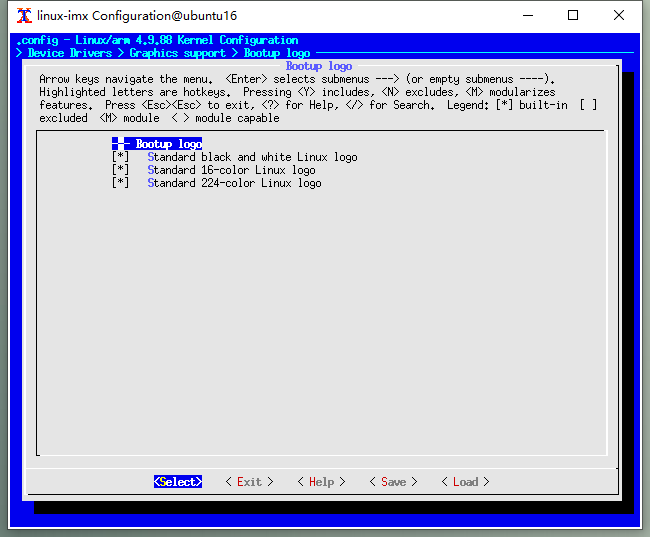

以 NXP 的 iMX Yocto 4.9.88 系统版本为例，启动分为三个阶段：U-Boot ，内核，根文件系统，每个阶段都可以设置自己的显示画面。

## U-Boot 的启动画面

u-boot 阶段的运行时很短，一般不用修改。待补充。

## 内核的启动画面

### PPM 图片格式

如果开启了 FrameBuffer ，Linux 内核启动时会在屏幕左上角显示企鹅图标，图标的数量等于 CPU 的核心数量。这个图标来自于内核源码的 `driver/video/logo/` 目录下的 ppm 格式图片：

```bash
$ ls drivers/video/logo/
clut_vga16.ppm             logo_linux_mono.pbm      logo_sun_clut224.ppm
Kconfig                    logo_linux_vga16.ppm     logo_superh_clut224.ppm
logo_blackfin_clut224.ppm  logo_m32r_clut224.ppm    logo_superh_mono.pbm
logo_blackfin_vga16.ppm    logo_mac_clut224.ppm     logo_superh_vga16.ppm
logo.c                     logo_parisc_clut224.ppm  Makefile
logo_dec_clut224.ppm       logo_sgi_clut224.ppm
logo_linux_clut224.ppm     logo_spe_clut224.ppm
```

这里的 ppm 格式是一种 ASCII 编码的图片文件格式，可以用文本编辑器打开，以 logo_linux_clut224.ppm 为例 ：

```
P3
# Standard 224-color Linux logo
80 80
255
  0   0   0   0   0   0   0   0   0   0   0   0
```

井号 `#` 开头的是注释，忽略注释后，前三行文本是文件头：

1. 第一行表示文件类型，P3 表示 ASCII 编码的 RGB 三色色显现图像 
2. 第二行表示图像的宽度和高度，单位是像素
3. 第三行表示最大的像素值

文件头后面所有像素点的数据，每个像素点是由 RGB三个数据组成，RGB 中间用一个空格隔开，像素点之间由两个空格隔开，每一行用回车隔开。

这样的文件不能供内核直接使用，需要转换成 C 语音的格式。编译内核时，执行的 `drivers/video/logo/Makefile` 文件会调用 `scripts/pnmtologo` 工具：

```bash
pnmtologo := scripts/pnmtologo
# Create commands like "pnmtologo -t mono -n logo_mac_mono -o ..."
quiet_cmd_logo = LOGO    $@
    cmd_logo = $(pnmtologo) \
         -t $(patsubst $*_%,%,$(notdir $(basename $<))) \
         -n $(notdir $(basename $<)) -o $@ $<
```

`scripts/pnmtologo` 是用 `scripts/pnmtologo.c` 编译生成的二进制工具，执行的语法是：

```
./pnmtologo [options] <filename>
可选项:
    -h          : 显示帮助信息
    -n <name>   : 生成的 struct linux_logo 类型变量的名字 (default: linux_logo)
    -o <output> : 生成的 C 语音源文件的名字
    -t <type>   : 启动画面的类型
                      mono    : monochrome black/white
                      vga16   : 16 colors VGA text palette
                      clut224 : 224 colors (default)
                      gray256 : 256 levels grayscale
<filename> 是要解析的 ppm 图片的文件名
```

它会把 `driver/video/logo/` 目录下 `.ppm` 文件转换为同名的 `.c` 文件，例如，logo_linux_clut224.ppm 会转换为 logo_linux_clut224.c ，通过一个 `struct linux_logo` 变量保存图片的数据。

###  显示启动画面的过程

内核绘制 logo 是由 `drivers/video/fbdev/core/fbmem.c` 文件中的 `fb_show_logo()` 完成的：

```c
int fb_show_logo(struct fb_info *info, int rotate)
{
	int y;

	y = fb_show_logo_line(info, rotate, fb_logo.logo, 0,
			      num_online_cpus());
	y = fb_show_extra_logos(info, y, rotate);

	return y;
}
```

参数 `info` 传递的 FrameBuffer 的属性，`rotate` 则表示屏幕的旋转方向。这个函数又调用了 `fb_show_logo_line()` 函数，参数 `num_online_cpus()` 是一个宏，它返回了 CPU 的核心数量，参数 `fb_logo.logo` 是一个 `struct linux_logo` 指针，这个结构记录了 logo 图片的分辨率和像素数据，它是在 `fb_prepare_logo()` 函数中由 `fb_find_logo()` 赋值：

```c
int fb_prepare_logo(struct fb_info *info, int rotate)
{
...
	/* Return if no suitable logo was found */
	fb_logo.logo = fb_find_logo(depth);
...
}
```

参数 `depth` 表示 FrameBuffer 的颜色深度，基本是由屏幕的素质决定，`fb_find_logo()` 函数定义在 `drivers/video/logo/logo.c` 中，它的作用是根据 `depth` 的值和内核配置决定用那个图片作为 logo ，如果颜色深度是 16 ，且内核配置了 `CONFIG_LOGO_LINUX_CLUT224` 选项，就用 `logo_linux_clut224` 作为 logo ：

```c
const struct linux_logo * __ref fb_find_logo(int depth)
{
	const struct linux_logo *logo = NULL;
	...
	if (depth >= 8) {
#ifdef CONFIG_LOGO_LINUX_CLUT224
		/* Generic Linux logo */
		logo = &logo_linux_clut224;
#endif
	...
	return logo;
}
```

配置选项是在 menuconfig 中的 `Device Drivers > Graphics support > Bootup logo` 中设置的：



`logo_linux_clut224` 是一个 `struct linux_logo` 类型的变量，定义在 `logo_linux_clut224.c` 文件中，它是在编译时，由 `drivers/video/logo/Makefile` 文件调用  `scripts/pnmtologo` 工具，读取 `drivers/video/logo/` 目录下的同名图片 `logo_linux_clut224.ppm` 解析后生成的。内容类似如下：

```c
static unsigned char logo_linux_clut224_data[] __initdata = {
    0x20, 0x20, 0x20, 0x20, 0x20, 0x20, 0x20, 0x20, 0x20, 0x20, 0x20, 0x20,
    ... ...
};
static unsigned char logo_linux_clut224_clut[] __initdata = {
    0xff, 0xff, 0xff, 0xff, 0xff, 0xfd, 0xfe, 0xff, 0xff, 0xff, 0xfe, 0xff,
    ... ...
}
const struct linux_logo logo_linux_clut224 __initconst = {
     .type       = LINUX_LOGO_CLUT224,
     .width      = 800,
     .height     = 590,
     .clutsize   = 223,
     .clut       = logo_linux_clut224_clut,
     .data       = logo_linux_clut224_data
};
```

确定了 logo 用的图片后， `fb_show_logo_line()` 函数会改用 `struct fb_image` 结构保存要显示的图片：

```c
static int fb_show_logo_line(struct fb_info *info, int rotate,
			     const struct linux_logo *logo, int y,
			     unsigned int n)
{
	struct fb_image image;
	...
    image.depth = 8;    //图片的颜色深度固定为 8
    image.data = logo->data;    //图片的数据
    image.dx = 0;        //绘制图片的起始横坐标，屏幕的左上角为 0
    image.dy = y;        //绘制图片的起始纵坐标，也是 0 ，表示从左上角开始显示
    image.width = logo->width;    //图片的横向分辨率
    image.height = logo->height;    //图片的纵向分辨率
    ...
    fb_do_show_logo(info, &image, rotate, n);
}
```

最后调用 `fb_do_show_logo()` 函数横向的绘制 n 个 image 。如果屏幕是正向的，图片会按如下方式绘制：

```c
static void fb_do_show_logo(struct fb_info *info, struct fb_image *image,
			    int rotate, unsigned int num)
{
    ...
	if (rotate == FB_ROTATE_UR) {
		for (x = 0;
		     x < num && image->dx + image->width <= info->var.xres;
		     x++) {
			info->fbops->fb_imageblit(info, image);
			image->dx += image->width + 8;
		}
	} 
	...
}
```

### 更换启动画面

根据 logo 的显示原理，我们可以按如下步骤更换内核的启动画面。

首先准备一张小于等于屏幕分辨率的 png 格式图片，命名为 logo.png ，执行如下命令将其转换为 ppm 格式：

```bash
~$ pngtopnm logo.png > logo_linux_clut.pnm
~$ pnmquant 224 logo_linux_clut.pnm > logo_linux_clut224.pnm
~$ pnmtoplainpnm logo_linux_clut224.pnm > logo_linux_clut224.ppm
```

将生成的 logo_linux_clut224.ppm 覆盖到内核源码的  `drivers/video/logo/` 目录下。

如果 CPU 是多核，且 logo 图片跟屏幕分辨率相同，想要全屏显示，就修改 `drivers/video/fbdev/core/fbmem.c` 文件中的 `fb_show_logo()` 函数，将绘制 logo 的数量设为 1 ：

```
@@ -665,7 +665,7 @@ int fb_show_logo(struct fb_info *info, int rotate)
        int y;

        y = fb_show_logo_line(info, rotate, fb_logo.logo, 0,
-                             num_online_cpus());
+                             1);
        y = fb_show_extra_logos(info, y, rotate);

        return y;

```

默认情况下，图片会贴着屏幕的左上角 `<0,0>` 显示。如果需要居中显示，可以在 `drivers/video/fbdev/core/fbmem.c` 文件的 `fb_show_logo_line()` 函数中修改图片显示的起始坐标：

```diff
-image.dx=0;
-image.dy=y;
+image.dx = (info->var.xres / 2) - (image.width / 2);
+image.dy = (info->var.yres / 2) - (image.height / 2);
```

查看内核的 git log 发现，在 5.0 之后的版本，通过 [commit:3d8b19](https://github.com/torvalds/linux/commit/3d8b1933eb1c3c94ef8667996dbff6994d5d552f) 添加了让 logo 居中显示的配置选项，但是很快又通过 [commit/890d14](https://github.com/torvalds/linux/commit/890d14d2d4b57ff5a149309da3ed36c8a529987f) 将这个功能转移到了命令行的选项 `fbcon=logo-pos:<location>` 中。

### 动态修改启动画面

上面的方法中，启动画面的数据必须编译到内核中，每次修改启动画面都要重新编译内核，不太方便。eMMC 中有一个用于放置内核和设备树文件的 FAT 分区，我们可以利用这个分区和 u-boot 的 load 命令，实现动态修改启动画面的功能，大致原理是：

1. 将 ppm 格式的 logo 图片转换成二进制格式的 ppmlogo.bin 文件，放到 FAT 分区中。
2. u-boot 启动时，读取 ppmlogo.bin 文件，并写入内核的保留内存中。
3. kernel 启动时，从保留内存的特定位置读取 ppmlogo.bin 的数据，用这个数据初始化 linux_logo 变量。

首先写一个名为 ppmtobin 的程序，可以借用 `script/pnmtologo.c` 进行修改。它的作用是把一个 ppm 格式的 logo 图片转换成内核能够直接读取的二进制格式文件 ppmlogo.bin ，把这个文件放到 eMMC 的 FAT 分区，该文件的存储布局与 `struct linux_logo` 相同：

```bash
 * ---------------------------------------------
 *         |    0        1        2        3    (byte)
 * ---------------------------------------------
 *        0|             logo type
 * ---------------------------------------------
 *        4|             logo width(w)
 * ---------------------------------------------
 *        8|             logo height(h)
 * ---------------------------------------------
 *       12|             logo clutsize
 * ---------------------------------------------
 *       16| 
 *      ...|             logo data
 *      ...|            (size = w*h)
 * ---------------------------------------------
 *   w*h+16| 
 *      ...|             logo clut
 *      ...|        (size = clutsize*3)
 * ---------------------------------------------
```

下一步就是 u-boot 中操作。先确认一下板卡的内存信息，可以在 u-boot 中执行 bdinfo 命令：

```bash
=> bdinfo
arch_number = 0x00000F8C
boot_params = 0x10000100
DRAM bank   = 0x00000000
-> start    = 0x10000000   # 内存起始地址
-> size     = 0x40000000   # 内存大小 1GB ，我们可以把 logo 文件加载到 4f000000 地址后面的内存里
baudrate    = 115200 bps
TLB addr    = 0x4FFF0000
relocaddr   = 0x4FF40000
reloc off   = 0x38740000
irq_sp      = 0x4EF318C0
sp start    = 0x4EF318B0
FB base     = 0x4EF46580
Early malloc usage: 114 / 400
```

然后确认分区和文件，明确 ppplog.bin 文件的路径：

```bash
=> mmc part

Partition Map for MMC device 2  --   Partition Type: DOS

Part    Start Sector    Num Sectors     UUID            Type
  1     20480           1024000         bcd6138c-01     0c
  2     1228800         6324224         bcd6138c-02     83

=> fatls mmc 2:1
  7679712   zimage
    52298   imx6dl-sabresd.dtb
   472688   ppmlogo.bin
    51391   imx6q-sabresd.dtb

```

先试试手动加载，将 ppmlogo.bin 文件加载 `4f00000` 的地址上：

```bash
=> load mmc 2:1 4f000000 ppmlogo.bin
reading ppmlogo.bin
472688 bytes read in 29 ms (15.5 MiB/s)
```

加载成功后可以读一下这段内存的值，看一下写入的值是否正确：

```bash
=> md.l 4f000000 4
4f000000: 00000003 00000320 0000024e 000000df    .... ...N.......
```

手动加载成功后，就可以新建一个环境变量，保存加载 logo 文件的操作：

```bash
=> env set load_logo load mmc 2:1 4f000000 ppmlogo.bin
=> env save
```

手动执行一次，确保命令可以正常执行：

```bash
=> run load_logo
reading ppmlogo.bin
472688 bytes read in 29 ms (15.5 MiB/s)
```

最后，编辑 bootcmd 环境变量，添加 ` run load_logo; ` ，让 u-boot 启动时自动执行 load_logo ：

```bash
=> env edit bootcmd
edit: run findfdt;run findtee;mmc dev ${mmcdev}; run load_logo; if mmc rescan; then if run loadbootscript; then run bootscript; else if run loadimage; then run mmcboot; else run netboot; fi; fi; else run netboot; fi
=> env save
```

保存后重启，可以看到加载 ppmlogo.bin 时，u-boot 打印的如下信息：

```bash
reading ppmlogo.bin
472688 bytes read in 28 ms (16.1 MiB/s)
```

手动修改 u-boot 没有问题后，可以在 u-boot 源码中修改 `bootcmd` 的值，使 u-boot 启动时自动加载 logo 图片。例如修改 imx6q 的配置文件 `include/configs/mx6sabre_common.h：

```diff
#define CONFIG_EXTRA_ENV_SETTINGS \
        CONFIG_MFG_ENV_SETTINGS \
        TEE_ENV \
        "epdc_waveform=epdc_splash.bin\0" \
        "script=boot.scr\0" \
        "image=zImage\0" \
+       "load_logo=load mmc 2:1 4f000000 ppmlogo.bin"
... ...
#define CONFIG_BOOTCOMMAND \
        "run findfdt;" \
        "run findtee;" \
        "mmc dev ${mmcdev};" \
+       "run load_logo" \
        "if mmc rescan; then " \
                "if run loadbootscript; then " \
                "run bootscript; " \
                "else " \
                        "if run loadimage; then " \
                                "run mmcboot; " \
                        "else run netboot; " \
                        "fi; " \
                "fi; " \
        "else run netboot; fi"
#endif
```

最后就是修改内核。我们需要在设备树的 `/reserved-memory` 中添加一个字节点，申请一段保留内存，将地址 `0x4f000000` 开始的 3MB 内存留給 u-boot 存放的 ppmlogo.bin ，避免内核启动后将这段内存覆盖：

```c
reserved-memory {
    linux-logo {
        compatible = "cs-logo";
        reusable;
        reg = <0x4f000000 0x300000>;
    }
}
```

然后修改 `drivers/video/logo/logo.c` 文件中的 `fb_find_logo()` 函数，读取 `0x4f000000` 内存中的数据，并结构化为 `struct linux_logo` 格式：

```diff
diff --git a/drivers/video/logo/logo.c b/drivers/video/logo/logo.c
index b6bc4a0..d304272 100644
--- a/drivers/video/logo/logo.c
+++ b/drivers/video/logo/logo.c
@@ -28,6 +28,8 @@ MODULE_PARM_DESC(nologo, "Disables startup logo");

 static bool logos_freed;

+struct linux_logo cs_logo; //存放内存中读取的 logo 数据，一定要全局变量
+
 static int __init fb_logo_late_init(void)
 {
        logos_freed = true;
@@ -43,6 +45,7 @@ late_initcall(fb_logo_late_init);
 const struct linux_logo * __ref fb_find_logo(int depth)
 {
        const struct linux_logo *logo = NULL;
+    char *logo_addr = NULL;  

        if (nologo || logos_freed)
                return NULL;
@@ -76,7 +79,17 @@ const struct linux_logo * __ref fb_find_logo(int depth)
        if (depth >= 8) {
 #ifdef CONFIG_LOGO_LINUX_CLUT224
                /* Generic Linux logo */
-               logo = &logo_linux_clut224;
+        logo_addr = phys_to_virt((phys_addr_t)(0x4f000000));  // 将物理地址转换为虚拟地址
+        memcpy(&cs_logo.type, logo_addr, 4);
+        memcpy(&cs_logo.width, logo_addr+4, 4);
+        memcpy(&cs_logo.height, logo_addr+8, 4);
+        memcpy(&cs_logo.clutsize,logo_addr+12, 4);
+        printk("load cs_logo head: %d,%d,%d,%d \n", cs_logo.type, cs_logo.width, cs_logo.height, cs_logo.clutsize);
+
+        cs_logo.data = logo_addr+16;
+        cs_logo.clut = logo_addr+16+cs_logo.width*cs_logo.height;
+        logo = &cs_logo;
+
 #endif
 #ifdef CONFIG_LOGO_BLACKFIN_CLUT224
```

修改完毕，下面是 ppmtobin 的程序的源码：

```c
/*
 * ppmtobin.c
 * compile: gcc -Wall ppmtobin.c -o ppmtobin
 * Author: LiShaocheng
 * 
 * Convert a logo in ASCII PNM format to binary file, format is 
 * ---------------------------------------------
 *         |    0        1        2        3    
 * ---------------------------------------------
 *        0|             logo type
 * ---------------------------------------------
 *        4|             logo width(w)
 * ---------------------------------------------
 *        8|             logo height(h)
 * ---------------------------------------------
 *       12|             logo clutsize
 * ---------------------------------------------
 *       16| 
 *      ...|             logo data
 *      ...|            (size = w*h)
 * ---------------------------------------------
 *   w*h+16| 
 *      ...|             logo clut
 *      ...|        (size = clutsize*3)
 * ---------------------------------------------
*/

#include <ctype.h>
#include <errno.h>
#include <stdarg.h>
#include <stdio.h>
#include <stdlib.h>
#include <string.h>
#include <unistd.h>

struct bin_header
{
    int type; /* one of LINUX_LOGO_* */
    unsigned int width;
    unsigned int height;
    unsigned int clutsize;     /* LINUX_LOGO_CLUT224 only */
};

static const char *appname;
static const char *filename;
static const char *outputname;
static FILE *out;

#define MAX_LINUX_LOGO_COLORS 224

struct color
{
    unsigned char red;
    unsigned char green;
    unsigned char blue;
};

static unsigned int logo_width;
static unsigned int logo_height;
static struct color **logo_data;
static struct color logo_clut[MAX_LINUX_LOGO_COLORS];
static unsigned int logo_clutsize;
static int is_plain_pbm = 0;

static void die(const char *fmt, ...)
    __attribute__((noreturn)) __attribute((format(printf, 1, 2)));
static void usage(void) __attribute((noreturn));

// read data from PNG file
static unsigned int get_number(FILE *fp)
{
    int c, val;

    /* Skip leading whitespace */
    do
    {
        c = fgetc(fp);
        if (c == EOF)
            die("%s: end of file\n", filename);
        if (c == '#')
        {
            /* Ignore comments 'till end of line */
            do
            {
                c = fgetc(fp);
                if (c == EOF)
                    die("%s: end of file\n", filename);
            } while (c != '\n');
        }
    } while (isspace(c));

    /* Parse decimal number */
    val = 0;
    while (isdigit(c))
    {
        val = 10 * val + c - '0';
        /* some PBM are 'broken'; GiMP for example exports a PBM without space
	 * between the digits. This is Ok cause we know a PBM can only have a '1'
	 * or a '0' for the digit. */
        if (is_plain_pbm)
            break;
        c = fgetc(fp);
        if (c == EOF)
            die("%s: end of file\n", filename);
    }
    return val;
}

static unsigned int get_number255(FILE *fp, unsigned int maxval)
{
    unsigned int val = get_number(fp);
    return (255 * val + maxval / 2) / maxval;
}

static void read_image(void)
{
    FILE *fp;
    unsigned int i, j;
    int magic;
    unsigned int maxval;

    /* open image file */
    fp = fopen(filename, "r");
    if (!fp)
        die("Cannot open file %s: %s\n", filename, strerror(errno));

    /* check file type and read file header */
    magic = fgetc(fp);
    if (magic != 'P')
        die("%s is not a PNM file\n", filename);
    magic = fgetc(fp);
    switch (magic)
    {
    case '1':
    case '2':
        /* Plain PBM/PGM */
        die("%s: Plain PBM/PGM is not supported\n"
            "Use pnmnoraw(1) to convert it to ASCII PNM\n",
            filename);
    case '3':
        /* Plain PPM */
        break;
    case '4':
    case '5':
    case '6':
        /* Binary PBM/PGM/PPM */
        die("%s: Binary PNM is not supported\n"
            "Use pnmnoraw(1) to convert it to ASCII PNM\n",
            filename);

    default:
        die("%s is not a PNM file\n", filename);
    }
    logo_width = get_number(fp);
    logo_height = get_number(fp);

    /* allocate image data */
    logo_data = (struct color **)malloc(logo_height * sizeof(struct color *));
    if (!logo_data)
        die("%s\n", strerror(errno));
    for (i = 0; i < logo_height; i++)
    {
        logo_data[i] = malloc(logo_width * sizeof(struct color));
        if (!logo_data[i])
            die("%s\n", strerror(errno));
    }

    /* read Plain PPM data */
    maxval = get_number(fp);
    for (i = 0; i < logo_height; i++)
        for (j = 0; j < logo_width; j++)
        {
            logo_data[i][j].red = get_number255(fp, maxval);
            logo_data[i][j].green = get_number255(fp, maxval);
            logo_data[i][j].blue = get_number255(fp, maxval);
        }

    /* close file */
    fclose(fp);
}

static inline int is_equal(struct color c1, struct color c2)
{
    return c1.red == c2.red && c1.green == c2.green && c1.blue == c2.blue;
}

static void write_logo_clut224(void)
{
    unsigned int i, j, k;
    int len = 0;
    int write_hex_cnt = 0;
    struct bin_header header;
    unsigned char bin_data[logo_width*logo_height];
    unsigned char bin_clut[MAX_LINUX_LOGO_COLORS*3];

    /* validate image */
    for (i = 0; i < logo_height; i++)
        for (j = 0; j < logo_width; j++)
        {
            for (k = 0; k < logo_clutsize; k++)
                if (is_equal(logo_data[i][j], logo_clut[k]))
                    break;
            if (k == logo_clutsize)
            {
                if (logo_clutsize == MAX_LINUX_LOGO_COLORS)
                    die("Image has more than %d colors\n"
                        "Use ppmquant(1) to reduce the number of colors\n",
                        MAX_LINUX_LOGO_COLORS);
                logo_clut[logo_clutsize++] = logo_data[i][j];
            }
        }

    /* open bin file */
    if (outputname)
    {
        printf("Creat %s file\n", outputname);
        out = fopen(outputname, "wb");
        if (!out)
            die("Cannot create file %s: %s\n", outputname, strerror(errno));
    }
    else
    {
        printf("Creat ppmlogo.bin file\n");
        out = fopen("ppmlogo.bin", "wb");
        if (!out)
            die("Cannot create file %s: %s\n", outputname, strerror(errno));        
    }

    /* write logo header to bin file*/
    header.type = 3;
    header.width = logo_width;
    header.height = logo_height;
    header.clutsize = logo_clutsize;
    printf("logo_width is %d \n", logo_width);
    printf("logo_height is %d \n", logo_height);
    printf("logo_clutsize is %d \n", logo_clutsize);
    len = fwrite(&header, 1, sizeof(header), out);
    printf("write logo header len is %d bytes\n\n", len);

    /* write logo data to bin file*/
    for (i = 0; i < logo_height; i++)
        for (j = 0; j < logo_width; j++)
        {
            for (k = 0; k < logo_clutsize; k++)
                if (is_equal(logo_data[i][j], logo_clut[k]))
                    break;
            bin_data[write_hex_cnt++] = k + 32;
        }
    printf("bin data len is %d bytes\n", write_hex_cnt);
    len = fwrite(&bin_data, 1, sizeof(bin_data), out);
    printf("write bin data len is %d bytes\n\n", len);

    /* write logo clut to bin file*/
    write_hex_cnt = 0;
    for (i = 0; i < logo_clutsize; i++)
    {
        bin_clut[write_hex_cnt++] = logo_clut[i].red;
        bin_clut[write_hex_cnt++] = logo_clut[i].green;
        bin_clut[write_hex_cnt++] = logo_clut[i].blue;
    }
    printf("bin clut len is %d bytes\n", write_hex_cnt);
    len = fwrite(&bin_clut, 1, sizeof(bin_clut), out);
    printf("write bin clut len is %d bytes\n", len);

    fclose(out);
}

static void die(const char *fmt, ...)
{
    va_list ap;

    va_start(ap, fmt);
    vfprintf(stderr, fmt, ap);
    va_end(ap);

    exit(1);
}

static void usage(void)
{
    die("Convert a logo in ASCII PNM format to binary file\n"
        "Usage: %s [options] <filename>\n"
        "\n"
        "Valid options:\n"
        "    -h          : display this usage information\n"
        "    -o <output> : output to file <output> instead of default ppmlogo.bin\n"
        "\n",
        appname);
}

int main(int argc, char *argv[])
{
    int opt;

    appname = argv[0];

    opterr = 0;
    while (1)
    {
        opt = getopt(argc, argv, "ho:");
        if (opt == -1)
            break;

        switch (opt)
        {
        case 'h':
            usage();
            break;
        case 'o':
            outputname = optarg;
            break;
        default:
            usage();
            break;
        }
    }
    if (optind != argc - 1)
        usage();

    filename = argv[optind];

    read_image();
    write_logo_clut224();

    exit(0);
}
```

### 一些问题

如果你的屏幕分辨率是 800x600 ，而你准备了一张 800x600 的图片，替换后会发现启动画面没有显示，查看内核信息会提示：

```
fbcon_init: disable boot-logo (boot-logo bigger than screen).
```

这条信息来自 `drivers/video/console/fbcon.c` 文件的 `fbcon_prepare_logo()` 函数：

```c
if (logo_lines > vc->vc_bottom) {
	logo_shown = FBCON_LOGO_CANSHOW;
	printk(KERN_INFO "fbcon_init: disable boot-logo (boot-logo bigger than screen).\n");
}
```

logo_lines 的值来自：

```c
logo_lines = DIV_ROUND_UP(logo_height, vc->vc_font.height);
```

`logo_height` 表示图片的高度，就是 600 ，`vc->vc_font.height` 的默认值是 16 ，DIV_ROUND_UP 的定义是：

```c
#define DIV_ROUND_UP __KERNEL_DIV_ROUND_UP#define __KERNEL_DIV_ROUND_UP(n, d) (((n) + (d) - 1) / (d))
```

计算后得到的 logo_lines 就是 38 。打印 vc->vc_bottom 的值发现是 37 ，所有需要把图片的纵向分辨率调小到 592 ，这样计算出的 logo_lines 就是 37 。

### 关于保留内存

参考内核文档 [reserved-memory.txt](https://www.kernel.org/doc/Documentation/devicetree/bindings/reserved-memory/reserved-memory.txt) 。

可以在设备树的 `/reserved-memory` 节点下面新建子节点，用于描述特定的内存区域，Linux 会将这部分内存排除在正常使用之外。 `/reserved-memory` 节点的定义如下：

```c
reserved-memory {
	#address-cells = <1>; # 标准定义，用于设置子节点的 reg 属性的书写格式
	#size-cells = <1>; # 标准定义，用于设置子节点的 reg 属性的书写格式
	ranges; # 标准定义，空属性

	#子节点
}
```

在下面的子节点中，可以使用 `reg` 属性来指定保留内存的范围，或者用 `size` 属性请求动态分配一段特定大小的内存，如果两个都存在，则 `reg` 优先，`size` 会被忽略。按照推荐的做法，节点名称应该反映节点的目的，如果是静态分配，应该附加上单位地址 `@<address>` 。

可用的属性如下：

1. 静态分配
    * reg - 标准定义，必须设置。语法是 `<address offset>` ，例如 `reg = <0x10000000 0x40000000>;` 表示从 0x10000000 开始，分配 1GB 内存。
2. 动态分配
    * size - 基于父类的 #size-cells 的长度，要保留的内存的字节数，必须设置。
    * alignment - 基于父类的#size-cells的长度，用于对齐分配的地址边界，可选设置。
    * alloc-ranges - 设置一个地址和长度，请求在这个特定区域内分配保留内存，可选设置。

可选的附加属性：

1. compatible - 可以包含以下字符串。

    * shared-dma-pool 。这表示一个内存区域，旨在作为一组设备的DMA缓冲区的共享池使用。如果有必要，它可以被操作系统用来实例化必要的池管理子系统。

    * 厂商特定的字符串，形式为 `<vendor>,[<device>-]<usage>` 。

2. no-map - 空属性，表示操作系统不得创建该区域的虚拟映射作为其系统内存标准映射的一部分，也不允许在使用该区域的设备驱动程序控制之外的任何情况下对其进行投机访问。

3. reusable - 空属性，操作系统可以使用该区域的内存，但有一个限制，即拥有该区域的设备驱动程序需要能够将其收回。通常情况下，这意味着操作系统可以使用该区域来存储易失性或缓存的数据，这些数据可以通过其他方式重新生成或迁移到其他地方。

> no-map 和 reusable 两个属性不能共存，因为它们的逻辑是矛盾的。

Linux 还有特定的实现：

- 如果 "linux,cma-default "属性存在，那么 Linux 将使用该区域作为连续内存分配器的默认池。

- 如果 "linux,dma-default "属性存在，那么 Linux 将使用该区域作为一致 DMA 分配器的默认池。

其他设备节点可以通过 `memory-region` 属性引用已定义的保留内存：

* memory-region - 它的值应该是保留内存子节点的名称
* memory-region-names - 保留内存子节点的名称的列表。

下面是一个例子，定义了三个保留内存：

* 一个是所有设备驱动的默认区域（名为linux,cma@72000000，大小为64MB）。
* 一个专门用于帧缓冲设备（命名为framebuffer@78000000，8MB）。
* 一个用于多媒体处理（名为multimedia-memory@77000000，64MB）。

```c
/ {
	#address-cells = <1>;
	#size-cells = <1>;

	memory {
		reg = <0x40000000 0x40000000>;
	};

	reserved-memory {
		#address-cells = <1>;
		#size-cells = <1>;
		ranges;

		/* global autoconfigured region for contiguous allocations */
		linux,cma {
			compatible = "shared-dma-pool";
			reusable;
			size = <0x4000000>;
			alignment = <0x2000>;
			linux,cma-default;
		};

		display_reserved: framebuffer@78000000 {
			reg = <0x78000000 0x800000>;
		};

		multimedia_reserved: multimedia@77000000 {
			compatible = "acme,multimedia-memory";
			reg = <0x77000000 0x4000000>;
		};
	};

	/* ... */

	fb0: video@12300000 {
		memory-region = <&display_reserved>;
		/* ... */
	};

	scaler: scaler@12500000 {
		memory-region = <&multimedia_reserved>;
		/* ... */
	};

	codec: codec@12600000 {
		memory-region = <&multimedia_reserved>;
		/* ... */
	};
};
```

## 用户空间的启动画面

用户空间的启动画面是用 psplash 实现的，它的原理就是使用 FrameBuffer 的 API 在屏幕上绘制图片。源码可以用 git 下载：

```bash
git://git.yoctoproject.org/psplash
```

源文件比较简单，比较重要的有：

* make-image-header.sh ，它的作用是把 png 格式的图片转换为 C 语言头文件，这样就可以把图片编译到可执行的二进制文件中。
* psplash.c ，main 函数所在的源文件，可以在这里查看绘制启动画面的流程。
* psplash-config.h ，基本的配置宏定义。
* psplash-colors.h ，颜色相关的配置宏定义。
* psplash-poky-img.h ，包含图片数据的头文件。
* psplash-fb.c ，定义了 framebuffer 绘图函数。

`psplash-config.h` 头文件定义了显示配置：

```c
/* 设置启动画面中文本信息，默认是空的。如果不用，最好注释掉，否则会在启动画面中显示一行背景色 */
#define PSPLASH_STARTUP_MSG ""

/* 一个布尔值，用于指示图片的显示位置，如果图片的分辨率等于屏幕分辨率，最好设为 1 ，如果图片的分辨率小于屏幕分辨率 ，可以设置为 0 ，然后用后面的参数调整显示效果*/
#define PSPLASH_IMG_FULLSCREEN 0

 /* 设置分屏显示的分子 */
#define PSPLASH_IMG_SPLIT_NUMERATOR 5

/* 设置分屏显示的分母 */
#define PSPLASH_IMG_SPLIT_DENOMINATOR 6
```

`psplash-colors.h` 头文件定义了画面元素的颜色：

```c
/* 设置背景颜色，RGB */
#define PSPLASH_BACKGROUND_COLOR 0xec,0xec,0xe1

/* 设置文字的颜色，RGB */
#define PSPLASH_TEXT_COLOR 0x6d,0x6d,0x70

/* 设置进度条的颜色，RGB */
#define PSPLASH_BAR_COLOR 0x6d,0x6d,0x70

/* 设置进度条的背景颜色，RGB */
#define PSPLASH_BAR_BACKGROUND_COLOR 0xec,0xec,0xe1
```

`psplash-poky-img.h` 文件用 make-image-header.sh 脚本生成的，根据图片的属性定义了一些宏：

```c
/* 图片的横向分辨率 */
#define POKY_IMG_WIDTH (800)
/* 图片的纵向分辨率 */
#define POKY_IMG_HEIGHT (600)
/* 一个像素的数据大小，单位是字节 */
#define POKY_IMG_BYTES_PER_PIXEL (3) /* 3:RGB, 4:RGBA */
/* 一行像素占用的数据大小，就是 POKY_IMG_WIDTH*POKY_IMG_BYTES_PER_PIXEL ，单位是字节 */
#define POKY_IMG_ROWSTRIDE (2400)
/* 一张图片的像素数据 */
#define POKY_IMG_RLE_PIXEL_DATA ((uint8*) ""
```

`psplash.c` 中的 main 函数绘制了启动画面，基本流程如下：

1. 初始化 framebuffer 
2. 调用 psplash_fb_draw_rect 函数，将屏幕上的每个像素部设为 PSPLASH_BACKGROUND_COLOR 颜色
3. 调用 psplash_fb_draw_image 函数，将 POKY_IMG_RLE_PIXEL_DATA 的所有数据绘制到屏幕上：
    1. 横向是居中显示。
    2. 如果 PSPLASH_IMG_FULLSCREEN 为 1 ，横向也是居中显示。
    3. 如果 PSPLASH_IMG_FULLSCREEN 为 0 ，纵向占用屏幕的 PSPLASH_IMG_SPLIT_NUMERATOR/PSPLASH_IMG_SPLIT_DENOMINATOR 部分
4. 调用 psplash_fb_draw_image 函数，绘制进度条。
5. 调用 psplash_draw_progress 函数，绘制进度条的动画。
6. 如果定义了 PSPLASH_STARTUP_MSG ，调用 psplash_draw_msg 函数，在进度条上方显示文本信息。

如果要更换启动画面，首先要准备一张 png 格式的图片，重命名为 psplash-poky.png ，分辨率应该小于等于屏幕的分辨率。然后使用 `make-image-header.sh` 脚本将图片转换为 C 语音的格式：

```bash
./make-image-header.sh psplash-poky.png POKY
```

> 这个脚本使用 gdk-pixbuf-csource 工具进行转换，需要安装 gdk-pixbuf-csource ：`sudo apt install libgdk-pixbuf2.0-dev`

处理完毕会生成 `psplash-poky-img.h` 头文件，直接编译，生成的 psplash 二进制文件就包含了启动画面，在系统启动时执行就可以显示。iMX Yocto 把这个文件名改成了 psplash-default ，安装在 `/usr/bin` 目录下，通过  `psplash-start.service` 服务启动。

