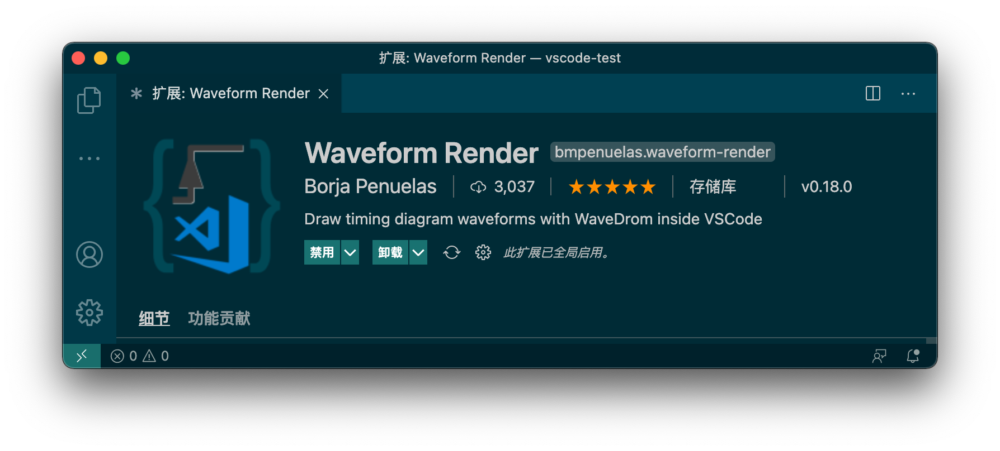
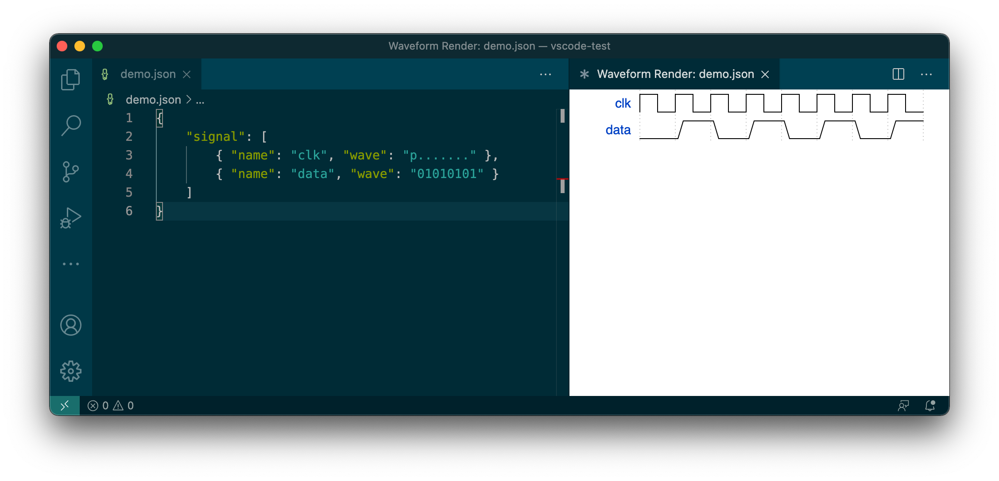
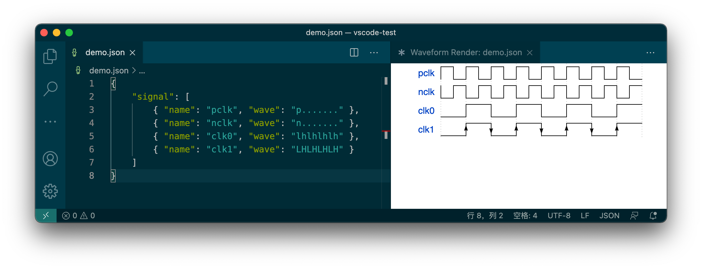
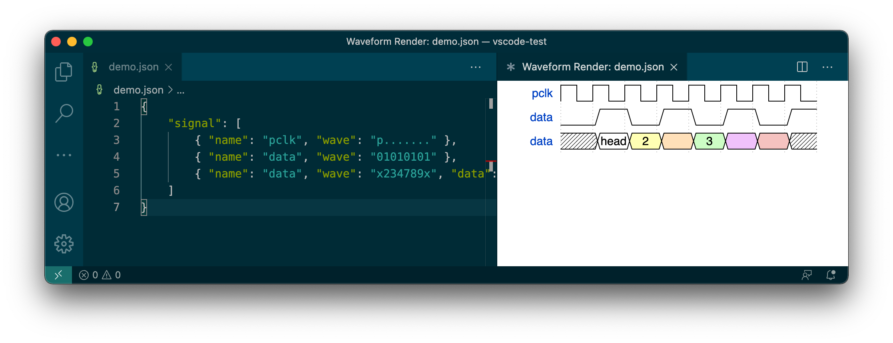
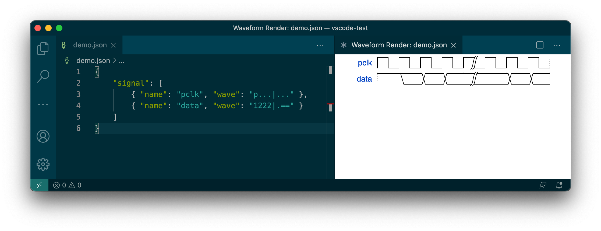
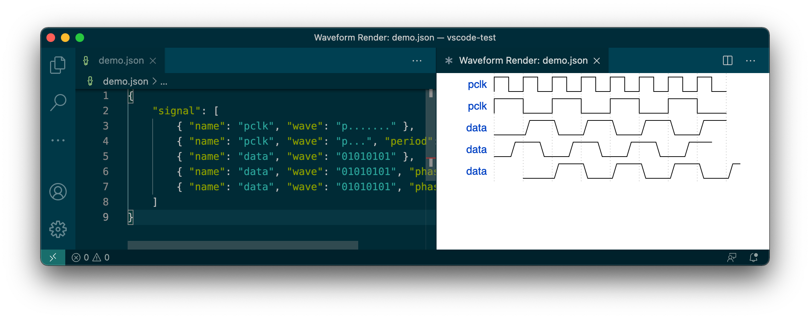
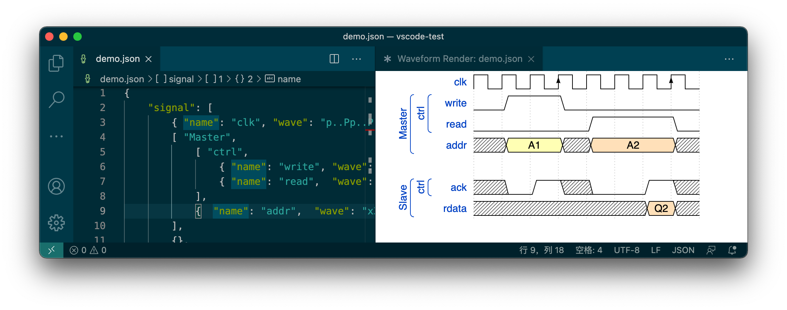
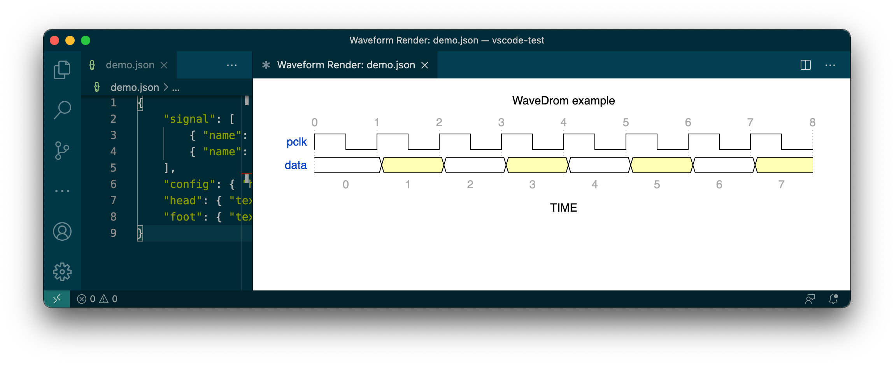

在 VSCode 中安装 Waveform Render 插件：



它可以解析 WaveJSON 语法的 json 文件，绘制一幅数字电路时序图。官网提供了一个完整教程：<https://wavedrom.com/tutorial.html> ，还有一个在线的编辑器：<https://wavedrom.com/editor.html> 。

## 开始

在 vscode 中新建一个名为 demo.json 的文件，内容如下：

```json
{
    "signal": [
        { "name": "clk", "wave": "p......." },
        { "name": "data", "wave": "01010101" }
    ]
}
```

保存后用 Command+Shift+P 组合键打开命令面板，选择执行 `Waveform Render:Draw` ，就可以看到渲染后的时序图，也可以选择执行 `Waveform Render:Toggle Live Preview` ，实时查看渲染结果：



这个例子展示了基本的 WaveJSON 语法：

* signal 是必须的关键词，它用一个数组表示一幅时序图。
* 数组内每个元素描述一个信号。
* 每个元素至少要包含 name 和 wave 两个变量：
    * name 定义了信号的名称。
    * wave 用来描述信号的样子。

wave 定义的字符串中，每个字符代表一个时钟周期（1bit），通过不同的字符来描述信号的样子：

* `0` 表示低电平，`1` 表示高电平。
* `p` 表示上升沿开始的一个时钟周期。
* `.` 表示与上一个时钟周期相同。

## 语法

对于时钟信号，  WaveJSON 支持的语法有：

*  `p` 表示上升沿开始的方波。
* `n` 表示下降沿开始的方波。
* `l` 表示低电平。
* `h` 表示高电平。
* 如果用大写字母，会在起始边沿绘制一个箭头。

例如：

```json
{
    "signal": [
        { "name": "pclk", "wave": "p......." },
        { "name": "nclk", "wave": "n......." },
        { "name": "clk0", "wave": "lhlhlhlh" },
        { "name": "clk1", "wave": "LHLHLHLH" }
    ]
}
```



对于数据信号，除了 `0` 和 `1` ，还支持其他语法：

* `x` 表示未知的无效状态。
* `=` 表示有效数据，也可以写成  `2`~`9` ，会用不同的颜色显示。
* 对于有效数据，可以用 data 变量加上文本标签。

例如：

```json
{
    "signal": [
        { "name": "pclk", "wave": "p......." },
        { "name": "data", "wave": "01010101" },
        { "name": "data", "wave": "x234789x", "data": ["head","2","","3"] }
    ]
}
```



还可以用 `|` 符号表示一段空白，例如：

```json
{
    "signal": [
        { "name": "pclk", "wave": "p...|..." },
        { "name": "data", "wave": "1222|.==" }
    ]
}
```



`period` 和 `phase` 变量用于调整时序：

* `period` 的值应该是一个数字 n ，表示横向等比例放大或缩小。
* `phase` 的值应该是一个数字 n ，表示横向的位置调整，单位是一个时钟周期：
    * 如果是正数，表示向左移动 n 个时钟周期。
    * 如果是负数，表示向右移动 n 个时钟周期。

例如：

```json
{
    "signal": [
        { "name": "pclk", "wave": "p......." },
        { "name": "pclk", "wave": "p...", "period": 2},
        { "name": "data", "wave": "01010101" },
        { "name": "data", "wave": "01010101", "phase": 0.5},
        { "name": "data", "wave": "01010101", "phase": -1}
    ]
}
```



多个信号可以用 `['group name', {...}, {...}, ...]` 语法编成一组，而且支持嵌套，例如：

```json
{
    "signal": [
        { "name": "clk", "wave": "p..Pp..P" },
        [ "Master",
            [ "ctrl",
                { "name": "write", "wave": "01.0...." },
                { "name": "read",  "wave": "0...1..0" }
            ],
            {  "name": "addr",  "wave": "x3.x4..x", "data": "A1 A2" }
        ],
        {},
        ["Slave",
            ["ctrl",
                {"name": "ack",   "wave": "x01x0.1x" }
            ],
            { "name": "rdata", "wave": "x.....4x", "data": "Q2" }
        ]
    ]
}
```



时序绘制完毕后，还可以对图片进行修饰。 `"config": { "hscale": n }` 表示将图片横向等比例放大 n 倍。`"head":{  }` 和 `"foot":{ }` 分别表示在时序图的上方和下方添加一些内容：

* `text` 变量应该设置一个字符串，表示添加一行文本。
* `tick` 变量应该设置一个整数，表示在时钟周期的起点显示序号，从 n 开始。
* `tock` 变量应该设置一个整数，表示在时钟周期的中点显示序号，从 n 开始。

例如：

```json
{
    "signal": [
        { "name": "pclk", "wave": "p......." },
        { "name": "data", "wave": "23232323" }
    ],
    "config": { "hscale": 2 },
    "head": { "text": "WaveDrom example", "tick": 0 },
    "foot": { "text": "TIME", "tock": 0 }
}
```



