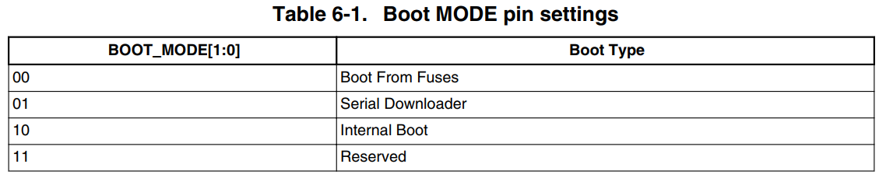
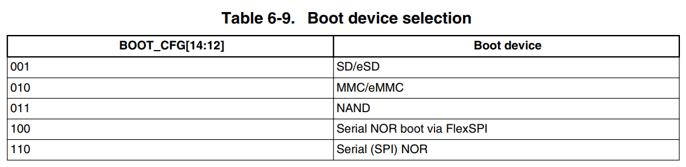
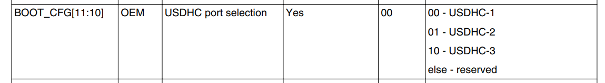
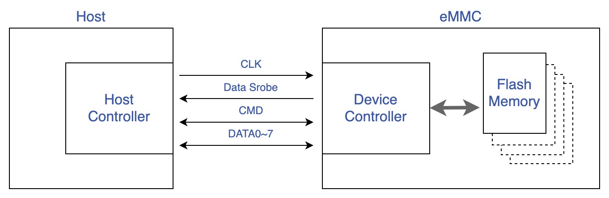
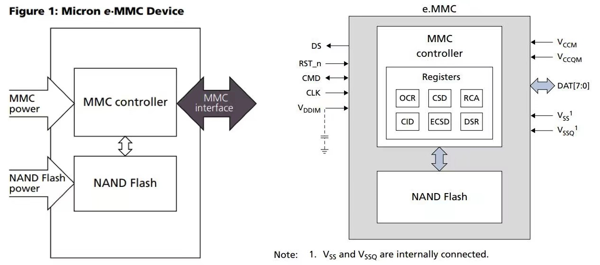
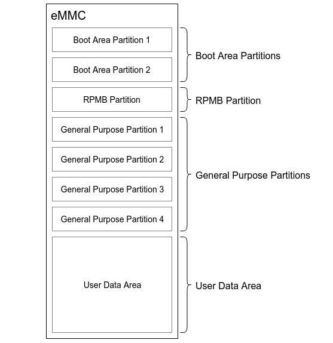
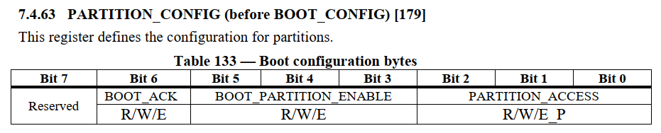
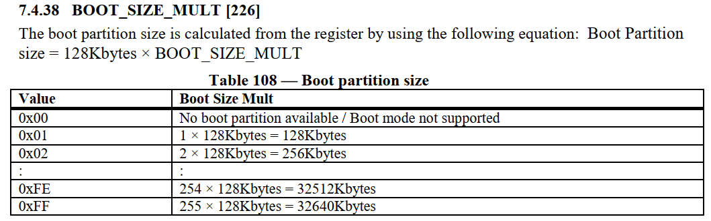
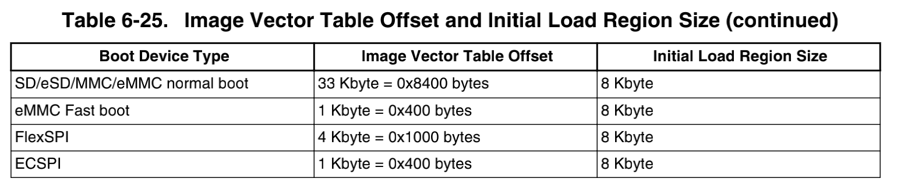
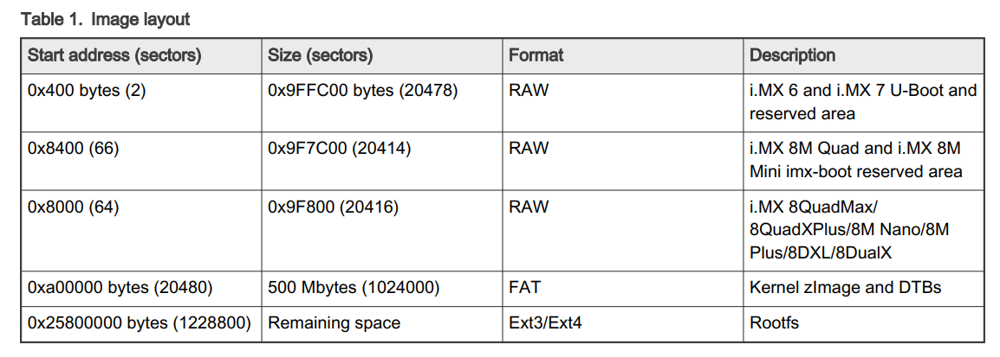

## 1. iMX8MM 的启动流程

> iMX8MM 系统启动的详细流程可以参考 IMX8MMRM.pdf 

上电复位后，硬件复位逻辑迫使 SoC 从片上的 Boot ROM 开始执行，Boot ROM 使用 BOOT_MODE 和 eFUSEs 的状态来决定启动设备。在 POR_B 信号的上升沿采集两个外部输入引脚 BOOT_MODE0 和 BOOT_MODE1 的电平，用于设置启动模式：



BOOT_MODE 的值可以在 SRC_SBMR2 寄存器的 IPP_BOOT_MODE[1:0] 中读到。在 Boot From Fuses 模式下，启动流程完全由 Fuse 控制，GPIO boot overrides 引脚的状态会被忽略。在 internal Boot 模式下，使用 Fuse 中的启动配置，但是为了开发方便，用于确定启动设备的 Fuse 可以通过 GPIO boot overrides 引脚的输入被覆盖，这时启动流程由 Fuse 或者 GPIO 控制的 BOOT_CFG 寄存器决定。首先会读取  BOOT_CFG[14:12] ，决定启动设备的类型：  



如果是从  eMMC/SD 启动，它们都使用 USDHC 接口与 SoC 连接，Boot ROM 会读取 BOOT_CFG[11:10]  的值，确定从哪个接口上的设备启动：



对于 eMMC 设备，Boot ROM 会读取 ECSD[179]:PARTITION_CONFIG 寄存器的 BOOT_PARTITION_ENABLE 字段来确定从 eMMC 的哪个位置获得用户程序，例如 BootLoader 代码，然后将用户程序从 eMMC 读到内存，由用户程序引导系统启动。


## 2. eMMC 

eMMC 是一种可以管理的存储设备，与 SD 卡类似，它还支持单独的启动分区来存储 BootLoader 程序。以 eMMC5.0 为例，参考标准文件 JESD84-B50(eMMC-Spec-V5.0).pdf ，eMMC 的整体架构如下：



SoC 作为主设备，通过 eMMC 控制模块向 eMMC 的设备管理接口发送指令和数据，各个信号的作用如下：

* CLK，用于同步的时钟信号。
* Data Strobe，从 Device 端输出的时钟信号，频率必须和 CLK 相同，用于同步从 Device 端输出的数据。 eMMC 5.0 中引入。
* CMD，此信号用于发送 Host 的 command 和 Device 的 response。
* DATA0-7，用于传输数据的 8bit 总线。

eMMC 的设备管理器定义了六种寄存器：OCR、CID、CSD、ECSD、RCA 和 DSR，只能通过相应的命令访问，OCR、CID 和 CSD 寄存器携带有设备/内容的具体信息，而 RCA 和 DSR 寄存器是存储实际配置参数的配置寄存器，EXT_CSD 寄存器同时携带设备特定信息和实际配置参数，设备控制器还集成了 Flash 读写，坏块管理，ECC 校验等功能，下面是 Micron 8GB eMMC  [MTFC8GAKAJCN-1M WT](https://media-www.micron.com/-/media/client/global/documents/products/data-sheet/emmc/broadmarket_embedded/emmc_4gb_8gb_ps8225_v50_wt.pdf?rev=200a5218843a461a880e8aee0fa9fb23) 数据手册中的描述：



Flash Memory 的最小读写单位是块（block），1 block = 512 Bytes 。eMMC 内部对 Flash Memory 划分了几个硬件分区：



u-boot 和 Linux 都提供了相应的 mmc 命令来读写 eMMC 。在 u-boot 阶段，可以查看 eMMC 的信息：

```bash
u-boot=> mmc list # 列出当前系统的 MMC 设备
FSL_SDHC: 1
FSL_SDHC: 2 (eMMC)
u-boot=> mmc dev 2  # 切换到 2 号 eMMC 设备
u-boot=> mmc info # 打印当前 MMC 设备的信息
Device: FSL_SDHC
Manufacturer ID: 13 # 厂商 ID
OEM: 14e
Name: Q2J55
Bus Speed: 200000000 # 总线速率
Mode: HS400 (200MHz) # 速率模式
Rd Block Len: 512 # block 的大小，单位是字节
MMC version 5.0 # eMMC 版本
High Capacity: Yes
Capacity: 7.1 GiB # 容量
Bus Width: 8-bit DDR # 总线宽度
Erase Group Size: 512 KiB
HC WP Group Size: 8 MiB
User Capacity: 7.1 GiB WRREL # User Data Area 
Boot Capacity: 2 MiB ENH # Boot Area Partition
RPMB Capacity: 4 MiB ENH # RPMB Partition
```

Linux 系统启动后，可以看到：

```bash
root@imx8mmevk:~# ls -l /dev/mmcblk2*
brw-rw---- 1 root disk 179,  0 Jul  6 03:33 /dev/mmcblk2       # User Data Area ，用户可以此基础上新建逻辑分区
brw-rw---- 1 root disk 179, 32 Jul  6 03:33 /dev/mmcblk2boot0  # Boot Area Partition 1
brw-rw---- 1 root disk 179, 64 Jul  6 03:33 /dev/mmcblk2boot1  # Boot Area Partition 2
brw-rw---- 1 root disk 179,  1 Jul  6 03:33 /dev/mmcblk2p1     # UDA 区域的逻辑分区，用于存放内核镜像和设备树
brw-rw---- 1 root disk 179,  2 Jul  6 03:33 /dev/mmcblk2p2     # UDA 区域的逻辑分区，用于存放根文件系统
crw------- 1 root root 237,  0 Jul  6 03:33 /dev/mmcblk2rpmb   # RPMB Partition
```

内核启动信息中也会打印各分区的大小：

```bash
root@imx8mmevk:~# dmesg | grep mmcblk2
[    0.000000] Kernel command line: console=ttymxc1,115200 root=/dev/mmcblk2p2 rootwait rw
[    1.986681] mmcblk2: mmc2:0001 Q2J55L 7.13 GiB
[    1.992485] mmcblk2boot0: mmc2:0001 Q2J55L partition 1 2.00 MiB
[    2.002296] mmcblk2boot1: mmc2:0001 Q2J55L partition 2 2.00 MiB
[    2.011031] mmcblk2rpmb: mmc2:0001 Q2J55L partition 3 4.00 MiB, chardev (237:0)
```

一般情况下，Boot Area Partitions 的大小都为 2MB 或者 4MB，部分芯片厂家也会提供配置的机会。RPMB 通常也是 4M ，用于保存安全相关的数据。General Purpose Partitions (GPP) 则在出厂时默认不被支持，即不存在这些分区，需要用户主动使能，并配置其所要使用的 GPP 的容量大小，GPP 的数量可以为 1 - 4 个，各个 GPP 的容量大小可以不一样。User Data Area (UDA) 的容量大小则为总容量大小减去其他分区所占用的容量。每一个硬件分区的存储空间都是独立编址的，即访问地址为 0 - partition size。具体的数据读写操作实际访问哪一个硬件分区，是由 ECSD[179] 的 PARTITION_CONFIG[2:0]:PARTITION_ACCESS 决定的，也就是说，用户在访问特定的分区前，需要先发送命令，配置 PARTITION_ACCESS，然后再发送相关的数据访问请求。PARTITION_CONFIG 寄存器的定义如下：



- Bit 7: Reserved
- Bit 6: BOOT_ACK (R/W/E)
    - 0x0 : No boot acknowledge sent (default)
    - 0x1 : Boot acknowledge sent during boot operation
- Bit[5:3] : BOOT_PARTITION_ENABLE (R/W/E), User selects boot data that will be sent to master
    - 0x0 : Device not boot enabled (default)
    - 0x1 : Boot partition 1 enabled for boot
    - 0x2 : Boot partition 2 enabled for boot
    - 0x3–0x6 : Reserved
    - 0x7 : User area enabled for boot
- Bit[2:0] : PARTITION_ACCESS (before BOOT_PARTITION_ACCESS, R/W/E_P), User selects partitions to access
    - 0x0 : No access to boot partition (default)
    - 0x1 : R/W boot partition 1
    - 0x2 : R/W boot partition 2
    - 0x3 : R/W Replay Protected Memory Block (RPMB)
    - 0x4 : Access to General Purpose partition 1
    - 0x5 : Access to General Purpose partition 2
    - 0x6 : Access to General Purpose partition 3
    - 0x7 : Access to General Purpose partition 4  

如果要擦除 Boot Area Partition 1 可以执行如下命令

```bash
u-boot=> mmc partconf 2 0 0 1  # 设置访问 boot partition 1
u-boot=> mmc erase 0 10 # 擦除 boot 分区的前十个 block
u-boot=> mmc partconf 2 0 0 0 # 设置会默认值
```

这个寄存器的值也可以在 Linux 系统中读取：

```bash
root@imx8mmevk:~#  mmc extcsd read /dev/mmcblk2 | grep PARTITION_CONFIG
Boot configuration bytes [PARTITION_CONFIG: 0x08]
```

## 3. 启动和烧写

BOOT Area Partition 主要是为了支持从 eMMC 启动系统而设计的。该分区的数据，在 eMMC 上电后，可以通过很简单的协议就可以读取出来。同时，大部分的 SoC 都可以通过 GPIO 或者 Fuse 的配置，让 Boot ROM 代码在上电后，将 BOOT Area Partition 分区的内容加载到 SoC 的内存中执行。Boot Area Partition 有两个，大小是完全一致的，大小由 ECSD 的 BOOT_SIZE_MULT 决定：



大小的计算公式如下：

```bash
Size = 128Kbytes x BOOT_SIZE_MULT
```

可以在 Linux 下读取这个寄存器的值：

```bash
root@imx8mmevk:~# mmc extcsd read /dev/mmcblk2 | grep BOOT_SIZE
Boot partition size [BOOT_SIZE_MULTI: 0x10]  # 0x10 表示 2MB
```

使用 NXP 提供的 uuu 工具，执行 `uuu -b emmc imx-boot` 向 eMMC 烧写 BootLoader 时，就是将 imx-boot 写入 BOOT Area Partition 1 ，并将 BOOT_PARTITION_ENABLE 设为 1 ，这样上电复位后，Boot ROM 代码就会把 BOOT Area Partition 1 中的代码加载的内存执行。

这里需要注意，如果 BootLoader 文件的大小超出了 BOOT Area Partition 的大小，烧写时调试串口输出的信息信息：

```bash
MMC write: dev # 2, block # 66, count 6550 ... MMC: block number 0x19d8 exceeds max(0x1000)

0 blocks written: ERROR

Writing 'bootloader' FAILED!
```

 要解决这个问题，有两种方法：

1. 更换 Boot Area Partition 更大的 eMMC
2. 将 BootLoader 文件写入 User Data Area 分区，设置从 User Data Area 分区启动。

从使用的角度，如果 eMMC 不使用 Boot Area Partition ，那么它就和 SD 卡基本一样，SD 卡没有独立的启动分区，需要在 SoC 规定的地址放入用户程序，SoC 从这个地址去加载启动。根据 iMX8MM 的要求，用户程序的第一个部分必须是一个镜像向量表 (IVT，位于 BootLoader 文件的头部) 数据结构，IVT 包含了执行成功启动所需的数据成分，包括程序镜像的入口点，设备配置数据（DCD）的指针以及启动过程中使用的其他指针。下面是对于不同存储介质的地址要求：



对于 eMMC  ，必须放 UDA 分区在 0x8400 地址，然后将 IVT 从 eMMC 读到内存，根据 IVT 中设置执行 BootLoader 的其他代码。IVT 的存储地址是用户程序中唯一要求固定地址的部分，用户程序的其余部分可以灵活布局，由 IVT 的内容决定。推荐如下布局，BootLoader 文件放置在  0x8400 地址，从 0xa00000 开始新建 FAT 和 Ext3 分区，放置内核、设备树和根文件系统：



可以从 SD 卡启动一个 Linux 系统，然后对 eMMC 进行烧写。用 dd 命令烧写 BootLoader ：

```bash
root@imx8mmevk:~# dd if=./imx-boot of=/dev/mmcblk2 bs=1k seek=33 conv=fsync
# dd 命令只会从 UDA 分区开始寻址，不会烧写到其他分区
```

> 如果编译 u-boot 时选择了 CONFIG_ENV_IS_IN_MMC ，u-boot 的环境变量会保存到 eMMC ，存储的位置由如下两个选项决定：
>
> 1. CONFIG_ENV_OFFSET , Offset from the start of the device (or partition)
> 2. CONFIG_ENV_SIZE , Size of the environment storage area .
>
> 烧写 u-boot 时，如果没有擦除这个区域，重启后的 u-boot 还会使用原来保存的环境变量。

FAT 和 Ext3 分区可以用 fdisk 命令新建，然后将相关文件夹拷贝到分区中，最后将 BOOT_PARTITION_ENABLE 设为 0 或者 7 ，Boot ROM 就会从 UDA 分区启动：

```bash
root@imx8mmevk:~# mmc bootpart enable 7 0 /dev/mmcblk2
```

也可以在 u-boot 中设置：

```bash
u-boot=> mmc partconf 2 0 7 0
```

写入后可以读出来确认一下：

```bash
root@imx8mmevk:~#  mmc extcsd read /dev/mmcblk2 | grep PARTITION_CONFIG
Boot configuration bytes [PARTITION_CONFIG: 0x38]
```

上面是手动写入系统镜像的步骤，NXP 提供的 UUU 工具可以使用串行下载模式，通过 USB OTG 接口从上位机执行自定义脚本对 eMMC 进行烧写，执行语法是 `uuu <script file name>` ，基本的原理和步骤是：

1. 使用 SDP 协议把一个 BootLoader 文件写入内存并启动。
2. 内存中的 BootLoader 使用 FB 协议把一个临时 Linux 系统（包括内核、设备树和根文件系统）写入内存并启动。
3. 内存中的临时系统通过 FBK 协议执行指令，烧写 BootLoader ，对 eMMC 格式化，然后把最终要运行的系统文件（包括内核、设备树和根文件系统等）复制到相应的分区 。
4. 设置 BOOT_PARTITION_ENABLE 的值。

UUU 的使用方法可以在 <https://github.com/NXPmicro/mfgtools/wiki> 查看，下面是一个脚本实例：

```bash
uuu_version 1.4.72
# 用于烧写 iMX8MM 的 eMMC ，从 User data area 启动
# tools 下的文件是临时系统
#    imx-boot		         | BootLoader
#    Image-imx8mmevk.bin    | kernel image, arm64 is Image, arm32 it is zImage
#    imx8mm-evk.dtb         | board dtb file
#    fsl-image-mfgtool-initramfs-imx_mfgtools.cpio.gz.u-boot	| mfgtool init ramfs
# image 下的文件用于烧写到 eMMC 
#    imx-boot		    | BootLoader
#    Image			    | kernel image, arm64 is Image, arm32 it is zImage
#    imx8mm-evk.dtb	| board dtb file
#    rootfs.tar.bz2	| rootfs
#    tee.bin			| optee image, put dummy _uTee.tar file here if platform is not MX6/MX7*

# 将 BootLoader 加载到内存并启动
# This command will be run when i.MX6/7 i.MX8MM, i.MX8MQ
SDP: boot -f tools/imx-boot

# This command will be run when ROM support stream mode
# i.MX8QXP, i.MX8QM
SDPS: boot -f tools/imx-boot

# These commands will be run when use SPL and will be skipped if no spl
# SDPU will be deprecated. please use SDPV instead of SDPU
# {
SDPU: delay 1000
SDPU: write -f tools/imx-boot -offset 0x57c00
SDPU: jump
# }

# These commands will be run when use SPL and will be skipped if no spl
# if (SPL support SDPV)
# {
SDPV: delay 1000
SDPV: write -f tools/imx-boot -skipspl
SDPV: jump
SDPV: delay 1000
# }

# 切换到 eMMC 设备
FB: ucmd setenv fastboot_dev mmc
FB: ucmd setenv mmcdev ${emmc_dev}
FB: ucmd mmc dev ${emmc_dev}

# 配置在 eMMC 从用户分区启动
FB: ucmd if env exists emmc_ack; then ; else setenv emmc_ack 0; fi;
FB: ucmd setenv emmc_cmd mmc partconf ${emmc_dev} ${emmc_ack} 7 0
FB: ucmd if test "${emmc_skip_fb}" != "yes"; then run emmc_cmd; fi

# 加载内核、设备树、rootfs 到内存上，并启动
FB: ucmd setenv fastboot_buffer ${loadaddr}
FB: download -f tools/Image
FB: ucmd setenv fastboot_buffer ${fdt_addr}
FB: download -f tools/imx8mm-evk.dtb
FB: ucmd setenv fastboot_buffer ${initrd_addr}
FB: download -f tools/fsl-image-mfgtool-initramfs-imx_mfgtools.cpio.gz.u-boot
# FB: ucmd setenv bootargs console=${console},${baudrate} earlycon=${earlycon},${baudrate}
FB: acmd ${kboot} ${loadaddr} ${initrd_addr} ${fdt_addr}

# get mmc dev number from kernel command line
# 等待启动完毕
FBK: ucmd while [ ! -e /dev/mmcblk*boot0 ]; do sleep 1; echo "wait for /dev/mmcblk*boot* appear"; done;

# serach emmc device number, if your platform have more than two emmc chip, please echo dev number >/tmp/mmcdev 
FBK: ucmd dev=`ls /dev/mmcblk*boot*`; dev=($dev); dev=${dev[0]}; dev=${dev#/dev/mmcblk}; dev=${dev%boot*}; echo $dev > /tmp/mmcdev;

# dd to clear the possible MBR
FBK: ucmd mmc=`cat /tmp/mmcdev`; dd if=/dev/zero of=/dev/mmcblk${mmc} bs=512 count=1

# 新建分区
# 前面 10M 留给 BootLoader ，从 0xa00000Bytes 开始新建一个 500M 的 FAT 分区，从 600M 开始新建一个 ext3 分区
FBK: ucmd mmc=`cat /tmp/mmcdev`; PARTSTR=$'10M,500M,0c\n600M,,83\n'; echo "$PARTSTR" | sfdisk --force /dev/mmcblk${mmc}

# 格式化 fat 分区并挂载
FBK: ucmd mmc=`cat /tmp/mmcdev`; while [ ! -e /dev/mmcblk${mmc}p1 ]; do sleep 1; done
FBK: ucmd mmc=`cat /tmp/mmcdev`; mkfs.vfat /dev/mmcblk${mmc}p1
FBK: ucmd mmc=`cat /tmp/mmcdev`; mkdir -p /mnt/fat
FBK: ucmd mmc=`cat /tmp/mmcdev`; mount -t vfat /dev/mmcblk${mmc}p1 /mnt/fat

# 将 BootLoader 复制到 fat 分区，并写入 eMMC
FBK: ucp  image/imx-boot t:/mnt/fat
FBK: ucmd mmc=`cat /tmp/mmcdev`; dd if=/mnt/fat/imx-boot of=/dev/mmcblk${mmc} bs=1k seek=33 conv=fsync

# 将内核、设备树复制到 fat 分区
FBK: ucp  image/fat/Image t:/mnt/fat
FBK: ucp  image/fat/imx8mm-evk.dtb t:/mnt/fat
FBK: ucp  image/fat/tee.bin t:/tmp/fat
FBK: ucmd umount /mnt/fat

# 格式化 ext3 分区
FBK: ucmd mmc=`cat /tmp/mmcdev`; mkfs.ext3 -F -E nodiscard /dev/mmcblk${mmc}p2
FBK: ucmd mkdir -p /mnt/ext3
FBK: ucmd mmc=`cat /tmp/mmcdev`; mount /dev/mmcblk${mmc}p2 /mnt/ext3
FBK: acmd export EXTRACT_UNSAFE_SYMLINKS=1; tar -jx -C /mnt/ext3
FBK: ucp  image/rootfs.tar.bz2 t:-
FBK: Sync
FBK: ucmd umount /mnt/ext3
FBK: DONE
```

如果要从 boot partitions 1 启动，可以用下面的脚本：

```bash
uuu_version 1.4.72
# 用于烧写 iMX8MM 的 eMMC ，从 boot 分区启动
# tools 下的文件是临时系统
#    imx-boot		         | BootLoader
#    Image-imx8mmevk.bin    | kernel image, arm64 is Image, arm32 it is zImage
#    imx8mm-evk.dtb         | board dtb file
#    fsl-image-mfgtool-initramfs-imx_mfgtools.cpio.gz.u-boot	| mfgtool init ramfs
# image 下的文件用于烧写到 eMMC 
#    imx-boot		    | BootLoader
#    Image			    | kernel image, arm64 is Image, arm32 it is zImage
#    imx8mm-evk.dtb	| board dtb file
#    rootfs.tar.bz2	| rootfs
#    tee.bin			| optee image, put dummy _uTee.tar file here if platform is not MX6/MX7*

# 将 BootLoader 加载到内存并启动
# This command will be run when i.MX6/7 i.MX8MM, i.MX8MQ
SDP: boot -f tools/imx-boot

# This command will be run when ROM support stream mode
# i.MX8QXP, i.MX8QM
SDPS: boot -f tools/imx-boot

# These commands will be run when use SPL and will be skipped if no spl
# SDPU will be deprecated. please use SDPV instead of SDPU
# {
SDPU: delay 1000
SDPU: write -f tools/imx-boot -offset 0x57c00
SDPU: jump
# }

# These commands will be run when use SPL and will be skipped if no spl
# if (SPL support SDPV)
# {
SDPV: delay 1000
SDPV: write -f tools/imx-boot -skipspl
SDPV: jump
SDPV: delay 1000
# }

# 将 BootLoader 烧入到 eMMC
FB: ucmd setenv fastboot_dev mmc
FB: ucmd setenv mmcdev ${emmc_dev}
FB: flash bootloader image/imx-boot

# 配置在 eMMC 引导分区 1 启动
FB: ucmd if env exists emmc_ack; then ; else setenv emmc_ack 0; fi;
FB: ucmd setenv emmc_cmd mmc partconf ${emmc_dev} ${emmc_ack} 1 0
FB: ucmd if test "${emmc_skip_fb}" != "yes"; then run emmc_cmd; fi

# 加载内核、设备树、rootfs 到内存上
FB: ucmd setenv fastboot_buffer ${loadaddr}
FB: download -f tools/Image
FB: ucmd setenv fastboot_buffer ${fdt_addr}
FB: download -f tools/imx8mm-evk.dtb
FB: ucmd setenv fastboot_buffer ${initrd_addr}
FB: download -f tools/fsl-image-mfgtool-initramfs-imx_mfgtools.cpio.gz.u-boot
#FB: ucmd setenv bootargs console=${console},${baudrate} earlycon=${earlycon},${baudrate}
FB: acmd ${kboot} ${loadaddr} ${initrd_addr} ${fdt_addr}

# get mmc dev number from kernel command line
# Wait for emmc
FBK: ucmd while [ ! -e /dev/mmcblk*boot0 ]; do sleep 1; echo "wait for /dev/mmcblk*boot* appear"; done;

# serach emmc device number, if your platform have more than two emmc chip, please echo dev number >/tmp/mmcdev 
FBK: ucmd dev=`ls /dev/mmcblk*boot*`; dev=($dev); dev=${dev[0]}; dev=${dev#/dev/mmcblk}; dev=${dev%boot*}; echo $dev > /tmp/mmcdev;

# dd to clear the possible MBR
FBK: ucmd mmc=`cat /tmp/mmcdev`; dd if=/dev/zero of=/dev/mmcblk${mmc} bs=512 count=1

# 新建分区
# 前面 10M 留给 BootLoader ，从 0xa00000Bytes 开始新建一个 500M 的 FAT 分区，从 600M 开始新建一个 ext3 分区
FBK: ucmd mmc=`cat /tmp/mmcdev`; PARTSTR=$'10M,500M,0c\n600M,,83\n'; echo "$PARTSTR" | sfdisk --force /dev/mmcblk${mmc}

# 格式化 fat 分区并挂载
FBK: ucmd mmc=`cat /tmp/mmcdev`; while [ ! -e /dev/mmcblk${mmc}p1 ]; do sleep 1; done
FBK: ucmd mmc=`cat /tmp/mmcdev`; mkfs.vfat /dev/mmcblk${mmc}p1
FBK: ucmd mmc=`cat /tmp/mmcdev`; mkdir -p /mnt/fat
FBK: ucmd mmc=`cat /tmp/mmcdev`; mount -t vfat /dev/mmcblk${mmc}p1 /mnt/fat

# 将内核、设备树复制到 fat 分区
FBK: ucp  image/fat/Image t:/mnt/fat
FBK: ucp  image/fat/imx8mm-evk.dtb t:/mnt/fat
FBK: ucp  image/fat/tee.bin t:/tmp/fat
FBK: ucmd umount /mnt/fat

# 格式化 ext3 分区
FBK: ucmd mmc=`cat /tmp/mmcdev`; mkfs.ext3 -F -E nodiscard /dev/mmcblk${mmc}p2
FBK: ucmd mkdir -p /mnt/ext3
FBK: ucmd mmc=`cat /tmp/mmcdev`; mount /dev/mmcblk${mmc}p2 /mnt/ext3
FBK: acmd export EXTRACT_UNSAFE_SYMLINKS=1; tar -jx -C /mnt/ext3
FBK: ucp  image/rootfs.tar.bz2 t:-
FBK: Sync
FBK: ucmd umount /mnt/ext3
FBK: DONE
```

## 4. u-boot mmc

u-boot 提供了读写 eMMC 的命令 mmc ，语法如下：

```bash
u-boot=> mmc
mmc - MMC sub system

Usage:
mmc info - display info of the current MMC device
mmc read addr blk# cnt
mmc write addr blk# cnt
mmc erase blk# cnt
mmc rescan
mmc part - lists available partition on current mmc device
mmc dev [dev] [part] - show or set current mmc device [partition]
mmc list - lists available devices
mmc hwpartition [args...] - does hardware partitioning
  arguments (sizes in 512-byte blocks):
    [user [enh start cnt] [wrrel {on|off}]] - sets user data area attributes
    [gp1|gp2|gp3|gp4 cnt [enh] [wrrel {on|off}]] - general purpose partition
    [check|set|complete] - mode, complete set partitioning completed
  WARNING: Partitioning is a write-once setting once it is set to complete.
  Power cycling is required to initialize partitions after set to complete.
mmc bootbus dev boot_bus_width reset_boot_bus_width boot_mode
 - Set the BOOT_BUS_WIDTH field of the specified device
mmc bootpart-resize <dev> <boot part size MB> <RPMB part size MB>
 - Change sizes of boot and RPMB partitions of specified device
mmc partconf dev [boot_ack boot_partition partition_access]
 - Show or change the bits of the PARTITION_CONFIG field of the specified device
mmc rst-function dev value
 - Change the RST_n_FUNCTION field of the specified device
   WARNING: This is a write-once field and 0 / 1 / 2 are the only valid values.
mmc setdsr <value> - set DSR register value
```

## 5. Linux mmc

Linux 提供看开源的 eMMC 读写工具 [mmc-utils](https://git.kernel.org/pub/scm/linux/kernel/git/cjb/mmc-utils.git/tree/) 。语法如下：

```bash
root@imx8mmevk:~# mmc
Usage:
        mmc extcsd read <device>
                Print extcsd data from <device>.
        mmc writeprotect boot get <device>
                Print the boot partitions write protect status for <device>.
        mmc writeprotect boot set <device>
                Set the boot partitions write protect status for <device>.
                This sets the eMMC boot partitions to be write-protected until
                the next boot.
        mmc writeprotect user set <type><start block><blocks><device>
                Set the write protect configuration for the specified region
                of the user area for <device>.
                <type> must be "none|temp|pwron".
                    "none"  - Clear temporary write protection.
                    "temp"  - Set temporary write protection.
                    "pwron" - Set write protection until the next poweron.
                <start block> specifies the first block of the protected area.
                <blocks> specifies the size of the protected area in blocks.
                NOTE! The area must start and end on Write Protect Group
                boundries, Use the "writeprotect user get" command to get the
                Write Protect Group size.
        mmc writeprotect user get <device>
                Print the user areas write protect configuration for <device>.
        mmc disable 512B emulation <device>
                Set the eMMC data sector size to 4KB by disabling emulation on
                <device>.
        mmc gp create <-y|-n|-c> <length KiB> <partition> <enh_attr> <ext_attr> <device>
                Create general purpose partition for the <device>.
                Dry-run only unless -y or -c is passed.
                Use -c if more partitioning settings are still to come.
                NOTE!  This is a one-time programmable (unreversible) change.
                To set enhanced attribute to general partition being created set
                 <enh_attr> to 1 else set it to 0.
                To set extended attribute to general partition
                 set <ext_attr> to 1,2 else set it to 0
        mmc enh_area set <-y|-n|-c> <start KiB> <length KiB> <device>
                Enable the enhanced user area for the <device>.
                Dry-run only unless -y or -c is passed.
                Use -c if more partitioning settings are still to come.
                NOTE!  This is a one-time programmable (unreversible) change.
        mmc write_reliability set <-y|-n|-c> <partition> <device>
                Enable write reliability per partition for the <device>.
                Dry-run only unless -y or -c is passed.
                Use -c if more partitioning settings are still to come.
                NOTE!  This is a one-time programmable (unreversible) change.
        mmc status get <device>
                Print the response to STATUS_SEND (CMD13).
        mmc bootpart enable <boot_partition> <send_ack> <device>
                Enable the boot partition for the <device>.
                Disable the boot partition for the <device> if <boot_partition> is set to 0.
                To receive acknowledgment of boot from the card set <send_ack>
                to 1, else set it to 0.
        mmc bootbus set <boot_mode> <reset_boot_bus_conditions> <boot_bus_width> <device>
                Set Boot Bus Conditions.
                <boot_mode> must be "single_backward|single_hs|dual"
                <reset_boot_bus_conditions> must be "x1|retain"
                <boot_bus_width> must be "x1|x4|x8"
        mmc bkops enable <device>
                Enable the eMMC BKOPS feature on <device>.
                NOTE!  This is a one-time programmable (unreversible) change.
        mmc hwreset enable <device>
                Permanently enable the eMMC H/W Reset feature on <device>.
                NOTE!  This is a one-time programmable (unreversible) change.
        mmc hwreset disable <device>
                Permanently disable the eMMC H/W Reset feature on <device>.
                NOTE!  This is a one-time programmable (unreversible) change.
        mmc sanitize <device>
                Send Sanitize command to the <device>.
                This will delete the unmapped memory region of the device.
        mmc rpmb write-key <rpmb device> <key file>
                Program authentication key which is 32 bytes length and stored
                in the specified file. Also you can specify '-' instead of
                key file path to read the key from stdin.
                NOTE!  This is a one-time programmable (unreversible) change.
                Example:
                  $ echo -n AAAABBBBCCCCDDDDEEEEFFFFGGGGHHHH | \
                    mmc rpmb write-key /dev/mmcblk0rpmb -
        mmc rpmb read-counter <rpmb device>
                Counter value for the <rpmb device> will be read to stdout.
        mmc rpmb read-block <rpmb device> <address> <blocks count> <output file> [key file]
                Blocks of 256 bytes will be read from <rpmb device> to output
                file or stdout if '-' is specified. If key is specified - read
                data will be verified. Instead of regular path you can specify
                '-' to read key from stdin.
                Example:
                  $ echo -n AAAABBBBCCCCDDDDEEEEFFFFGGGGHHHH | \
                    mmc rpmb read-block /dev/mmcblk0rpmb 0x02 2 /tmp/block -
                or read two blocks without verification
                  $ mmc rpmb read-block /dev/mmcblk0rpmb 0x02 2 /tmp/block
        mmc rpmb write-block <rpmb device> <address> <256 byte data file> <key file>
                Block of 256 bytes will be written from data file to
                <rpmb device>. Also you can specify '-' instead of key
                file path or data file to read the data from stdin.
                Example:
                  $ (awk 'BEGIN {while (c++<256) printf "a"}' | \
                    echo -n AAAABBBBCCCCDDDDEEEEFFFFGGGGHHHH) | \
                    mmc rpmb write-block /dev/mmcblk0rpmb 0x02 - -
        mmc cache enable <device>
                Enable the eMMC cache feature on <device>.
                NOTE! The cache is an optional feature on devices >= eMMC4.5.
        mmc cache disable <device>
                Disable the eMMC cache feature on <device>.
                NOTE! The cache is an optional feature on devices >= eMMC4.5.
        mmc csd read <device path>
                Print CSD data from <device path>.
                The device path should specify the csd file directory.
        mmc cid read <device path>
                Print CID data from <device path>.
                The device path should specify the cid file directory.
        mmc scr read <device path>
                Print SCR data from <device path>.
                The device path should specify the scr file directory.
        mmc ffu <image name> <device>
                Run Field Firmware Update with <image name> on <device>.


        mmc help|--help|-h
                Show the help.

        mmc <cmd> --help
                Show detailed help for a command or subset of commands.

0.1
```