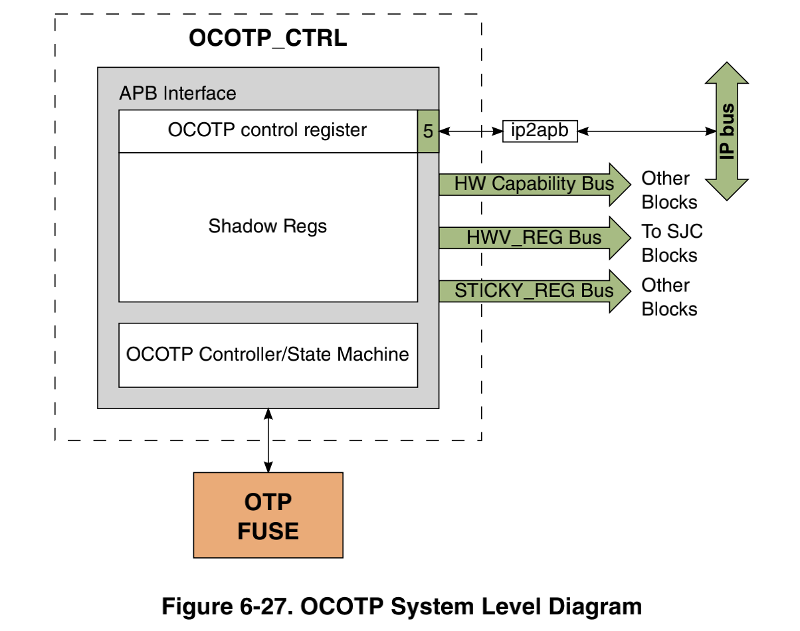
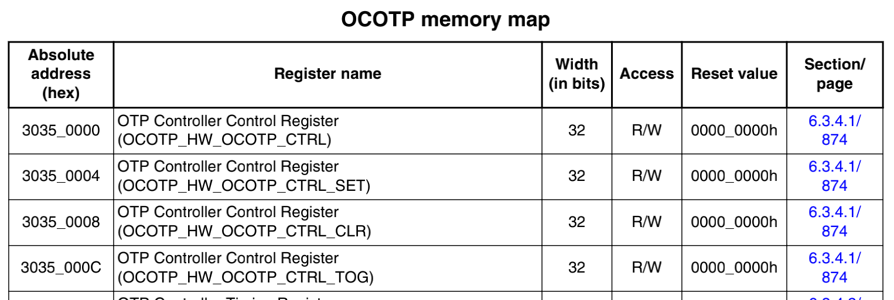
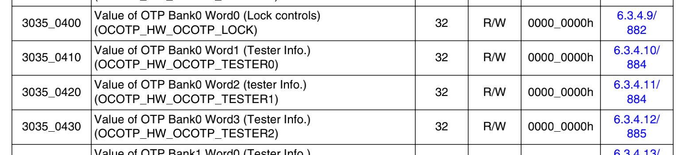
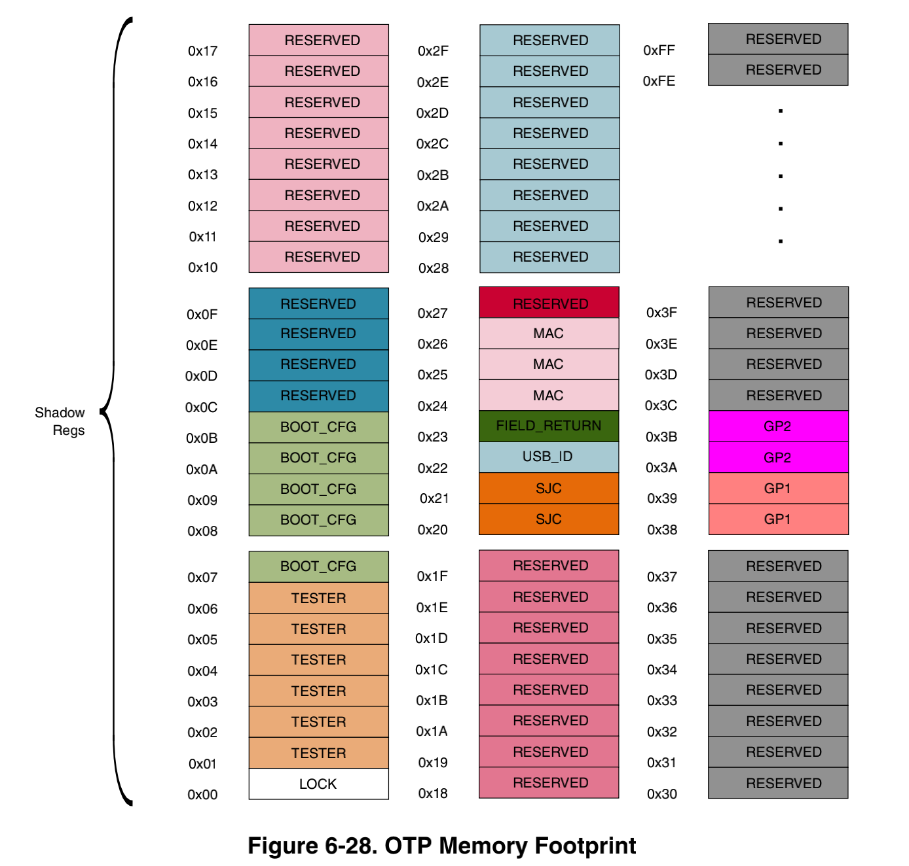
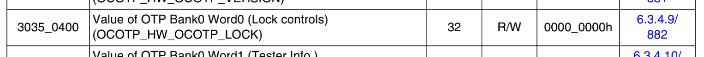
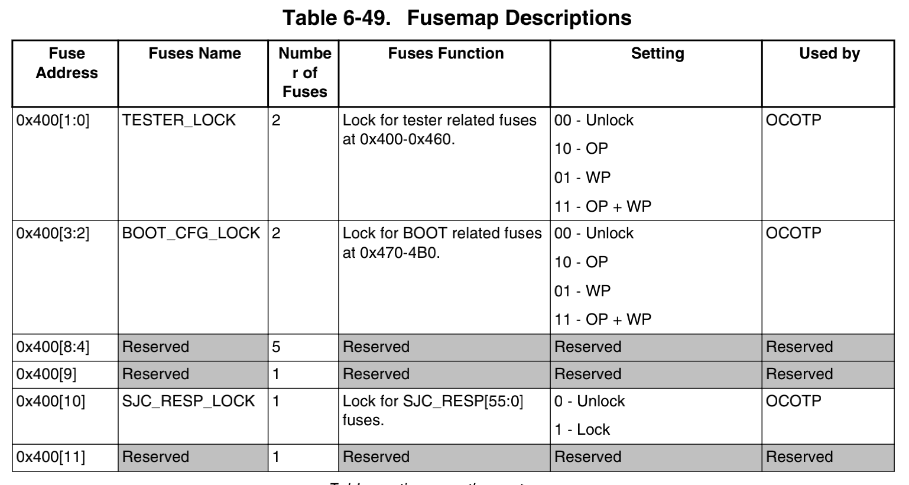

Fuse 就是熔丝位，是一种只能写入一次的寄存器，写入后不可更改，所以写入操作也叫做烧毁（burned）。iMX8MM 的 Fuse 由 on-chip eFuse OTP 控制读写，简称 OCOPT ，结构框图如下：



可以通过 APB 接口读写 OCOTP 的寄存器，寄存器的布局可以在芯片手册的 《6.3.4 OCOTP Memory Map/Register Definition》中查看，起始地址是 0x30350000，分为两个部分，前半部分 0x30350000~0x3035009C 是 OCOTP Control Register ，是配置 OCOTP 本身的寄存器：



从 0x30350400 到 0x303507B0 是 Shadow Regs 寄存器：



在硬件上，Shadow Regs 和 Fuse 是两个独立的存储设备，但是 OCOTP 的内部机制实现了二者之间的映射，Fuse 的所有内容都被映射到了这段寄存器中，完整的映射如下：



总大小是 4x256 bytes，大部分是保留状态，不可读写。需要注意的是，在 Fuse 中，32bits 组成一个 Word ，4Words 组成一个 Bank ，读写时也要用 Bank:Word 的格式寻址。可以在 u-boot 中执行 fuse 命令读写 fuse ，语法如下：

```bash
fuse - Fuse sub-system

Usage:
fuse read <bank> <word> [<cnt>] - read 1 or 'cnt' fuse words,
    starting at 'word'
fuse sense <bank> <word> [<cnt>] - sense 1 or 'cnt' fuse words,
    starting at 'word'
fuse prog [-y] <bank> <word> <hexval> [<hexval>...] - program 1 or
    several fuse words, starting at 'word' (PERMANENT)
fuse override <bank> <word> <hexval> [<hexval>...] - override 1 or
several fuse words, starting at 'word'
```

* read - 读取，表示从 Shadow Regs 中读取。
* sense - 感应，表示跳过 Shadow Regs ，直接从 Fuse 中读取。
* prog - 烧毁，表示直接烧写 Fuse ，写入一次后就无法更改。
* override - 改写，表示修改 Shadow Regs 中的值，不会影响到 Fuse ，所以，在这个操作之后，Shadow Regs 可能与 Fuse 中的值不同。

 第一个寄存器（Bank0，Word0）是 OCOTP_LOCK ：



它的作用是设置其他 fuse 寄存器的锁定状态，例如，Bit[1:0] 用于设置 Tester 寄存器的锁定状态，Bit[10] 用于设置 SJC 寄存器的锁定状态：



支持五种锁定状态：

* Unlock - 受控字段可以在 Shadow Regs 中被读取、感应、烧毁或改写。
* Lock - 受控字段不能被读取、烧毁或改写。
* OP - override protect，受控字段可以在 Shadow Regs 中被读取、感应或烧毁。
* WP - write protect，受控字段可以在 Shadow Regs 中被读取、感应或改写。
* OP+WP - 受控字段只能在 Shadow Regs 中被读取或感应到，但是不能被烧毁或改写。

这个寄存器在芯片出厂时已经被写入了特定的值，无法更改，可以读取查看：

```bash
u-boot=> fuse sense 0 0
Sensing bank 0:

Word 0x00000000: feafa9eb
```

几个关键的字段：

* Bit[1:0] TESTER_LOCK = 11，所有 TESTER 寄存器只读
* Bit[3:2] BOOT_CFG_LOCK = 10，所有 BOOT_CFG 寄存器可读可烧毁，不可改写。
* Bit[15:14] MAC_ADDR_LOCK= 10，所有 MAC_ADDR 寄存器可读可烧毁，不可改写。

存储 MAC 地址是 Fuse 的重要用途，默认情况下，以太网驱动获得 MAC 地址的顺序是：

1. 从设备树的以太网节点属性 "local-mac-address" 中获取 MAC 地址。
2. 如果设备树没有这个属性，驱动就从 fuse 中获取 MAC 地址。
3. 如果 fuse 没有烧写 MAC 地址，驱动从 u-boot 设置的环境变量中获得MAC地址。
4. 如果不存在合法的MAC地址，会发生错误。

Fuse 用了三个 Word（Bank9 Word0~2）存储以太网卡的 MAC 地址，可以存储两个 MAC 地址：


iMX8MM 本身只要一个以太网卡，占用了 FEC1_MAC 的位置，例如 MAC 地址为 00-04-9F-05-FB-39 时：

```bash
u-boot=> fuse read 9 0 4
Reading bank 9:

Word 0x00000000: 9f05fb39 00000004 00000000 00000000
```

因为 Fuse 只能烧写一次，所有最好一次烧写两个 MAC 地址，防止日后增加网卡时无法烧写。假设要烧写的两个地址是：

```
FEC1: 001DF3513075
FEC2: 001DF3513089
```

在u-boot 中执行如下命令：

```
fuse prog 9 2 001DF351
fuse prog 9 1 3089001D
fuse prog 9 0 F3513075
```

启动后：

```bash
root@imx8mmevk:~# ifconfig
eth0      Link encap:Ethernet  HWaddr 00:1d:f3:51:30:75
          UP BROADCAST MULTICAST  MTU:1500  Metric:1
          RX packets:0 errors:0 dropped:0 overruns:0 frame:0
          TX packets:0 errors:0 dropped:0 overruns:0 carrier:0
          collisions:0 txqueuelen:1000
          RX bytes:0 (0.0 B)  TX bytes:0 (0.0 B)
```

批量生产时，用 uuu 烧写更方便，下面是一个脚本的实例：

```
SDP: boot -f imx-boot
FB: ucmd fuse prog 9 2 -y 001DF351
FB: ucmd fuse prog 9 1 -y 3089001D
FB: ucmd fuse prog 9 0 -y F3513075
```

参考：

* [Understanding how to burn eFuses on i.MX8 and i.MX8x families](https://imxdev.gitlab.io/tutorial/Burning_eFuses_on_i.MX8_and_i.MX8x_families/)
* [i.MX8 uuu](https://wowothink.com/2e4a33d4/)

