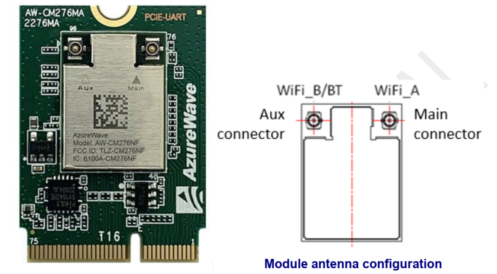
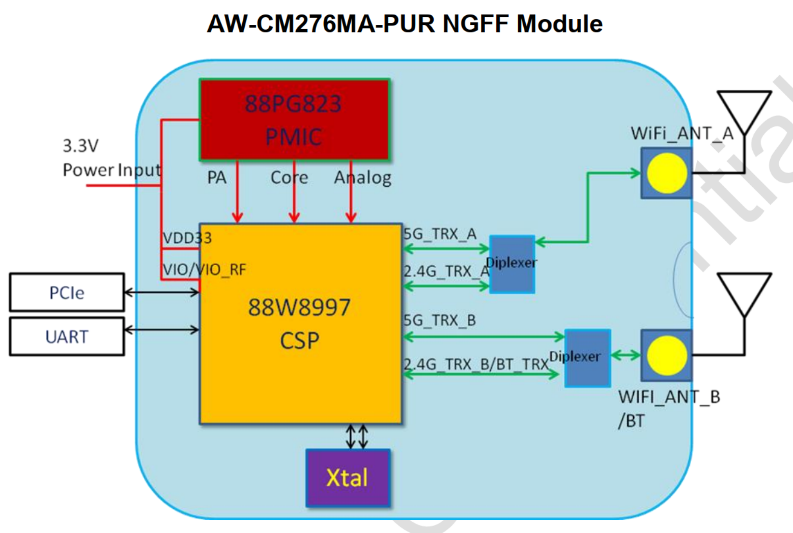
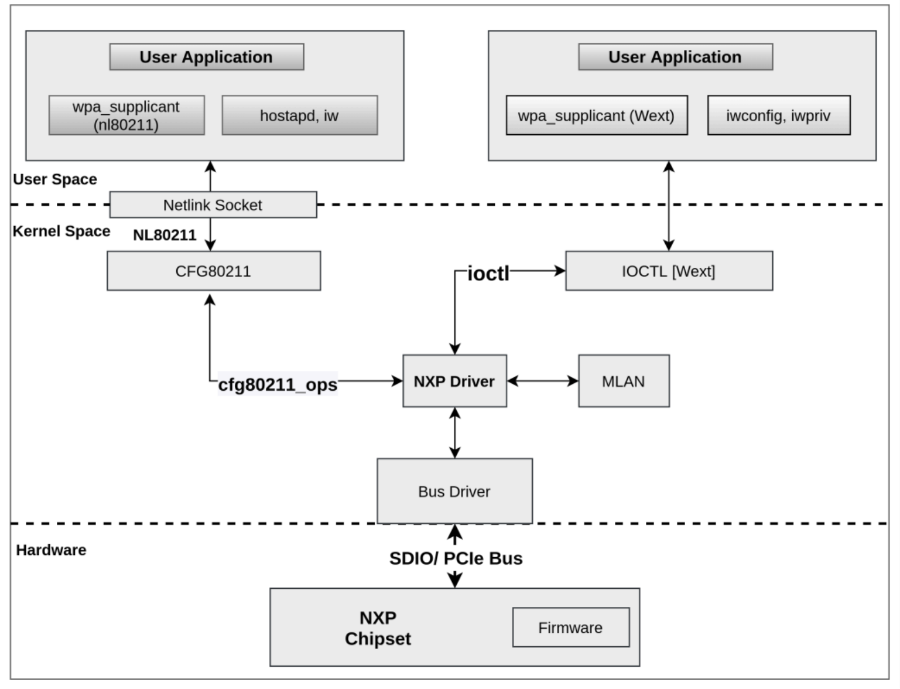
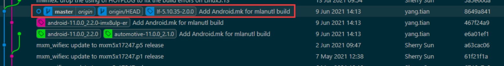
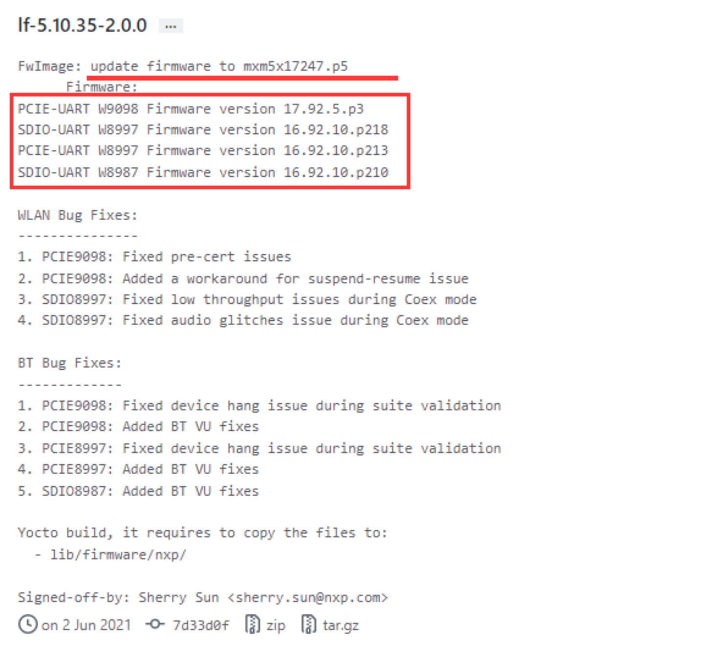
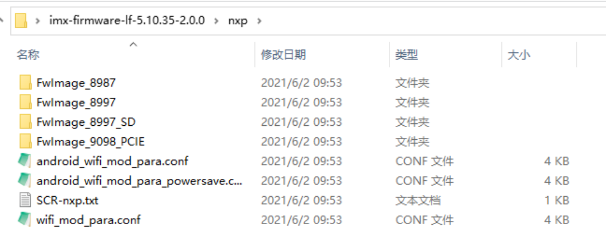
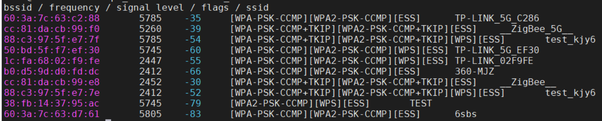

## 1. 概述

硬件平台使用 iMX8MM 参考开发板，带有 M.2 接口，软件平台是 iMX Yocto Linux 5.4.47 。调试海华的 AW-CM276MA 模块，该模块基于 NXP [88W8997](https://www.nxp.com/products/wireless/wi-fi-plus-bluetooth/2-4-5-ghz-dual-band-1x1-wi-fi-5-802-11ac-plus-bluetooth-5-2-solution:88W8987)，PCIe 2.0 接口，M.2 2230 封装，外观如下：



模块结构：



具有如下特性：

- 基于 88W8997
- IEEE 802.11ac (wave2)，BlueTooth 5.2
-  Wi-Fi PCIe 接口，BlueTooth UART 接口
- Wi-Fi 2.4/5 GHz 双频，2x2 双天线
- 支持 20/40/80Mhz 带宽，80MHz 2x2时最高速率 866.7Mbps
- WPA/WPA2 和 WEP 64/128 bit 加密
- 支持STA（Wi-Fi站点）, AP（Wi-Fi热点）和 P2P（Wi-Fi直连）三种模式

其他参考：

- NXP 的 Wi-Fi 产品列表：https://www.nxp.com/products/wireless/wi-fi-plus-bluetooth:WIFI-BLUETOOTH
- 88W8997 ：https://www.nxp.com/products/wireless/wi-fi-plus-bluetooth/2-4-5-ghz-dual-band-2x2-wi-fi-5-802-11ac-plus-bluetooth-5-3-solution:88W8997

## 2. 驱动和固件

模块使用的驱动是 mxm_wifiex ，位于内核的drivers/net/wireless/nxp/mxm_wifiex 目录下。这个驱动是 NXP 开发并维护，支持 NXP 的多种无线模块，通常，新的模块需要新的驱动版本支持，可以在 https://source.codeaurora.org/external/imx/mwifiex 下载源码。此外，还需要提供相应模块的固件，NXP 的固件通过 https://github.com/NXP/imx-firmware 发布，也分不同的版本，需要与驱动版本匹配。

加载驱动时，通过模块参数指定固件的路径，当 SDIO/PCIe 总线驱动检测到模块的 SDIO/PCIe 接口时，MLAN 模块将固件二进制文件下载到 SD8987/PCIE8997 中。模块驱动程序支持多种接口向用户提供控制和配置模块的通道，可以通过 CFG80211 子系统与网络协议栈相连，向 iw 、hostapt 和 wpa_supplicant(nl80211) 提供编程接口，也可以通过 IOCTL 向 iwconfig、iwpriv 和 wpa_supplicant(wext) 提供编程接口。如下是整个软件栈的图式：



使用 git 下载驱动源码：

```bash
$ git clone https://source.codeaurora.org/external/imx/mwifiex
```

源码有多个分支：

```bash
$ git branch -a
* master
  remotes/origin/HEAD -> origin/master
  remotes/origin/imx_5.4.70_2.3.0
  remotes/origin/lf-5.10.52_2.1.0
  remotes/origin/lf-5.10.72_2.2.0
  remotes/origin/lf-5.10.y_1.0.0
  remotes/origin/lf-5.10.y_2.0.0
  remotes/origin/master
```

直接使用 master 分支，对应的标签 lf-5.10.35-2.0.0 表示这个版本已经集成到了 iMX Yocto L5.10.35 的内核里：



从 git 记录可以看到当前的驱动版本是 mxm5x17247.p5 ：

```
commit a63cac065978149d9c4c1064eddcdc1f11dda57c
Author: Sherry Sun <sherry.sun@nxp.com>
Date:  Wed Jun 2 09:47:10 2021 +0800

  mxm_wifiex: update to mxm5x17247.p5 release
```

- 5X - Linux 5.x Kernel  
- 17 - card type
- 247 - Release version
- p5 - Patch Number 

然后将驱动源码中 wlan_src 目录下的所有文件复制到 iMX Yocto L5.4.47 内核源码的 drivers/net/wireless/nxp/mxm_wifiex/wlan_src/ 目录下。编译出的内核模块是 mlan.ko 和 moal.ko ，复制到目标板的如下目录，覆盖原文件：

```
/lib/modules/5.4.47-2.2.0+g5ec03d06f54e/kernel/drivers/net/wireless/nxp/mxm_wifiex/wlan_src/ 
```

打开 https://github.com/NXP/imx-firmware 页面，在 tag 中找到对应的版本 lf-5.10.35-2.0.0 ：



对应的固件版本是 PCIE-UART W8997 Firmware version 16.92.10.p213 :

- 16 - Major revision
- 92 - Feature pack
- 10 - Release version
- p213 - Patch number 

下载后解压，在 nxp 目录下有多种模块的固件：



其中，FwImage_8997 下是 PCIe 接口的 88W8997 模块的固件，wifi_mod_para.conf 是传递模块参数的配置文件。将这三个复制到目标板的 /lib/firmware/nxp/ 目录下，修改 wifi_mod_para.conf 中 PCIE8997 的 fw_name 参数，设置正确的固件路径：

```json
PCIE8997 = {
        cfg80211_wext=0xf
        wfd_name=p2p
        max_vir_bss=1
        cal_data_cfg=none
        drv_mode=7
        ps_mode=2
        auto_ds=2
        fw_name=nxp/FwImage_8997/pcieuart8997_combo_v4.bin
}
```

关于这些模块参数的含义，在驱动源码的 READM_MLAN 文件里有详细说明。常用的参数有：

- drv_mode：设置驱动支持模式，低三位有效，设为 7 表示支持三种模式：
  - Bit 0 : STA
  - Bit 1 : AP
  - Bit 2 : P2P
- sta_name：STA 模式的接口名称 (default: "mlan")
- uap_name：AP 模式的接口名称 (default: "uap")
- wfd_name：P2P 模式的接口名称 (default: "wfd")
- cfg80211_wext=<bit mask of CFG80211 and WEXT control>
  - Bit 0: STA WEXT
  - Bit 1: AP WEXT
  - Bit 2: STA CFG80211
  - Bit 3: AP CFG80211
- auto_ds=0|1|2 <use MLAN default | enable auto deepsleep | disable auto deepsleep>
- ps_mode=0|1|2 <use MLAN default | enable IEEE PS mode | disable IEEE PS mode>
- fw_name = <FW file name>，固件的相对路径（/lib/firmware/ 目录下）

确保插入模块后，可以看到 PCIe 设备：

```bash
~# lspci -v
00:00.0 PCI bridge: Synopsys, Inc. DWC_usb3 (rev 01) (prog-if 00 [Normal decode])
        Flags: bus master, fast devsel, latency 0, IRQ 232
        Memory at 18000000 (32-bit, non-prefetchable) [size=1M]
        Bus: primary=00, secondary=01, subordinate=ff, sec-latency=0
        I/O behind bridge: None
        Memory behind bridge: None
        Prefetchable memory behind bridge: 18100000-182fffff [size=2M]
        [virtual] Expansion ROM at 18300000 [disabled] [size=64K]
        Capabilities: [40] Power Management version 3
        Capabilities: [50] MSI: Enable- Count=1/1 Maskable+ 64bit-
        Capabilities: [70] Express Root Port (Slot-), MSI 00
        Capabilities: [100] Advanced Error Reporting
        Capabilities: [148] L1 PM Substates
        Kernel driver in use: pcieport

01:00.0 Ethernet controller: Marvell Technology Group Ltd. Device 2b42 (rev 11)
        Flags: bus master, fast devsel, latency 0, IRQ 232
        Memory at 18100000 (64-bit, prefetchable) [size=1M]
        Memory at 18200000 (64-bit, prefetchable) [size=1M]
        Capabilities: [40] Power Management version 3
        Capabilities: [50] MSI: Enable- Count=1/32 Maskable+ 64bit+
        Capabilities: [70] Express Endpoint, MSI 00
        Capabilities: [b0] MSI-X: Enable- Count=32 Masked-
        Capabilities: [100] Advanced Error Reporting
        Capabilities: [148] Device Serial Number 00-00-00-00-00-00-00-00
        Capabilities: [158] Power Budgeting <?>
        Capabilities: [168] Latency Tolerance Reporting
        Capabilities: [170] L1 PM Substates
        Kernel driver in use: wlan_pcie
```

然后加载驱动：

```bash
~# modprobe moal mod_para=nxp/wifi_mod_para.conf
```

驱动加载成功后，内核会打印如下信息：

```
[  232.184958] wlan: Loading MWLAN driver
[  232.189377] wlan_pcie 0000:01:00.0: enabling device (0000 -> 0002)
[  232.195726] Attach moal handle ops, card interface type: 0x204
[  232.205187] PCIE8997: init module param from usr cfg
[  232.210209] card_type: PCIE8997, config block: 0
[  232.214848] cfg80211_wext=0xf
[  232.217837] wfd_name=p2p
[  232.220381] max_vir_bss=1
[  232.223001] cal_data_cfg=none
[  232.225986] drv_mode = 7
[  232.228546] ps_mode = 2
[  232.230991] auto_ds = 2
[  232.233455] fw_name=nxp/FwImage_8997/pcieuart8997_combo_v4.bin
[  232.239350] rx_work=1 cpu_num=4
[  232.242530] Attach mlan adapter operations.card_type is 0x204.
[  232.256329] Request firmware: nxp/FwImage_8997/pcieuart8997_combo_v4.bin
[  233.115916] FW download over, size 553604 bytes
[  233.984767] WLAN FW is active
[  233.987752] on_time is 233983459875
[  234.031562] fw_cap_info=0x181c3fa3, dev_cap_mask=0xffffffff
[  234.037181] max_p2p_conn = 8, max_sta_conn = 8
[  234.068698] wlan: version = PCIE8997--16.92.10.p213-MM5X16247.p5-GPL-(FP92)
[  234.078130] wlan: Driver loaded successfully
```

可以看到三个网络接口：

```bash
~# ifconfig -a
eth0      Link encap:Ethernet  HWaddr 7a:ac:85:59:55:fb
          BROADCAST MULTICAST  MTU:1500  Metric:1
          RX packets:0 errors:0 dropped:0 overruns:0 frame:0
          TX packets:0 errors:0 dropped:0 overruns:0 carrier:0
          collisions:0 txqueuelen:1000
          RX bytes:0 (0.0 B)  TX bytes:0 (0.0 B)

lo        Link encap:Local Loopback
          inet addr:127.0.0.1  Mask:255.0.0.0
          inet6 addr: ::1/128 Scope:Host
          UP LOOPBACK RUNNING  MTU:65536  Metric:1
          RX packets:82 errors:0 dropped:0 overruns:0 frame:0
          TX packets:82 errors:0 dropped:0 overruns:0 carrier:0
          collisions:0 txqueuelen:1000
          RX bytes:6220 (6.0 KiB)  TX bytes:6220 (6.0 KiB)

mlan0     Link encap:Ethernet  HWaddr d8:c0:a6:6e:8f:7d
          BROADCAST MULTICAST  MTU:1500  Metric:1
          RX packets:0 errors:0 dropped:0 overruns:0 frame:0
          TX packets:0 errors:0 dropped:0 overruns:0 carrier:0
          collisions:0 txqueuelen:1000
          RX bytes:0 (0.0 B)  TX bytes:0 (0.0 B)

p2p0      Link encap:Ethernet  HWaddr da:c0:a6:6e:8f:7d
          BROADCAST MULTICAST  MTU:1500  Metric:1
          RX packets:0 errors:0 dropped:0 overruns:0 frame:0
          TX packets:0 errors:0 dropped:0 overruns:0 carrier:0
          collisions:0 txqueuelen:1000
          RX bytes:0 (0.0 B)  TX bytes:0 (0.0 B)

uap0      Link encap:Ethernet  HWaddr d8:c0:a6:6e:90:7d
          BROADCAST MULTICAST  MTU:1500  Metric:1
          RX packets:0 errors:0 dropped:0 overruns:0 frame:0
          TX packets:0 errors:0 dropped:0 overruns:0 carrier:0
          collisions:0 txqueuelen:1000
          RX bytes:0 (0.0 B)  TX bytes:0 (0.0 B)
```

mlan0 是 STA 模式的接口，p2p0 是 P2P 模式的接口，uap0 是 AP 模式的接口。

查看驱动信息：

```bash
~# cat /proc/mwlan/adapter0/mlan0/info
driver_name = "wlan"
driver_version = PCIE8997--16.92.10.p213-MM5X16247.p5-GPL-(FP92)
interface_name="mlan0"
firmware_major_version=16.92.10
bss_mode ="Managed"
media_state="Disconnected"
mac_address="d8:c0:a6:6e:8f:7d"
```

驱动源码里有大量的调试信息，是通过 PRINTM 函数打印的，分为多种类型，下表列出了所有的调试信息类型：

| Bit    | Message type | Log format                                  | Description                                                  |
| ------ | ------------ | ------------------------------------------- | ------------------------------------------------------------ |
| Bit 0  | MMSG         | PRINTM(MMSG,...)                            | Set bit 0 to enable all driver logs with log level MMSG.     |
| Bit 1  | MFATAL       | PRINTM(MFATAL,...)                          | Set bit 1 to enable all driver logs with log level MFATAL.   |
| Bit 2  | MERROR       | PRINTM(MERROR,...)                          | Set bit 2 to enable all driver logs with log level MERROR.   |
| Bit 3  | MDATA        | PRINTM(MDATA,...)                           | Set bit 3 to enable all driver logs with log level MDATA.    |
| Bit 4  | MCMND        | PRINTM(MCMND,...)                           | Set bit 4 to enable all driver logs with log level MCMND.    |
| Bit 5  | MEVENT       | PRINTM(MEVENT,...)                          | Set bit 5 to enable all driver logs with log level MEVENT.   |
| Bit 6  | MINTR        | PRINTM(MINTR,...)                           | Set bit 6 to enable all driver logs with log level MINTR.    |
| Bit 7  | MIOCTL       | PRINTM(MIOCTL,...)                          | Set bit 7 to enable all driver logs with log level MIOCTL.   |
| Bit 16 | MDAT_D       | PRINTM(MDAT_D,...), DBG_HEXDUMP(MDAT_D,...) | Set bit 16 to enable all driver logs with log level MDAT_D and provide the corresponding hexdump in dmesg logs. |
| Bit 17 | MCMD_D       | PRINTM(MCMD_D,...), DBG_HEXDUMP(MCMD_D,...) | Set bit 17 to enable all driver logs with log level MCMD_D and provide the corresponding hexdump in dmesg logs. |
| Bit 18 | MEVT_D       | PRINTM(MEVT_D,...), DBG_HEXDUMP(MEVT_D,...) | Set bit 18 to enable all driver logs with log level MEVT_D and provide the corresponding hexdump in dmesg logs. |
| Bit 19 | MFW_D        | PRINTM(MFW_D,...), DBG_HEXDUMP(MFW_D,...)   | Set bit 19 to enable all driver logs with log level MFW_D and provide the corresponding hexdump in dmesg logs. |
| Bit 20 | MIF_D        | PRINTM(MIF_D,...), DBG_HEXDUMP(MIF_D,...)   | Set bit 20 to enable all driver logs with log level MIF_D and provide the corresponding hexdump in dmesg logs. |
| Bit 28 | MENTRY       | PRINTM(MENTRY,...), ENTER(), LEAVE()        | Set bit 28 to enable all driver logs with API entry and exit. |
| Bit 29 | MWARN        | PRINTM(MWARN,...)                           | Set bit 29 to enable all driver logs with log level MWARN.   |
| Bit 30 | MINFO        | PRINTM(MINFO,...)                           | Set bit 30 to enable all driver logs with log level MINFO.   |

模块参数 drvdbg ，按位使能或者关闭特定的信息类型，例如 drvdbg=0x6 ，表示只打开 MFATAL 和 MERROR 类型的调试信息。加载驱动后，可以在 /sys/ 文件系统中查看这个参数的值：

```bash
~# cat /sys/module/moal/parameters/drvdbg
519
```

这个参数不能在驱动配置文件中设置，只能通过 /proc 文件系统修改，例如关闭 MMSG 信息：

```bash
~# echo "drvdbg=518" >> /proc/mwlan/adapter0/uap0/debug
~# cat /sys/module/moal/parameters/drvdbg
518
```

## 3. STA 模式

使用 STA 模式可以让 Wi-Fi 模块连接 Wi-Fi 热点。

### 3.1 连接

首先使用 iw 扫描热点：

```bash
~# iw dev mlan0 scan
BSS 60:3a:7c:63:c2:86(on mlan0)
        TSF: 1394835875 usec (0d, 00:23:14)
        freq: 2412
        beacon interval: 100 TUs
        capability: ESS Privacy ShortSlotTime RadioMeasure (0x1411)
        signal: -29.00 dBm
        last seen: 4 ms ago
        SSID: TP-LINK_5G_C286
        Supported rates: 1.0* 2.0* 5.5* 11.0* 9.0 18.0 36.0 54.0
        DS Parameter set: channel 1
        ERP: Use_Protection Barker_Preamble_Mode
        Extended supported rates: 6.0 12.0 24.0 48.0
        WPA:     * Version: 1
                 * Group cipher: CCMP
                 * Pairwise ciphers: CCMP
                 * Authentication suites: PSK
        RSN:     * Version: 1
                 * Group cipher: CCMP
                 * Pairwise ciphers: CCMP
                 * Authentication suites: PSK
                 * Capabilities: 1-PTKSA-RC 1-GTKSA-RC (0x0000)
```

新建一个 wpa_supplicant 的配置文件 /etc/wpa_supplicant/wpa_supplicant-mlan0.conf，内容如下：

```bash
ctrl_interface=/var/run/wpa_supplicant
ctrl_interface_group=wheel
update_config=1
```

设置 Wi-Fi 热点的名称和密码：

```bash
wpa_passphrase <ESSID> <PASSWORD> >> /etc/wpa_supplicant/wpa_supplicant-mlan0.conf
```

手动执行 wpa_supplicant ：

```bash
~# wpa_supplicant -i mlan0 -Dnl80211 -c /etc/wpa_supplicant/wpa_supplicant-mlan0.conf -B
```

或者使用 systemd 连接：

```bash
~# systemctl start wpa_supplicant@mlan0
```

如果连接成功，内核会打印如下信息：

```
[ 1657.514313] wlan: mlan0 START SCAN
[ 1661.922914] wlan: SCAN COMPLETED: scanned AP count=17
[ 1661.957185] wlan: Connected to bssid 60:XX:XX:XX:c2:88 successfully
[ 1662.062877] mlan0:
[ 1662.062888] wlan: Send EAPOL pkt to 60:XX:XX:XX:c2:88
[ 1662.072089] mlan0:
[ 1662.072092] wlan: Send EAPOL pkt to 60:XX:XX:XX:c2:88
[ 1662.080127] IPv6: ADDRCONF(NETDEV_CHANGE): mlan0: link becomes ready
[ 1662.087172] woal_cfg80211_set_rekey_data return: gtk_rekey_offload is DISABLE
```

驱动信息里可以看到连接成功：

```bash
~# more /proc/mwlan/adapter0/mlan0/info
driver_name = "wlan"
driver_version = PCIE8997--16.92.10.p213-MM5X16247.p5-GPL-(FP92)
interface_name="mlan0"
firmware_major_version=16.92.10
bss_mode ="Managed"
media_state="Connected"
mac_address="d8:c0:a6:6e:8f:7d"
multicast_count="10"
essid="TP-LINK_5G_C286"
bssid="60:3a:7c:63:c2:88"
channel="157"
```

启动 wpa_supplicant 后，可以用 wpa_cli 命令调试 Wi-Fi 连接，比如查看连接状态：

```bash
~# wpa_cli -i mlan0 status
bssid=60:3a:7c:63:c2:88
freq=5785
ssid=TP-LINK_5G_C286
id=1
mode=station
pairwise_cipher=CCMP
group_cipher=CCMP
key_mgmt=WPA2-PSK
wpa_state=COMPLETED
p2p_device_address=d8:c0:a6:6e:8f:7d
address=d8:c0:a6:6e:8f:7d
uuid=15f39fc6-08ec-59cd-82d8-8991c864b6c3
ieee80211ac=1
```

使用 iw 可以看到更底层的状态数据：

```bash
~# iw dev mlan0 info
Interface mlan0
        ifindex 3
        wdev 0x1
        addr d8:c0:a6:6e:8f:7d
        ssid TP-LINK_5G_C286
        type managed
        wiphy 0
        channel 157 (5785 MHz), width: 80 MHz, center1: 5775 MHz
        txpower 24.00 dBm
~# iw dev mlan0 link
Connected to 60:3a:7c:63:c2:88 (on mlan0)
        SSID: TP-LINK_5G_C286
        freq: 5785
        RX: 111781 bytes (1487 packets)
        TX: 44737 bytes (734 packets)
        signal: -37 dBm
        rx bitrate: 6.0 MBit/s
        tx bitrate: 702.0 MBit/s VHT-MCS 8 80MHz VHT-NSS 2

        bss flags:
        dtim period:    1
        beacon int:     100
```

### 3.2 获取 IP

连接成成功后，还需要通过 DHCP 获得 IP 。可以用 udhcpc 命令获取 IP ：

```bash
~# udhcpc -i mlan0 -b
udhcpc: started, v1.31.0
udhcpc: sending discover
udhcpc: sending select for 192.168.1.103
udhcpc: lease of 192.168.1.103 obtained, lease time 7200
/etc/udhcpc.d/50default: Adding DNS 192.168.0.99
/etc/udhcpc.d/50default: Adding DNS 223.5.5.5
```

如果系统支持 systemd-networkd 服务管理网卡，也可以在 /etc/systemd/network/ 目录下新建一个网卡的配置文件 12-mlan0.network ，内容如下：

```bash
[Match]
Name=mlan0
[Network]
DHCP=yes
```

然后重启服务：

```bash
~# systemctl restart systemd-networkd
```

可以看到网卡成功获取 IP ：

```bash
~# ifconfig
lo        Link encap:Local Loopback
          inet addr:127.0.0.1  Mask:255.0.0.0
          inet6 addr: ::1/128 Scope:Host
          UP LOOPBACK RUNNING  MTU:65536  Metric:1
          RX packets:82 errors:0 dropped:0 overruns:0 frame:0
          TX packets:82 errors:0 dropped:0 overruns:0 carrier:0
          collisions:0 txqueuelen:1000
          RX bytes:6220 (6.0 KiB)  TX bytes:6220 (6.0 KiB)

mlan0     Link encap:Ethernet  HWaddr d8:c0:a6:6e:8f:7d
          inet addr:192.168.1.103  Bcast:192.168.1.255  Mask:255.255.255.0
          inet6 addr: fe80::dac0:a6ff:fe6e:8f7d/64 Scope:Link
          UP BROADCAST RUNNING MULTICAST  MTU:1500  Metric:1
          RX packets:17 errors:0 dropped:0 overruns:0 frame:0
          TX packets:45 errors:0 dropped:0 overruns:0 carrier:0
          collisions:0 txqueuelen:1000
          RX bytes:3261 (3.1 KiB)  TX bytes:5822 (5.6 KiB)
```

### 3.3 使用 wpa_cli 

配置文件的 ctrl_interface 选项指定了 socket 文件（/var/run/wpa_supplicant），wpa_supplicant 启动后，可以使用 wpa_cli 与 wpa_supplicant 通讯，调试和维护 Wi-Fi 连接。

扫描热点，然后打印扫描结果：

```bash
~# wpa_cli -i mlan0 scan
~# wpa_cli -i mlan0 scan_result
```

效果如下：



向 wpa_supplicant 添加一个网络连接：

```bash
~# wpa_cli -i mlan0 add_network
2
```

该命令会返回一个新的网络 ID 号，如果 wpa_supplicant.conf 文件为空，则返回 0 ，表示第一个网络连接。因为已经有两个连接，所以返回了 2 ：

```bash
~# wpa_cli -i mlan0 list_network
network id / ssid / bssid / flags
0       TP-LINK_C286    any
1       TP-LINK_5G_C286 any     [CURRENT]
2               any     [DISABLED]
```

然后向这个网络连接添加一个 Wi-Fi 热点的配置：

```bash
~# wpa_cli -i mlan0 set_network 2 ssid '"Shaocheng"'
OK
~# wpa_cli -i mlan0 set_network 2 psk '"1234567890"'
OK
```

如果是没有密码的 Wi-Fi 热点，按如下设置：

```
wpa_cli -i mlan0 set_network 2 key_mgmt NONE
```

如果要修改密码可以执行：

```
wpa_cli -i mlan0 set_network 2 key_mgmt NONE
```

设置网络优先级，数值越大，优先级越高：

```bash
~# wpa_cli -i mlan0 set_network 2 priority 2
OK
```

设置 scan_ssid 为 1 ，表示扫描这个 SSID ，如果为 0 ，表示忽略这个 SSID：

```bash
~# wpa_cli -i mlan0 set_network 2 scan_ssid 1
OK
```

使能这个网络：

```bash
~# wpa_cli -i mlan0 enable_network 2
OK
```

选中这个网络连接后，开始连接：

```bash
~# wpa_cli -i mlan0 select_network 2
OK
```

当前连接的网络变为 ID 2 ：

```bash
~# wpa_cli -i mlan0 list_network
network id / ssid / bssid / flags
0       TP-LINK_C286    any     [DISABLED]
1       TP-LINK_5G_C286 any     [DISABLED]
2       Shaocheng       any     [CURRENT]
```

连接成功后，还需要重新获取 IP :

```bash
~# udhcpc -i mlan0 -b -q
udhcpc: started, v1.31.0
udhcpc: sending discover
udhcpc: sending select for 172.20.10.9
udhcpc: lease of 172.20.10.9 obtained, lease time 86400
/etc/udhcpc.d/50default: Adding DNS 172.20.10.1
```

调试成功后，可以将当前的网络配置保存到配置文件：

```bash
~# wpa_cli -i mlan0 save_config
OK
```

想要断开热点时可以执行如下命令：

```
wpa_cli -i mlan0 disable_network 2    //与 ID 2 的网络进行断开
wpa_cli -i mlan0 remove_network 2     //将 ID 2 的网络移除掉,必须先断开才行
wpa_cli -i mlan0 save_config          //更新配置文件
```

如果直接执行 wpa_cli ，不带参数，会进入交互模式，执行 help 查看所有指令，方便调试。 

## 4. AP 模式

使用 AP 模式可以将 Wi-Fi 模块作为热点，AP 模式的接口是 uap0 ，需要先设置一个静态 IP ：

```
ifconfig uap0 172.31.255.1 netmask 255.255.255.0 up 
```

### 4.1 启动 hostapd

新建 /etc/hostapd-uap0.conf 文件，添加 WPA/WPA2-PSK 认证方式的配置选项，内容如下：

```
ctrl_interface=/var/run/hostapd
interface=uap0
driver=nl80211
ieee80211n=1
country_code=CN
ssid=NXP_AP
hw_mode=a
channel=0
macaddr_acl=0
auth_algs=1
ignore_broadcast_ssid=0
wpa=3
wpa_passphrase=12345678
wpa_key_mgmt=WPA-PSK
wpa_pairwise=TKIP
rsn_pairwise=CCMP
```

启动 hostapd ：

```bash
~# hostapd /etc/hostapd-uap0.conf -B
```

启动过程中，内核会打印如下信息：

```bash
[  100.479639] wlan: SCAN COMPLETED: scanned AP count=5
[  100.872225] wlan: SCAN COMPLETED: scanned AP count=6
[  101.264337] wlan: SCAN COMPLETED: scanned AP count=3
[  101.661716] wlan: SCAN COMPLETED: scanned AP count=1
[  102.056751] wlan: SCAN COMPLETED: scanned AP count=4
[  102.093045] wlan: Starting AP
[  102.096548] Get ht_cap from beacon ies: 0xc
[  102.101107] fw doesn't support 11ax
[  102.114610] wlan: AP started
[  102.117540] IPv6: ADDRCONF(NETDEV_CHANGE): uap0: link becomes ready
[  102.125433] Set AC=3, txop=47 cwmin=3, cwmax=7 aifs=1
[  102.132663] Set AC=2, txop=94 cwmin=7, cwmax=15 aifs=1
[  102.139977] Set AC=0, txop=0 cwmin=15, cwmax=63 aifs=3
[  102.147327] Set AC=1, txop=0 cwmin=15, cwmax=1023 aifs=7
```

启动成功后，用 hostapd_cli 查看状态：

```bash
~# hostapd_cli -i uap0 status
state=ENABLED
phy=mwiphy0
freq=5180
num_sta_non_erp=0
num_sta_no_short_slot_time=0
num_sta_no_short_preamble=0
olbc=0
num_sta_ht_no_gf=0
num_sta_no_ht=0
num_sta_ht_20_mhz=0
num_sta_ht40_intolerant=0
olbc_ht=0
ht_op_mode=0x0
cac_time_seconds=0
cac_time_left_seconds=N/A
channel=36
secondary_channel=0
ieee80211n=1
ieee80211ac=0
ieee80211ax=0
beacon_int=100
dtim_period=2
ht_caps_info=000c
ht_mcs_bitmask=ffff0000010000000000
supported_rates=0c 12 18 24 30 48 60 6c
max_txpower=23
bss[0]=uap0
bssid[0]=d8:c0:a6:6e:90:7d
ssid[0]=NXP_AP
num_sta[0]=0
```

此时，用手机可以搜到名为 NXP_AP 的热点，密码 12345678，可以连接，但是无法获取 IP ，因为本机没有提供 DHCP 服务。

### 4.2 分配 IP

可以使用 udhcpd 启动 DHCP 服务，想 Wi-Fi 终端分配 IP。新建配置文件 /etc/udhcpd-uap0.conf ，内容如下：

```
interface uap0
start 192.168.1.100
end 192.168.1.199
remaining yes
lease_file	/var/lib/misc/udhcpd.leases
```

启动 udhcpd ：

```bash
~# udhcpd /etc/udhcpd-uap0.conf
```

用手机重新连接，可以获得 IP 。用 hostapd_cli 可以列出已连接的 STA 设备：

```bash
~# hostapd_cli -i uap0 list_sta
ce:53:7d:79:65:a5
```

udhcpd 是 busybox 提供的 DHCP Server ，如果对功能和稳定性有要求，可以使用 dnsmasq 。

### 4.3 使用 hostapd_cli

配置文件的 ctrl_interface 选项指定了 socket 文件（/var/run/hostapd），hostapd 启动后，可以使用 hostapd_cli 与 hostapd 通讯，调试和维护 hostapd 。

列出所有 STA 的详细信息：

```bash
~# hostapd_cli -i uap0 all_sta
ce:53:7d:79:65:a5
flags=[AUTH][ASSOC][AUTHORIZED]
aid=0
capability=0x0
listen_interval=0
supported_rates=0c 18 30
timeout_next=NULLFUNC POLL
dot11RSNAStatsSTAAddress=ce:53:7d:79:65:a5
dot11RSNAStatsVersion=1
dot11RSNAStatsSelectedPairwiseCipher=00-0f-ac-4
dot11RSNAStatsTKIPLocalMICFailures=0
dot11RSNAStatsTKIPRemoteMICFailures=0
wpa=2
AKMSuiteSelector=00-0f-ac-2
hostapdWPAPTKState=11
hostapdWPAPTKGroupState=0
rx_packets=83
tx_packets=18
rx_bytes=9712
tx_bytes=2031
inactive_msec=0
signal=-56
rx_rate_info=0
tx_rate_info=0
connected_time=515
```

### 4.4 udhcpd.leases

因为配置文件中设置了 lease_file 选项，有 STA 设备接入热点后，在 /var/lib/misc/ 目录下就会生成一个 udhcpd.leases 文件，这是一个二进制文件，记录了所有接入设备的信息：

```bash
~# hexdump -C /var/lib/misc/udhcpd.leases
00000000  00 00 00 00 60 e3 d2 49  00 0d 2e cc ac 1f ff 64  |....`..I.......d|
00000010  ce 53 7d 79 65 a5 00 00  00 00 00 00 00 00 00 00  |.S}ye...........|
00000020  00 00 00 00 00 00 00 00  00 00 00 00              |............|
0000002c
```

文件的前 8 个字节为本文件的修改时间，0x60e3d249 转换为整数是1,625,543,241，就是 2021-07-06 11:47:21 ，每当有新的 sta 接入，或者 auto_time 到时（默认 7200 秒），该文件就会更新。从第9个字节开始就是 struct dyn_lease 的内容: 

```c
typedef uint32_t leasetime_t;

struct dyn_lease {
          /* "nip": IP in network order */
          /* Unix time when lease expires. Kept in memory in host order.
           * When written to file, converted to network order
           * and adjusted (current time subtracted) */
          leasetime_t expires;
          uint32_t lease_nip;
          /* We use lease_mac[6], since e.g. ARP probing uses
           * only 6 first bytes anyway. We check received dhcp packets
           * that their hlen == 6 and thus chaddr has only 6 significant bytes
           * (dhcp packet has chaddr[16], not [6])
           */
          uint8_t lease_mac[6];
          char hostname[20];
          uint8_t pad[2];
          /* total size is a multiply of 4 */
}；
```

该结构体的大小为 36 个字节，当有新的 sta 接入热点时，会向 udhcpd.leases 增加 36 字节的信息，后面接入的 sta 会放在文件的前面，但是当 sta 离开时，不会把该 sta 的信息删除。

注意，这个文件并不稳定，不能保证及时更新。

## 5. 参考

wpa_supplicant ：

- 官网：https://w1.fi/wpa_supplicant/

- 配置文件：https://w1.fi/cgit/hostap/plain/wpa_supplicant/wpa_supplicant.conf

hostapd：

- 官网：https://w1.fi/hostapd/

- 配置文件：https://w1.fi/cgit/hostap/plain/hostapd/hostapd.conf

udhcp：

- 官网：https://udhcp.busybox.net/
- udhcpd：https://udhcp.busybox.net/README.udhcpd
- udhcpd.conf：https://udhcp.busybox.net/udhcpd.conf
- udhcpc：https://udhcp.busybox.net/README.udhcpc
