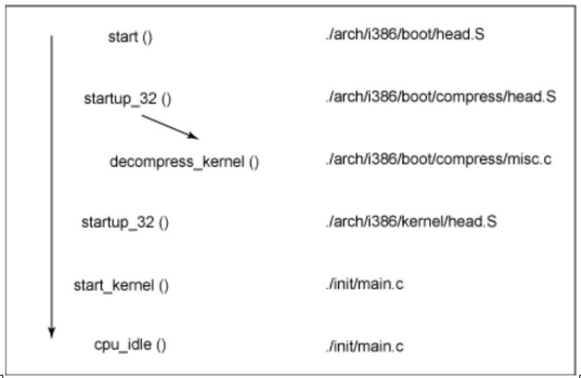
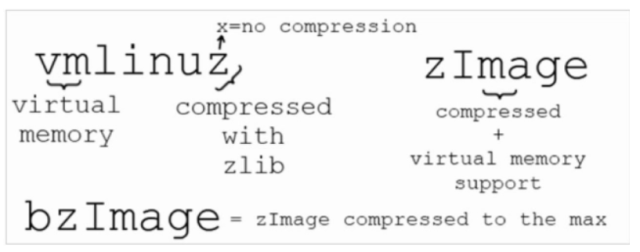

原文：<https://ineclabs.com/image-zimage-uimage-vmlinuz-linux-kernel/>

Linux 内核是宏内核。在建立内核镜像时，我们可以选择多种格式的内核镜像。通常情况下，初学者会因为这些不同的名称和格式而感到疑惑。在 Ubuntu 中，内核文件存储在 /boot 文件夹中，被称为 vmlinuz-version ，以 ubuntu 18 为例：

```bash
sbs@ubuntu:~$ ls /boot/
config-5.4.0-100-generic      initrd.img-5.4.0-104-generic  System.map-5.4.0-100-generic
config-5.4.0-104-generic      memtest86+.bin                System.map-5.4.0-104-generic
grub                          memtest86+.elf                vmlinuz-5.4.0-100-generic
initrd.img-5.4.0-100-generic  memtest86+_multiboot.bin      vmlinuz-5.4.0-104-generic
```

vmlinuz 这个名字来自于 Unix 世界，在 60 年代，他们曾经把内核简单地称为 "Unix"，所以 Linux 在90年代首次开发时开始把他们的内核称为 "Linux"。当虚拟内存被开发出来以提高多任务处理能力时，"vm "被放在文件的前面以表明内核支持虚拟内存。有一段时间，Linux 内核被称为 vmlinux ，但是内核越来越大，无法容纳在可用的启动内存中，所以内核图像被压缩，结尾的 x 被改成了 z ，以显示它是用 zlib 压缩的。在嵌入式系统中，更常用的是 LZMA 和 BZIP2 格式，有些内核干脆被称为 zImage 。在内核配置选项中，可以选择所需的格式。

在这里，我们可以对各种内核图像有一个简单的概述：

* Image ，通用的 Linux 内核二进制镜像文件。

* vmlinux ，这是一个静态链接的可执行文件格式的 Linux 内核。一般来说，你不需要担心这个文件，它只是启动过程中的一个中间步骤。原始的 vmlinux 文件可能对调试有用。

* vmlinux.bin ，与 vmlinux 相同，但采用可启动的原始二进制文件格式。所有的符号和重定位信息都被丢弃了。通过 `objcopy -O binary vmlinux vmlinux.bin` 从 vmlinux 生成。

* vmlinuz，vmlinux 文件通常用 zlib 进行压缩。从 2.6.30 开始，LZMA 和 bzip2 也可用。生成 zImage 或 bzImage 时，也是对vmlinux 的压缩。通过给 vmlinuz 添加进一步的启动和解压缩功能，可以用来启动带有 vmlinux 内核的系统。内核函数 decompress_kernel() 在启动时处理 vmlinuz 的解压过程，会打印如下信息：

  ```
  Decompressing Linux... done
  Booting the kernel.
  ```

* zImage ，执行 `make zImage` 时生成的内核，这是小内核的旧格式（压缩的，低于512KB）。在启动时，这个镜像会被加载到内存的低位（RAM 的前 640KB）。
* bzImage，执行 `make bzImage` 时生成的内核，大的 zImage（这与 bzip2 无关），如果内核镜像超过 512KB ，就应该用这个格式。该镜像在内存中被加载得很高（超过1MB RAM）。由于今天的内核已经远远超过 512KB，这通常是首选的方式。
* uImage：一个具有 U-Boot 包装器（由 mkimage 工具安装）的镜像文件，包括操作系统类型和引导程序的信息。

常用的做法（例如典型的 Linux Kernel Makefile）是使用 zImage 文件。 由于 zImage 文件是自解压的（即不需要外部解压缩器），因此包装器会指示该内核“未压缩”，即使它实际上已经压缩了。

内核启动过程如下：



总结

