进程调度的概念比较简单。假设在只有单核处理器的系统中，同一时刻只有一个进程可以拥有处理器资源，那么其他的进程只能在就绪队列（runqueue）中等待，等到处理器空闲之后才有机会获取处理器资源并运行。在这种场景下，操作系统就需要从众多的就绪进程中选择一个最合适的进程来运行，这就是进程调度器（scheduler）。进程调度器产生的最大原因是为了提高处理器的利用率。一个进程在运行的过程中有可能需要等待某些资源，比如等待磁盘操作的完成、等待键盘输入、等待物理页面的分配等。如果处理器和进程一起等待，那么明显会浪费处理器资源，所以一个进程在睡眠等待时，调度器可以调度其他进程来运行，这样就提高了处理器的利用率。

## 1. 进程的分类

站在处理器的角度看进程的行为，你会发现有的进程一直占用处理器，有的进程只需要处理器的一部分计算资源即可。所以进程按照这个标准可以分成两类：一类是 CPU 消耗型（CPU-Bound），另外一类是 I/O 消耗型（I/O-Bound）。 CPU消耗型的进程会把大部分时间用在执行代码上，也就是一直占用CPU。比如一个while死循环。实际上，常用的例子就是执行大量数学计算的程序，比如MATLAB等。 I/O消耗型的进程大部分时间在提交 I/O 请求或者等待 I/O 请求，所以这类进程通常只需要很少的处理器计算资源即可，比如需要键盘输入的进程或者等待网络 I/O 的进程。

有时候，鉴别一个进程是 CPU 消耗型还是 I/O 消耗型其实挺困难的，一个典型的例子就是Linux图形服务器X-window进程，它既是I/O消耗型也是CPU消耗型。所以，调度器有必要在系统吞吐率和系统响应性方面做出一些妥协和平衡。Linux内核的调度器通常倾向于提高系统的响应性。

## 2. 进程的状态

在 Linux 系统中，一个进程就是一个正在执行的程序实例，当进程被创建后，它可能处于五种状态之一：

*   Running or Runnable (R)，运行或者准备就绪的状态

*   Uninterruptible Sleep (D)，不可中断的睡眠状态

*   Interruptable Sleep (S)，可中断的睡眠状态

*   Stopped (T)，暂停状态

*   Zombie (Z)，僵尸状态

下面用一张状态图展示一个进程的生命周期：

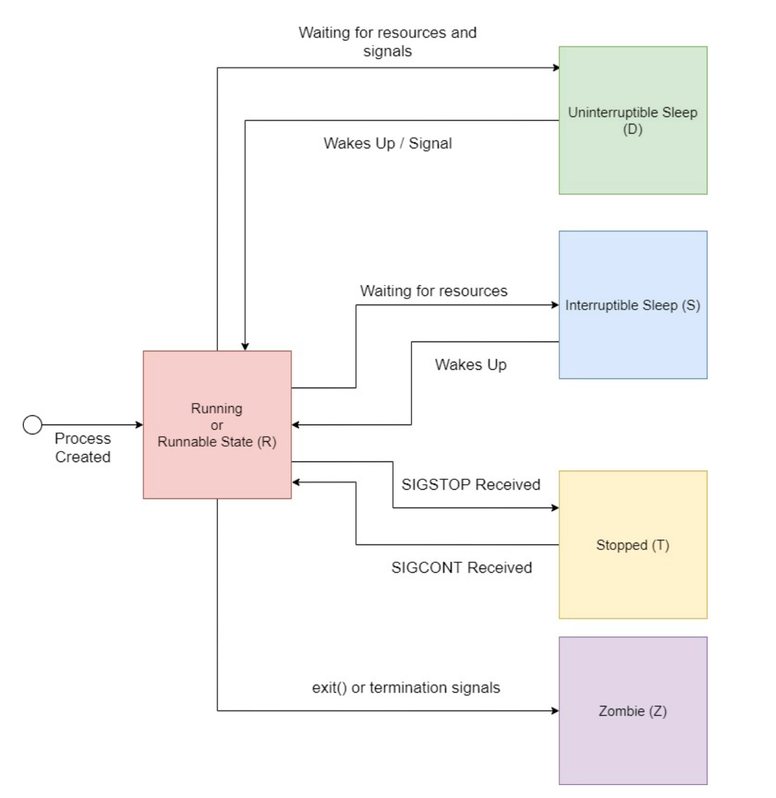

对于任何 Linux 进程来说，它们的起点就是被创建的那一刻。例如，一个父进程可以使用 fork() 系统调用来启动一个子进程。一旦启动，该进程就进入运行或准备就绪的状态，当进程运行时，它可能会进入一个代码路径，要求它在继续运行前等待特定的资源或信号。在等待资源时，进程将自愿放弃 CPU 周期，进入两种睡眠状态之一。此外，我们可以向进程发送SIGSTOP 信号来让它进入暂停状态，处于这种状态的进程将继续存在，直到它被杀死或用 SIGCONT 恢复。最后，当进程被终止并进入僵尸状态时，它的生命周期就结束了，然后，直到它的父进程会将它从进程表中清除。如果它的父进程先退出了，它会成为孤儿进程，一直处于僵尸状态。

有很多工具可以查看进程状态，他们都是是利用了 /proc 文件系统（可以执行 man proc 查看 /proc 文件系统的详细说明），每个进程的信息都放在以 PID 命名的子文件夹下，例如，查看 PID 为 2780 的进程状态：

```bash
$ cat /proc/2780/status | grep State
State:  S (sleeping)
```

### 2.1 Running or Runnable (R)

当一个进程启动后，为了确保每个进程可以公平地分享 CPU 资源，内核会将其放入就绪队列，此时，进程处于准备就绪的状态等待调度，内核依据进程调度算法，依次调度队列中的进程使用 CPU 执行代码，此时进程处于运行状态。

尽管运行和准备就绪的状态是不同的，但它们被统统归入一个由字符 R 表示的状态。

### 2.2 Sleeping State: Interruptible (S) and Uninterruptible (D)

在进程执行过程中，它可能会遇到其代码中需要请求外部资源的部分。通常来说，对这些资源的请求是基于 IO 的，如从磁盘上读取文件或进行网络请求，或者是单纯的 sleep 。由于进程在没有资源的情况下无法进行，它就会停滞不前什么也不做。这种情况下，为例把 CPU 资源让给其他可运行的进程，内核会把进程从就绪队列中移出，进入睡觉状态，等待被唤醒。

有两种不同的睡眠状态：不可中断的睡眠状态（D）和可中断的睡眠状态（S）。不可中断的睡眠状态只等待资源的可用性，然后再转入可运行状态，它对任何信号都没有反应。另一方面，可中断的睡眠状态（S）将对信号和资源的可用性做出反应。

### 2.3 Stopped State (T)

从 R 状态，我们可以使用 SIGSTOP 或 SIGTSTP 信号将一个进程放入暂停状态（T）。这两个信号的区别在于，我们发送 SIGSTOP 是程序化的，比如运行 `kill -STOP {pid}`，进程不能忽略这个信号，将进入停止状态。如果我们用键盘 CTRL+Z 发送 SIGTSTP 信号，进程可以选择忽略这个信号，在收到 SIGTSTP 后继续执行。

在暂停状态下，我们可以通过发送 SIGCONT 信号使进程重新进入运行或可运行状态。

### 2.4 Zombie State (Z)

当一个进程完成其执行或被终止时，它将向父进程发送 SIGCHLD 信号并进入僵尸状态。僵尸进程，也被称为失效进程，将一直处于这种状态，直到父进程将其从进程表中清除。为了从进程表中清除已终止的子进程，父进程必须使用 wait() 或 waitpid() 系统调用读取子进程的退出值。

## 3. CPU 使用率

单个进程的 CPU 使用率，是指在一段时间内，进程占用 CPU （即运行状态）的时长占总时长的百分比，因为进程在这段时间内会在三种状态之间切换，也可以表示为:

```text
CPU 使用率 = 运行状态/(运行状态+就绪状态+睡眠状态)
```

### 3.1 实验

下面做一个实验，在一个 2.3GHz 主频的四核  CPU 上，如果没有其他进程影响，下面这段代码会让 CPU 使用率维持在 50% 左右：

```c
//cpu_test.c
#include <stdio.h>
#include <unistd.h>

int main()
{
    for(;;)
    {
        for(int i=0;i<=(2.3*100000000)/2;i++) //busy
             ;
        usleep(100000); //idle
     }
     return 0;
}
```

其中， usleep(100000) 会让进程处于 S 状态 100ms，然后进程会进入 R 状态，busy 部分的循环执行时间大约是 100ms ，因为没有其他进程影响，可以认为就绪状态持续的时间为零，这样 CPU 的使用率可以估算：

```text
100ms/(100ms+0+100ms) = 50%

```

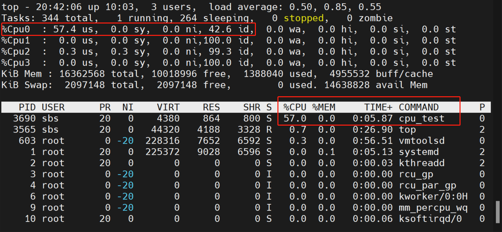

如果把延时缩短到 50ms，CPU 的使用率会上升到 70% 左右：

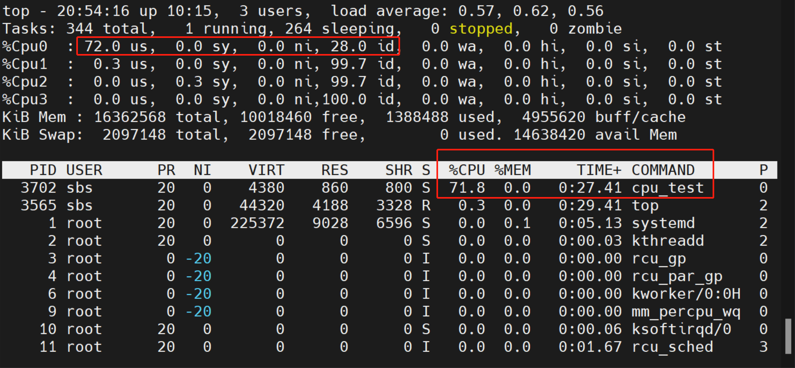

如果再开启一个同样的进程，用 taskset 命令让两个进程都锁定再 Cpu0 上运行，每个进程的 CPU 使用率会下降到 40 左右，这是因为进程在就绪队列里的等待时间变长了：

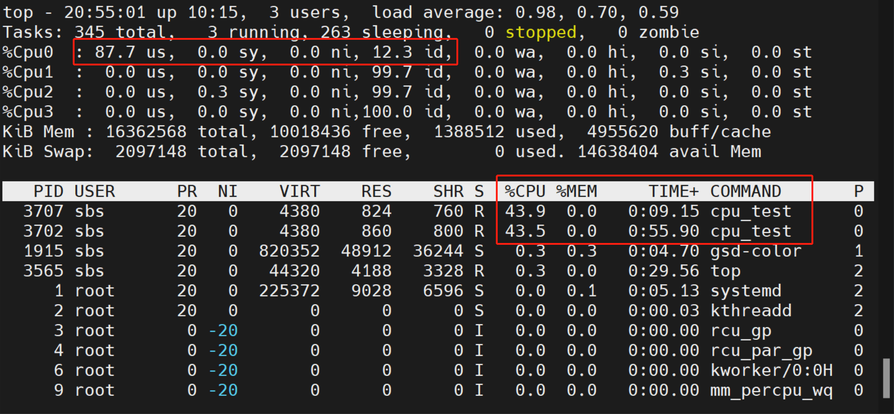

### 3.2 计算单个进程的 CPU 使用率

很多工具可以查看 CPU 使用率，他们都是依赖 /proc 下的文件计算得到的。在 /proc/{pid}/stat 文件中，记录了进程的很多信息，以 gnome-shell 进程为例：

```text
$ cat /proc/1751/stat
1751 (gnome-shell) S 1673 1669 1669 1026 1669 4194304 123945 69225 28 178 2801 623 244 90 20 0 13 0 26476 4092280832 48528 18446744073709551615 93953806516224 93953806530024 140723185486304 0 0 0 0 16781312 33637616 0 0 0 17 2 0 0 4 0 0 93953808628368 93953808630032 93953822617600 140723185490640 140723185490661 140723185490661 140723185491939 0
```

每一项数据都用空格隔开，几个关键项的含义（参考 man proc）：

*   (3) state %c ，数据类型是字符，显示了进程的状态，常见的状态有：

    *   R  Running

    *   S  Sleeping in an interruptible wait

    *   D  Waiting in uninterruptible disk sleep

    *   Z  Zombie

    *   T  Stopped (on a signal) or (before  Linux  2.6.33)  trace stopped

*   (14) utime  %lu ，无符号长整形数据，显示了该进程启动以来，用户态代码执行的时长，单位是 clock tick

*   (15) stime  %lu ，无符号长整形数据，显示了该进程启动以来，内核态代码执行的时长，单位是 clock tick

> 可以通过`sysconf(_SC_CLK_TCK)`获取 1 秒内有多少个 clock tick ，大部分系统上是 100 .

那么，我们可以每隔 n 秒读取一次 /proc/{pid}/stat 文件，解析其中的 utime 和 stime ，相加后（utime+stime）减去上一次采样得到的两项和（prev\_utime+prev\_stime），这就是 n 秒内该进程占用 CPU 的时间，单位是 clock tick，再除以总时长就是 CPU 使用率，用公式可以表达为：

```text
某进程 CPU 使用率 = ((utime+stime) - (prev_utime + prev_stime)) / (n * sysconf(_SC_CLK_TCK))
```

### 3.3 计算每个 CPU 核的使用率

在 /proc/stat 文件中记录了每个CPU核心所处不同状态的累计时间。以一个四核 CPU 系统为例：

```bash
$ head -n 5 /proc/stat
cpu  389079 306 24073 16922376 8047 0 2427 0 0 0
cpu0 160840 80 7066 4165808 1429 0 648 0 0 0
cpu1 109391 11 6220 4215843 2778 0 894 0 0 0
cpu2 13407 26 4699 4317280 1604 0 326 0 0 0
cpu3 105440 187 6088 4223444 2234 0 557 0 0 0
```

前五行记录了整个 CPU（cpu 行）和每个 CPU 核（cpu\[n] 行）在各种状态下花费的时间，单位是 USER\_HZ （通常是百分之一秒，可以用 `sysconf(_SC_CLK_TCK)` 获得正确的值）。每一行有十个数据，每一列的含义如下：

```bash
      user    nice  system  idle      iowait  irq  softirq  steal  guest  guest_nice
cpu   389079  306   24073   16922376  8047    0    2427     0      0      0
cpu0  160840  80    7066    4165808   1429    0    648      0      0      0
cpu1  109391  11    6220    4215843   2778    0    894      0      0      0
cpu2  13407   26    4699    4317280   1604    0    326      0      0      0
cpu3  105440  187   6088    4223444   2234    0    557      0      0      0
```

*   user，执行用户态进程消耗的时间

*   nice，执行低优先级用户态进程花费的时间

*   system，执行内核态进程消耗的时间

*   idle，空闲的时间

*   iowait, 等待 I/O 的时间

我们可以定时采集该文件的数据，通过计算两次采样数据，得出这段时间内的 CPU 使用率 。这是 top 工具默认的计算方法，也是最常见CPU使用率统计方法。

## 4. 系统负载平均值

执行 top 或者 uptime 命令，可以查看系统负载平均值（load average），这三个数值分别表示过去一分钟，五分钟和十五分钟内的系统负载平均值 ：

```bash
$ uptime
 14:38:23 up 4 min,  1 user,  load average: 0.09, 0.53, 0.30
```

系统负载平均值是指处于 R 状态和 D 状态的进程的平均数量。 处于 R 状态的进程要么正在使用 CPU，要么正在等待使用 CPU。 处于 D 状态的进程正在等待一些 I/O 访问，例如等待磁盘。 取三个时间间隔的平均值。 负载平均值未针对系统中的 CPU 数量进行标准化，因此负载平均值为 1 意味着单个 CPU 系统一直在加载，而在 4 CPU 系统上则意味着它有 75% 的时间处于空闲状态。

如果启动一个 CPU 使用率 100% 的进程，持续运行一分钟后，一分钟的系统负载平均值就会变为 1.00 左右。可以做个实验，执行 stress 启动一个进程：

```bash
~$ stress -c 1
```

然后执行 uptime 查看。

```bash
$ uptime
 15:27:57 up 53 min,  2 users,  load average: 0.18, 0.38, 0.30
$ uptime
 15:30:02 up 55 min,  2 users,  load average: 0.98, 0.62, 0.40
$ uptime
 15:33:55 up 59 min,  2 users,  load average: 1.01, 0.85, 0.55

```

## 5. 进程的优先级

操作系统的进程调度策略有很多种，最经典是基于优先级调度。就是说在同一个调度周期中，优先级高的进程占用 CPU 的时间长些，而优先级低的进程占用 CPU 的时间短些。

在内核中，进程优先级的相关宏定义：

```c
/* include/linux/sched/prio.h */

#define MAX_NICE  19
#define MIN_NICE  -20

#define NICE_WIDTH  (MAX_NICE - MIN_NICE + 1)
#define MAX_USER_RT_PRIO  100
#define MAX_RT_PRIO    MAX_USER_RT_PRIO

#define MAX_PRIO    (MAX_RT_PRIO + NICE_WIDTH)
#define DEFAULT_PRIO    (MAX_RT_PRIO + NICE_WIDTH / 2)

```

进程优先级的取值范围是 MAX\_PRIO 定义的，它的值为140 ，就是说，Linux 内核实现了 140 个优先级范围（ 0\~139） ，数值越小，优先级越高。其中 ，0\~99 是实时进程的优先级范围，100\~139 是非实时进程的优先级范围。对于非实时进程，当我们新建一个非实时进程时，内核为它分配的默认优先级是 DEFAULT\_PRIO 定义的，就是 120 ，也就是 nice 为 0 时的值，可以在用户空间通过 nice 值（取值 -20\~19）调整进程的优先级。

在 top 命令中，使用 PR 和 NI 分别表示用户视角的优先级和 nice 值，二者相差 20 ：

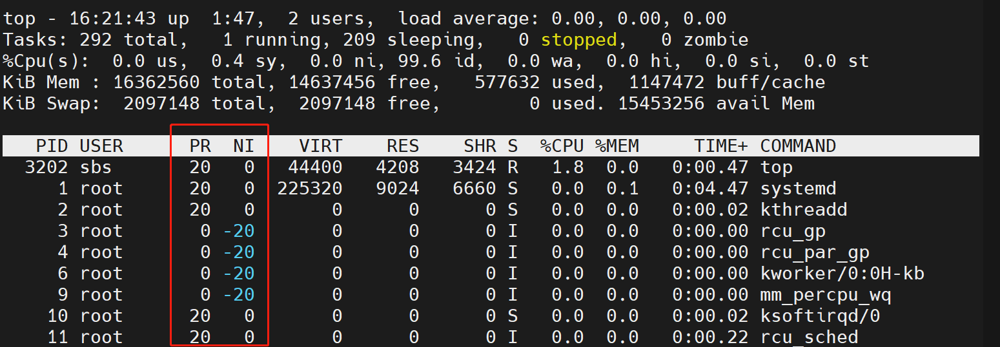

可以看出，在 top 命令中显示的进程优先级与内核中的优先级是不一致的，存在的映射关系如下：

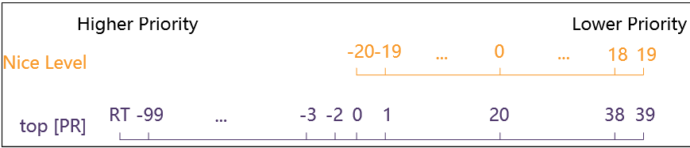

实时进程优先级是负值，范围在 -100 到 -2 之间，对应内核中的 0\~99，其中最高优先级 -100 显示为RT； 非实时进程优先级范围是 0\~39，对应用户设置的nice值是 -20\~19，对应内核中的 100\~139 。

如果用 ps 命令查看进程的优先级信息，显示结果根 top 命令是不一样的：

```bash
$ ps -l
F S   UID    PID   PPID  C PRI  NI ADDR SZ WCHAN  TTY          TIME CMD
0 S  1000  15399  15386  0  80   0 -  5771 wait   pts/1    00:00:00 bash
0 R  1000  15488  15399  0  80   0 -  7229 -      pts/1    00:00:00 ps

```

其中，PRI 表示优先级，取值范围是 -40 到 100 ，对应内核中的 0\~139 ，当 nice 值为 0 时，就会显示 80 。

可以用 nice 命令设置进程启动时的优先级，例如：

```bash
$ nice -n 10 stress -c 1
```

然后查看这个进程优先级：

```bash
$ ps -efl | grep stress
0 S sbs        3288   2819  0  90  10 -  2061 wait   17:07 pts/1    00:00:00 stress -c 1
1 R sbs        3289   3288 99  90  10 -  2061 -      17:07 pts/1    00:00:08 stress -c 1
```

还可以用 renice 命令修改正在运行的进程的优先级，例如：

```bash
$ sudo renice -n 0 -p 3289
3289 (process ID) old priority 10, new priority 0
$ ps -lfp 3289
F S UID         PID   PPID  C PRI  NI ADDR SZ WCHAN  STIME TTY          TIME CMD
1 R sbs        3289   3288 99  80   0 -  2061 -      17:07 pts/1    00:06:48 stress -c 1

```

## 6. CFS 调度器

进程调度依赖于调度策略，Linux 内核把相同的调度策略抽象成了调度类（schedule class）。不同类型的进程采用不同的调度策略，目前 Linux 内核中默认实现了 5 个调度类，分别是 stop、 deadline、realtime、CFS 和 idle，它们分别使用 sched\_class 来定义，并且通过 next 指针串联在一起，如图所示：


*   stop

    *   最高优先级，比deadline进程的优先级高。

    *   可以抢占任何进程。

    *   在每个CPU上实现一个名为“migration/N”的内核线程，N表示CPU的编号。该内核线程的优先级最高，可以抢占任何进程的执行，一般用来执行特殊的功能。

    *   用于负载均衡机制中的进程迁移、softlockup检测、CPU热插拔、RCU等。

*   deadline(SCHED\_DEADLINE )

    *   最高优先级的实时进程，优先级为-1。

    *   用于调度有严格时间要求的实时进程，如视频编解码等。

*   realtime(SCHED\_FIFO、SCHED\_RR)

    *   普通实时进程，优先级为0\~99。

    *   用于普通的实时进程，比如IRO线程化。

*   CFS(SCHED\_NORMAL、SCHED\_BATCH、SCHED\_IDLE)

    *   普通进程，优先级为100\~139，由CFS来调度。

*   idle

    *   最低优先级的进程。

    *   当就绪队列中没有其他进程时进入idle调度类，idle调度类会让CPU进入低功耗模式。

一般的非实时进程是由完全公平调度器 CFS(Completely Fair Scheduler) 调度执行的，核心代码在内核的 [kernel/sched](https://github.com/torvalds/linux/tree/master/kernel/sched "kernel/sched") 目录下，它的目的是让每个进程尽可能“公平”地获得运行时间。

如果当前有 n 个进程需要调度执行，那么调度器应该在一个比较小的时间范围内，把这 n 个进程全都调度执行一遍，尽量公平的分配执行时长，这个时间范围也叫做调度周期。进程越多，每个进程在周期内被执行的时间就会被分的越小。在一个调度周期里，一个进程分配的时间是由进程的权重决定的，可以表示为：

```text
运行时间tn=调度周期T * 进程权重w / 运行队列中全部进程的权重之和S
```

权重跟进程的 nice 值有关，在内核的 kernel/sched/core.c 文件定义了 nice 值转换为权重的映射表：

```c
const int sched_prio_to_weight[40] = {
 /* -20 */     88761,     71755,     56483,     46273,     36291,
 /* -15 */     29154,     23254,     18705,     14949,     11916,
 /* -10 */      9548,      7620,      6100,      4904,      3906,
 /*  -5 */      3121,      2501,      1991,      1586,      1277,
 /*   0 */      1024,       820,       655,       526,       423,
 /*   5 */       335,       272,       215,       172,       137,
 /*  10 */       110,        87,        70,        56,        45,
 /*  15 */        36,        29,        23,        18,        15,
};
```

其中，nice 值为 0 的权重是 1024，nice值每差1，权重大约差1.25倍，运行时间相差10% 。

确定了每个进程分配的时间后，还有一个问题需要解决，就是下一个运行的进程是谁？CFS 会对所有进程维护一个累积占用 CPU 时间数，可以衡量出每个进程目前占用的CPU时间总量是不是过大或者过小，这个数字记录在每个进程的 vruntime 中。所有待执行进程都以 vruntime 为key放到一个由红黑树组成的队列中，每次被调度执行的进程，都是这个红黑树的最左子树上的那个进程，即 vruntime 时间最少的进程，这样就保证了所有进程的相对公平。进程每次运行完毕后就会更新vruntime变量，至于如何挑选出vruntime最少的进程，这将由红黑树完成。

总的来说，优先级高的进程，每次被调度后执行的时间更长，总执行时间最短的进程会被优先调度。

为了避免过度频繁的抢占发生，Linux内核还设置了每个Task（进程）的最小运行时间（或称运行时间粒度），在这个时间内，这个进程的 CPU 资源是不可被抢占的。除非进程主动让出CPU或者执行了阻塞的系统调用，一般而言进程都可以执行这个最小时间。这个时间可以通过内核参数`sched_min_granularity_ns`来查看：

```bash
$ cat /proc/sys/kernel/sched_min_granularity_ns
2250000

```

## 7. 实时进程的调度

优先级在 0\~99 范围内的都是实时进程。

## 8. top 命令

top 命令是用于显示 Linux 系统经常信息的工具，执行 top 命令后，即可进入一个基本的交互界面：

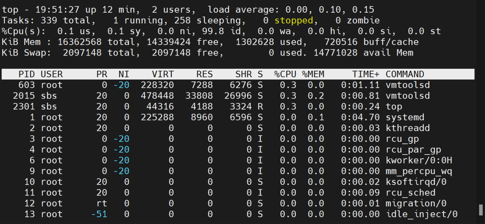

这个界面是动态更新的，默认是 1.5 秒刷新一次，显示的内容分为两个区域：

1.  上半部分显示统计信息，包括所有进程对 CPU 和 Memery 的总体使用情况。

2.  下半部分显示进程列表，如果进程比较多，没有显示全，可以按 Up/Down 或者 PageUp/PageDown 键上下翻页。

按 q 键可以退出。

执行 top 命令时，可以设置一些选项：

*   \-d \[secs.tenths]，刷新的间隔时间，单位是秒，支持小数，必须大于默认值（1.5s）。

*   \-n \[X]，默认情况下，top 会一直保持运行，用 -n 选项可以指定一个整数 X ，表示 top 命令会在刷新 X 次后退出。

*   \-u \[user name]，只显示某个用户的进程列表，也可以启动后按下 u 键，选择用户。

### 8.1  统计信息解析

以如下信息为例：

```bash
top - 14:12:35 up  3:33,  2 users,  load average: 0.06, 0.06, 0.01
Tasks: 343 total,   1 running, 257 sleeping,   0 stopped,   0 zombie
%Cpu(s):  0.1 us,  0.1 sy,  0.0 ni, 99.8 id,  0.0 wa,  0.0 hi,  0.0 si,  0.0 st
KiB Mem : 16362568 total, 14239488 free,  1374568 used,   748512 buff/cache
KiB Swap:  2097148 total,  2097148 free,        0 used. 14697252 avail Mem
```

第一行：

*   14:12:35 ，系统当前时间

*   up 3:33 ，系统开机到现在经过的时间

*   2 users ，当前有两个用户在线

*   load average: 0.06, 0.06, 0.01，过去 1 分钟，5 分钟和 15 分钟的 CPU 平均负载。

第二行：

*   Tasks ，进程信息

*   343 total ，当前系统有 343 给进程

*   1 running ，有 1 个进程处于运行状态（R）

*   257 sleeping ，有 257 个进程处于睡眠状态（S）

*   0 stopped ，有 0 个进程进程处于停止状态（T）

*   0 zombie ，有 0 个进程处于僵尸状态（Z）

第三行：

*   %Cpu(s) ，CPU 使用率的信息，对于多核 CPU ，这里显示的是所有核心的平均值，可以按 1 键，显示每个 CPU 核的状态。

*   0.1 us ，CPU 执行用户空间进程的时间百分比

*   0.1 sy ，CPU 执行内核空间任务的时间百分比

*   0.0 ni ，手动设置过 "nice" 值的进程的执行时间百分比。Linux 使用一个 "nice" 值来决定一个进程的优先级。"nice" 值越小的进程优先级越高，"nice" 值可以手动设置。

*   99.8 id ，CPU 空闲的时间百分比

*   中断是向处理器发出的关于一个需要立即注意的事件的信号。硬件中断通常被外设用来告诉系统有关事件，如键盘上的按键。另一方面，软件中断是由于在处理器上执行特定指令而产生的。在任何一种情况下，操作系统都会处理它们，处理硬件和软件中断的时间分别由hi和si给出。

*   在虚拟化环境中，CPU的一部分资源被赋予每个虚拟机（VM）。操作系统检测到它有工作要做，但它不能执行这些工作，因为CPU在其他虚拟机上很忙。以这种方式损失的时间是 "偷 "的时间，显示为st。

### 8.2 进程列表解析

默认情况下，进程列表显示的信息包括如下内容：

*   PID：进程的ID

*   USER：进程所有者

*   PR：进程的优先级

*   NI：nice 值

*   VIRT：进程占用的虚拟内存

*   RES：进程占用的物理内存

*   SHR：进程使用的共享内存

*   S：进程的状态。S表示休眠，R表示正在运行，Z表示僵死状态，N表示该进程优先值为负数

*   %CPU：进程的CPU使用率

*   %MEM：进程使用的物理内存和总内存的百分比

*   TIME+：该进程启动后占用的总的CPU时间，即占用CPU使用时间的累加值。

*   COMMAND：进程启动命令名称

还有很多信息没有显示出来，可以按 f 键打开 Fields Management 窗口，这里列出了所有可选的进程信息，可以通过上下键移动光标，按下空格键选中相应选项。

### 8.3 应用实例

#### 8.3.1 进程排序

默认情况下，进程列表按 %CPU 列的值，由大到小排序，可以通过按键改变排序依据：

1.  M，按 %MEM 排序

2.  N，按 PID 排序

3.  T，按 TIME+ 排序

4.  P，按 %CPU 排序

#### 8.3.2 按用户筛选

按下 u 键后，根据提示输入用户名或者用户 ID ，可以在进程列表中筛选出特定用户的进程，例如，只列出 root 用户的进程：

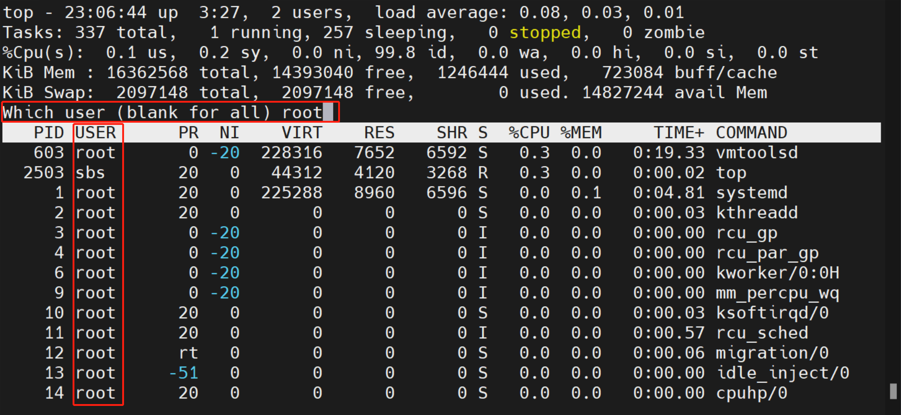

#### 8.3.3 改变显示单位

按下 E 键，可以改变系统信息部分显示的内存大小单位，按下 e 键，可以改变进程信息部分显示的内存大小单位。支持的单位有：

*   kibibytes (KiB)

*   mebibytes (MiB)

*   gibibytes (GiB)

*   tebibytes (TiB)

*   pebibytes (PiB)

*   exbibytes (EiB - applies only for memory values)

例如：

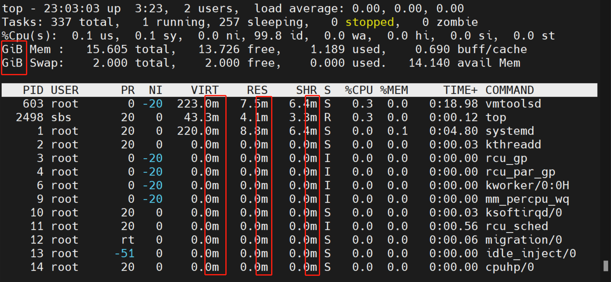

#### 8.3.5 查看进程运行在哪个 CPU 核

默认情况下，显示的进程信息有限，可以按 f 键打开 Fields Management 窗口，这里列出了所有可选的进程信息，然后通过上下键将光标移动到 P = Last Use CPU ，按下空格键选中这个选项，前面会出现一个星号：

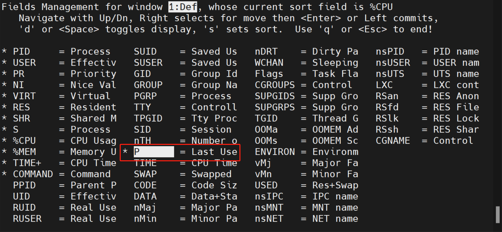

然后按 q 键退出，回到主界面，就会在左右边显示每个进程最近使用的 CPU 核：

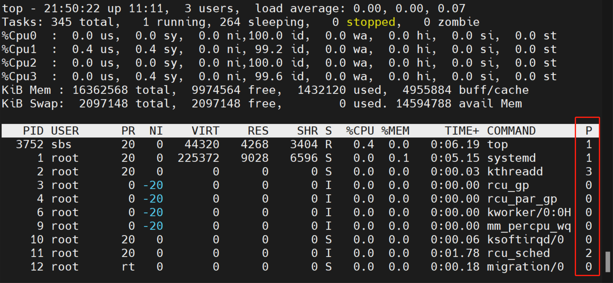

## 参考

1.  [https://phoenixnap.com/kb/top-command-in-linux#change-display-units](https://phoenixnap.com/kb/top-command-in-linux#change-display-units "https://phoenixnap.com/kb/top-command-in-linux#change-display-units")

2.  [https://www.booleanworld.com/guide-linux-top-command/#CPU\_usage](https://www.booleanworld.com/guide-linux-top-command/#CPU_usage "https://www.booleanworld.com/guide-linux-top-command/#CPU_usage")

3.  [https://linuxtools-rst.readthedocs.io/zh\_CN/latest/tool/top.html](https://linuxtools-rst.readthedocs.io/zh_CN/latest/tool/top.html "https://linuxtools-rst.readthedocs.io/zh_CN/latest/tool/top.html")

4.  [https://www.howtogeek.com/668986/how-to-use-the-linux-top-command-and-understand-its-output/](https://www.howtogeek.com/668986/how-to-use-the-linux-top-command-and-understand-its-output/ "https://www.howtogeek.com/668986/how-to-use-the-linux-top-command-and-understand-its-output/")

5.  [http://blog.foool.net/2020/09/利用-proc精确计算linux系统的cpu利用率/](http://blog.foool.net/2020/09/利用-proc精确计算linux系统的cpu利用率/ "http://blog.foool.net/2020/09/利用-proc精确计算linux系统的cpu利用率/")

6.  [https://scoutapm.com/blog/understanding-load-averages](https://scoutapm.com/blog/understanding-load-averages "https://scoutapm.com/blog/understanding-load-averages")

7.  [https://www.baeldung.com/linux/process-states](https://www.baeldung.com/linux/process-states "https://www.baeldung.com/linux/process-states")

8.  [https://carlyleliu.github.io/2021/Linux进程管理（七）多核调度/](https://carlyleliu.github.io/2021/Linux进程管理（七）多核调度/ "https://carlyleliu.github.io/2021/Linux进程管理（七）多核调度/")

9.  [https://linux.cn/article-7325-1.html](https://linux.cn/article-7325-1.html "https://linux.cn/article-7325-1.html")

10. [https://scoutapm.com/blog/understanding-load-averages](https://scoutapm.com/blog/understanding-load-averages "https://scoutapm.com/blog/understanding-load-averages")