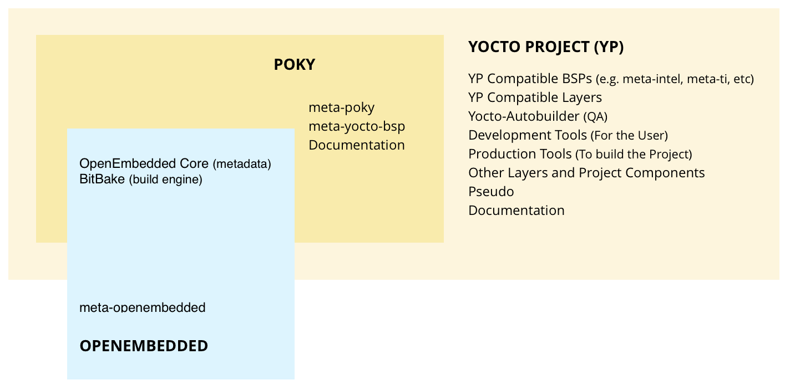
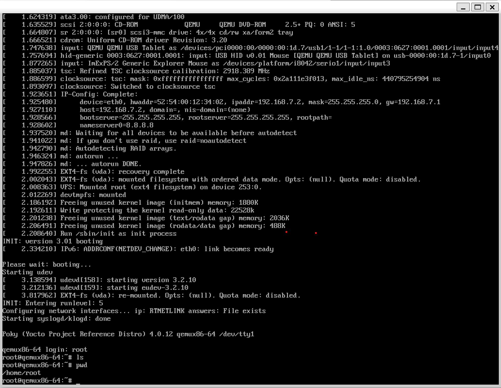
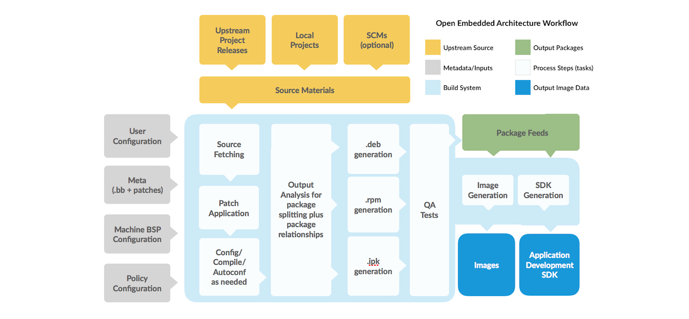
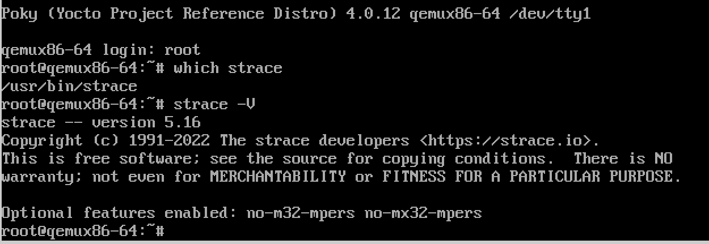
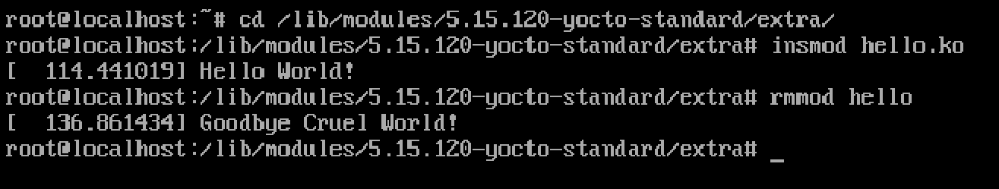
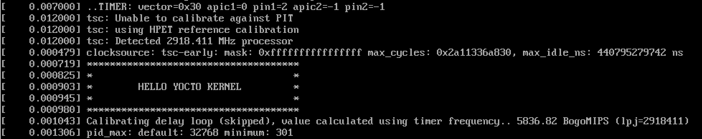
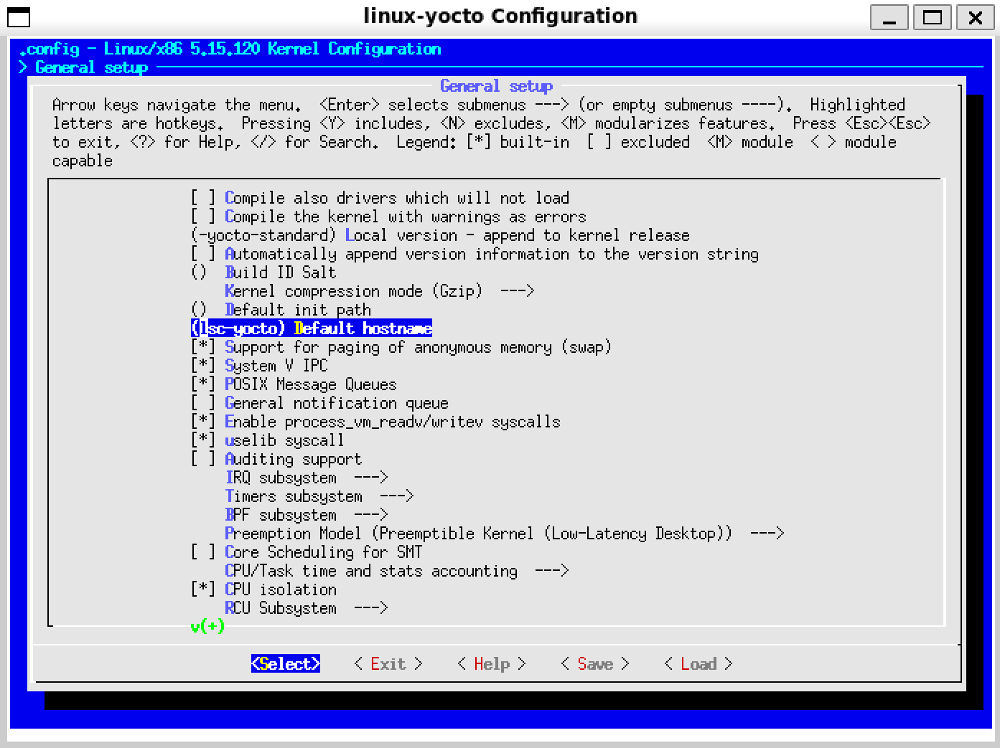

## 1. 前言

通常情况下，一个嵌入式Linux系统由三个部分组成：

1. bootloader：对于X86架构，大部分用GRUB，对于ARM架构，以前的处理器用一个u-boot就可以，而ARMv8之后，还要在u-boot前加上ATF等固件。
2. kernel：就是Linux内核，最常见的是一个bzImage文件，如果是ARM架构，还需要设备树文件，但是内核模块会包含在rootfs中。
3. rootfs：包含了内核模块和用户空间的所有软件（配置文件，可执行文件，运行库等），一些极简的系统只用busybox就可以完成基本的rootfs。

> 除了运行时的系统镜像，通常还要提供一个用于应用程序开发的SDK，包含了编译工具链和开发链接库。

```
- 嵌入式Linux系统镜像
  - bootloader
    - u-boot
    - atf-a
  - kernel
    - bzImage
    - devicetree
  - rootfs
    - kernel modules
    - busybox
    - glibc
    - Qt
    - etc.
```

最开始的时候，嵌入式Linux系统比较简单，BSP工程师只需要编译u-boot，linux kernel 和 busybox ，就可以构建一个系统，然后再根据需要添加软件包，整个构建过程基本都是手动操作，先下载源码，然后逐一编译，再写入系统盘中执行，或者组合成一个可以写入系统盘的系统文件。后来，随着嵌入式Linux系统日渐复杂，尤其是rootfs所需的包越来越多，彼此直接的依赖关系也非常复杂，为了使构建过程更加简便和可靠，也为了便于开发维护，人们开始创造一些自动化的工具，Yocto就是现在最流行的方案之一。

在2003年的时候，OpenEmbedded社区成立，它的目的是提供一套用于构建嵌入式Linux系统的框架和工具。在这里，构建Linux系统的过程就像做一桌宴席：

1. 首先，确定宴席的菜单，用什么桌椅和餐具。就是确定有一些系统级的特性，为此，OpenEmbedded定义了后缀为`.conf/.cfg`的configure（配置）文件，来描述系统内包含哪些软件包，包管理的种类（rpm，dpkg等），文件系统的格式（ext3，ext4等），目标磁盘的大小等。
2. 然后，根据菜单，确定每一道菜需要什么食材，如何采买，怎么烹饪，如何装盘上菜，把每一道菜做好。每个软件包就相当于一道菜，OpenEmbedded定义了后缀为`.bb`的recipe（食谱）配置文件，来描述构建一个软件包所需的信息，包括：源码下载地址，下载后放在那里，如何配置编译，生成的文件安装到哪里等。
3. 最后，就是烹饪和上菜的过程，我们需要做好每一道菜，摆好桌椅餐具，把做好的菜摆到桌子上，一桌宴席就成了。这就是编译和打包的过程，为此，OpenEmbedded提供了bitbake，这是一个python写成的工具，它通过解析recipe和configure文件，先把每个软件包编译出来，再把它们打包组合成一个Linux系统镜像。

到2010年，Linux基金会发起了Yocto项目，它的目标是创造一套构建嵌入式Linux系统发行版的软件工具，改善Linux发行版的构建流程，于是就与OpenEmbedded合并了，在此基础上开发了一个Linux系统发行版Poky。整个项目主要由三个部分组成：

- OpenEmbedded-Core：包括基础核心的recipe和configure，还通过class文件提供了通用功能的类和方法，可以供多个recipe共享。
- BitBake：OpenEmbedded提供的构建工具套件，用Python 写成，核心就行bitbake命令，它是一个多任务引擎，可以并行执行 shell 和 Python 任务，解析recipes和conf等配置文件，管理和执行源码下载、配置、编译、打包等构建过程，并最终将每个任务生成的文件集合成为系统镜像。构建Linux系统发行版涉及到很多方面的工作，如果你玩过 LFS ，就会了解这个过程的复杂性。BitBake 存在的意义就是提供了一个高效的工具，将这个过程标准化、流程化。BitBake 与 GNU Make 的关系就像 GNU Make 之于 GCC ，运作方式也类似 GNU Make ，又有很多不同。
- Poky：Yocto基于OpenEmbedded开发的一个Linux系统发行版，基于Qemu运行，与具体硬件无关。作为一个参考，Yocto 的很多文档，都是以Poky作为实例进行讲解的，其他硬件厂商也可以基于Poky开发自己的Linux发行版。



在这里可以查到Yocto 发行版的历史：

- [https://wiki.yoctoproject.org/wiki/Releases](https://wiki.yoctoproject.org/wiki/Releases "https://wiki.yoctoproject.org/wiki/Releases")。

其中，[Yocto Kirkstone 4.0](https://docs.yoctoproject.org/4.0.14/ "Yocto Kirkstone 4.0")是一个LST版本，2022年发布，预计支持到2026年。我们以此为例，循序渐进的学习Yocto。该版本的详细文档，可以在这里查到：

- [https://docs.yoctoproject.org/4.0.14/](https://docs.yoctoproject.org/4.0.14/ "https://docs.yoctoproject.org/4.0.14/")

需要注意，Yocto的学习曲线比较陡峭，好在官方文档非常丰富，最好的方式就是循序渐进的做一些任务，然后查询文档理解其原理。

## 2. 快速开始

先搭建Yocto的宿主机环境，然后构建一个最简单系统，这样对Yocto有一个直观的认识。

### 2.1 宿主机

通常情况下，构建Yocto是个庞大的工程，根据目标文件的不同，可能需要执行成千上万个任务，对宿主机的CPU，内存和硬盘空间有较高要求。这里做最小的系统，可以用虚拟机，或者WSL，分配8核以上CPU，16G以上内存，100G以上的硬盘空间，操作系统选择Ubuntu20.04 Server，构建过程中会下载大量源码包，要确保网络畅通。

然后安装如下软件：

```bash
$ sudo apt install gawk wget git diffstat unzip texinfo gcc build-essential chrpath socat cpio python3 python3-pip python3-pexpect xz-utils debianutils iputils-ping python3-git python3-jinja2 libegl1-mesa libsdl1.2-dev pylint3 xterm python3-subunit mesa-common-dev zstd liblz4-tool

```

配置git：

```c
$ git config --global user.name "Your Name"
$ git config --global user.email "Your Email"
$ git config --list
```

### 2.2 获取源码

这一步是获取 poky 发行版的yocto源码。先新建一个工作目录：

```bash
$ mkdir yocto-kirkstone
$ cd yocto-kirkstone
```

克隆 poky ，并检出 kirkostone分支：

```bash
$ git clone git://git.yoctoproject.org/poky
$ cd poky
$ git checkout -t origin/kirkstone -b my-kirkstone

```

分析一下poky源码的包括：

- oe-init-build-env，初始化构建环境的脚本，主要是把Yocto的工具路径添加到PATH中，然后生成基础配置。
- bitbake/，bitbake工具套件的路径。
- scritps/，包含了很多构建过程需要的脚本工具。
- meta-\*/，以meta开头的文件夹是layer。[Layer Model](https://docs.yoctoproject.org/4.0.12/overview-manual/yp-intro.html#the-yocto-project-layer-model "Layer Model")是Yocto的重要概念，可以简单的理解为对recipe的分类，例如，meta-yocto-bsp下包含的是与硬件相关的recipe，例如bootloader，kernel等，meta-selftest包含的是各种测试程序。

### 2.3 开始构建

初始化构建环境：

```bash
$ source poky/oe-init-build-env x86_build
```

输出如下内容：

```bash
You had no conf/local.conf file. This configuration file has therefore been
created for you from /home/lsc/yocto-kirkstone/poky/meta-poky/conf/local.conf.sample
You may wish to edit it to, for example, select a different MACHINE (target
hardware). See conf/local.conf for more information as common configuration
options are commented.

You had no conf/bblayers.conf file. This configuration file has therefore been
created for you from /home/lsc/yocto-kirkstone/poky/meta-poky/conf/bblayers.conf.sample
To add additional metadata layers into your configuration please add entries
to conf/bblayers.conf.

The Yocto Project has extensive documentation about OE including a reference
manual which can be found at:
    https://docs.yoctoproject.org

For more information about OpenEmbedded see the website:
    https://www.openembedded.org/


### Shell environment set up for builds. ###

You can now run 'bitbake <target>'

Common targets are:
    core-image-minimal
    core-image-full-cmdline
    core-image-sato
    core-image-weston
    meta-toolchain
    meta-ide-support

You can also run generated qemu images with a command like 'runqemu qemux86'

Other commonly useful commands are:
 - 'devtool' and 'recipetool' handle common recipe tasks
 - 'bitbake-layers' handles common layer tasks
 - 'oe-pkgdata-util' handles common target package tasks
```

这个初始化过程会设置一些环境变量，然后新建一个名为x86\_build文件夹，作为该项目的工作路径。这个路径会设置到`BUILDDIR`环境变量中。`x86_build/conf/`下有三个配置文件：

- templateconf.cfg：设置配置文件模板的路径。文件内容默认为 `meta-poky/conf`，这个路径下包含了很多配置文件的模板。
- bblayers.conf：该文件列出了本项目用到的layer，bitbake只会在这些layer下搜索recipe。
- local.conf：本地配置文件，在这个文件里设置针对本项目的全局变量。 &#x20;

在conf/local.conf 文件添加配置：

```bash
BB_NUMBER_THREADS = "4"
PARALLEL_MAKE = "-j 4"
```

- [BB\_NUMBER\_THREADS](https://docs.yoctoproject.org/4.0.11/ref-manual/variables.html?highlight=bb_number_threads#term-BB_NUMBER_THREADS "BB_NUMBER_THREADS") ，设置最大任务数。bitbake 会同时开启多个任务，并行处理构建过程，默认最大值为CPU的线程数，为了避免影响其他工作，可以设置调小一点。
- [PARALLEL\_MAKE](https://docs.yoctoproject.org/4.0.11/ref-manual/variables.html?highlight=bb_number_threads#term-PARALLEL_MAKE "PARALLEL_MAKE") ，传递给make命令的参数，通过 bitbake调用 do\_compile任务时传递。设置为`-j 4` 表示编译时最大线程数。

打印信息已经告诉我们下一步可以构建多种target，我们选择构建一个最小的发行版：

```bash
$ bitbake core-image-minimal
```

这个发行版包含的软件包较少，构建过程在数小时就可以完成，简单看一下build目录下的文件：

- conf，包含了一些全局配置文件。
- downloads，所有的源码包都下载到了这个路径。
- sstate-cache，构建过程中产生的缓存文件。
- tmp/deploy/rpm/qemux86\_64，安装到最终系统镜像中的所有 rpm 包都在这个路径下。
- tmp/deploy/images/qemux86-64，最终生成的bootloader，kernel和rootfs等系统镜像文件都在这个路径下。

然后运行qemu启动虚拟机：

```bash
$ runqemu qemux86-64
```

在打印信息中可以看到完整的qemu配置参数：

```bash
runqemu - INFO - Setting up tap interface under sudo
runqemu - INFO - Network configuration: ip=192.168.7.2::192.168.7.1:255.255.255.0::eth0:off:8.8.8.8
runqemu - INFO - Running /home/lsc/yocto-kirkstone/x86_build/tmp/work/x86_64-linux/qemu-helper-native/1.0-r1/recipe-sysroot-native/usr/bin/qemu-system-x86_64 \
-device virtio-net-pci,netdev=net0,mac=52:54:00:12:34:02 \
-netdev tap,id=net0,ifname=tap0,script=no,downscript=no \
-object rng-random,filename=/dev/urandom,id=rng0 \
-device virtio-rng-pci,rng=rng0 \
-drive file=/home/lsc/yocto-kirkstone/x86_build/tmp/deploy/images/qemux86-64/core-image-minimal-qemux86-64-20230919015802.rootfs.ext4,if=virtio,format=raw \
-usb -device usb-tablet   -cpu IvyBridge -machine q35 -smp 4 -m 256 -serial mon:vc -serial null -device virtio-vga  -display sdl,show-cursor=on  \
-kernel /home/lsc/yocto-kirkstone/x86_build/tmp/deploy/images/qemux86-64/bzImage \
-append 'root=/dev/vda rw  ip=192.168.7.2::192.168.7.1:255.255.255.0::eth0:off:8.8.8.8 oprofile.timer=1 tsc=reliable no_timer_check rcupdate.rcu_expedited=1 '
```

虚拟机会启动了一个新的窗口，用户名是 root，没有密码：



关于qemu的更多内容可以参考[Using the Quick EMUlator ](https://docs.yoctoproject.org/4.0.12/dev-manual/qemu.html#using-the-quick-emulator-qemu "Using the Quick EMUlator ")。

> 📌也可以先下载所有软件包的源码，下载完毕后再编译：**bitbake core-image-minimal --runall=fetch**


## 3. 解析工作流

下图展示了使用Yocto生成系统镜像image和应用开发工具SDK的工作流程：



1. 开发人员从上游厂家获取Upstream Source，例如poky。
2. 开发人员对Upstream Source进行必要的配置，包括增删软件包，修改软件配置，修改系统特性等。
3. 开始构建，Build Systeam按如下流程工作：
   1. 从指定位置获取并下载源代码，这个过程支持标准方法，例如ftp，git等。
   2. 下载成功后，再将源代码提取到本地工作区，在该工作区中应用补丁并运行配置和编译等软件的常见步骤。
   3. 将软件安装到暂存区，然后使用您选择的二进制包格式（deb、rpm或 ipk）来打包软件。
   4. 不同的 QA 和健全性检查贯穿整个构建过程。
   5. 软件包构建完毕后，放到一个Package Feeds中，用于生成image和SDK。
   6. 生成image（用于写入磁盘的系统镜像）和SDK (包含工具链和链接库，用于应用程序开发）。
      
      

更多详细信息可以参考：[https://docs.yoctoproject.org/4.0.13/overview-manual/concepts.html](https://docs.yoctoproject.org/4.0.13/overview-manual/concepts.html "https://docs.yoctoproject.org/4.0.13/overview-manual/concepts.html")，可以先通篇浏览，然后在遇到问题时回溯，加深理解。下面以构建`core-image-minimal`为例简单分析一下。

bitbake的基本语法是`bitbake [options] [recipe_name/target]` ，当我们执行bitbake时，它解析`${BUILDDIR}/conf/bblayers.conf`文件，确定搜索recipe的路径，然后在这些路径下搜索recipce或者target，`core-image-minimal`作为一个target，也是由recipe文件描述的，可以用如下命令确定该文件的路径：

```bash
$ bitbake -e core-image-minimal | grep ^FILE=
FILE="/home/lsc/yocto-kirkstone/poky/meta/recipes-core/images/core-image-minimal.bb"
```

看一下这个文件的内容：

```bash
  1 SUMMARY = "A small image just capable of allowing a device to boot."
  2
  3 IMAGE_INSTALL = "packagegroup-core-boot ${CORE_IMAGE_EXTRA_INSTALL}"
  4
  5 IMAGE_LINGUAS = " "
  6
  7 LICENSE = "MIT"
  8
  9 inherit core-image
 10
 11 IMAGE_ROOTFS_SIZE ?= "8192"
 12 IMAGE_ROOTFS_EXTRA_SPACE:append = "${@bb.utils.contains("DISTRO_FEATURES", "systemd", " + 4096",     "", d)}"
```

- `SUMMARY`简要的说明了这个target是什么。
- `IMAGE_INSTALL`列出了该系统要安装的recipes。
- `inherit core-image`表示它继承了core-image。

从这个文件开始，继续深入解析，bitbake就会得到该系统依赖的所有recipes，然后依次执行每个recipe的构建过程。可以使用`-g`选项解析target与recipe之间的依赖关系：

```bash
$ bitbake -g core-image-minimal
Loading cache: 100% |################################################################| Time: 0:00:00
Loaded 1644 entries from dependency cache.
NOTE: Resolving any missing task queue dependencies
NOTE: PN build list saved to 'pn-buildlist'
NOTE: Task dependencies saved to 'task-depends.dot'
```

生成了两个文件：

- task-depends.dot: 这是一个[Graphviz](http://www.graphviz.org/ "Graphviz")格式的文件，显示是所有任务之间的依赖关系。
- pn-buildlist: 文本文件，列出了构建target过程中依赖的所有recipe。

Yocto提供了`oe-depends-dot`工具，可以对`task-depends.dot`进行简单分析：

```bash
# 查询busybox的生成关系
$ oe-depends-dot -k busybox -w task-depends.dot
Because: core-image-minimal packagegroup-core-boot
core-image-minimal -> packagegroup-core-boot -> busybox

# 查询busybox依赖的包
$ oe-depends-dot -k busybox -d task-depends.dot
Depends: gcc-cross-x86_64 gcc-runtime zip rpm-native opkg-utils-native pseudo-native opkg-utils libxcrypt kern-tools-native quilt-native ptest-runner update-rc initscripts patch-native glibc binutils-cross-x86_64 dwarfsrcfiles-native
```

这个文件很大，可以删除一下冗余信息缩小文件体积，然后用dot命令把它转换为pdf文件，方便查看：

```bash
$ oe-depends-dot -r ./task-depends.dot
Saving reduced dot file to ./task-depends-reduced.dot
$ ls -l task-depends*
-rw-r--r-- 1 lsc lsc   23056 Sep 28 15:55 task-depends-reduced.dot
-rw-r--r-- 1 lsc lsc 1297931 Sep 12 22:16 task-depends.dot
$ sudo apt install graphviz
$ dot -Tpdf task-depends-reduced.dot -o task-depends-reduced.pdf

```

也可以把文件内容负责到在线平台查看，例如：[https://edotor.net/](https://edotor.net/ "https://edotor.net/") 。

查看pn-buildlist文件，会发现有些recipe带有`native`后缀，有些则没有，例如：

```bash
> cat pn-buildlist | grep unzip
unzip-native
unzip
```

带有`native`后缀的recipe是运行宿主机上的软件，通常是辅助构建所需的工具，或者交叉编译工具链等，而没有后缀的recipe是运行在目标机上的软件。最终会发现，安装到目标机上的软件只有一百多个：

```bash
$ cat pn-buildlist | wc -l
295
$ cat pn-buildlist | grep native | wc -l
149

```

执行`bitbake -e <recipe_name>` 可以将一个recipe的所有内容全部解析出来，还包含大量的注释，这个非常重要，后面的各种工作都可以从中获得线索。以busybox为例，我们把它解析后的内容保存到一个文件，简单分析一下：

```bash
$ bitbake -e busybox > busybox-bb.log
```

首先，`FILE`变量记录了recipe文件的位置：

```bash
$ cat busybox-bb.log | grep ^FILE=
FILE="/home/lsc/yocto-kirkstone/poky/meta/recipes-core/busybox/busybox_1.35.0.bb"
```

通过`WORKDIR`可以定位bitbake构建这个包时的工作目录：

```bash
$ cat busybox-bb.log | grep ^WORKDIR=
WORKDIR="/home/lsc/yocto-kirkstone/x86_build/tmp/work/core2-64-poky-linux/busybox/1.35.0-r0"
```

构建过程会执行很多任务，每个包会略有不同，执行任务的顺序由其任务调度器控制。在`${WORKDIR}/temp/` 目录下，以 `run.do_` 开头的文件记录了每个任务执行的python/shell程序源码，以 `log.do_` 开头的文件记录任务执行时的日志，`log.task_order` 文件按顺序记录了当前目标执行了哪些任务。看一下busybox\_1.35.0.bb执行了哪些任务：

```bash
$ cat log.task_order
do_fetch (1564520): log.do_fetch.1564520
do_unpack (1605094): log.do_unpack.1605094
do_patch (1653034): log.do_patch.1653034
do_deploy_source_date_epoch (1707365): log.do_deploy_source_date_epoch.1707365
do_prepare_recipe_sysroot (1707727): log.do_prepare_recipe_sysroot.1707727
do_configure (1707736): log.do_configure.1707736
do_configure_ptest_base (1781759): log.do_configure_ptest_base.1781759
do_compile (1781797): log.do_compile.1781797
do_compile_ptest_base (1949513): log.do_compile_ptest_base.1949513
do_install (1949868): log.do_install.1949868
do_install_ptest_base (2060604): log.do_install_ptest_base.2060604
do_package (2064697): log.do_package.2064697
do_packagedata (2173119): log.do_packagedata.2173119
do_populate_lic (2262819): log.do_populate_lic.2262819
do_package_write_rpm (2374209): log.do_package_write_rpm.2374209
do_package_qa (2374261): log.do_package_qa.2374261
```

主要的任务有：

1. [fetch](https://docs.yoctoproject.org/4.0.12/ref-manual/tasks.html?highlight=oe_runmake#do-fetch "fetch") ：从远程或者本地获取源码，并放到`${DL_DIR}`路径下
2. [unpack](https://docs.yoctoproject.org/4.0.12/ref-manual/tasks.html?highlight=oe_runmake#do-unpack "unpack") ：将源码从`${DL_DIR}`释放到`${WORKDIR}`下的相应路径下，并用`${S}`指向这个路径。
3. [patch](https://docs.yoctoproject.org/4.0.12/ref-manual/tasks.html?highlight=oe_runmake#do-patch "patch") ： 将补丁文件应用到`${S}`路径下的源码中
4. [configure](https://docs.yoctoproject.org/4.0.12/ref-manual/tasks.html?highlight=oe_runmake#do-configure "configure") ：在`${S}`路径下执行配置
5. [compile](https://docs.yoctoproject.org/4.0.12/ref-manual/tasks.html?highlight=oe_runmake#do-compile "compile") ：在`${S}`路径下执行编译，编译生成的文件会放在`${B}`下，默认与`${S}`相同。
6. [install](https://docs.yoctoproject.org/4.0.12/ref-manual/tasks.html?highlight=oe_runmake#do-install "install") ：从`${B}`把文件复制到`${D}`路径下。
7. [package](https://docs.yoctoproject.org/4.0.12/ref-manual/tasks.html?highlight=oe_runmake#do-package "package") ：分析`${D}`路径下的文件，按照`${PACKAGES}`和`${FILES}`的设置，把他们分类放入`${PKGDEST}`下的文件夹，最后打包生成`${WORKDIR}/deploy/`和`${TMPDIR}/deploy`路径下软件安装包，软件安装包的数据会记录到`${PKGDATA_DIR}`下的相应文件。
8. [clean](https://docs.yoctoproject.org/4.0.12/ref-manual/tasks.html?highlight=oe_runmake#do-clean "clean") ：删除`${B}`路径下编译生成的文件
9. [clearsstate](https://docs.yoctoproject.org/4.0.12/ref-manual/tasks.html?highlight=oe_runmake#do-cleansstate "clearsstate") ：删除编译过程产生的所有文件和缓存文件
10. [cleanall](https://docs.yoctoproject.org/4.0.12/ref-manual/tasks.html?highlight=oe_runmake#do-cleanall "cleanall") ：删除所有文件，包括`${DL_DIR}`路径下的源码和`${WORKDIR}`下的所有文件。

可以看到busybox的源码路径和编译路径是一样的：

```bash
$ cat busybox-bb.log | grep ^S=
S="/home/lsc/yocto-kirkstone/x86_build/tmp/work/core2-64-poky-linux/busybox/1.35.0-r0/busybox-1.35.0"

$ cat busybox-bb.log | grep ^B=
B="/home/lsc/yocto-kirkstone/x86_build/tmp/work/core2-64-poky-linux/busybox/1.35.0-r0/busybox-1.35.0"
```

各种任务的具体内容也可以查到，例如do\_compile任务：

```bash
$ cat busybox-bb.log | grep -C 2 "^do_compile"

# line: 147, file: /home/lsc/yocto-kirkstone/poky/meta/recipes-core/busybox/busybox.inc
do_compile() {
        unset CFLAGS CPPFLAGS CXXFLAGS LDFLAGS
        export KCONFIG_NOTIMESTAMP=1
--

# line: 33, file: /home/lsc/yocto-kirkstone/poky/meta/classes/ptest.bbclass
do_compile_ptest() {
    :
}

# line: 37, file: /home/lsc/yocto-kirkstone/poky/meta/classes/ptest.bbclass
do_compile_ptest_base() {
    do_compile_ptest
}
```

这些任务可以通过 `-c` 参数单独执行，例如只下载源码可以执行  `bitbake <recipe_name> -c fetch` 。执行 `listtasks`  任务可以查看所有可用任务的解释：

```bash
bitbake linux-imx -c listtasks
```

更详细的任务解释可以在官方文档查看：[https://docs.yoctoproject.org/4.0.14/ref-manual/tasks.htm](https://docs.yoctoproject.org/4.0.14/ref-manual/tasks.html "https://docs.yoctoproject.org/4.0.14/ref-manual/tasks.htm")。

依赖的recipe都构建完毕后，`core-image-minimal`会执行do\_rootfs任务，它根据`${IMAGE_ROOTFS}`的值新建一个文件夹，把image需要安装的rpm安装包都安装到这里：

```bash
$ bitbake -e core-image-minimal | grep IMAGE_ROOTFS=
IMAGE_ROOTFS="/home/lsc/yocto-kirkstone/x86_build/tmp/work/qemux86_64-poky-linux/core-image-minimal/1.0-r0/rootfs"
$ ls tmp/work/qemux86_64-poky-linux/core-image-minimal/1.0-r0/rootfs
bin  boot  dev  etc  home  lib  media  mnt  proc  run  sbin  sys  tmp  usr  var
```

还会根据`${IMAGE_MANIFEST}`的值生成一个文件，在里面逐行列出了所有安装到image的rpm安装包，每行分三列，分别是名称，架构和版本：

```bash
$ bitbake -e core-image-minimal | grep IMAGE_MANIFEST=
IMAGE_MANIFEST="/home/lsc/yocto-kirkstone/x86_build/tmp/work/qemux86_64-poky-linux/core-image-minimal/1.0-r0/deploy-core-image-minimal-image-complete/core-image-minimal-qemux86-64-20230914042751.rootfs.manifest"
$ cat tmp/work/qemux86_64-poky-linux/core-image-minimal/1.0-r0/deploy-core-image-minimal-image-complete/core-image-minimal-qemux86-64-20230914042751.rootfs.manifest
base-files qemux86_64 3.0.14
base-passwd core2_64 3.5.29
busybox core2_64 1.35.0
busybox-hwclock core2_64 1.35.0
busybox-syslog core2_64 1.35.0
busybox-udhcpc core2_64 1.35.0
eudev core2_64 3.2.10
init-ifupdown qemux86_64 1.0
init-system-helpers-service core2_64 1.62
initscripts core2_64 1.0
initscripts-functions core2_64 1.0
kernel-5.15.120-yocto-standard qemux86_64 5.15.120+git0+820b9bdb19_74c80e559b
kernel-image-5.15.120-yocto-standard qemux86_64 5.15.120+git0+820b9bdb19_74c80e559b
kernel-image-bzimage-5.15.120-yocto-standard qemux86_64 5.15.120+git0+820b9bdb19_74c80e559b
kernel-module-uvesafb-5.15.120-yocto-standard qemux86_64 5.15.120+git0+820b9bdb19_74c80e559b
ldconfig core2_64 2.35
libblkid1 core2_64 2.37.4
libc6 core2_64 2.35
libkmod2 core2_64 29
liblzma5 core2_64 5.2.6
libz1 core2_64 1.2.11
modutils-initscripts core2_64 1.0
netbase noarch 6.3
packagegroup-core-boot qemux86_64 1.0
sysvinit core2_64 3.01
sysvinit-inittab qemux86_64 2.88dsf
sysvinit-pidof core2_64 3.01
update-alternatives-opkg core2_64 0.5.0
update-rc.d noarch 0.8
v86d qemux86_64 0.1.10

```

最后执行do\_image任务，将kernel，rootfs等image组件放到`${DEPLOY_DIR_IMAGE}`路径下：

```bash
$ cat core-image-minimal-bb.log | grep ^DEPLOY_DIR
DEPLOY_DIR="/home/lsc/yocto-kirkstone/x86_build/tmp/deploy"
DEPLOY_DIR_DEB="/home/lsc/yocto-kirkstone/x86_build/tmp/deploy/deb"
DEPLOY_DIR_IMAGE="/home/lsc/yocto-kirkstone/x86_build/tmp/deploy/images/qemux86-64"
DEPLOY_DIR_IPK="/home/lsc/yocto-kirkstone/x86_build/tmp/deploy/ipk"
DEPLOY_DIR_RPM="/home/lsc/yocto-kirkstone/x86_build/tmp/deploy/rpm"
DEPLOY_DIR_TAR="/home/lsc/yocto-kirkstone/x86_build/tmp/deploy/tar"
DEPLOY_DIR_TOOLS="/home/lsc/yocto-kirkstone/x86_build/tmp/deploy/tools"
$ ls tmp/deploy/images/qemux86-64/
bzImage
bzImage--5.15.120+git0+820b9bdb19_74c80e559b-r0-qemux86-64-20230912081542.bin
bzImage-qemux86-64.bin
core-image-minimal-qemux86-64-20230914081917.rootfs.manifest
core-image-minimal-qemux86-64-20230914081917.testdata.json
core-image-minimal-qemux86-64-20230914083045.qemuboot.conf
core-image-minimal-qemux86-64-20230914083045.rootfs.ext4
core-image-minimal-qemux86-64-20230914083045.rootfs.tar.bz2
core-image-minimal-qemux86-64.ext4
core-image-minimal-qemux86-64.manifest
core-image-minimal-qemux86-64.qemuboot.conf
core-image-minimal-qemux86-64.tar.bz2
core-image-minimal-qemux86-64.testdata.json
modules--5.15.120+git0+820b9bdb19_74c80e559b-r0-qemux86-64-20230912081542.tgz
modules-qemux86-64.tgz

```

关于BitBake的详细内容可以参考手册：[https://docs.yoctoproject.org/bitbake/2.0/index.html](https://docs.yoctoproject.org/bitbake/2.0/index.html "https://docs.yoctoproject.org/bitbake/2.0/index.html")。

## 4. 基础定制

本章对`core-image-minimal`做一些基本的定制工作，循序渐进的理解Yocto。需要注意，重启Linux会话后，都要执行如下命令初始化Yocto环境：

```bash
$ source poky/oe-init-build-env x86_build
```

### 4.1 新建layer

在Yocto中，recipe不是独立存在的，必须通过不同layer分类存放，官方和社区都发布了很多layer，例如：

- OpenEmedded Layer ：[https://layers.openembedded.org/layerindex/branch/master/layers/](https://layers.openembedded.org/layerindex/branch/master/layers/ "https://layers.openembedded.org/layerindex/branch/master/layers/")
- Yocto Layer ：[https://www.yoctoproject.org/software-overview/layers/](https://www.yoctoproject.org/software-overview/layers/ "https://www.yoctoproject.org/software-overview/layers/")

当我们要对poky进一步定制的时候，可以先现在社区找一找，有没有别人已经写好layer或者recipe，如果没找到，就应该新建自己的layer ，存放自定义的recipe。layer本质是一个文件夹和一些特定配置文件，这些可以手动逐个新建，详细情况可以参考[Understand and Creating Layers](https://docs.yoctoproject.org/4.0.12/dev-manual/common-tasks.html#understanding-and-creating-layers "Understand and Creating Layers")。

同时，bitbake套件提供bitbake-layers工具，简化了管理layer 的操作，它的`create-layer`子命令用于新建layer：

```bash
$ bitbake-layers create-layer meta-mylayer
NOTE: Starting bitbake server...
Add your new layer with 'bitbake-layers add-layer meta-mylayer'
```

这条命令新建了一个名为 meta-mylayer 的文件夹，内部包含如下文件：

- COPYING.MIT文件，这是layer的版权声明文件。
- README 文件，这是一个描述layer内容的文件。
- 包含 layer.conf 文件的 conf 子目录，是layer的默认配置文件。
- 一个 recipes-example 子目录，其中包含一个名为 example 的子目录，该子目录包含一个 example.bb 文件，这是一个recipe的例子。

然后需要把这个layer添加到项目中：

```bash
$ bitbake-layers add-layer meta-mylayer
```

这条命令会把meta-mylayer的路径添加到`${BUILDDIR}/conf/bblayers.conf`文件的`BBLAYERS`变量中，这样bitbake在执行时才能找到这个layer下的recipe：

```bash
> cat conf/bblayers.conf
# POKY_BBLAYERS_CONF_VERSION is increased each time build/conf/bblayers.conf
# changes incompatibly
POKY_BBLAYERS_CONF_VERSION = "2"

BBPATH = "${TOPDIR}"
BBFILES ?= ""

BBLAYERS ?= " \
  /home/lsc/yocto-kirkstone/poky/meta \
  /home/lsc/yocto-kirkstone/poky/meta-poky \
  /home/lsc/yocto-kirkstone/poky/meta-yocto-bsp \
  /home/lsc/yocto-kirkstone/x86_build/meta-mylayer \
  "
```

查看一下当前项目包含的layer ：

```bash
$ bitbake-layers show-layers
NOTE: Starting bitbake server...
layer                 path                                      priority
==========================================================================
meta                  /home/lsc/yocto-kirkstone/poky/meta       5
meta-poky             /home/lsc/yocto-kirkstone/poky/meta-poky  5
meta-yocto-bsp        /home/lsc/yocto-kirkstone/poky/meta-yocto-bsp  5
meta-mylayer          /home/lsc/yocto-kirkstone/x86_build/meta-mylayer  6
```

几个layer包含不同的内容：

- mate源于OpenEmbedded项目，是Yocto项目的核心内容，包括各种核心recipe，共享库和工具等。例如内核的recipe就在`meta/recipes-kernel/linux/`下。
- meta-yocto-bsp包含硬件相关的内容，例如，`meta-yocto-bsp/conf/machine`下是目标硬件的配置文件，`meta-yocto-bsp/recipes-kernel/linux`下面是硬件相关的内核补丁。
- meta-poky是poky这个发行版的核心内容，`meta-poky/conf/distro`下面是发行版的配置文件，从顶层决定了发行版包含的内容。
- meta-mylayer就是我们在poky发行版基础上添加的自定义内容。

注意最后一列表示优先级（priority），它在`${LAYERDIR}/conf/layer.conf`文件的[BBFILE\_PRIORITY](https://docs.yoctoproject.org/4.0.12/ref-manual/variables.html#term-BBFILE_PRIORITY "BBFILE_PRIORITY")变量中定义，数字越大表示优先级越高。bitbake会从低到高读取解析各layer中的配置，这样，对应同名的配置选项，高优先级中的配置就会把低优先级中的覆盖。如果要从bblayers.conf文件删除一个layer可以执行remove-layer子命令。

### 4.2 添加软件包

因为`core-image-minimal` 的image只安装了少量的软件，大部分命令是由busybox生成的，数量较少，功能也比较简陋，例如没有可以追踪系统调用strace命令，我们要安装一个。

首先要确定现有的layer中，有没有包含strace的recipe。可以用bitbake的`-s`选项列出当前layer中的所有recipe，从中检索一下即可：

```bash
$ bitbake -s | grep strace
strace                                               :5.16-r0
strace-native                                        :5.16-r0
```

需要注意的是，当前项目的`${BBLAYERS}`并没有包含poky的所有layer，如果bitbake命令没找到，还是要去poky下搜索一下。

向image添加软件包的方法有很多种，最常用的是向[IMAGE\_INSTALL](https://docs.yoctoproject.org/4.0.12/ref-manual/variables.html#term-IMAGE_INSTALL "IMAGE_INSTALL")变量追加recpie，IMAGE\_INSTALL的值是由空格分隔的recipe名称，bitbake会向image安装这个变量设置的recipe。我们在meta-mylayer下面新建`recipes-core/images/core-image-minimal.bbappend`文件，内容如下：

```bash
IMAGE_INSTALL:append = " strace"
```

它的含义是向[IMAGE\_INSTALL](https://docs.yoctoproject.org/4.0.12/ref-manual/variables.html#term-IMAGE_INSTALL "IMAGE_INSTALL")变量的尾部追加一个字符串，如果要在前面添加一个字符串，可以用`:prepend`语法，需要注意的是，这两个语法不会自动添加空格，所以要在recipe名的前后加一个空格，如果要删除一个字符串，可以用`:remove`语法。bitbake修改变量的语法有很多种，有很多注意事项，可以参考[Basic Syntax](https://docs.yoctoproject.org/bitbake/2.0/bitbake-user-manual/bitbake-user-manual-metadata.html#basic-syntax "Basic Syntax")探索一下。

每个recipe可以由一个`.bb`文件和多个`.bbappend`文件组成，bitbake会先读取`.bb`文件，然后按照layer的优先级由低到高，逐个读取`.bbappend`文件，然后深入解析。现在检查一下，可以看到strace已经加上：

```bash
$ bitbake -e core-image-minimal | grep ^IMAGE_INSTALL=
IMAGE_INSTALL="packagegroup-core-boot  strace"
```

重新编译image：

```bash
$ bitbake core-image-minimal -c cleanall
$ bitbake core-image-minimal

```

查看`${IMAGE_ROOTFS}`和`${IMAGE_MANIFEST}`中的内容，确认安装成功，就可以启动虚拟机使用了：



这是添加软件包最直接的方式，但是影响image包含哪些软件包的因素还有很多，后面会逐渐遇到。

### 4.3 设置hostname

在Linux系统中，通过`/etc/hostname`文件设置主机名：


如果要修改这个文件，首先要确定它是由哪个recipe安装到image的。每个recipe生成了哪些安装包都记录在`${PKGDATA_DIR}`路径下的同名文件中。以busybox为例，`${PKGDATA_DIR}/busybox`文件列出来busybox生成的所有安装包：

```bash
$ cat busybox
PACKAGES: busybox-src busybox-dbg busybox-ptest busybox-httpd busybox-udhcpd busybox-udhcpc busybox-syslog busybox-mdev busybox-hwclock busybox-staticdev busybox-dev busybox-doc busybox-locale busybox
```

查看`${IMAGE_MANIFEST}`文件的内容可以确定，image只安装了如下几个安装包：

```bash
busybox core2_64 1.35.0
busybox-hwclock core2_64 1.35.0
busybox-syslog core2_64 1.35.0
busybox-udhcpc core2_64 1.35.0
```

每个安装包向image安装的文件，都存放在`${PKGDEST}`路径下的同名文件夹里：

```bash
$ cat busybox-bb.log | grep ^PKGDEST=
PKGDEST="/home/lsc/yocto-kirkstone/x86_build/tmp/work/core2-64-poky-linux/busybox/1.35.0-r0/packages-split"
$ ls tmp/work/core2-64-poky-linux/busybox/1.35.0-r0/packages-split
busybox      busybox-doc      busybox-locale  busybox-src        busybox-udhcpc
busybox-dbg  busybox-httpd    busybox-mdev    busybox-staticdev  busybox-udhcpd
busybox-dev  busybox-hwclock  busybox-ptest   busybox-syslog     busybox.shlibdeps

```

例如busybox-hwclock只安装了一个hwclock.sh脚本：

```bash
$ tree tmp/work/core2-64-poky-linux/busybox/1.35.0-r0/packages-split/busybox-hwclock
tmp/work/core2-64-poky-linux/busybox/1.35.0-r0/packages-split/busybox-hwclock
└── etc
    └── init.d
        └── hwclock.sh

2 directories, 1 file
```

通过上面这个查询次序，可以确定image安装哪些软件包，每个软件包都安装了什么文件，反过来也就可以确定image中的某个文件来自于哪个recipe 。OpenEmbedded为此提供了oe-pkgdata-util工具，它会解析`${PKGDATA_DIR}`下的文件，然后找出我们想要的数据。其中find-path子命令用户找到image中的某个文件来自于哪个安装包，执行如下命令：

```bash
$ oe-pkgdata-util find-path /etc/hostname
base-files: /etc/hostname
```

因为一个recipe可能会生成多个软件安装包，所以，要进一步使用lookup-recipe子命令找到base-files这个软件包是哪个recipe生成的：

```bash
$ oe-pkgdata-util lookup-recipe base-files
base-files
```

至此，可以确定`/etc/hostname`是由`base-files_*.bb`构建的base-files软件包安装的，找到它：

```bash
$ bitbake -e base-files | grep ^PKGDEST=
PKGDEST="/home/lsc/yocto-kirkstone/x86_build/tmp/work/qemux86_64-poky-linux/base-files/3.0.14-r89/packages-split"
$ ls tmp/work/qemux86_64-poky-linux/base-files/3.0.14-r89/packages-split
base-files  base-files-dbg  base-files-dev  base-files-doc  base-files-src
$ cat tmp/work/qemux86_64-poky-linux/base-files/3.0.14-r89/packages-split/base-files/etc/hostname
qemux86-64

```

找到它的recipe文件：

```bash
$ bitbake -e base-files | grep ^FILE=
FILE="/home/lsc/yocto-kirkstone/poky/meta/recipes-core/base-files/base-files_3.0.14.bb"

```

在`base-files_3.0.14.bb`文件可以看到如下内容：

```bash
hostname = "${MACHINE}"

do_install () {
...
    if [ "${hostname}" ]; then
        echo ${hostname} > ${D}${sysconfdir}/hostname
        echo "127.0.1.1 ${hostname}" >> ${D}${sysconfdir}/hosts
    fi
...
}

```

首先用`${MACHINE}`的值设置了hostname变量，然后把它写入了`${D}${sysconfdir}/hostname`文件。[MACHINE](https://docs.yoctoproject.org/4.0.12/ref-manual/variables.html#term-MACHINE "MACHINE")定义在`${BUILDDIR}/conf/local.conf`文件中，这就是hostname的默认值：

```bash
$ cat conf/local.conf | grep ^MACHINE
MACHINE ??= "qemux86-64"
```

当然可以在`base-files_3.0.14.bb`文件中的修改hostname 变量，但是这样不利于系统维护，更好的做法是在meta-mylayer下面新建`recipes-core/base-files/base-files_3.0.14.bbappend`文件，重新设置hostname：

```bash
hostname = "localhost"
```

重新构建时，bitbake会先找到`base-files_3.0.14.bb`，然后找到同名的`.bbappend`文件，依据layer的优先级合并解析这些文件。很多时候会有有多个`.bbappend`文件，我们可以用bitbake-layer的show-appends子命令列出某个recipe依赖的所有`.bb`和`.bbappend`文件，以base-files为例：

```bash
> bitbake-layers show-appends base-files
NOTE: Starting bitbake server...
Loading cache: 100% |################################################################| Time: 0:00:00
Loaded 1645 entries from dependency cache.
Parsing recipes: 100% |##############################################################| Time: 0:00:00
Parsing of 884 .bb files complete (883 cached, 1 parsed). 1645 targets, 45 skipped, 0 masked, 0 errors.
=== Matched appended recipes ===
base-files_3.0.14.bb:
  /home/lsc/yocto-kirkstone/x86_build/meta-mylayer/recipes-core/base-files/base-files_3.0.14.bbappend
```

所以，base-files\_3.0.14.bbappend对hostname的重新赋值会把base-files\_3.0.14.bb中的相应配置覆盖掉。我们重新构建一下就可以确认：

```bash
$ bitbake base-files -c cleansstate
$ bitbake base-files 
$ cat tmp/work/qemux86_64-poky-linux/base-files/3.0.14-r89/packages-split/base-files/etc/hostname
localhost

```

### 4.4 新建一个recipe

其实，Yocto通过`poky/meta-skeleton`提供了多种reciep和configure的例子，其中的recipes-`skeleton/hello-single`是一个添加应用程序的简单实例，我们参考这个例子改造一下，向image添加一个C语言的串口测试程序comperf。

首先在meta-mylayer下新建`recipes-app`文件夹，之所以用`recipes-`开头，是因为`conf/layer.conf`文件中默认配置的[BBFILES](https://docs.yoctoproject.org/4.0.12/ref-manual/variables.html#term-BBFILES "BBFILES")变量，规定了只会检索`recipes-*`文件夹下的`.bb`和 `.bbappend`文件：

```bash
BBFILES += "${LAYERDIR}/recipes-*/*/*.bb \
            ${LAYERDIR}/recipes-*/*/*.bbappend"
```

然后在此目录下新建comperf文件夹，包含如下文件：

```bash
> tree comperf/
comperf/
├── comperf_1.0.bb
└── files
    ├── Makefile
    ├── README.md
    └── comperf.c

1 directory, 4 files
```

Makefile 的内容是：

```bash
comperf:comperf.c
  $(CC) ${CFLAGS} $< -o $@ -lrt $(LDFLAGS)

install:
  install -d $(DESTDIR)
  install -m 0755 comperf $(DESTDIR)

clean:
  rm -rf comperf
```

按照bitbake的规定，recipe文件helloworld\_1.0.bb的文件名有三个部分组成：

- 第一个部分是recipe的名字，bitbake会把它解析到[PN](https://docs.yoctoproject.org/4.0.12/ref-manual/variables.html?highlight=section#term-PN "PN")变量中，这里PN=helloworld。
- 下划线后面是源码的版本号，bitbake会把它解析到[PV](https://docs.yoctoproject.org/4.0.12/ref-manual/variables.html?highlight=section#term-PV "PV")变量中，这里PV=1.0。
- 后缀必须是`.bb`。

内容如下：

```bash
DESCRIPTION = "Linux UART Serial test application"
SECTION = "application"
LICENSE = "MIT"
LIC_FILES_CHKSUM = "file://${COMMON_LICENSE_DIR}/MIT;md5=0835ade698e0bcf8506ecda2f7b4f302"

SRC_URI = "file://comperf.c \
           file://Makefile \
           file://README.md \
           "

S = "${WORKDIR}"

EXTRA_OEMAKE = "CC='${CC}' CFLAGS='${CFLAGS}' LDCFLAGS='${LDFLAGS}' DESTDIR='${D}${bindir}'"

do_install() {
    oe_runmake install
}

FILES:${PN} = "${bindir}/comperf" 
```

DESCRIPTION是对这个recipe的整体描述，SECTION的值用于软件安装包分类，rpm等包管理器会用它的值填充软件包的信息，不是必须的。

LICENSE标识这个recipe使用的License，这里用的是MIT。[LIC\_FILES\_CHKSUM](https://docs.yoctoproject.org/4.0.12/ref-manual/variables.html?spm=wolai.workspace.0.0.5d1f23abMglYzs#term-LIC_FILES_CHKSUM "LIC_FILES_CHKSUM")是License文件的路径和校验和。Yocto在`${COMMON_LICENSE_DIR}`路径下提供了大量常用的Licesen文件，通常直接用这些就够了，如果要使用其他的Licesen文件，可以放到`${SRC_URI}`中，然后填写相对路径即可。`md5=`表示后面跟着License文件的md5校验和。bitbake开始构建前会检查这个，如果校验失败会报错。

执行do\_fetch任务时，bibake会从`${SRC_URI}`获取源码，然后通过do\_unpack任务放到`${WORKDIR}`路径下。SRC\_URI设置了源码的路径，`file://` 协议表示这些文件在本地，然后是源码文件的路径，这个路径是基于 `${FILESPATH}` 的相对路径，可以设置单个文件，压缩包或者整个目录，通常是放在recipe文件同一层的`files`或者`${PN}`文件夹下。

后面的编译工作要在`${S}`设置的路径下进行，但是[S](https://docs.yoctoproject.org/4.0.12/ref-manual/variables.html#term-S "S")的默认值是`${WORKDIR}/${BPN}-${PV}`，所以要重设`S = "${WORKDIR}"`。需要注意，如果SRC\_URI设置的是压缩包，文件夹或者其他协议，这个路径是不一样的。

因为有Makefile，bitbake会自动执行基于make的do\_compile任务，不用我们重写，可以用[EXTRA\_OEMAKE](https://docs.yoctoproject.org/4.0.12/ref-manual/variables.html#term-EXTRA_OEMAKE "EXTRA_OEMAKE")向Makefile传递一些需要的参数。[LDFLAGS](https://docs.yoctoproject.org/4.0.12/ref-manual/variables.html#term-LDFLAGS "LDFLAGS")是向链接器传递的参数，使目标文件与构建系统的链接起来。`${bindir}`表示image中可执行文件的安装路径，默认值是`/usr/bin`。这些参数都定义在`poky/meta/conf/bitbake.conf`文件，常用的还有：

```bash
export base_prefix = ""
export prefix = "/usr"
export exec_prefix = "${prefix}"
export sysconfdir = "${base_prefix}/etc"
export bindir = "${exec_prefix}/bin"
export sbindir = "${exec_prefix}/sbin"


export CC = "${CCACHE}${HOST_PREFIX}gcc ${HOST_CC_ARCH}${TOOLCHAIN_OPTIONS}"
export CXX = "${CCACHE}${HOST_PREFIX}g++ ${HOST_CC_ARCH}${TOOLCHAIN_OPTIONS}"
export CPP = "${HOST_PREFIX}gcc -E${TOOLCHAIN_OPTIONS} ${HOST_CC_ARCH}"
export LD = "${HOST_PREFIX}ld${TOOLCHAIN_OPTIONS} ${HOST_LD_ARCH}"

TARGET_CFLAGS = "${TARGET_CPPFLAGS} ${SELECTED_OPTIMIZATION}"
export CFLAGS = "${TARGET_CFLAGS}"
TARGET_LDFLAGS = "-Wl,-O1 ${TARGET_LINK_HASH_STYLE} ${ASNEEDED} ${DEBUG_PREFIX_MAP}"
export LDFLAGS = "${TARGET_LDFLAGS}"

```

但是do\_install任务默认是空的，需要我们自定义，这里是调用了Yocto提供的oe\_runmake函数执行Makefile的install目标，这是由[base.bbclass](https://docs.yoctoproject.org/4.0.12/ref-manual/classes.html#base-bbclass "base.bbclass")文件提供的函数，可以在`poky/meta/classes/` 下找到。如果Makefile没有install目标，可以在do\_install中直接添加安装命令，例如：

```bash
do_install() {
    install -d ${D}/usr/bin
    install -m 0755 comperf ${D}/usr/bin
}
```

编译和安装完毕后，下一步要处理do\_package任务。它先根据[PACKAGES](https://docs.yoctoproject.org/4.0.12/ref-manual/variables.html#term-PACKAGES "PACKAGES")变量来确定要新建几个包，以空格分隔，默认值是：

```bash
${PN}-src ${PN}-dbg ${PN}-staticdev ${PN}-dev ${PN}-doc ${PN}-locale ${PACKAGE_BEFORE_PN} ${PN}
```

我们没有修改，所以`${PKGDEST}`路径下有如下文件夹：

```bash
comperf      comperf-dev  comperf-locale  comperf-staticdev
comperf-dbg  comperf-doc  comperf-src
```

然后遍历`${PACKAGES}`，根据与每个软件包对应的[FILES](https://docs.yoctoproject.org/4.0.12/ref-manual/variables.html#term-FILES "FILES") 变量，将文件分配给这些软件包。例如`FILES:${PN}`就是向comperf软件包添加的文件。如果要向comperf-doc软件包添加文件，应该设置`FILES:${PN}-doc`。如果一个文件与 `${PACKAGES}` 中多个软件包的 `${FILES}` 匹配，它将被分配到最早（最左）匹配的软件包。之后会执行do\_package\_write\_rpm任务，把这些文件夹打包成rpm软件包，放到`${WORKDIR}/deploy-rpms`路径下。最后还要执行[do\_package\_qa](https://docs.yoctoproject.org/4.0.12/ref-manual/tasks.html#do-package-qa "do_package_qa")任务，对生成的软件包进行质量检查，确保构建正确，如果有“QA Issue”错误，可以在[QA Error and Warning Messages](https://docs.yoctoproject.org/4.0.12/ref-manual/qa-checks.html "QA Error and Warning Messages")查询错误信息的含义和解决方法。

写好recipe后，构建调试没有问题，就可以把需要的软件包添加到image，在`meta-mylayer/recipes-core/images/core-image-minimal.bbappend`文件中添加一行：

```bash
IMAGE_INSTALL:append = " comperf"
```

### 4.5 使用packagegroup

解析image的IMAGE\_INSTALL变量，会发现一个名为`packagegroup-core-boot`的软件包：

```bash
$ bitbake -e core-image-minimal | grep ^IMAGE_INSTALL=
IMAGE_INSTALL="packagegroup-core-boot  strace comperf"
```

这种以`packagegroup`开头的可以叫做包组，就是按特定需求把多个软件包集合到一起，本质也是recipe：

```bash
$ oe-pkgdata-util lookup-recipe packagegroup-core-boot
packagegroup-core-boot
$ bitbake -e packagegroup-core-boot | grep ^FILE=
FILE="/home/lsc/yocto-kirkstone/poky/meta/recipes-core/packagegroups/packagegroup-core-boot.bb"

```

因为包组本身没有源码，所以文件名里没有设置PV，默认值是“1.0”，分析一下这个文件：

```bash
SUMMARY = "Minimal boot requirements"
DESCRIPTION = "The minimal set of packages required to boot the system"
PR = "r17"

PACKAGE_ARCH = "${MACHINE_ARCH}"

inherit packagegroup

# Distro can override the following VIRTUAL-RUNTIME providers:
VIRTUAL-RUNTIME_dev_manager ?= "udev"
VIRTUAL-RUNTIME_keymaps ?= "keymaps"

EFI_PROVIDER ??= "grub-efi"

SYSVINIT_SCRIPTS = "${@bb.utils.contains('MACHINE_FEATURES', 'rtc', '${VIRTUAL-RUNTIME_base-utils-hwclock}', '', d)} \
                    modutils-initscripts \
                    init-ifupdown \
                    ${VIRTUAL-RUNTIME_initscripts} \
                   "

RDEPENDS:${PN} = "\
    base-files \
    base-passwd \
    ${VIRTUAL-RUNTIME_base-utils} \
    ${@bb.utils.contains("DISTRO_FEATURES", "sysvinit", "${SYSVINIT_SCRIPTS}", "", d)} \
    ${@bb.utils.contains("MACHINE_FEATURES", "keyboard", "${VIRTUAL-RUNTIME_keymaps}", "", d)} \
    ${@bb.utils.contains("MACHINE_FEATURES", "efi", "${EFI_PROVIDER} kernel", "", d)} \
    netbase \
    ${VIRTUAL-RUNTIME_login_manager} \
    ${VIRTUAL-RUNTIME_init_manager} \
    ${VIRTUAL-RUNTIME_dev_manager} \
    ${VIRTUAL-RUNTIME_update-alternatives} \
    ${MACHINE_ESSENTIAL_EXTRA_RDEPENDS}"

RRECOMMENDS:${PN} = "\
    ${VIRTUAL-RUNTIME_base-utils-syslog} \
    ${MACHINE_ESSENTIAL_EXTRA_RRECOMMENDS}"
```

开头的[PR](https://docs.yoctoproject.org/4.0.12/ref-manual/variables.html?spm=wolai.workspace.0.0.5d1f23abPcawC8#term-PR "PR")是recipe文件本身的版本号，如果没有设置，默认值就是“r0”。`inherit packagegroup`表示继承[packagegroup.bbclass](https://docs.yoctoproject.org/4.0.12/ref-manual/classes.html#packagegroup-bbclass "packagegroup.bbclass")中的方法，bitbake 会在[BBPATH](https://docs.yoctoproject.org/bitbake/2.0/bitbake-user-manual/bitbake-user-manual-ref-variables.html?highlight=bbpath#term-BBPATH "BBPATH")指定的路径中寻找 `packagegroup.bbclass`文件，`inherit`是用于继承`.bb`和`.bbclass`文件的语法，支持继承多个文件和使用变量。如果要继承其他类型的文件，推荐用`include`或`require`语法，二者的作用类似，主要区别是，如果找不到指定文件，`require`会报错，而`include`不会。更多共享通用功能的方法可以参考[Sharing Functionality](https://docs.yoctoproject.org/bitbake/2.0/bitbake-user-manual/bitbake-user-manual-metadata.html#sharing-functionality "Sharing Functionality")。

文件里没有设置SRC\_URI或者FILES等变量，也没有定义do\_compile等任务，所以它不会执行编译，安装和打包等任务。关键是[RDEPENDS](https://docs.yoctoproject.org/4.0.12/ref-manual/variables.html#term-RDEPENDS "RDEPENDS") 和[RRECOMMENDS](https://docs.yoctoproject.org/4.0.12/ref-manual/variables.html#term-RRECOMMENDS "RRECOMMENDS")变量：

- [RDEPENDS](https://docs.yoctoproject.org/4.0.12/ref-manual/variables.html#term-RDEPENDS "RDEPENDS")的作用是列出软件包的运行时依赖项，这里列出的软件包也会安装到image，如果这些依赖项出错，会影响整个构建流程。例如`RDEPENDS:foo = "bar baz"`表示软件包foo需要安装软件包bar和baz。bitbake会自动检测和添加常见的软件包依赖关系，所以，多数recipe不需要设置 RDEPENDS。更多信息请参考[Automatically Added Runtime Dependencies](https://docs.yoctoproject.org/4.0.12/overview-manual/concepts.html#automatically-added-runtime-dependencies "Automatically Added Runtime Dependencies")。
- [RRECOMMENDS](https://docs.yoctoproject.org/4.0.12/ref-manual/variables.html#term-RRECOMMENDS "RRECOMMENDS")的作用是列出软件包的运行时功能扩展项，它们与本软件包是软性依赖关系，可以扩展本软件包的可用性，但不是构建的必要条件。如果存在就编译安装，如果不存在，也不会影响本软件的构建过程。

通过[RDEPENDS](https://docs.yoctoproject.org/4.0.12/ref-manual/variables.html#term-RDEPENDS "RDEPENDS") 和[RRECOMMENDS](https://docs.yoctoproject.org/4.0.12/ref-manual/variables.html#term-RRECOMMENDS "RRECOMMENDS")变量安装的软件包，不能直接在IMAGE\_INSTALL变量中清除，可以使用`.bbappend`文件修改相应变量，或者在[PACKAGE\_EXCLUDE](https://docs.yoctoproject.org/4.0.12/ref-manual/variables.html?#term-PACKAGE_EXCLUDE "PACKAGE_EXCLUDE")变量中列出禁止安装到image的软件包，需要注意处理破坏依赖关系而导致的错误。

这里涉及到一个重要的函数`bb.utils.contains()`，由[utils.bbclass](https://docs.yoctoproject.org/4.0.12/ref-manual/classes.html?#utils-bbclass "utils.bbclass")提供，语法是：

```bash
V = "${@bb.utils.contains('val', 'a', '1', '2', d)}"
```

它的作用是，如果变量 val 中包含了 a ，就返回 1 ，否则返回 2 。例如上面的：

```bash
${@bb.utils.contains("DISTRO_FEATURES", "sysvinit", "${SYSVINIT_SCRIPTS}", "", d)} \
${@bb.utils.contains("MACHINE_FEATURES", "keyboard", "${VIRTUAL-RUNTIME_keymaps}", "", d)} \
```

如果[DISTRO\_FEATURES](https://docs.yoctoproject.org/4.0.12/ref-manual/variables.html#term-DISTRO_FEATURES "DISTRO_FEATURES")中包含了sysvinit ，就返回`${SYSVINIT_SCRIPTS}`。类似的`*_FEATURES`还有[MACHINE\_FEATURES](https://docs.yoctoproject.org/4.0.12/ref-manual/variables.html#term-MACHINE_FEATURES "MACHINE_FEATURES")，[IMAGE\_FEATURES](https://docs.yoctoproject.org/4.0.12/ref-manual/variables.html#term-IMAGE_FEATURES "IMAGE_FEATURES")，[EXTRA\_IMAGE\_FEATURES](https://docs.yoctoproject.org/4.0.12/ref-manual/variables.html#term-EXTRA_IMAGE_FEATURES "EXTRA_IMAGE_FEATURES")等，它们的值都会通过这种方式影响安装到image的软件包，我们可以在`conf/local.conf`或者`<image>.bbappend`文件中修改这些变量。更多信息可以参考[Features](https://docs.yoctoproject.org/4.0.14/ref-manual/features.html? "Features")。

要确定哪些recipe会检查某个特性，可以用grep命令查找，例如查找bluetooth的相关特性：

```bash
$ cd poky/
$ grep -rn 'contains.*MACHINE_FEATURES.*bluetooth' ./*
$ grep -rn 'contains.*DISTRO_FEATURES.*bluetooth' ./*
```

### 4.6 生成SDK

执行`bitbake [image] -c do_populate_sdk`可以生成相应image的SDK，包含了工具链和编译库等：

```bash
$ bitbake core-image-minimal -c do_populate_sdk
```

生成的SDK安装脚本位于`tmp/deploy/sdk`路径下，执行后默认安装到`/opt/poky/4.0.12`路径：

```bash
$ ls
poky-glibc-x86_64-core-image-minimal-core2-64-qemux86-64-toolchain-4.0.12.host.manifest
poky-glibc-x86_64-core-image-minimal-core2-64-qemux86-64-toolchain-4.0.12.sh
poky-glibc-x86_64-core-image-minimal-core2-64-qemux86-64-toolchain-4.0.12.target.manifest
poky-glibc-x86_64-core-image-minimal-core2-64-qemux86-64-toolchain-4.0.12.testdata.json
$ ./poky-glibc-x86_64-core-image-minimal-core2-64-qemux86-64-toolchain-4.0.12.sh
Poky (Yocto Project Reference Distro) SDK installer version 4.0.12
==================================================================
Enter target directory for SDK (default: /opt/poky/4.0.12):
You are about to install the SDK to "/opt/poky/4.0.12". Proceed [Y/n]?
[sudo] password for lsc:
Extracting SDK........................................................done
Setting it up...done
SDK has been successfully set up and is ready to be used.
Each time you wish to use the SDK in a new shell session, you need to source the environment setup script e.g.
 $ . /opt/poky/4.0.12/environment-setup-core2-64-poky-linux

```

主要包括如下文件：

```bash
$ tree -L 2
.
├── environment-setup-core2-64-poky-linux
├── site-config-core2-64-poky-linux
├── sysroots
│   ├── core2-64-poky-linux
│   └── x86_64-pokysdk-linux
└── version-core2-64-poky-linux
```

- environment-setup-core2-64-poky-linux 是初始化SDK环境的脚本
- x86\_64-pokysdk-linux是宿主机的开发环境，包含了交叉编译工具链，和运行SDK需要的各种库。
- core2-64-poky-linux是目标机的运行环境，包含了编译链接的库和头文件等。
  
  

使用时，执行如下命令初始化SDK使用环境：

```bash
$ . /opt/poky/4.0.12/environment-setup-core2-64-poky-linux
$ echo ${CC}
x86_64-poky-linux-gcc -m64 -march=core2 -mtune=core2 -msse3 -mfpmath=sse -fstack-protector-strong -O2 -D_FORTIFY_SOURCE=2 -Wformat -Wformat-security -Werror=format-security --sysroot=/opt/poky/4.0.12/sysroots/core2-64-poky-linux

```

一些关键的变量：

```bash
CC=x86_64-poky-linux-gcc  -m64 -march=core2 -mtune=core2 -msse3 -mfpmath=sse -fstack-protector-strong  -O2 -D_FORTIFY_SOURCE=2 -Wformat -Wformat-security -Werror=format-security --sysroot=/opt/poky/4.0.12/sysroots/core2-64-poky-linux
CFLAGS= -O2 -pipe -g -feliminate-unused-debug-types

CXX=x86_64-poky-linux-g++  -m64 -march=core2 -mtune=core2 -msse3 -mfpmath=sse -fstack-protector-strong  -O2 -D_FORTIFY_SOURCE=2 -Wformat -Wformat-security -Werror=format-security --sysroot=/opt/poky/4.0.12/sysroots/core2-64-poky-linux
CXXFLAGS= -O2 -pipe -g -feliminate-unused-debug-types

LD=x86_64-poky-linux-ld   --sysroot=/opt/poky/4.0.12/sysroots/core2-64-poky-linux
LDFLAGS=-Wl,-O1 -Wl,--hash-style=gnu -Wl,--as-needed  -Wl,-z,relro,-z,now
```

然后编译：

```bash
$ ${CC} hello.c -o helle
```

### 4.7 应用开发和调试

参考[Debugging With the GNU Project Debugger (GDB) Remotely](https://docs.yoctoproject.org/4.0.14/dev-manual/debugging.html#debugging-with-the-gnu-project-debugger-gdb-remotely "Debugging With the GNU Project Debugger (GDB) Remotely")。

系统的DISTRO\_FEATURES变量默认已经包含了`debuginfod`特性，这个特性会使gdb使能debuginfod特性：

```bash
# recipes-devtools/gdb/gdb-common.inc
PACKAGECONFIG ??= "readline ${@bb.utils.filter('DISTRO_FEATURES', 'debuginfod', d)}"
PACKAGECONFIG[debuginfod] = "--with-debuginfod, --without-debuginfod, elfutils"

```

这里涉及到一个重要的函数`bb.utils.filter()`，由[utils.bbclass](https://docs.yoctoproject.org/4.0.14/ref-manual/classes.html?#utils-bbclass "utils.bbclass")提供，语法是：

```bash
bb.utils.filter('variable', 'checkvalue', d)}
```

它的作用是检查`${variable}`中是否包含字符串`'checkvalue'`，成功则返回`'checkvalue'`，否则返回空。所以，第一行[PACKAGECONFIG](https://docs.yoctoproject.org/4.0.14/ref-manual/variables.html#term-PACKAGECONFIG "PACKAGECONFIG")变量的值是`readline debuginfod`。第二行利用了bitbake的[Variable Flag](https://docs.yoctoproject.org/bitbake/2.0/bitbake-user-manual/bitbake-user-manual-metadata.html#variable-flag-syntax "Variable Flag")语法，可以影响[PACKAGECONFIG\_CONFARGS](https://docs.yoctoproject.org/4.0.14/ref-manual/variables.html#term-PACKAGECONFIG_CONFARGS "PACKAGECONFIG_CONFARGS")和[DEPENDS](https://docs.yoctoproject.org/4.0.14/ref-manual/variables.html#term-DEPENDS "DEPENDS")变量的值，这里的含义是：

1. 如果PACKAGECONFIG中定义了debuginfod，则向PACKAGECONFIG\_CONFARGS添加`--with-debuginfod`。
2. 如果PACKAGECONFIG没有定义debuginfod，则向PACKAGECONFIG\_CONFARGS添加`--without-debuginfod`。
3. 如果PACKAGECONFIG中定义了debuginfod，则向DEPENDS中添加`elfutils`。

使用方法就很简单了，在宿主机上执行`oe-debuginfod`命令启动debuginfod server，在目标机上设置服务器地址：

```bash
root@qemux86-64:~# export DEBUGINFOD_URLS="http://192.168.7.1:8002/"
```

然后可以用`gdb`, `readelf` 或者 `objdump`与debuginfod server建立连接，获取调试信息：

```bash
root@qemux86-64:~# gdb /bin/cat
...
Reading symbols from /bin/cat...
Downloading separate debug info for /bin/cat...
Reading symbols from /home/root/.cache/debuginfod_client/923dc4780cfbc545850c616bffa884b6b5eaf322/debuginfo...
```

## 5. 内核开发

内核开发的详细内容可以参考 [Yocto Project Linux Kernel Development Manual](https://docs.yoctoproject.org/4.0.14/kernel-dev/index.html "Yocto Project Linux Kernel Development Manual")。poky的内核recipe文件是`meta/recipes-kernel/linux/linux-yocto_5.15.bb`。

### 5.1 添加外部模块

脱离内核源码树，独立存在的内核模块，可以像软件包一样添加到image中，`poky/meta-skeleton/recipes-kernel/hello-mod`是一个简单实例，我们参考这个向系统添加一个内核模块。

在`meta-mylayer`新建`recipes-kernel/hello-mod`文件夹，添加如下文件：

```bash
$ tree hello-mod
hello-mod
├── files
│   └── hello-mod
│       ├── COPYING
│       ├── Makefile
│       └── hello.c
└── hello-mod_0.1.bb

2 directories, 4 files
```

`files/hello-mod`路径下就是内核模块的源码，需要注意Makefile的写法：

```bash
obj-m := hello.o

SRC := $(shell pwd)

all:
  $(MAKE) -C $(KERNEL_SRC) M=$(SRC)

modules_install:
  $(MAKE) -C $(KERNEL_SRC) M=$(SRC) modules_install

clean:
  rm -f *.o *~ core .depend .*.cmd *.ko *.mod.c
  rm -f Module.markers Module.symvers modules.order
  rm -rf .tmp_versions Modules.symvers

```

`hello-mod_0.1.bb`的内容：

```bash
SUMMARY = "Example of how to build an external Linux kernel module"
DESCRIPTION = "${SUMMARY}"
LICENSE = "GPL-2.0-only"
LIC_FILES_CHKSUM = "file://COPYING;md5=12f884d2ae1ff87c09e5b7ccc2c4ca7e"

inherit module

SRC_URI = "file://hello-mod"

S = "${WORKDIR}/hello-mod"

```

`LIC_FILES_CHKSUM`是License文件的相对路径和校验和，需要注意相对路径是指相对`${S}`。`SRC_URI`设置了源码路径，因为源码放在本地的`files/hello-mod`路径下，所以指设置一个文件夹名称即可。`inherit module`表示继承module.bbclass的相关任务，它会自动使用`kernel-module-`前缀命名软件安装包，生成的软件包是`kernel-module-hello-5.15.120-yocto-standard-0.1-r0.qemux86_64.rpm`：

```bash
$ ls deploy-rpms/qemux86_64/
hello-mod-0.1-r0.qemux86_64.rpm
hello-mod-dbg-0.1-r0.qemux86_64.rpm
hello-mod-dev-0.1-r0.qemux86_64.rpm
kernel-module-hello-5.15.120-yocto-standard-0.1-r0.qemux86_64.rpm
```

然后在`core-image-minimal.bbappend`中将模块添加到image：

```bash
IMAGE_INSTALL:append = " hello-mod"
```

模块安装在`/lib/modules/5.15.120-yocto-standard/extra/`路径下。启动虚拟机后验证加载卸载：



### 5.2 修改内核源码

修改内核源码树的方法有很多，这里推荐用git生产源码补丁，再添加都recipe中，下面是一个简单的例子。

找到内核源码的路径`${S}`，修改`init/calibrate.c`文件，在`calibrate_delay()`函数添加几行打印启动信息：

```c
void calibrate_delay(void)
{
  unsigned long lpj;
  static bool printed;
  int this_cpu = smp_processor_id();

    printk("*************************************\n");
    printk("*                                   *\n");
    printk("*        HELLO YOCTO KERNEL         *\n");
    printk("*                                   *\n");
    printk("*************************************\n");

  if (per_cpu(cpu_loops_per_jiffy, this_cpu)) {
  ...
}
```

保存后使用git提交，并对此次修改生产一个补丁，补丁文件自动命名为`0001-feat-add-boot-message.patch`：

```bash
$ git add init/calibrate.c
$ git commit -m "feat:add boot message"
$ git format-patch -1
0001-feat-add-boot-message.patch

```

在`meta-mylayer/recipes-kernel`下新建`linux`文件夹，准备如下文件：

```bash
$ tree linux/
linux/
├── linux-yocto
│   └── 0001-feat-add-boot-message.patch
└── linux-yocto_%.bbappend

1 directory, 2 files
```

把前面生成的补丁文件放到了`linux-yocto`目录下，`linux-yocto_%.bbappend`文件名中的百分号`%`是通配符，表示这个[append文件](https://docs.yoctoproject.org/bitbake/2.0/bitbake-user-manual/bitbake-user-manual-intro.html#append-files "append文件")可以匹配任何前缀`linux-yocto_`的recipe文件，文件内容如下：

```bash
FILESEXTRAPATHS:prepend := "${THISDIR}/${PN}:"

SRC_URI:append = " file://0001-feat-add-boot-message.patch"
```

[FILESEXTRAPATHS](https://docs.yoctoproject.org/4.0.14/ref-manual/variables.html#term-FILESEXTRAPATHS "FILESEXTRAPATHS")变量是告诉bitbake查找文件和补丁的搜索路径，这里把`./linux-yocto`也加进去，因为补丁文件存放在这里，下面向SRC\_URI添加补丁文件是，就是相对这里的路径。bitbake在执行patch任务时，会自动判断文件类型，然后把补丁合并到源码中，可以单独执行patch任务，确认补丁是否合并成功。最后依次执行如下命令生产新的内核和系统镜像：

```bash
$ bitbake linux-yocto -c cleansstate
$ bitbake linux-yocto 
$ bitbake core-image-minimal -c cleanall
$ bitbake core-image-minimal 

```

启动虚拟机可以看到添加的启动信息：



### 5.3 修改内核配置

单独编译内核时，标准做法是执行`make menuconfig`命令修改配置，bitbake也可以执行相应的`do_menuconfig`任务，打开内核的配置界面：

```bash
$ bitbake linux-yocto -c menuconfig
```

这里的配置来自于`${B}/.config`文件，它是由上一个任务`do_kernel_configme`集合多个配置片段而成的，详细情况稍后再讲。这里我们修改一下`CONFIG_DEFAULT_HOSTNAME`配置：



然后保存并退出。在编译目录`${B}`下面会生成更新后的 `.config` 文件，原有的 `.config` 被重命名为 `.config.old` ，对比一下二者的差异：

```diff
$ diff -u .config.old .config
--- .config.old 2023-11-20 16:46:10.061458785 +0800
+++ .config     2023-11-20 17:01:28.021316267 +0800
@@ -16,7 +16,7 @@
 CONFIG_CC_HAS_ASM_GOTO_TIED_OUTPUT=y
 CONFIG_CC_HAS_ASM_INLINE=y
 CONFIG_CC_HAS_NO_PROFILE_FN_ATTR=y
-CONFIG_PAHOLE_VERSION=0
+CONFIG_PAHOLE_VERSION=121
 CONFIG_IRQ_WORK=y
 CONFIG_BUILDTIME_TABLE_SORT=y
 CONFIG_THREAD_INFO_IN_TASK=y
@@ -45,7 +45,7 @@
 # CONFIG_KERNEL_LZ4 is not set
 # CONFIG_KERNEL_ZSTD is not set
 CONFIG_DEFAULT_INIT=""
-CONFIG_DEFAULT_HOSTNAME="(none)"
+CONFIG_DEFAULT_HOSTNAME="lsc-yocto"
 CONFIG_SWAP=y
 CONFIG_SYSVIPC=y
 CONFIG_SYSVIPC_SYSCTL=y
```

然后调用 diffconfig任务，它会对比 `.config` 和 `.config.old` ，确定修改的内容，生成一个补丁文件，称之为配置片段：

```bash
$ bitbake linux-yocto -c diffconfig
...
Config fragment has been dumped into:
 /home/lsc/yocto-kirkstone/x86_build/tmp/work/qemux86_64-poky-linux/linux-yocto/5.15.120+gitAUTOINC+820b9bdb19_74c80e559b-r0/fragment.cfg
```

生成的配置片段文件是位于`${WORKDIR}`目录下的 `fragment.cfg` 。把这个文件复制到 `meta-mylayer/recipes-kernel/linux/linux-yocto` 目录下，然后在 `linux-yocto_%.bbappend` 文件中添加一行：

```bash
SRC_URI:append = " file://fragment.cfg"
```

可以为`fragment.cfg`更改一个有意义的文件名，因为通常会使用多个配置片段来添加不同类型的修改内容，清除后重新编译，可以调用 `kernel_configcheck` 任务检查内核配置是否正确：

```bash
$ bitbake linux-yocto -c cleansstate
$ bitbake linux-yocto -c kernel_configcheck
$ bitbake linux-yocto
```

这里要注意几个任务的执行顺序：

1. `do_patch`任务会把`.patch`文件应用到源码上。
2. `do_kernel_configme`任务负责将defconfig和各种配置片段合并为`.config`。
3. `do_configure`任务是执行内核配置工作，`do_menuconfig`也是在这个任务之后。

在menuconfig中修改完配置，如果没有清除直接编译，后面的任务是继续进行，而不是从头开始，不会应用recipes文件中添加的配置片段，这样调试没有问题，如果想要使配置片段生效，还是要执行`do_cleansstate`任务后重新开始。

`do_kernel_configme`任务定义在`poky/meta/classes/kernel-yocto.bbclass`文件中，它利用了Linux 内核源码的`/scripts/kconfig/merge_config.sh` 脚本来完成合并配置，脚本的语法如下：

```bash
$ ./merge_config.sh -h
Usage: ./merge_config.sh [OPTIONS] [CONFIG [...]]
  -h    display this help text
  -m    only merge the fragments, do not execute the make command
  -n    use allnoconfig instead of alldefconfig
  -r    list redundant entries when merging fragments
  -y    make builtin have precedence over modules
  -O    dir to put generated output files.  Consider setting $KCONFIG_CONFIG instead.

Used prefix: 'CONFIG_'. You can redefine it with $CONFIG_ environment variable.
```

很多情况下，第三方发布的BSP会重写这个任务，但是基本原理是一样的。我们也可以在内核的 `.bbappend` 文件中添加一个类似的任务，让它在编译前利用 `merge_config.sh` 脚本合并配置片段，例如：

```bash
do_merge_fragment() {
  if [ -f ${WORKDIR}/fragment.cfg ]; then
        ${S}/scripts/kconfig/merge_config.sh -m ${B}/.config ${WORKDIR}/fragment.cfg
        mv .config ${B}/.config
    fi
}
addtask merge_fragment before do_compile after do_configure
```

### 5.4 设置defconfig

我们单独编译x86架构的内核时，通常是直接执行`make defconfig`，内核的Makefile会根据主机的`uname -m`信息，在`arch/x86/configs/`下找到相应的配置文件。如果是arm架构，通常要指定一个配置文件，Makefile会在`arch/${ARCH}/configs/`路径下的搜索，例如：

```bash
$ make imx_v8_defconfig
```

在yocto中，可以通过[KBUILD\_DEFCONFIG](https://docs.yoctoproject.org/4.0.14/ref-manual/variables.html#term-KBUILD_DEFCONFIG "KBUILD_DEFCONFIG")变量设置defconfig，bitbake会把`${KBUILD_DEFCONFIG}`和其他配置片段合并为`.config`文件。我们在 `linux-yocto_%.bbappend` 文件中添加一行：

```bash
KBUILD_DEFCONFIG = "x86_64_defconfig"
```

重新编译内核，会发现`${WORKDIR}`目录下多了一个`defconfig`文件，这是

`arch/x86/configs/x86_64_defconfig`文件的拷贝。我们也可以创建自己的defconfig，在`linux-yocto_%.bbappend `文件中通过SRC\_URI添加：

```bash
SRC_URI += "file://defconfig"
```

通过SRC\_URI添加的defconfig比`${KBUILD_DEFCONFIG}`的优先级高，在`do_kernel_configme`任务中可以看到相关代码：

```bash
   # 如果定义了${KBUILD_DEFCONFIG}
  if [ -n "${KBUILD_DEFCONFIG}" ]; then
    if [ -f "${S}/arch/${ARCH}/configs/${KBUILD_DEFCONFIG}" ]; then
      # 优先使用${WORKDIR}/defconfig
      if [ -f "${WORKDIR}/defconfig" ]; then
        cmp "${WORKDIR}/defconfig" "${S}/arch/${ARCH}/configs/${KBUILD_DEFCONFIG}"
        if [ $? -ne 0 ]; then
          bbdebug 1 "detected SRC_URI or unpatched defconfig in WORKDIR. ${KBUILD_DEFCONFIG} copied over it"
        fi
        cp -f ${S}/arch/${ARCH}/configs/${KBUILD_DEFCONFIG} ${WORKDIR}/defconfig
      # 如果${WORKDIR}/defconfig不存在，就用${KBUILD_DEFCONFIG}
      else
        cp -f ${S}/arch/${ARCH}/configs/${KBUILD_DEFCONFIG} ${WORKDIR}/defconfig
      fi
      in_tree_defconfig="${WORKDIR}/defconfig"
    else
      bbfatal "A KBUILD_DEFCONFIG '${KBUILD_DEFCONFIG}' was specified, but not present in the source tree (${S}/arch/${ARCH}/configs/)"
    fi
  fi

  # 如果${KBUILD_DEFCONFIG}没有定义，就用${WORKDIR}/defconfig
  sccs_from_src_uri="${@" ".join(find_sccs(d))}"
  src_uri_defconfig=$(echo $sccs_from_src_uri | awk '(match($0, "defconfig") != 0) { print $0 }' RS=' ')
```

上面的写法`KBUILD_DEFCONFIG = "x86_64_defconfig"`虽然有效，但是兼容性不好，常见的作法是用条件语法[Conditional Syntax (Overrides)](https://docs.yoctoproject.org/bitbake/2.0/bitbake-user-manual/bitbake-user-manual-metadata.html#conditional-syntax-overrides "Conditional Syntax (Overrides)")，让defconfig跟硬件架构关联起来，例如：

```bash
KBUILD_DEFCONFIG = "i386_defconfig"
KBUILD_DEFCONFIG:qemux86-64 = "x86_64_defconfig"
KBUILD_DEFCONFIG:beaglebone = "beaglebone_defconfig"

```

它的含义是KBUILD\_DEFCONFIG的默认值是i386\_defconfig，如果`${OVERRIDES}`中包含qemux86-64，就用x86\_64\_defconfig覆盖，如果`${OVERRIDES}`中包含beaglebone，就用beaglebone\_defconfig覆盖。执行`bitbake -e linux-yocto > linux-yocto.bb.log`，在导出的日志文件中搜索KBUILD\_DEFCONFIG，可以看到这个解析过程：

```bash
# $KBUILD_DEFCONFIG [3 operations]
#   set /home/lsc/yocto-kirkstone/x86_build/meta-mylayer/recipes-kernel/linux/linux-yocto_%.bbappend:3
#     "i386_defconfig"
#   override[qemux86-64]:set /home/lsc/yocto-kirkstone/x86_build/meta-mylayer/recipes-kernel/linux/linux-yocto_%.bbappend:4
#     "x86_64_defconfig"
#   override[beaglebone]:set /home/lsc/yocto-kirkstone/x86_build/meta-mylayer/recipes-kernel/linux/linux-yocto_%.bbappend:5
#     "beaglebone_defconfig"
# pre-expansion value:
#   "x86_64_defconfig"
KBUILD_DEFCONFIG="x86_64_defconfig"

```

这里显示解析结果是`KBUILD_DEFCONFIG="x86_64_defconfig"`，是因为OVERRIDES变量的值是这样的：

```bash
OVERRIDES="linux:x86-64:pn-linux-yocto:qemuall:qemux86-64:poky:class-target:libc-glibc:forcevariable"
```

bitbake解析KBUILD\_DEFCONFIG变量的时候，根据冒号后面的条件，在`${OVERRIDES}`中匹配到了qemux86-64。[OVERRIDES](https://docs.yoctoproject.org/bitbake/2.0/bitbake-user-manual/bitbake-user-manual-ref-variables.html#term-OVERRIDES "OVERRIDES")叫做条件控制变量，这是一个以冒号字符分隔的字符串列表，每个字符串就是一个条件，定义在 `poky/meta/conf/bitbake.conf` 文件：

```c
OVERRIDES = "${TARGET_OS}:${TRANSLATED_TARGET_ARCH}:pn-${PN}:${MACHINEOVERRIDES}:${DISTROOVERRIDES}:${CLASSOVERRIDE}${LIBCOVERRIDE}:forcevariable"
LIBCOVERRIDE ?= ""
CLASSOVERRIDE ?= "class-target"
DISTROOVERRIDES ?= "${@d.getVar('DISTRO') or ''}"
MACHINEOVERRIDES ?= "${MACHINE}"

```

主要集合列举了当前项目的一些系统特性，其中MACHINEOVERRIDES是指硬件特性，默认使用MACHINE的值，就是qemux86-64。这样，defconfig就跟硬件架构关联起来了。

### 5.5 使用devtool

上面是内核开发的基本方法，但是，实际情况不会这么简单，通常需要反复修改验证，如果每次都要修改后都要生成补丁重新构建系统，效率就很低。最好是修改后直接编译验证，完成所有内核开发后，再构建系统镜像，这个过程更推荐用devtool完成。这是Yocto提供的辅助开发工具，不止用于内核开发，它的基本原理是新建一个名为workspace的临时layer进行开发，开发完毕后再合并清除。详细内容可以参考：

- [Using devtool to Patch the Kernel](https://docs.yoctoproject.org/4.0.14/kernel-dev/common.html#using-devtool-to-patch-the-kernel "Using devtool to Patch the Kernel")
- [devtool Quick Reference](https://docs.yoctoproject.org/4.0.14/ref-manual/devtool-reference.html# "devtool Quick Reference")

首先使用 `devtool modify` 命令将 linux-yocto 的源码释放到 devtool 的环境下：

```bash
$ devtool modify linux-yocto
... ...
INFO: Adding local source files to srctree...
INFO: Copying kernel config to srctree
INFO: Source tree extracted to /home/lsc/yocto-kirkstone/x86_build/workspace/sources/linux-yocto
INFO: Recipe linux-yocto now set up to build from /home/lsc/yocto-kirkstone/x86_build/workspace/sources/linux-yocto

```

这一步完成了几项工作：

1. 新建了一个名为workspace的layer。
2. 将workspace的路径添加到`conf/bblayers.conf`文件的BBLAYERS变量中。
3. 将linux-yocto的源码checkout到`workspace/sources/linux-yocto`路径下。

此时，S变量也指向了这个路径：

```bash
$ bitbake -e linux-yocto | grep ^S=
S="/home/lsc/yocto-kirkstone/x86_build/workspace/sources/linux-yocto"
```

这里的内核源码已经应用了recipe中设置的所有补丁和配置片段，合并后的配置文件就是源码路径下的`.config`，执行`git log`可以看到已经提交的补丁：

```bash
$ cd workspace/sources/linux-yocto
$ ls -la
total 1120
drwxr-xr-x  28 lsc lsc   4096 Nov 23 15:51 .
drwxr-xr-x   3 lsc lsc   4096 Nov 23 15:51 ..
-rw-r--r--   2 lsc lsc  17019 Nov 23 14:14 .clang-format
-rw-r--r--   2 lsc lsc     59 Nov 23 14:14 .cocciconfig
-rw-r--r--   1 lsc lsc 147545 Nov 23 14:15 .config
$ git log
commit 9f62d786ef4e9c4ad2b85aa34d3ec8036ec107f2 (HEAD -> v5.15/standard/base)
Author: lishaocheng <gexbob@gmail.com>
Date:   Fri Nov 17 15:32:14 2023 +0800

    feat:add boot message
```

之后我们就在这个内核源码上进行开发，例如修改`init/calibrate.c`文件，添加几行启动信息：

```bash
void calibrate_delay(void)
{
    unsigned long lpj;
    static bool printed;
    int this_cpu = smp_processor_id();

    printk("*************************************\n");
    printk("*                                   *\n");
    printk("*        HELLO YOCTO KERNEL         *\n");
    printk("*                                   *\n");
    printk("*************************************\n");

    if (per_cpu(cpu_loops_per_jiffy, this_cpu)) {
          .
          .
```

使用devtool进行编译：

```bash
$ devtool build linux-yocto
$ devtool build-image core-image-minimal

```

也可以脱离devtool，使用外部工具链进行编译，首先初始化开发环境：

```bash
$ source /opt/poky/4.0.12/environment-setup-core2-64-poky-linux

```

打开配置界面修改配置：

```bash
$ make menuconfig
```

清除：

```bash
$ make clean
```

- `make clean`，删除大多数的编译生成文件，但是会保留内核的`.config`， 还有足够的编译支持来建立扩展模块，比较常用。
- `make mrproper` ，删除所有的编译生成文件， 还有内核配置文件， 再加上各种备份文件，慎用。
- `make distclean`，mrproper 删除的文件，加上编辑备份文件和一些补丁文件，包括 `.scmversion` 等，几乎不用。

编译 ，生成的内核位于`./arch/${ARCH}/boot/`路径下：

```bash
$ make -j4

```

打包模块，所有编译出的模块都安装到 `./modules/` 路径下：

```bash
$ make modules_install INSTALL_MOD_PATH=./modules/
```

生成的内核和模块都可以复制到目标硬件上测试验证。阶段性开发完毕后，可以向 git 提交：

```bash
git status
git add <files>
git commit -m <message>
```

一次或者多次 commit 后，可以使用`devtool finish`命令结束开发：

```bash
$ devtool finish linux-yocto ~/yocto-kirkstone/x86_build/meta-mylayer
...
NOTE: Writing append file /home/lsc/yocto-kirkstone/x86_build/meta-mylayer/recipes-kernel/linux/linux-yocto_%.bbappend
NOTE: Copying 0001-calibrate-Add-printk-example.patch to /home/lsc/yocto-kirkstone/x86_build/meta-mylayer/recipes-kernel/linux/linux-yocto/0001-calibrate-Add-printk-example.patch
INFO: Cleaning sysroot for recipe linux-yocto...
INFO: Leaving source tree /home/lsc/yocto-kirkstone/x86_build/workspace/sources/linux-yocto as-is; if you no longer need it then please delete it manually
```

这个命令自动执行了几个步骤：

1. 检查git日志，将最近的几次commit生成补丁，并放到`meta-mylayer/recipes-kernel/linux/linux-yocto`路径下。
2. 修改`linux-yocto_%.bbappend`文件，将补丁文件添加到SRC\_URI。
3. 将`workspace/sources/linux-yocto` 从yocto开发环境中清除。

也可以手动完成这些操作，执行 `git format-patch <-n>` 将前面几次 commit 生成补丁，n是 commit 的次数，然后将这些补丁文件复制到`meta-mylayer/recipes-kernel/linux/linux-yocto`，修改并添加到SRC\_URI。最后执行 `devtool reset linux-yocto` 将 `workspace/sources/linux-yocto` 从yocto开发环境中清除，之后执行bitbake时，才会使用 `meta-mylayer` 下的配置。需要注意的是，`devtool reset`和`devtool finish`并不会删除源码，所有，`workspace/source/linux-yocto` 下的源码需要手动删除。

上面的方法主要针对内核源码的开发，对于内核配置，推荐执行`make savedefconfig`，使用生成的`defconfig`文件，而不是配置片段。

### 5.6 使用Virtual Provider

在构建之前，如果知道有几个不同的recipe提供相同的功能，可以使用Virtual Provider（即 virtual/\*）作为实际提供程序的占位符，实际提供程序将在构建时确定。参考：[Using Virtual Providers](https://docs.yoctoproject.org/4.0.14/dev-manual/new-recipe.html#using-virtual-providers "Using Virtual Providers")。

例如，poky包含了多个不同的内核recipe：

```bash
> ls poky/meta/recipes-kernel/linux
cve-exclusion.inc  linux-dummy.bb          linux-yocto-rt_5.15.bb    linux-yocto.inc
kernel-devsrc.bb   linux-yocto-dev.bb      linux-yocto-tiny_5.10.bb  linux-yocto_5.10.bb
linux-dummy        linux-yocto-rt_5.10.bb  linux-yocto-tiny_5.15.bb  linux-yocto_5.15.bb
```

每个recipe都有字节的[PROVIDES](https://docs.yoctoproject.org/4.0.14/ref-manual/variables.html#term-PROVIDES "PROVIDES")变量，它的值是recpie的别名列表，默认只包含了`${PN}`，而这些内核recipe都继承了`poky/meta/classes/kernel.bbclass`，这里向PROVIDES追加了`virtual/kernel`：

```bash
PROVIDES += "virtual/kernel"
```

所以，每个内核recipe就有了`${PN}`和`virtual/kernel`两个名称。然后通过[PREFERRED\_PROVIDER](https://docs.yoctoproject.org/4.0.14/ref-manual/variables.html#term-PREFERRED_PROVIDER "PREFERRED_PROVIDER")和[PREFERRED\_VERSION](https://docs.yoctoproject.org/4.0.14/ref-manual/variables.html#term-PREFERRED_VERSION "PREFERRED_VERSION")变量设置`virtual/kernel`解析为哪个recipe：

```bash
# poky/meta/conf/machine/include/qemu.inc
PREFERRED_PROVIDER_virtual/kernel ??= "linux-yocto"
# poky/meta-poky/conf/distro/poky.conf
PREFERRED_VERSION_linux-yocto ?= "5.15%"

```

这样，开发内核时，可以不用内核的recipe原名，而是使用`virtual/kernel`，例如`bitbake virtual/kernel`，bitbake会自动解析PREFERRED\_PROVIDER变量，确定使用的内核recipe。