## MIPI DSI 的基本概念

MIPI联盟是一个由移动设备制造商和电子元件供应商组成的联盟，在2003年由ARM，Nokia和TI等厂商牵头成立，旨在为智能手机和类似多媒体设备中的各种子系统指定一组通用接口。他们发布了一系列标准，涵盖音频、摄像头、显示器、触摸屏和其他设备的接口，如其信息图所示：

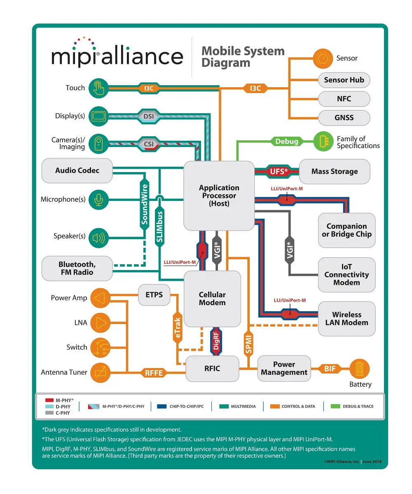

目前最成熟的两个接口标准协议：

- MIPI-CSI，全称MIPI Camera Serial Interface，用于连接处理器和摄像头。数据流`传感器 → 应用层 → CSI-2协议层 → 通道层 → D-PHY → 处理器`
- MIPI-DSI，全称MIPI Display Serial Interface，用于连接处理器和液晶显示屏。数据流`处理器 → 应用层 → DSI协议层 → 通道层 → D-PHY → 显示面板`

协议分四层：

``` markdown 
┌─────────────────────────┐
│    应用层 (Application) │  ← 图像数据/显示数据
├─────────────────────────┤
│    协议层 (Protocol)    │  ← CSI-2/DSI 协议
├─────────────────────────┤
│    通道层 (Lane)        │  ← 数据打包和分发
├─────────────────────────┤
│    物理层 (Physical)    │  ← D-PHY/C-PHY
└─────────────────────────┘

```

物理层的两种协议区别：

| 特性            | D-PHY                   | C-PHY                |
| ------------- | ----------------------- | -------------------- |
| 信号类型  | 差分信号对                   | 三线制信号                |
| 数据通道  | 每个通道需要2根线（差分对）          | 每个通道需要3根线            |
| 速率    | 最高 4.5 Gbps/Lane（v2.1）  | 最高 9Gbps/trio（v2.0）  |
| 功耗    | 相对较高                    | 更低功耗                 |
| 成本    | 较低，技术成熟                 | 较高，新技术               |

下图是一个典型应用，分别使用了四通道的D-PHY传输数据，用I2C进行控制：

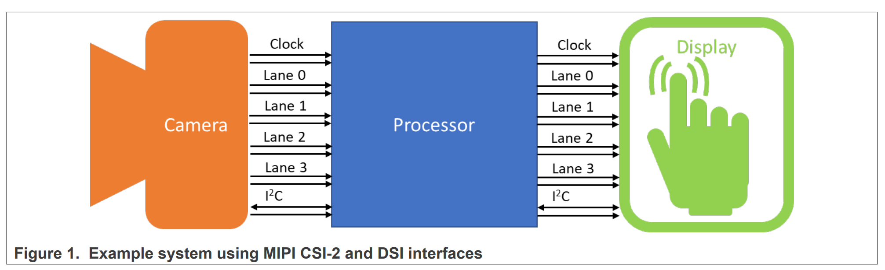

除了以上MIPI标准要求的信号，通常还会有电源信号，复位信号和背光信号等。

### D-PHY

MIPI协议的物理层是D-PHY，基本概念：

- **线路(Line)**：主机处理器和外设之间单个引脚的互连或走线
- **通道(Lane)**：两条线路组成差分信号对，用于高速数据和时钟传输
- **链路(Link)**：包含一个时钟通道和至少一个数据通道的设备间连接

一个D-PHY接口链路的特性：

- **信号类型**：低压差分信号
- **电压范围**：1.2V ± 10%
- **数据通道**：1-4个差分数据对 (Data Lane)
- **时钟通道**：1个差分时钟对 (Clock Lane)
- **每个通道**：2根信号线（Line）组成差分对，一个叫做P，一个叫做N

常见的2-Lane MIPI D-PHY 接口连接方式：

``` text 
发送端                    接收端
┌─────────┐              ┌─────────┐
│ Data0+  │──────────────│ Data0+  │
│ Data0-  │──────────────│ Data0-  │
│ Data1+  │──────────────│ Data1+  │
│ Data1-  │──────────────│ Data1-  │
│ CLK+    │──────────────│ CLK+    │
│ CLK-    │──────────────│ CLK-    │
└─────────┘              └─────────┘

```

### 时钟和传输速率

数据在 Data Lane 上采用DDR方式传输，在CLK Lane的上升沿和下降沿采样：

- 1个CLK周期传输2个数据位
- CLK上升沿传输第1个bit
- CLK下降沿传输第2个bit

所以，一对Lane的时钟频率 = 数据速率 ÷ 2 （数据速率 = CLK频率 × 2），如果数据速率要达到 800Mbps，时钟频率至少 400MHz 。而 MIPI-DSI的传输速率（也就是总带宽）由Lane的传输能力和Lane的数量决定：

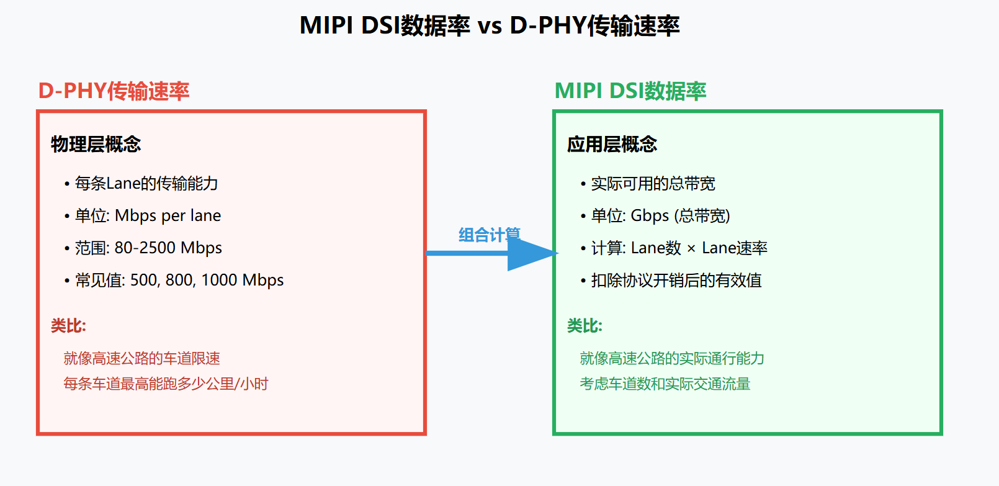

## 显示器工作原理基础

显示器采用**逐行扫描**的方式显示图像，类似于老式CRT电视机的电子束扫描：

1. 从屏幕左上角开始
2. 逐像素从左到右扫描（水平扫描）
3. 扫描完一行后，跳到下一行的左边重新开始（垂直扫描）
4. 重复直到扫描完整个屏幕的每一行
5. 回到左上角，开始下一帧

下面是一个典型的 1600x1200 60Hz的显示器的工作时序。

### 水平扫描过程

每一行需要扫描1600个像素：

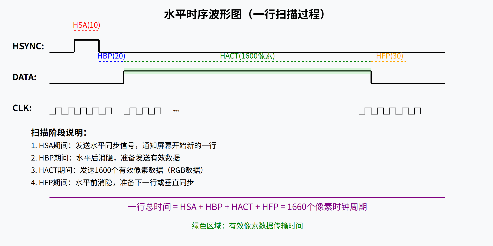

水平时序各阶段详解：

1. HSA (Horizontal Sync Active) - 水平同步脉冲
   - 作用：告诉屏幕"新的一行开始了"
   - 时长：10个像素时钟周期
   - 信号：HSYNC拉低（或拉高，取决于极性）
   - 此时：不传输像素数据
2. HBP (Horizontal Back Porch) - 水平后消隐
   - 作用：给屏幕时间准备接收像素数据
   - 时长：20个像素时钟周期
   - 信号：HSYNC恢复正常电平
   - 此时：不传输像素数据，但时钟继续运行
3. HACT (Horizontal Active) - 水平有效数据
   - 作用：传输这一行的所有像素数据
   - 时长：1600个像素时钟周期
   - 信号：DE（数据有效）信号拉高
   - 此时：连续传输1600个像素的RGB数据
4. HFP (Horizontal Front Porch) - 水平前消隐
   - 作用：给屏幕时间处理这一行数据，准备下一行
   - 时长：30个像素时钟周期
   - 信号：DE信号拉低
   - 此时：不传输像素数据

### 垂直扫描过程

连续做1200次水平扫描可以完成一帧画面：

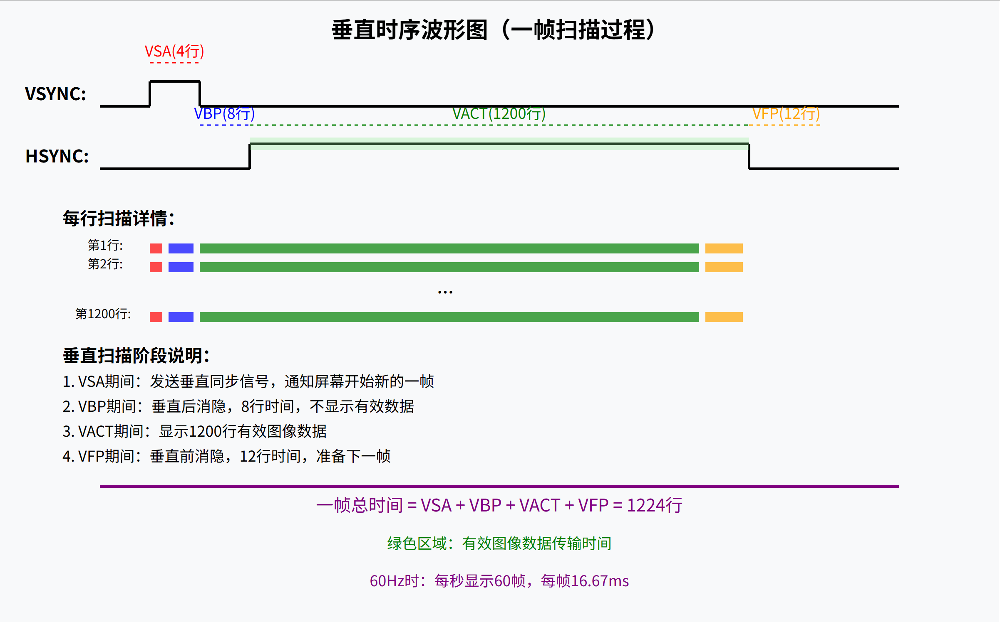

垂直时序各阶段详解：

1. VSA (Vertical Sync Active) - 垂直同步脉冲
   1. 作用：告诉屏幕"新的一帧开始了"
   2. 时长：4行时间
   3. 信号：VSYNC拉低（或拉高）
   4. 此时：不显示任何图像数据
2. VBP (Vertical Back Porch) - 垂直后消隐
   - 作用：给屏幕时间准备显示新一帧图像
   - 时长：8行时间
   - 信号：VSYNC恢复正常电平
   - 此时：扫描8行，但不显示有效图像
3. VACT (Vertical Active) - 垂直有效数据
   - 作用：显示整帧图像的所有行
   - 时长：1200行时间
   - 信号：每行都按水平时序传输像素数据
   - 此时：连续扫描1200行，每行1600个像素
4. VFP (Vertical Front Porch) - 垂直前消隐
   - 作用：给屏幕时间处理这一帧，准备下一帧
   - 时长：12行时间
   - 信号：继续行扫描但不显示数据
   - 此时：扫描12行空白，然后开始下一帧

### 完整显示过程

数据传输过程：

``` text 
第1帧开始：
├─ VSA(4行) → 发送垂直同步信号
├─ VBP(8行) → 8行空白扫描
├─ VACT开始：
│   ├─ 第1行：HSA→HBP→传输1600像素RGB数据→HFP
│   ├─ 第2行：HSA→HBP→传输1600像素RGB数据→HFP  
│   ├─ ...
│   └─ 第1200行：HSA→HBP→传输1600像素RGB数据→HFP
├─ VFP(12行) → 12行空白扫描
└─ 第2帧开始...
```


一幅画面就是一帧，每秒能够完成的帧数叫做帧率，或者叫刷新率。60Hz帧率下的时间计算：

``` text
一行时间 = 1660个像素时钟 ÷ 122.4MHz = 13.56μs
一帧时间 = 1224行 × 13.56μs = 16.6ms
帧率 = 1000ms ÷ 16.6ms = 60.24Hz ≈ 60Hz
```

有效像素区域VACT和HACT的前后都有消隐区，目的是给软硬件保留信号处理时间，也是与传统显示标准的兼容。完整的像素显示区域示意图：

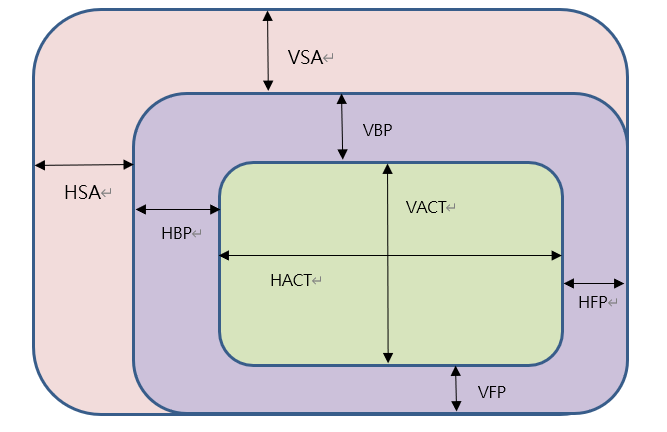

消隐区会影响显示器的有效显示时间占比：
1. 水平有效比例 = 1600 / 1660 = 96.4%
2. 垂直有效比例 = 1200 / 1224 = 98.0%
3. 总有效比例 = 96.4% × 98.0% = 94.5%

这意味着：
- 94.5%的时间在传输有效图像数据
- 5.5%的时间在消隐区（不传输图像数据）

## MIPI DSI的显示时序

上面时序中有 SYNC和 DATA等信号，但是MIPI DSI协议中并没有独立的DATA，HSYNC和VSYNC硬件信号线。这些信息都是通过D-PHY的Lane进行传输的。

HSYNC和VSYNC信息是通过**数据包**的形式在DATA通道中传输的：

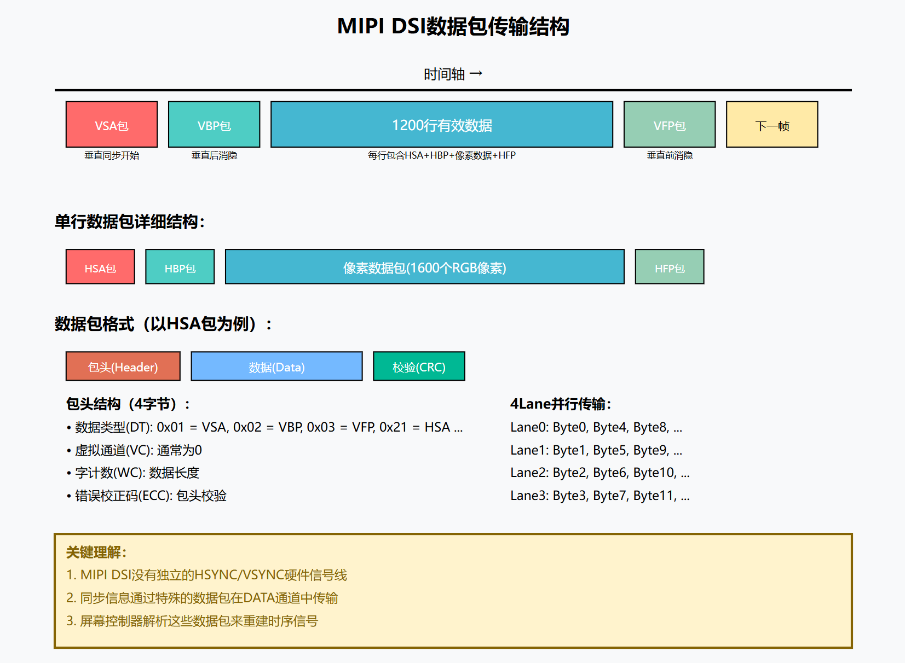

Video Mode下的数据流：

``` text 
// 一帧数据的传输序列
Frame开始:
├─ 发送VSA数据包 (4次，对应4行VSA)
├─ 发送VBP数据包 (8次，对应8行VBP)  
├─ 发送1200行有效数据:
│   ├─ 第1行: HSA包 → HBP包 → 像素数据包(1600像素) → HFP包
│   ├─ 第2行: HSA包 → HBP包 → 像素数据包(1600像素) → HFP包
│   ├─ ...
│   └─ 第1200行: HSA包 → HBP包 → 像素数据包(1600像素) → HFP包
├─ 发送VFP数据包 (12次，对应12行VFP)
└─ 下一帧开始...
```

数据包的4Lane并行传输

``` text
// 以HSA数据包为例 (假设包含4字节数据)
数据包内容: [Header(4字节)] [Data(N字节)] [CRC(2字节)]

4Lane并行传输:
时钟周期1: Lane0=Header[0], Lane1=Header[1], Lane2=Header[2], Lane3=Header[3]
时钟周期2: Lane0=Data[0],   Lane1=Data[1],   Lane2=Data[2],   Lane3=Data[3]
时钟周期3: Lane0=CRC[0],    Lane1=CRC[1],    Lane2=空,        Lane3=空
```

屏幕端的收到信号后进行重建：

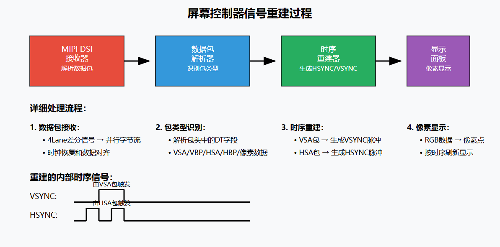

这些转换和传输过程由底层驱动和硬件完成，Linux显示子系统抽象后的屏幕模型还是标准时序，无论什么显示接口，行列扫描和时钟频率这些基本参数都是一样的。

## MIPI DSI的初始化命令

与其他显示接口主要用硬件时序初始化不同，MIPI DSI需要执行一组软件初始化命令。不同接口的初始化方式对比：

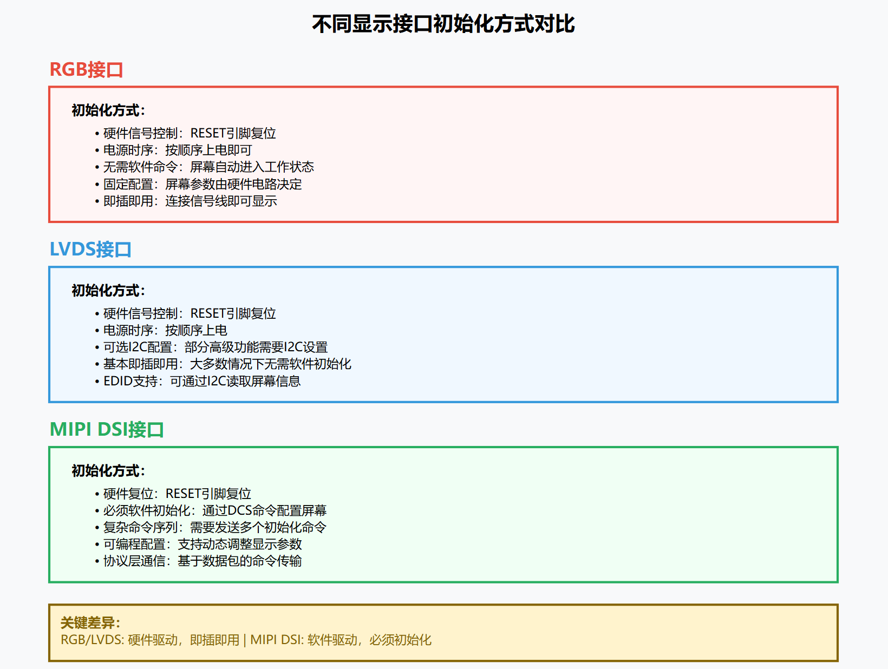

MIPI DSI为应对更智能更复杂的情况，实现更多功能，需要软件初始化：

``` text
1. 复杂的电源管理：
   ├─ 多个电源域需要协调
   ├─ 支持多种省电模式
   ├─ 动态功耗控制
   └─ 温度补偿功能

2. 可编程的显示参数：
   ├─ 像素格式可选择 (RGB565/RGB666/RGB888)
   ├─ 扫描方向可配置
   ├─ 亮度可调节
   ├─ 伽马校正可设置
   └─ 色彩增强可开启

3. 协议层复杂性：
   ├─ LP/HS模式切换
   ├─ 虚拟通道管理
   ├─ 错误检测和恢复
   └─ 流控制机制

4. 兼容性考虑：
   ├─ 支持不同的主控芯片
   ├─ 适应不同的应用场景
   ├─ 向后兼容性
   └─ 标准化命令接口
```

典型的MIPI DSI 屏幕控制器的状态机：

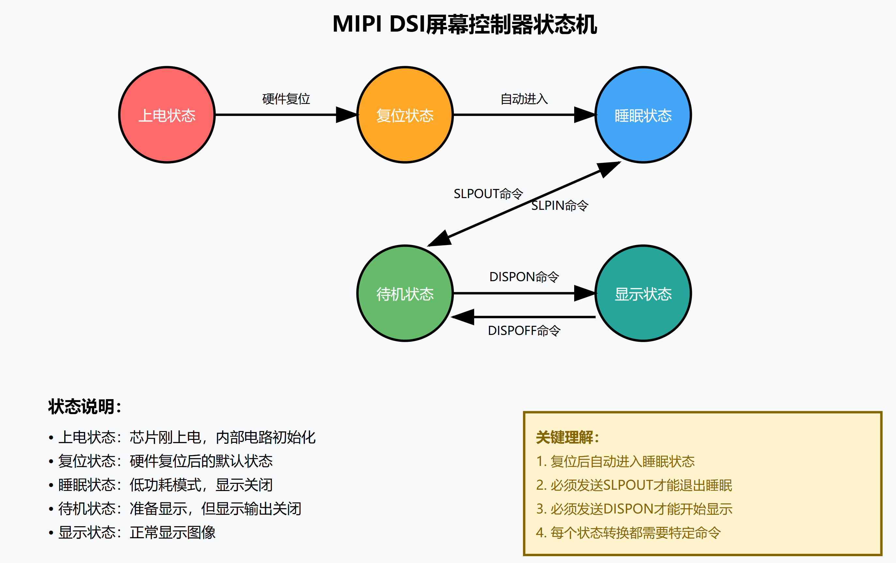

这些初始化命令由屏厂给出，通常是由MIPI DSI接口发送，也可以由 I2C或者SPI等接口发送给屏的控制器。

## MIPI DSI 显示屏实例

下面是一个MIPI显示屏SY050WGM01的基本参数：

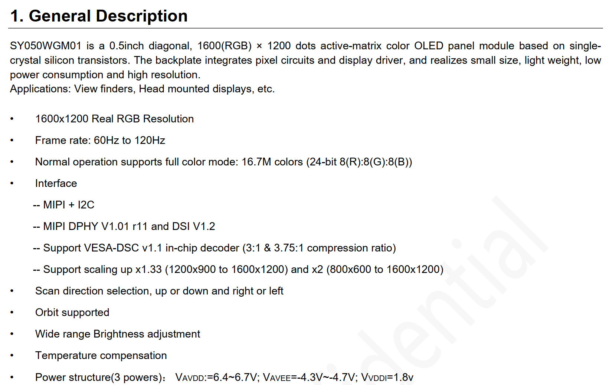

- 分辨率: 1600(H) × 1200(V)
- 像素尺寸: 6.3μm × 6.3μm
- 显示区域: 10.08mm × 7.56mm (0.5英寸对角线)
- 帧率范围: 60Hz \~ 120Hz（每秒刷新的帧数）
- 接口: MIPI DSI (1port D-PHY)
- 颜色深度: 24-bit RGB (8:8:8)

### 接口

这个屏支持I2C和MIPI DSI 两种接口：

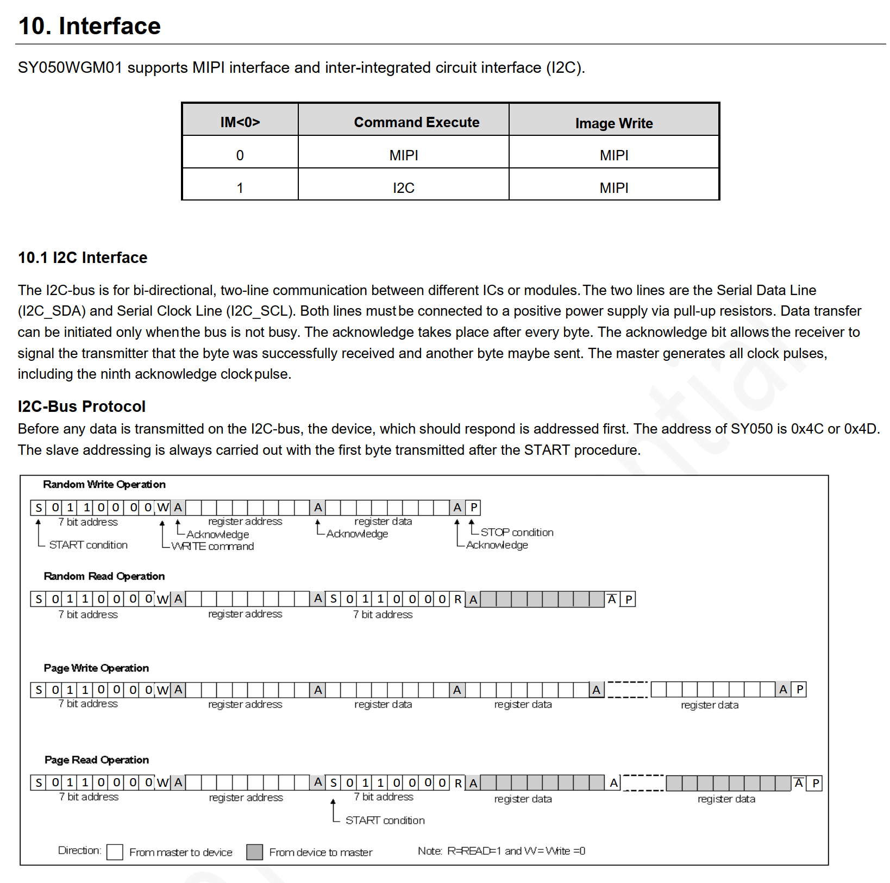

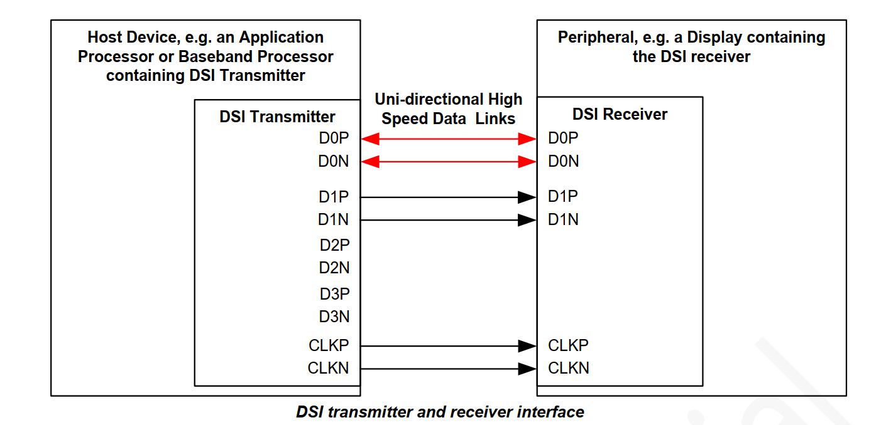

其中，I2C的7位设备地址是0x4C或者0x4D，最后一位右pin16引脚的电平决定（本例中是接地，所以设备地址是 0x4C）：

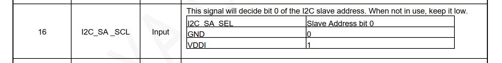

MIPI DSI的数据通道是4Lane差分信号：

- CLK差分对: CKP/CKN (Pin 45/46)
- DATA0差分对: DP<0>/DN<0> (Pin 48/49)&#x20;
- DATA1差分对: DP<1>/DN<1> (Pin 42/43) &#x20;
- DATA2差分对: DP<2>/DN<2> (Pin 51/52)
- DATA3差分对: DP<3>/DN<3> (Pin 39/40)

### 垂直扫描时序

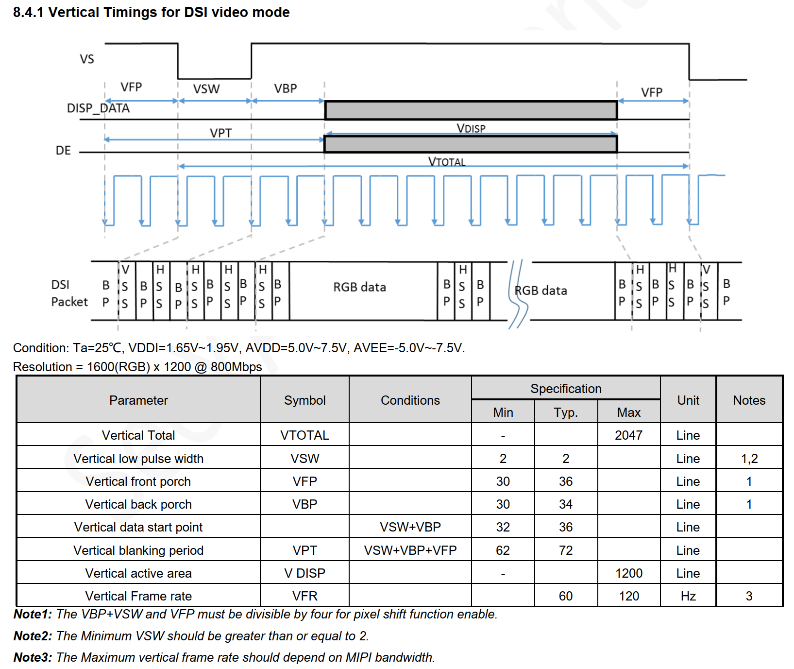

由规格书可知，垂直时序参数（单位是行）：

- VSW (垂直同步宽度，就是前面说的VSA): 2行 (固定)
- VBP (垂直后消隐): 30\~34行 (典型值34行)
- VDISP (有效显示，就是前面说的VACT): 1200行 (固定)
- VFP (垂直前消隐): 30\~36行 (典型值36行)
- VTOTAL (垂直总行数): 最大2047行
- VPT (垂直消隐总时间) = VSW + VBP + VFP，典型值: VPT = 2 + 34 + 36 = 72行

### 水平扫描时序

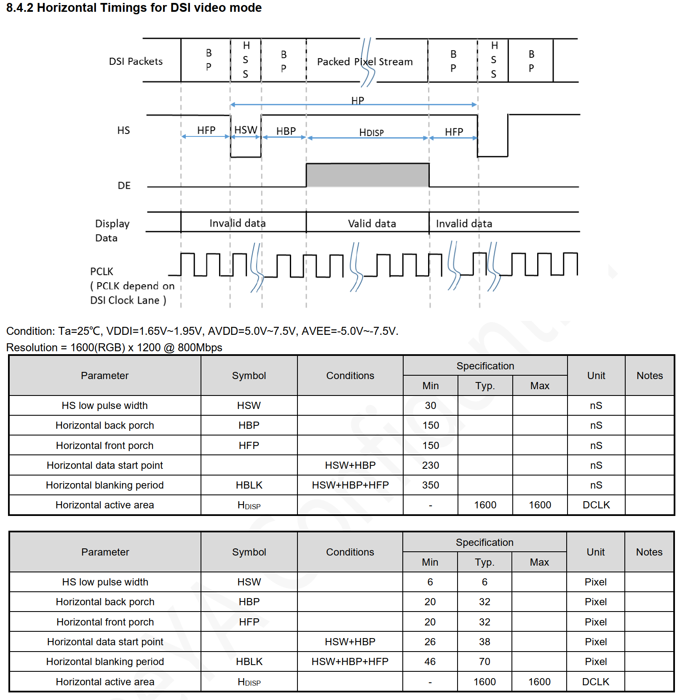

由规格书可知，水平时序参数（单位是像素）：

- HSW（水平同步脉冲宽度，就是前面说的HSA）：6像素 (典型值)
- HBP（水平后消隐）：32像素 (典型值)
- HFP（水平前消隐）：32像素 (典型值)
- HDISP (水平有效显示，就是前面说的HACT)：1600像素
- HBLK (水平消隐总时间)=HSW+HBP+HFP ： 6 + 32 + 32 = 70像素

### 像素时钟和接口速率

在1600x1200分辨率，60Hz帧率的情况下，基于像素单位的时序计算像素时钟：

1. 水平总像素 = HSW + HBP + HDISP + HFP = 6 + 32 + 1600 + 32 = 1670像素
2. 垂直总行数 = VSW + VBP + VDISP + VFP = 2 + 34 + 1200 + 36 = 1272行
3. 一帧的像素总数 = 1670 × 1272 = 2124240 像素
4. 60Hz帧率下，每秒显示60帧，总像素数 = 1670 × 1272 × 60 = 127646400像素/秒
5. 像素时钟 = 127.65MHz

因为每个像素是24Bit（RGB888），所以，D-PHY接口的带宽需求就是 24bit x 127.65MHz = 3.0636Gbps ，每条 Lane 的数据速率就是 3.0636Gbps/4 = 765.9Mbps ≈ 800Mbps 。时钟频率是 800Mbps/2 = 400MHz。

### 初始化命令

初始化命令是一组指令，由屏的厂家直接给出，可以由MIPI DSI，I2C 或者 SPI 接口传输，具体由屏的规格书决定。例如，下面是该屏厂给出的800x600分辨率60Hz帧率的情况下的时序参数和初始化命令，由左边是MIPI格式，右边是I2C格式：

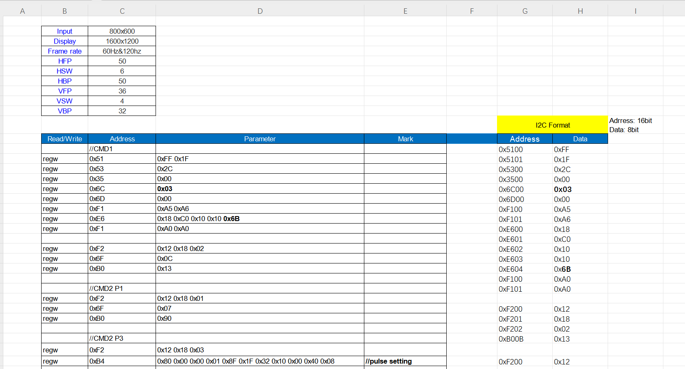

## 实例调试

以在Hi3516dv500的u-boot点亮SY050WGM01为例。参考海思SDK中提供的文档：

- \ReleaseDoc\zh\02.only for reference\Software\屏幕对接使用指南.pdf
- \ReleaseDoc\zh\02.only for reference\Software\RGB\_MIPI屏幕时钟时序计算器.xlsx
- \ReleaseDoc\zh\01.Software\board\MPP\开机画面使用指南.pdf
- \ReleaseDoc\zh\01.Software\board\MPP\MPP 媒体处理软件 V6.0 开发参考.pdf

### 源码分析

Hi3516dv500的视频输出模块叫做VO，有它来驱动MIPI DSI接口向屏幕输出图像，所以u-boot中启动显示设备的命令是startvo，语法：

```bash 
startvo [dev] [intftype] [sync]
```

- dev 表示设备号，Hi3516dv500支持的超高清显示设备DHD0，设备号就是0 （它支持一个视频层VHD0和一个图形层G0）。
- intftype 表示接口类型，MIPI接口的编号是1024
- sync 表示时序类型，官方内置了默认的时序，例如24(代表1600x1200\_60)，如果是自己添加的液晶屏驱动，这里要设置为48，表示用户自定义。

该命令的实现是`do_startvo()`函数，依次做两个工作：

1. 调用`start_vo(dev, intftype, sync)` 配置并启动VO
2. 调用`do_start_mipi_tx(intftype, sync)` 配置并启动MIPI\_TX

#### start_vo

`start_vo()` 函数负责初始化、配置和启动VO设备。执行流程：

1. 调用 `vo_init()` 初始化视频输出系统
2. 调用 `vo_construct_pub_attr()` 根据设备号、接口类型和时序类型构造公共属性结构体变量 `ot_vo_pub_attr pub_attr` 。其中关键的用户时序参数定义在`product/ot_osd/vo/arch/hi3519dv500/hal/drv_vo_dev.c`文件的`ot_vo_sync_info g_vo_user_sync_timing[]`数组里：
   ``` c 
   static const ot_vo_sync_info g_vo_user_sync_timing[OT_VO_MAX_PHYS_DEV_NUM] = {
       /*
        * |--INTFACE---||-----TOP-----||----HORIZON--------||----BOTTOM-----||-PULSE-||-INVERSE-|
        * syncm, iop, itf,   vact, vbb,  vfb,  hact,  hbb,  hfb, hmid,bvact,bvbb, bvfb, hpw, vpw,idv, ihs, ivs
        */
       { 0, 1, 1, 600, 36, 36, 800, 56, 50, 1, 1, 1, 1, 6, 4, 0, 0, 0 }, /* 800x600@60_hz */
   };

   // VO输出用户时序信息的数据结构ot_vo_pub_attr.ot_vo_sync_info的定义
   typedef struct {
       td_u32 bg_color; /* RW; background color of a device, in RGB format. */
       ot_vo_intf_type intf_type; /* RW; VO接口类型，来自startvo的intftype参数，MIPI接口的编号是1024(OT_VO_INTF_MIPI) */
       ot_vo_intf_sync intf_sync; /* RW; VO时序类型，来自startvo的sync参数，自定义是设置48(OT_MIPI_TX_OUT_USER或者OT_VO_OUT_USER)*/
       ot_vo_sync_info sync_info; /* RW; VO接口的时序信息，来自 struct ot_vo_sync_info*/
   } ot_vo_pub_attr;
    
   typedef struct { 
       td_bool syncm;      // 同步模式，参数无意义，配置为0
       td_bool iop;        // 隔行/逐行标志，0=隔行时序，1=逐行时序。MIPI和LCD配置为1
       td_u8 intfb;        // 输出接口位宽，参数无意义，配置为0
       
       td_u16 vact;        // 垂直有效区，屏幕垂直分辨率，如1080、720等
       td_u16 vbb;         // 垂直消隐后肩，VSA+VBP（垂直同步+垂直后消隐）
       td_u16 vfb;         // 垂直消隐前肩，VFP（垂直前消隐）
       
       td_u16 hact;        // 水平有效区，屏幕水平分辨率，如1920、1280等
       td_u16 hbb;         // 水平消隐后肩，HSA+HBP（水平同步+水平后消隐）
       td_u16 hfb;         // 水平消隐前肩，HFP（水平前消隐）
       td_u16 hmid;        // 底场垂直同步有效像素值，逐行时序时无意义，置为1
       
       td_u16 bvact;       // 底场垂直有效区，逐行时序时无意义，置为1
       td_u16 bvbb;        // 底场垂直消隐后肩，逐行时序时无意义，置为1
       td_u16 bvfb;        // 底场垂直消隐前肩，逐行时序时无意义，置为1
       
       td_u16 hpw;         // 水平同步信号宽度，HSA（水平同步脉冲宽度）
       td_u16 vpw;         // 垂直同步信号宽度，VSA（垂直同步脉冲宽度）
       
       td_bool idv;        // 数据有效信号极性，0=高有效，1=低有效。MIPI固定高有效
       td_bool ihs;        // 水平有效信号极性，0=高有效，1=低有效。MIPI固定高有效
       td_bool ivs;        // 垂直有效信号极性，0=高有效，1=低有效。MIPI固定高有效
   } ot_vo_sync_info;
   ```
3. 调用`vo_set_pub_attr()` 根据`ot_vo_pub_attr pub_attr`设置设备的公共属性。
4. 调用 `vo_set_user_sync_clk()` 函数，从`product/ot_osd/vo/arch/hi3519dv500/hal/drv_vo_dev.c`文件的`ot_vo_user_sync_info g_vo_user_sync_info[]`数组里获取时钟配置，然后设置输出时钟频率。定义如下：
   ``` c 
   static const ot_vo_user_sync_info g_vo_user_sync_info[OT_VO_MAX_PHYS_DEV_NUM] = {
       {
           .manual_user_sync_info = {
               .user_sync_attr = {
                   .clk_src = OT_VO_CLK_SRC_LCDMCLK,
                   .lcd_m_clk_div = 0x3EF962,  //LCD时钟分频
               },
               .pre_div = 1, /* if hdmi, set it by pixel clk */
               .dev_div = 1, /* if rgb, set it by serial mode */
           },
           .op_mode = OT_OP_MODE_MANUAL,
           .clk_reverse_en = TD_TRUE,
       },
   };

   // VO输出时钟频率的数据结构ot_vo_user_sync_info的定义
   typedef struct {
       td_bool clk_reverse_en;              // 设置时钟相位是否相反，0表示正向，1表示反向，对于MIPI屏，固定为反向即可
       ot_op_mode op_mode;     // 时序操作模式，0表示自动设置，1表示手动设置。u-boot阶段只支持手动设置。
       union {
           ot_vo_auto_user_sync_info auto_user_sync_info; // 自动模式下的时钟参数
           ot_vo_manual_user_sync_info manual_user_sync_info; // 手动模式下的时钟参数
       };
   } ot_vo_user_sync_info;

   // 手动模式下的时钟参数
   typedef struct {
       ot_vo_user_sync_attr user_sync_attr; // 时序属性：时钟源类型、时钟大小配置信息
       td_u32 pre_div;                      // 设备前置分频，取值范围 [1, 32]，MIPI屏固定为1
       td_u32 dev_div;                      // 设备时钟分频比，取值范围[1, 4]，MIPI屏固定为1
   } ot_vo_manual_user_sync_info;

   // 时序属性
   typedef struct {
       ot_vo_clk_src clk_src; // 时钟源类型，
                              // 中小型LCD屏建议选择LCD分频器时钟源（OT_VO_CLK_SRC_LCDMCLK），可以输出0~75MHz的时钟；
                              // 中大型LCD屏建议选择PLL时钟源，可以输出16.326531~594MHz时钟

       union {
           ot_vo_pll vo_pll;  // clk_src为OT_VO_CLK_SRC_PLL或OT_VO_CLK_SRC_PLL_FOUT4时有效，user synchronization timing clock PLL information
           td_u32 lcd_m_clk_div; // clk_src为OT_VO_CLK_SRC_LCDMCLK时有效。LCD时钟源的分频系数，取值范围 [1, 8473341]，假定目标频率src_clk（MHz），则分频系数lcd_m_clk_div= (src_clk/1188) * 2^27； src_clk最大75MHz
           ot_vo_fixed_clk fixed_clk; // clk_src为OT_VO_CLK_SRC_FIXED时有效。fixed clock。
       };
   } ot_vo_user_sync_attr;
   ```
5. 调用 `vo_enable()` 启用视频输出设备。

#### do_start_mipi_tx

`do_start_mipi_tx(intftype, sync)`的核心函数是`sample_comm_mipi_tx.c:mipi_tx_display()`：

``` c 
void mipi_tx_display(unsigned int intftype, unsigned int sync)
{
    sample_mipi_tx_config tx_config = {0};
 
    if (!((intftype & OT_VO_INTF_MIPI) || (intftype & OT_VO_INTF_MIPI_SLAVE))) {
        return;
    }
 
    tx_config.intf_sync = sync;
 
    /*
     * step1: Users do:
     * fill the cmd_count and cmd_info for a peripheral device.
     * If this peripheral device needs to be configured through mipi_tx controller.
     * If not, ignore this step or fill in to 0.
     */
    set_mipi_tx_config_cmd_info(&tx_config);
 
    /*
     * step2: Users do:
     * fill the combo_dev_cfg for mipi_tx in USER timing.
     * If it is not user timing, the system will automatically fill in this item in step3.
     */
    set_mipi_tx_config_combo_dev_cfg(&tx_config);
 
    /*
     * step3: System do:
     * If it is not user timing, it is not necessary to fill in the combo_dev_cfg,
     * and the system will adopt a default configuration.
     */
    sample_comm_start_mipi_tx(&tx_config);
}
```

参数：

- intftype: 接口类型，用于确定是否为MIPI接口
- sync: 同步类型，指定分辨率和帧率

这个函数主要是初始化`sample_mipi_tx_config tx_config`结构体变量，然后按照结构体的内容对MIPI进行配置，这是一个用于配置MIPI Tx（发送器）的结构体，它封装了驱动MIPI显示屏所需的各种参数和配置信息，结构体的定义：

``` c 
typedef struct {
    /* for combo dev config */
    mipi_tx_intf_sync intf_sync; // 接口时序类型，对应不同的分辨率和刷新率，例如OT_VO_OUT_1600x1200_60（值为48）表示1600x1200@60Hz
 
    /* for screen cmd */
    td_u32 cmd_count; // 初始化命令的数量
    mipi_tx_cmd_info *cmd_info;  // 初始化命令序列的数组指针
 
    /* for user sync */
    combo_dev_cfg_t combo_dev_cfg; // MIPI TX设备组合配置
} sample_mipi_tx_config;
```

执行流程：

1. 检查接口类型是否为MIPI或MIPI从设备
2. 设置接口时序类型`tx_config->intf_sync`，如果是用户自定义，这个值是`48（OT_MIPI_TX_OUT_USER）`
3. 通过`set_mipi_tx_config_cmd_info()`函数设置屏幕初始化命令（`tx_config->cmd_info`和`tx_config->cmd_count`），如果sync设置的是`48（OT_MIPI_TX_OUT_USER）`，用户需要自定义一个`struct mipi_tx_cmd_info` 数组，并传递给`set_mipi_tx_config_cmd_info()`函数：
   1. `tx_config->cmd_info`，屏幕初始化命令序列，实际是一组MIPI命令，用 `struct mipi_tx_cmd_info` 数组描述，添加特定液晶屏时要自定义一个这样的数组，并注册到`tx_config`
   2. `tx_config->cmd_count`，屏幕初始化命令的数量，也就是`struct mipi_tx_cmd_info` 数组的长度。
4. 通过`set_mipi_tx_config_combo_dev_cfg()`函数设置MIPI Tx设备组合配置`tx_config->combo_dev_cfg`，它包含了MIPI Tx设备的设备号，LaneID，时钟频率，LCD的时序参数等。如果sync设置的是`48（OT_MIPI_TX_OUT_USER）`，会使用`combo_dev_cfg_t g_sample_comm_mipi_tx_1920x1080_60_config`中的配置。添加特定液晶屏时要自定义一个这样的数组，并注册到`tx_config`。
5. 通过`sample_comm_start_mipi_tx()`函数按照`tx_config`的配置启动MIPI TX：
   1. 检查配置参数
   2. 初始化MIPI Tx模块
   3. 如果sync设置的不是`48（OT_MIPI_TX_OUT_USER）`，会依据`tx_config->intf_sync`的值，在`mipi_tx_intf_sync_cfg`数组里匹配一个MIPI TX配置，传递给`tx_config->combo_dev_cfg`
   4. 调用`mipi_tx_set_combo_dev_cfg(const combo_dev_cfg_t *dev_cfg)`，根据`tx_config->combo_dev_cfg`配置 mipi\_tx设备的参数.
   5. 执行`tx_config->cmd_info`中的命令，初始化屏幕。
   6. 使能MIPI Tx

初始化命令序列的数据结构`tx_config->cmd_info`定义：

``` c 
typedef struct {
    td_u32 devno;                 // MIPI Tx设备号，固定 0
    td_u32 work_mode;             // 工作模式，低功耗模式和高速模式
    td_u32 lp_clk_en;             // 低功耗时钟使能
    td_u32 data_type;             // 初始化命令数组的数据类型。根据数据个数选择数据类型：类型1、当只有寄存器地址没有数据时，数据类型选择0x5；类型2、有寄存器地址和一个数据时，数据类型选择0x15；类型3、有寄存器地址且数据个数大于等于两个数据类型一般用0x39。
    td_u32 cmd_size;              // 如果初始化命令数组的数据类型是类型三，设置为初始化命令数组的大小。如果是类型1，设置为寄存器地址；如果是类型2，低八位为地址，高八位为数据。
    td_u8 *cmd;                   // 如果初始化命令数组的数据类型是类型3，设置为命令数组，如果是类型1或者类型2，可置为NULL；
} cmd_info_t;

typedef struct {
    cmd_info_t cmd_info;          // 初始化命令信息
    td_u32 usleep_value;          // 命令执行后的延迟时间(微秒)，固定设置为UDELAY_50。
} mipi_tx_cmd_info;
```

> 注意，`tx_config->cmd_info`定义的初始化命令，是通过MIPI 接口发送的，如果要通过其他接口发送，需要自定义。

MIPI设备组合配置的数据结构`tx_config->combo_dev_cfg`定义：

``` c 
typedef struct {
    td_u32 devno;                 // MIPI Tx设备号，配0
    td_u32 lane_id[LANE_MAX_NUM]; // 数据通道ID，4lane配成{0,1,2,3}，2lane配成{0,1,-1,-1}
    td_u32 out_mode;              // 输出模式 (OUTPUT_MODE_CSI，OUTPUT_MODE_DSI_VIDEO，OUTPUT_MODE_DSI_CMD)，需要从屏的规格书确认。
    td_u32 video_mode;            // VIDEO模式下的数据格式。参数选择范围： BURST_MODE、NON_BURST_MODE_SYNC_PULSES、NON_BURST_MODE_SYNC_EVENTS，三种模式下，传递的数序和数据包位置不同，需要从屏的规格书确认。如果output_mode_t属性为OUTPUT_MODE_DSI_CMD，本属性配置不生效。
    td_u32 out_format;            // 输出格式，参数包括OUT_FORMAT_RGB_24BIT = 0x3,OUT_FORMAT_YUV420_12BIT = 0x4 等，需要从屏的规格书确认
    struct {
        unsigned short vact;    // 垂直有效区行数，屏幕垂直分辨率
        unsigned short vbp;     // 垂直后消隐区行数，垂直后消隐（不包含同步脉冲）
        unsigned short vfp;     // 垂直前消隐区行数，垂直前消隐
        unsigned short hact;    // 水平有效区像素个数，屏幕水平分辨率
        unsigned short hbp;     // 水平后消隐区像素个，水平后消隐（不包含同步脉冲）
        unsigned short hfp;     // 水平前消隐区像素个数，水平前消隐
        unsigned short hpw;     // 水平同步脉冲区像素个数，HSA，要求与VO时序中的hpw一致
        unsigned short vpw;     // 垂直同步脉冲区行数，VSA，要求与VO时序中的vpw一致
    } sync_info_t;                  // 同步信息
    td_u32 phy_data_rate;         // 一条Lane的数据速率 (Mbps)，配置值>= (hact+hsa+hbp+hfp)*(vact+vsa+vbp+vfp)*output format bits* framerate / lane_num/（ 10^6）
    td_u32 pixel_clk;             // 像素时钟 (KHz)，配置值=(hact+hsa+hbp+hfp)*(vact+vsa+vbp+vfp)*framerate/1000，向上取整
} combo_dev_cfg_t;
```

#### 总结

对比VO和MIPI_TX的时序参数：

``` text
屏幕规格参数 → MIPI sync_info_t → VO ot_vo_sync_info
─────────────────────────────────────────────────────
HACT         → hact            → hact
HBP          → hbp             → hbb = hsa + hbp  
HFP          → hfp             → hfb
HSA          → hpw             → hpw
VACT         → vact            → vact  
VBP          → vbp             → vbb = vsa + vbp
VFP          → vfp             → vfb
VSA          → vpw             → vpw
```

添加新的屏幕时，主要是修改或者新建如下几个数据结构：

- `ot_vo_sync_info g_vo_user_sync_timing[]`，定义VO时序参数
- `ot_vo_user_sync_info g_vo_user_sync_info[]`，定义VO时钟参数
- `combo_dev_cfg_t g_sample_comm_mipi_tx_800x600_60_config`，MIPI Tx 时序参数
- `mipi_tx_cmd_info g_sy050wgm01_init_cmds[]`，初始化命令数组

### 调试过程

调试过程如下：

1. 配置引脚复用
2. MIPI屏使能和复位
3. 配置背光
4. 配置VO输出时序
5. 配置VO输出时钟
6. 配置MIPI Tx时序
7. 配置屏幕初始化序列
8. 启动VO和MIPI Tx

#### 引脚复用

当前主板用到的引脚包括：

1. Power：`LCD_PWM(GPIO4_4)`，电源使能，需要启动时拉高。
2. Reset：`LCD_RESET(GPIO8_3)`，输出低电平脉冲进行复位。
3. MIPI_DSI: `DSI_D0P/N\~DSI_D3P/N`, `DSI_CKP/N`
4. I2C0：`TP_I2C0_SCL/TP_I2C0_SDA`

#### 屏幕使能和复位

屏幕的电源控制引脚是`GPIO4_4`，启动时拉高，复位引脚是`GPIO8_3`，启动时依次输出101，完成复位。参考代码:

``` c 
void screen_poweron(void)
{
  writel(0x1201, PIN_F19_IOCFG_REG22); // F19引脚的功能设置为GPIO4_4
  set_gpio_dir(4, 4, GPIO_DIR_OUT);
  mdelay(1);
  set_gpio_output(4, 4, 1);
  mdelay(15);
}

void screen_reset(void)
{
  writel(0x1300, PIN_P19_IOCFG_REG54); // P19引脚的功能设置为GPIO8_3
  set_gpio_dir(8, 3, GPIO_DIR_OUT);
  mdelay(1);
  set_gpio_output(8, 3, 1);
  mdelay(1);
  set_gpio_output(8, 3, 0);
  mdelay(1);
  set_gpio_output(8, 3, 1);
  mdelay(15);  // 复位后需要保持足够的延时，让屏幕控制进入正常状态，等待初始化命令
}
int board_init(void)
{
  ...
  screen_poweron();  
  screen_reset();  
  ...
}
```

启动后在u-boot验证`GPIO4_4`和`GPIO8_3`的引脚复用，方向和输入

``` shell 
# GPIO4_4
~ # md.l 10260058 1
10260058: 00001201                             ....
~ # md.l 11094400 1
11094400: 00000010                             ....
~ # md.l 11094040 1
11094040: 00000010                             ....

# GPIO8_3
~ # md.l 0x102600D8 1
102600d8: 00001300                             ....
~ # md.l 0x11098400 1
11098400: 00000008                             ....
~ # md.l 0x11098020 1
11098020: 00000008                             ....

```

#### 背光

该屏的背光是有初始化命令设置的，不用单独配置。如果是通过PWM或者GPIO设置的屏，需要在 `board_init(void)` 函数中添加相关代码。

#### VO的输出时序

用官方提供的《RGB_MIPI屏幕时钟时序计算器.xlsx》，输入屏幕的属性，可以直接计算得到的时序参数：

| MIPI屏幕属性                        | 输入值  | VO用户时序参数值                | 输出值  |
| ------------------------------- | ---- | ------------------------ | ---- |
| 水平有效区          HACT（像素）         | 800  | 水平有效区          hact（像素）  | 800  |
| 水平后消隐          HBP（像素）          | 50   | 水平消隐后肩        hbb（像素）    | 56   |
| 水平前消隐          HFP（像素）          | 50   | 水平消隐前肩        hfb（像素）    | 50   |
| 水平同步时序        HSA（像素）           | 6    | 水平同步信号        hpw（像素）    | 6    |
| 垂直有效区          VACT（行数）         | 600  | 垂直有效区          vact（行数）  | 600  |
| 垂直后消隐          VBP（行数）          | 32   | 垂直消隐后肩        vbb（行数）    | 36   |
| 垂直前消隐          VFP（行数）          | 36   | 垂直消隐前肩        vfb（行数）    | 36   |
| 垂直同步时序        VSA（行数）           | 4    | 垂直同步信号        vpw（行数）    | 4    |
| 设备输出帧率        frame rate        | 60   |                          |      |
| 输出数据类型   output_format_t  | 24   |                          |      |
| 使用的lane个数                       | 4    |                          |      |
| MIPI Tx输出模式                     | 1    |                          |      |

填到变量中：

``` c 
static const ot_vo_sync_info g_vo_user_sync_timing[OT_VO_MAX_PHYS_DEV_NUM] = {
    /*
     * |--INTFACE---||-----TOP-----||----HORIZON--------||----BOTTOM-----||-PULSE-||-INVERSE-|
     * syncm, iop, itf,   vact, vbb,  vfb,  hact,  hbb,  hfb, hmid,bvact,bvbb, bvfb, hpw, vpw,idv, ihs, ivs
     */
    { 0, 1, 1, 600, 36, 36, 800, 56, 50, 1, 1, 1, 1, 6, 4, 0, 0, 0 }, /* 800x600@60_hz */
};
```

#### VO的输出时钟

VO接口输出时钟频率为时钟源输出时钟除以分频后得到，因此，为了得到接口输出时钟，需要依次设置时钟源类型、时钟大小和时钟分频比。拓扑关系如下图：

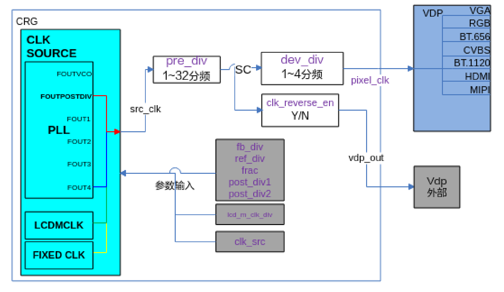

时钟源时钟频率与接口时钟之间的关系：

1. CLK SOURCE 有很多时钟源，这个MIPI屏可以设置为 LCDMCLK 时钟源，然后配置`lcd_m_clk_div`分频，可以得到`src_clk`。
2. `src_clk` 经过 `pre_div` （MIPI屏固定为1）分频输出 SC。
3. 再经过`dev_div`（MIPI屏固定为1）分频即得到像素时钟`pixel_clk`，供MIPI屏使用。

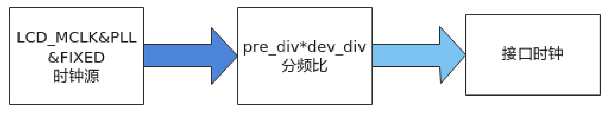

同样可以通过计算得到VO用户时钟参数值：

| MIPI屏幕属性                        | 输入值  | VO用户时钟参数值                           | 输出值       |
| ------------------------------- | ---- | ----------------------------------- | --------- |
| 水平有效区          HACT（像素）         | 800  | 前置分频系数         pre_div[1,32]  | 1         |
| 水平后消隐          HBP（像素）          | 50   | 设备时钟分频系数     dev_div[1,4]     | 1         |
| 水平前消隐          HFP（像素）          | 50   | LCD分频时钟（小于75MHz)lcdmclk_div      | 3EF962    |
| 水平同步时序        HSA（像素）           | 6    | PLL时钟分频 (大于16.33MHz)fb_div       | 74        |
| 垂直有效区          VACT（行数）         | 600  | frac                                | 94F8B5    |
| 垂直后消隐          VBP（行数）          | 32   | ref_div                          | 1         |
| 垂直前消隐          VFP（行数）          | 36   | post_div1                        | 7         |
| 垂直同步时序        VSA（行数）           | 4    | post_div2                        | 7         |
| 设备输出帧率        frame rate        | 60   | PLL(MHz)                            | 74.58192  |
| 输出数据类型   output_format_t  | 24   | FREF(MHz)                           | 24        |
| 使用的lane个数                       | 4    |                                     |           |
| MIPI Tx输出模式                     | 1    |                                     |           |

填到变量中：

``` c 

static const ot_vo_user_sync_info g_vo_user_sync_info[OT_VO_MAX_PHYS_DEV_NUM] = {
    {
        .manual_user_sync_info = {
            .user_sync_attr = {
                .clk_src = OT_VO_CLK_SRC_LCDMCLK,
                .lcd_m_clk_div = 0x3EF962,  //LCD时钟分频
            },
            .pre_div = 1, /* if hdmi, set it by pixel clk */
            .dev_div = 1, /* if rgb, set it by serial mode */
        },
        .op_mode = OT_OP_MODE_MANUAL,
        .clk_reverse_en = TD_TRUE,
    },
};
```

#### MIPI Tx的时序参数

同样可以通过计算得到MIPI Tx的时序参数：

| MIPI屏幕属性                        | 输入值  | MIPI设备属性参数值                              | 输出值    |
| ------------------------------- | ---- | ---------------------------------------- | ------ |
| 水平有效区          HACT（像素）         | 800  | 行有效区像素个数    hact_pixels               | 800    |
| 水平后消隐          HBP（像素）          | 50   | 行后消隐区像素个数  hbp_pixels                 | 50     |
| 水平前消隐          HFP（像素）          | 50   | 行前消隐区像素个数  hfp_pixels                 | 50     |
| 水平同步时序        HSA（像素）           | 6    | 行同步像素个数      hsa_pixels               | 6      |
| 垂直有效区          VACT（行数）         | 600  | 帧前有效区行数      vact_lines               | 600    |
| 垂直后消隐          VBP（行数）          | 32   | 帧后消隐区行数      vbp_lines                | 32     |
| 垂直前消隐          VFP（行数）          | 36   | 帧前消隐区行数      vfp_lines                | 36     |
| 垂直同步时序        VSA（行数）           | 4    | 帧同步区行数        vsa_lines               | 4      |
| 设备输出帧率        frame rate        | 60   |                                          |        |
| 输出数据类型   output_format_t  | 24   | 输入数据数率        phy_data_rate（Mbps）  | 220    |
| 使用的lane个数                       | 4    | 像素时钟            pixel_clk(KHz)        | 36530  |
| MIPI Tx输出模式                     | 1    |                                          |        |

新建一个`combo_dev_cfg_t`变量，并注册。参考代码：

``` c 
static const combo_dev_cfg_t g_sample_comm_mipi_tx_800x600_60_config = {
    .devno = 0,
    .lane_id = {0, 1, 2, 3},
    .out_mode = OUT_MODE_DSI_VIDEO,
    .out_format = OUT_FORMAT_RGB_24BIT,
    .video_mode =  BURST_MODE,
    .sync_info = {
        .vact = 600,
        .vbp = 32,
        .vfp = 36,

        .hact = 800,
        .hbp = 50,
        .hfp = 50,

        .hpw = 6,
        .vpw = 4,
    },
    .phy_data_rate = 220, // 220Mbps
    .pixel_clk = 36530, // 36530KHz
};

static td_void set_mipi_tx_config_user(sample_mipi_tx_config *tx_config)
{
    if (tx_config->intf_sync == OT_MIPI_TX_OUT_USER) {
        (td_void)memcpy_s(&tx_config->combo_dev_cfg, sizeof(combo_dev_cfg_t),
            &g_sample_comm_mipi_tx_800x600_60_config, sizeof(combo_dev_cfg_t));
    }
}

```

#### 初始化命令序列

初始化命令序列需要自定义一个`mipi_tx_cmd_info`结构变量，并注册。参考代码：

``` c 

// SY050WGM01显示屏 800x600 60Hz MIPI初始化序列
static unsigned char g_sy050wgm01_cmd_0[] = {0x51, 0xFF, 0x1F};
static unsigned char g_sy050wgm01_cmd_1[] = {0x53, 0x2C};
static unsigned char g_sy050wgm01_cmd_2[] = {0x35, 0x00};
static unsigned char g_sy050wgm01_cmd_3[] = {0x6C, 0x03};
static unsigned char g_sy050wgm01_cmd_4[] = {0x6D, 0x00};
static unsigned char g_sy050wgm01_cmd_5[] = {0xF1, 0xA5, 0xA6};
static unsigned char g_sy050wgm01_cmd_6[] = {0xE6, 0x18, 0xC0, 0x10, 0x10, 0x6B};
static unsigned char g_sy050wgm01_cmd_7[] = {0xF1, 0xA0, 0xA0};
... 

// MIPI初始化命令数组
#define UDELAY_50       50
#define UDELAY_20000    20000
#define UDELAY_32000    32000
#define UDELAY_100000   100000
#define SY050WGM01_INIT_CMD_COUNT 48

static const mipi_tx_cmd_info g_sy050wgm01_init_cmds[] = {
    {{0, 0, 0, 0x39, 3, g_sy050wgm01_cmd_0}, UDELAY_50},  // 类型3 (地址+2个数据), 地址:0x51
    {{0, 0, 0, 0x15, 0x2C53, NULL}, UDELAY_50},  // 类型2 (地址+1个数据), 地址:0x53
    {{0, 0, 0, 0x15, 0x0035, NULL}, UDELAY_50},  // 类型2 (地址+1个数据), 地址:0x35
    {{0, 0, 0, 0x15, 0x036C, NULL}, UDELAY_50},  // 类型2 (地址+1个数据), 地址:0x6C
    {{0, 0, 0, 0x15, 0x006D, NULL}, UDELAY_50},  // 类型2 (地址+1个数据), 地址:0x6D
    {{0, 0, 0, 0x39, 3, g_sy050wgm01_cmd_5}, UDELAY_50},  // 类型3 (地址+2个数据), 地址:0xF1
    {{0, 0, 0, 0x39, 6, g_sy050wgm01_cmd_6}, UDELAY_50},  // 类型3 (地址+5个数据), 地址:0xE6
    {{0, 0, 0, 0x39, 3, g_sy050wgm01_cmd_7}, UDELAY_50},  // 类型3 (地址+2个数据), 地址:0xF1
    ... 
};

static td_void set_mipi_tx_config_cmd_info(sample_mipi_tx_config *tx_config)
{
    tx_config->cmd_count = SY050WGM01_INIT_CMD_COUNT;
    tx_config->cmd_info = g_sy050wgm01_init_cmds;
}
```

#### 启动VO输出

源码修改完毕后，可以启动u-boot，进入u-boot的命令行，依次执行如下命令：

```bash 
setvobg 0 0x00FF00
startvo 0 1024 48

```

- `setvobg [dev] [color]`：设置背景色
  - dev表示设备号，直接设为0
  - color是RGB格式的颜色，0x00FF00表示绿色。
- `startvo [dev] [intftype] [sync]`：启动VO设备
  - dev表示设备号，直接设为0;
  - intftype表示接口类型，MIPI就是1024;
  - sync 表示时序类型，自定义的时序设为48

一切正常的话，屏幕会亮起并显示绿色。

#### 添加启动画面

屏幕已经点亮，就可以在u-boot阶段加载一张图片作为开机画面。以NandFlash启动为例，大致流程如下。

1. 准备一张jpg格式的图片，分辨率800x600，图片大小和CRC32校验值如下：
   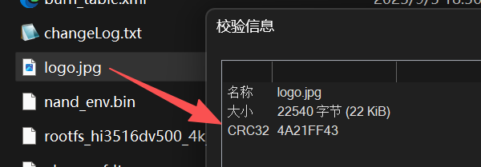
2. 讲图片文件写入NandFlash的特定地址，这里是512MB的NandFlash，我们写到后面的0x1EA80000地址处。
3. 启动u-boot，进入u-boot命令行界面，先检查NandFlash的状态：
   ``` bash
   # nand info

   Device 0: nand0, sector size 256 KiB
     Page size       4096 b
     OOB size         200 b
     Erase size    262144 b
     subpagesize     4096 b
     options     0x40004400
     bbt options 0x00008000
   ```
4. 讲图片文件的数据从NandFlash读到内存的特定地址，并校验：
   ``` bash 
   # nand read 0x92000000 0x1EA80000 0x6000
   NAND read: device 0 offset 0x1ea80000, size 0x6000
    24576 bytes read: OK

   # crc32 0x92000000 0x580c
   crc32 for 92000000 ... 9200580b ==> 4a21ff43

   # md.b 0x92000000 0x40
   92000000: ff d8 ff e0 00 10 4a 46 49 46 00 01 01 01 00 60  ......JFIF.....`
   92000010: 00 60 00 00 ff db 00 43 00 03 02 02 03 02 02 03  .`.....C........
   92000020: 03 03 03 04 03 03 04 05 08 05 05 04 04 05 0a 07  ................
   92000030: 07 06 08 0c 0a 0c 0c 0b 0a 0b 0b 0d 0e 12 10 0d  ................

   ```
5. 设置JPEG界面的必要参数：
   ``` bash
   # setenv jpeg_addr 0x92000000         # 存放JPG图片的内存地址
   # setenv jpeg_size 0x580c             # JPG图片的实际大小
   # setenv jpeg_emar_buf 0x96000000     # 解码过程中使用到的buffer地址
   # setenv vobuf 0xa0000000             # 解码后输出的图片的存放地址
   # saveenv
   ```
6. 启动解码，注意解码成功后输出的`stride 832`：
   ``` bash
   # dcache off
   # decjpg 0
   you should first set:

   args: [format]
           -<format> : 0: semi-plannar yvu420
           - setenv jpeg_addr     0x--------
           - setenv jpeg_size     0x--------
           - setenv vobuf         0x--------
           - setenv jpeg_emar_buf 0x--------

   jpeg decoding ...
   <<addr=0x92000000, size=0x580c, jpeg_emar_buf=0x96000000, vobuf=0xa0000000>>
   hardware decoding success! 800x600, stride 832.
   decode jpeg!
   # dcache on
   ```
7. 先开启VO：
   ``` bash
   # startvo 0 1024 48
   load mipi_tx driver successful!
   mipi intf sync = 48
   cmd count is 48!
   dev 0 opened!

   ```
8. 开启视频层，从解码后的内存地址读取图片显示。注意startvl的第三个参数`stride`要写832：
   ``` bash
   # startvl 0 0xa0000000 832 0 0 800 600
   video layer 0 opened!
   ```

一切正常的话，会显示启动画面。
