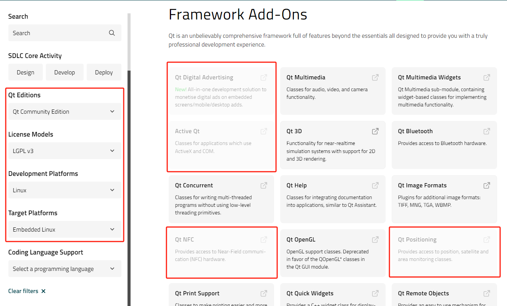

## 1. GPL和LGPL

GPL全称**GNU通用公共许可协议**（英语：GNU General Public License），是一种自由软件的版权声明和许可文件，描述了软件开发者和用户的权利及义务，最初由[自由软件基金会](https://zh.wikipedia.org/wiki/自由軟件基金會 "自由软件基金会")的[理查德·斯托曼](https://zh.wikipedia.org/wiki/理查德·斯托曼 "理查德·斯托曼")（简称RMS）为GNU项目所撰写，后来被广泛应用，是最流行的自由软件许可证。

1. 1989年发布了[GPLv1](https://www.gnu.org/licenses/old-licenses/gpl-1.0.html "GPLv1")，目的是保护开发者的知识产权，确保软件可以被自由的传播和修改，不被其他人限制。
2. 1991年发布了[GPLv2](https://www.gnu.org/licenses/old-licenses/gpl-2.0.html "GPLv2")，同时，为了应对一些宽松的使用需求，发布了 [LGPLv2.1](https://www.gnu.org/licenses/old-licenses/lgpl-2.1.html "LGPLv2.1")作为GPLv2的附加条款，全称**GNU 宽通用公共许可证**（英语：GNU Lesser General Public License）。
3. 2007年升级为 [GPLv3](https://jxself.org/translations/gpl-3.zh.shtml "GPLv3")和[LGPLv3](https://licenses.peaksol.org/lgplv3-zh.html "LGPLv3")，主要是为了应对新的对自由软件的威胁。现在所说的GPL和LGPL通常就是指这个版本。

在 GNU 工程早期，由于GPL协议太严格，导致闭源软件无法使用GNU的C库，为了争取更多用户，RMS发布了LGPL协议，作为对GPL的附加条款，增加了一些例外的说明。简单的讲，如果其他软件只是以链接库的型式使用本库，那么软件本身可以选择其他许可证，也就不必开源。这样既能保护库本身的自由，又不限制程序使用。

关于升级GPLv3的原因，可以参考RMS写的[Why Upgrade to GPLv3](https://www.gnu.org/licenses/rms-why-gplv3.en.html "Why Upgrade to GPLv3")，中文版[为什么升级到GPLv3](https://fsfs-zh.readthedocs.io/rms-why-gplv3/ "为什么升级到GPLv3")。最主要的是解决Tivoization 问题，参考[GNU对 Tivoization的说明](https://www.gnu.org/philosophy/tivoization.en.html "GNU对 Tivoization的说明")。简单的讲，GPLv2存在一些漏洞，硬件厂商可以使用硬件锁定的方式实际禁止用户修改源码。有一个公司叫做TiVo，它基于Linux开发一款DVR设备，为了安全性考虑添加硬件保护，在启动时，由ROM对启动文件进行签名验证，以防止任何人修改TiVo的软件。人们确实可以自由查看，复制并修改TiVo源代码，但是修改以后，如果没有签名私钥，就无法在TiVo上运行。这个问题就叫做Tivoization。不过，Linus对此表示明确的反对，他认为软件开发人员没有权利规定硬件厂商的行为，如果感到一家硬件厂商的专有行为是讨厌的，你可以购买其它厂商的产品，所以，Linux现在使用的还是GPLv2，在ARM处理器上使能Secure Boot功能启动Linux系统也是合法的。

开发自由软件时，可以参考GNU官方的《[如何为你的作品选择一份许可证](https://www.gnu.org/licenses/license-recommendations.html "如何为你的作品选择一份许可证")》，选择一个合适的许可证版本。另一个问题是，我们使用受GPL和LGPL保护的软件时，应该如何处理，避免违规，简单总结：

- 你可以免费使用、修改和分发受保护的软件。
- 你可以向用户收取技术支持的费用，不能收取版权或者专利许可之类的费用。
- 如果你的软件链接了一个GPLv3协议的库，那么你的软件也必须继承GPLv3协议，并开源。（这就是GPL协议的传染性，在GPLv3 的第二节，第四节，第十节都有描述）。
- 如果你的软件链接了一个LGPLv3协议的库，那么你的软件就不必继承LGPLv3协议，也不用开源。但需要有详细声明，确保软件的用户可以更换和修改这个库。（参考LGPLv3的第四节）
- 如果你的软件链接了一个LGPLv3协议的库，并修改了这个库的源码，修改后的库必须在GPLv3或者LGPLv3协议下开源。（参考LGPLv3的第二节）

## 2. Qt的许可证

Qt公司有很多软件，这里是指Qt应用程序开发库（[https://doc.qt.io/qt-5/licensing.html](https://doc.qt.io/qt-5/licensing.html "https://doc.qt.io/qt-5/licensing.html")），并且只限于Qt5.x版本。这个库分为两类许可：

1. Qt开源社区版，使用时需要遵守许可证规定的义务。可以选择两种开源许可证：GPL和LGPL。Qt5.3之前使用的是GPLv2和LGPLv2.1，从Qt5.4开始，增加了LGPLv3，旧的组件依然支持LGPLv2.1，新的组件只在LGPLv3协议下发布。参考[https://www.qt.io/blog/2014/08/20/adding-lgpl-v3-to-qt](https://www.qt.io/blog/2014/08/20/adding-lgpl-v3-to-qt "https://www.qt.io/blog/2014/08/20/adding-lgpl-v3-to-qt")。
2. Qt商业版，拥有开源社区版的所有特性。获得商业许可证后可以使用，无需承担开源义务，还可以获得Qt的官方支持。


需要注意，Qt库有很多模块组件，核心组件都支持LGPLv3，但是附加组件可能只支持GPLv3，各组件支持的许可证版本可以在[https://www.qt.io/product/features](https://www.qt.io/product/features "https://www.qt.io/product/features")和中查看，还有第三方提供的组件，可以在[https://doc.qt.io/qt-5/licenses-used-in-qt.html](https://doc.qt.io/qt-5/licenses-used-in-qt.html "https://doc.qt.io/qt-5/licenses-used-in-qt.html")中查看许可证类型，使用前最好查清楚。例如，这些灰色的附加组件无法在嵌入式Linux系统下使用LGPLv3协议：




以Qt5.15.2为例，在源码目录下可以看到如下许可文件：

``` bash 
qt-everywhere-src-5.15.2$ ls -l
-rw-r--r--  1 sbs sbs 22961 Nov 12  2020 LICENSE.FDL
-rw-r--r--  1 sbs sbs 36363 Nov 12  2020 LICENSE.GPL3-EXCEPT
-rw-r--r--  1 sbs sbs 15351 Nov 12  2020 LICENSE.GPLv2
-rw-r--r--  1 sbs sbs 35641 Nov 12  2020 LICENSE.GPLv3
-rw-r--r--  1 sbs sbs 26828 Nov 12  2020 LICENSE.LGPLv21
-rw-r--r--  1 sbs sbs  8174 Nov 12  2020 LICENSE.LGPLv3
-rw-r--r--  1 sbs sbs 79543 Nov 12  2020 LICENSE.QT-LICENSE-AGREEMENT

```

- LICENSE.QT-LICENSE-AGREEMENT 是Qt库的版权许可声明文件，这里声明了Qt的开源版本使用GPLv2和LGPLv2.1以上版本授权发布。
- LICENSE.GPLv3是GPLv3的副本。
- LICENSE.LGPLv3是LGPLv3的副本。
- LICENSE.GPLv2是GPLv2的副本。
- LICENSE.LGPLv21是LGPLv2.1的副本。

每个组件还有自己单独的许可证和版权声明，例如qtwebengine，官网有说明：[https://doc.qt.io/qt-5/qtwebengine-licensing.html](https://doc.qt.io/qt-5/qtwebengine-licensing.html "https://doc.qt.io/qt-5/qtwebengine-licensing.html")，源码根目录下有许可证的副本：

``` bash
qt-everywhere-src-5.15.2/qtwebengine $ ls -l
-rw-r--r--  1 lsc lsc  1481 Nov  7  2020 LICENSE.Chromium
-rw-r--r--  1 lsc lsc 22952 Nov  7  2020 LICENSE.FDL
-rw-r--r--  1 lsc lsc 18092 Nov  7  2020 LICENSE.GPL2
-rw-r--r--  1 lsc lsc 35147 Nov  7  2020 LICENSE.GPL3
-rw-r--r--  1 lsc lsc 36363 Nov  7  2020 LICENSE.GPL3-EXCEPT
-rw-r--r--  1 lsc lsc 35641 Nov  7  2020 LICENSE.GPLv3
-rw-r--r--  1 lsc lsc  8140 Nov  7  2020 LICENSE.LGPL3
-rw-r--r--  1 lsc lsc  8173 Nov  7  2020 LICENSE.LGPLv3
```


源码`qtwebengine/src/core/web_engine_library_info.cpp`在文件开头声明，可以选择GPLv2，GPLv3，LGPLv3或者商业许可使用该文件：

``` text
/****************************************************************************
  2 **
  3 ** Copyright (C) 2013 BlackBerry Limited. All rights reserved.
  4 ** Copyright (C) 2016 The Qt Company Ltd.
  5 ** Contact: https://www.qt.io/licensing/
  6 **
  7 ** This file is part of the QtWebEngine module of the Qt Toolkit.
  8 **
  9 ** $QT_BEGIN_LICENSE:LGPL$
 10 ** Commercial License Usage
 11 ** Licensees holding valid commercial Qt licenses may use this file in
 12 ** accordance with the commercial license agreement provided with the
 13 ** Software or, alternatively, in accordance with the terms contained in
 14 ** a written agreement between you and The Qt Company. For licensing terms
 15 ** and conditions see https://www.qt.io/terms-conditions. For further
 16 ** information use the contact form at https://www.qt.io/contact-us.
 17 **
 18 ** GNU Lesser General Public License Usage
 19 ** Alternatively, this file may be used under the terms of the GNU Lesser
 20 ** General Public License version 3 as published by the Free Software
 21 ** Foundation and appearing in the file LICENSE.LGPL3 included in the
 22 ** packaging of this file. Please review the following information to
 23 ** ensure the GNU Lesser General Public License version 3 requirements
 24 ** will be met: https://www.gnu.org/licenses/lgpl-3.0.html.
 25 **
 26 ** GNU General Public License Usage
 27 ** Alternatively, this file may be used under the terms of the GNU
 28 ** General Public License version 2.0 or (at your option) the GNU General
 29 ** Public license version 3 or any later version approved by the KDE Free
 30 ** Qt Foundation. The licenses are as published by the Free Software
 31 ** Foundation and appearing in the file LICENSE.GPL2 and LICENSE.GPL3
 32 ** included in the packaging of this file. Please review the following
 33 ** information to ensure the GNU General Public License requirements will
 34 ** be met: https://www.gnu.org/licenses/gpl-2.0.html and
 35 ** https://www.gnu.org/licenses/gpl-3.0.html.
 36 **
 37 ** $QT_END_LICENSE$
 38 **
 39 ****************************************************************************/
```

而第三方组件chromium下的pdf模块，在`qtwebengine/src/3rdparty/chromium/pdf/pdf.c`文件中声明，可以按照BSD协议使用该文件：

``` c 
  1 // Copyright (c) 2010 The Chromium Authors. All rights reserved.
  2 // Use of this source code is governed by a BSD-style license that can be
  3 // found in the LICENSE file.
```

如果要用Qt开源社区版开发闭源软件，需要选择LGPLv3，在LGPLv3的第4节“组合作品”中规定了软件开发者的义务，注意的事项可以参考：

- [https://www.qt.io/licensing/open-source-lgpl-obligations](https://www.qt.io/licensing/open-source-lgpl-obligations "https://www.qt.io/licensing/open-source-lgpl-obligations")
- [https://www.qt.io/faq/tag/qt-open-source-licensing](https://www.qt.io/faq/tag/qt-open-source-licensing "https://www.qt.io/faq/tag/qt-open-source-licensing")

总结如下：

1. 应用程序应该通过动态链接的方式来使用Qt库，如果是静态链接，应用程序就需要开源。
2. 应用程序的开发者，必须向其用户公开使用的Qt库的源码，或者Qt源代码的获取方式。
3. 必须在应用程序中包含显著的声明，说明应用程序使用了LGPLv3许可的Qt库，并提供GPLv3和LGPLv3的文件副本。
4. 必须允许用户更改和重新链接应用程序所使用的Qt库，并提供方法。
5. Qt公司不对使用者是否合规负责，建议咨询有经验的法律顾问以明确详细的许可适用性，为避免法律问题，最好选择商业许可。

> 更多关于Qt许可证的信息可以从[https://www.qt.io/qt-licensing](https://www.qt.io/qt-licensing "https://www.qt.io/qt-licensing")获取。

## 3. 实操建议

如果选择用LGPLv3协议的Qt5.4以上版本开发了一个闭源软件，建议做如下工作：

1. 确定所使用Qt组件是否都支持LGPLv3 ，或者比LGPLv3更宽松的协议。
2. 编译Qt库时，用 `-opensource` 选项指定编译开源版本。
3. 应用软件要通过动态链接的方式使用Qt库。
4. 在软件中设置一个界面，显示版权信息：
   1. 显示COPYING文件，文件中列出使用的Qt库组件和对应的许可证，例如：
      ``` text 
      本软件使用了 Qt 5.15 的开源版本，这里列出用到的组件和对应的许可证：
      
      Software                 License
      -------------------------------------------------------------------
      qtbase                   LGPLv3
      qtmultimedia             LGPLv3
      
      完整的许可证内容可以在 LICENSE.GPLv3 和 LICENSE.LGPLv3 文件中查看。
      
      ```

   2. 显示GPLv3和LGPLv3文件，可以用Qt源码中的`LICENSE.GPLv3`和`LICENSE.LGPLv3`。
5. 向软件的用户提供一个文档，说明获取Qt库的源码、编译和安装的步骤，确保用户按照文档替换为自己编译的Qt库之后，软件还能运行。对于获取Qt库的源码，有两种情况：
   1. 如果你没有修改Qt库，可以写从Qt官方的源码网址获取对应的版本。
   2. 如果你修改了Qt库，需要把修改后的Qt库源码和详细的修改说明在互联网上发布，文档里可以写从对应的网址获取源码。
6. 还可以使用Fossology审计你的软件使用的开源许可证是否合规，详情参考：[https://www.fossology.org/](https://www.fossology.org/ "https://www.fossology.org/")。


总体来说，合法使用开源软件是一个复杂的法律问题，不同的Qt版本，Qt组件，以及涉及的第三方库的许可政策都可能有各种各样的差别，还是要根据实际项目咨询法律顾问，评估法律风险，或者购买商业许可。

## 4. 参考

- 自由软件，自由社会（第三版）：[https://fsfs-zh.readthedocs.io](https://fsfs-zh.readthedocs.io/ "https://fsfs-zh.readthedocs.io")
- 人话解读GPLv3：[https://mp.weixin.qq.com/s/muPDVThX5S4vsXuM5PEoIw](https://mp.weixin.qq.com/s/muPDVThX5S4vsXuM5PEoIw "https://mp.weixin.qq.com/s/muPDVThX5S4vsXuM5PEoIw")
- 人话解读LGPLv3：[https://mp.weixin.qq.com/s/nO2FqY3krB1uVi1C5BAR1g](https://mp.weixin.qq.com/s/nO2FqY3krB1uVi1C5BAR1g "https://mp.weixin.qq.com/s/nO2FqY3krB1uVi1C5BAR1g")
- Using Qt under LGPLv3：[https://embeddeduse.com/2019/05/15/using-qt-under-lgplv3](https://embeddeduse.com/2019/05/15/using-qt-under-lgplv3/ "https://embeddeduse.com/2019/05/15/using-qt-under-lgplv3")
- Using Qt6 under LGPLv3：[https://embeddeduse.com/2023/01/06/using-qt-5-15-and-qt-6-under-lgplv3](https://embeddeduse.com/2023/01/06/using-qt-5-15-and-qt-6-under-lgplv3/ "https://embeddeduse.com/2023/01/06/using-qt-5-15-and-qt-6-under-lgplv3")